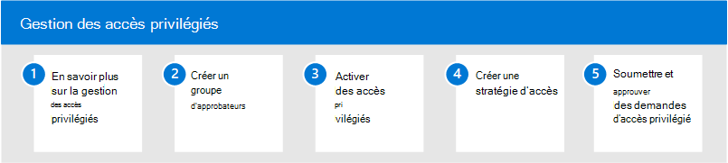

# Gestion des accès privilégiés dans Microsoft 365

L’accès permanent par certains utilisateurs aux informations sensibles ou aux paramètres de configuration réseau critiques dans Microsoft Exchange Online est un parcours potentiel pour les comptes compromis ou les activités de menace internes. La gestion des accès privilégiés permet de protéger votre organisation contre les violations et de respecter les meilleures pratiques de conformité en limitant l’accès permanent aux données sensibles ou l’accès aux paramètres de configuration critiques. Au lieu d’avoir un accès constant aux administrateurs, des règles d’accès juste-à-temps sont implémentées pour les tâches qui ont besoin d’autorisations élevées. L’activation de la gestion des accès privilégiés pour Exchange Online dans Microsoft 365 permet à votre organisation de fonctionner avec zéro privilège permanent et de fournir une couche de défense contre les vulnérabilités d’accès administratifs.

## Configurer la gestion des accès privilégiés pour Microsoft 365

Pour configurer la gestion des accès privilégiés pour votre organisation, utilisez les étapes suivantes :

1. En savoir plus [sur la gestion des accès privilégiés](privileged-access-management-overview.md) dans Microsoft 365
2. Créer un [groupe d’approbation](privileged-access-management-configuration.md#step-1-create-an-approvers-group)
3. Activer la [gestion des accès privilégiés](privileged-access-management-configuration.md#step-2-enable-privileged-access)
4. Créer une stratégie [d’accès](privileged-access-management-configuration.md#step-3-create-an-access-policy)
5. Envoyer/approuver [des demandes d’accès privilégié](privileged-access-management-configuration.md#step-4-submitapprove-privileged-access-requests)

## Plus d’informations sur la gestion des accès privilégiés

- [Questions fréquemment posées sur la gestion des accès privilégiés](privileged-access-management-overview.md#frequently-asked-questions)