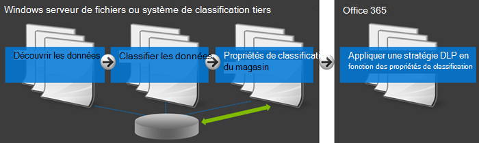
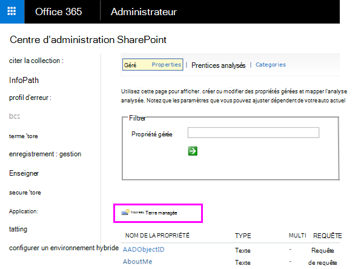

# <a name="create-a-dlp-policy-to-protect-documents-with-fci-or-other-properties"></a>Création d’une stratégie DLP pour protéger les documents avec l’ICF ou d’autres propriétés

les stratégies Protection contre la perte de données Microsoft Purview (DLP) peuvent utiliser des propriétés de classification ou des propriétés d’élément pour identifier les éléments sensibles. Par exemple, vous pouvez utiliser :

- Propriétés de l’infrastructure de classification des fichiers Windows Server
- Propriétés du document SharePoint
- propriétés du document système tiers



Par exemple, votre organisation peut utiliser l’instance FCI Windows Server pour identifier des éléments avec des données personnelles telles que des numéros de sécurité sociale, puis classifier le document en définissant la propriété **Informations d’identification personnelle** sur **Haute**, **Modérée**, **Faible**, **Publique** ou **Non,** en fonction du type et du nombre d’occurrences de données personnelles trouvées dans le document.

Dans Microsoft 365, vous pouvez créer une stratégie DLP qui identifie les documents dont la propriété est définie sur des valeurs spécifiques, telles que **High** et **Medium**, puis effectue une action telle que le blocage de l’accès à ces fichiers. La même stratégie peut disposer d’une autre règle qui exécute une action différente si la propriété est définie sur **Faible**, telle que l’envoi d’une notification par courrier électronique. De cette façon, DLP s’intègre à l’instance FCI Windows Server et peut aider à protéger les documents Office chargés ou partagés vers Microsoft 365 à partir de serveurs de fichiers Windows Server.

Une stratégie DLP recherche simplement une paire nom/valeur de propriété spécifique. N’importe quelle propriété de document peut être utilisée, tant que la propriété possède une propriété gérée correspondante pour la recherche SharePoint. Par exemple, une collection de sites SharePoint peut utiliser un type de contenu nommé **Relevé de voyage** avec un champ obligatoire nommé **Client**. Lorsqu’une personne crée un relevé de voyage, elle doit entrer le nom du client. Cette paire nom/valeur de propriété peut également être utilisée dans une stratégie DLP, par exemple si vous souhaitez une règle qui bloque l’accès au document pour les invités lorsque le champ **Client** contient **Contoso**.

Si vous souhaitez appliquer votre stratégie DLP au contenu avec des étiquettes Microsoft 365 spécifiques, vous ne devez pas suivre les étapes décrites ici. Au lieu de cela, découvrez comment [utiliser une étiquette de rétention comme condition dans une stratégie DLP](data-loss-prevention-policies.md#using-a-retention-label-as-a-condition-in-a-dlp-policy).

## <a name="before-you-create-the-dlp-policy"></a>Avant de créer la stratégie DLP

Avant de pouvoir utiliser une propriété windows Server FCI ou une autre propriété dans une stratégie DLP, vous devez créer une propriété gérée dans le <a href="https://go.microsoft.com/fwlink/?linkid=2185219" target="_blank">Centre d’administration SharePoint</a>. Voilà pourquoi.

Exemples

> [!NOTE]
> Veillez à utiliser un nom de propriété gérée et non un nom de propriété analysée lors de la création de règles DLP à l’aide de la `ContentPropertyContainsWords` condition.

Cela est important, car DLP utilise l’analyseur de recherche pour identifier et classer les informations sensibles sur vos sites, puis stocker ces informations sensibles dans une partie sécurisée de l’index de recherche. Lorsque vous chargez un document vers Office 365, SharePoint crée automatiquement les propriétés analysées basées sur les propriétés du document. En revanche, pour utiliser une ICF ou une autre propriété dans une stratégie DLP, la propriété analysée doit être mappée sur une propriété gérée afin que le contenu avec cette propriété soit conservé dans l’index.

Pour plus d’informations sur la recherche et les propriétés gérées, consultez [Gérer le schéma de recherche dans SharePoint Online](/sharepoint/manage-search-schema).

### <a name="step-1-upload-a-document-with-the-needed-property-to-office-365"></a>Étape 1 : chargement d’un document avec la propriété nécessaire vers Office 365

Vous devez d’abord charger un document avec la propriété que vous souhaitez référencer dans votre stratégie DLP. Microsoft 365 détecte la propriété et crée automatiquement une propriété analysée à partir de celle-ci. À l’étape suivante, vous allez créer une propriété gérée, puis mapper la propriété managée à cette propriété analysée.

### <a name="step-2-create-a-managed-property"></a>Étape 2 : création d’une propriété gérée

1. Connectez-vous au <a href="https://go.microsoft.com/fwlink/p/?linkid=2024339" target="_blank">Centre d’administration Microsoft 365</a>.

2. Dans la navigation de gauche, choisissez **Administration centres** \> **SharePoint**. Vous êtes maintenant dans le <a href="https://go.microsoft.com/fwlink/?linkid=2185219" target="_blank">Centre d’administration SharePoint</a>.

3. Dans le volet de navigation de gauche, choisissez **rechercher** \> dans la page \> **Administration** de la recherche **Gérer le schéma de recherche**.

   

4. Dans la page \> **Propriétés gérées****, nouvelle propriété gérée**.

   

5. Entrez un nom et une description pour la propriété. Ce nom apparaîtra dans vos stratégies DLP.

6. Pour **Type**, sélectionnez **Texte**.

7. Sous **Caractéristiques principales**, sélectionnez **Utilisable dans une requête** et **Affichable dans les résultats d’une recherche**.

8. Sous **Mappages aux propriétés analysées** \> **, ajoutez un mappage**.

9. Dans la boîte \> de dialogue **de sélection de propriété analysée**, recherchez et sélectionnez la propriété analysée qui correspond à la propriété windows Server FCI ou à une autre propriété que vous utiliserez dans votre stratégie DLP \> **OK**.

   

10. En bas de la page \> **OK**.

## <a name="create-a-dlp-policy-that-uses-an-fci-property-or-other-property"></a>Création d’une stratégie DLP qui utilise une propriété ICF ou une autre propriété

Dans cet exemple, une organisation utilise FCI sur ses serveurs de fichiers Windows Server ; plus précisément, ils utilisent la propriété de classification FCI nommée **Informations d’identification personnelle** avec des valeurs possibles **de haute**, **moyenne**, **faible**, **publique** et **non piI**. Ils souhaitent maintenant utiliser leur classification FCI existante dans leurs stratégies DLP dans Office 365.

D’abord, ils suivent les étapes ci-dessus pour créer une propriété gérée dans SharePoint Online, qui est mappée sur la propriété analysée créée automatiquement à partir de la propriété ICF.

Ensuite, ils créent une stratégie DLP avec deux règles qui utilisent toutes les deux les **propriétés de document de condition contenant l’une de ces valeurs** :

- **Contenu de l’IIP de l’instance FCI - Élevé, Modéré** La première règle limite l’accès au document si la propriété de classification FCI **Informations d’identification personnelle** est **élevée** ou **modérée** et si le document est partagé avec des personnes extérieures à l’organisation.

- **Contenu DPI de l’instance FCI - Faible** La deuxième règle envoie une notification au propriétaire du document si la propriété de classification FCI **Informations d’identification personnelle** est **Faible** et que le document est partagé avec des personnes extérieures à l’organisation.

### <a name="create-the-dlp-policy-by-using-security--compliance-powershell"></a>Créer la stratégie DLP à l’aide de Security & Compliance PowerShell

Les **propriétés de document de condition contiennent l’une de ces valeurs** n’est temporairement pas disponible dans le portail de conformité Microsoft Purview, mais vous pouvez toujours utiliser cette condition dans Security & Compliance PowerShell. Vous pouvez utiliser les `New\Set\Get-DlpCompliancePolicy` applets de commande pour utiliser une stratégie DLP et utiliser les `New\Set\Get-DlpComplianceRule` applets de commande avec le `ContentPropertyContainsWords` paramètre pour ajouter la condition **Que les propriétés document contiennent l’une de ces valeurs**.

1. [Se connecter à Security & Compliance PowerShell](/powershell/exchange/connect-to-scc-powershell)

2. Créez la stratégie à l’aide de `New-DlpCompliancePolicy`.

   PowerShell crée une stratégie DLP qui s’applique à tous les emplacements.

   ```powershell
   New-DlpCompliancePolicy -Name FCI_PII_policy -ExchangeLocation All -SharePointLocation All -OneDriveLocation All -Mode Enable
   ```

3. Créez les deux règles décrites ci-dessus à l’aide `New-DlpComplianceRule`, où une règle concerne la valeur **Basse** , et une autre pour les valeurs **Élevée** et **Moyenne** .

   Voici un exemple PowerShell qui crée ces deux règles. Les paires nom/valeur de propriété sont placées entre guillemets, et un nom de propriété peut spécifier plusieurs valeurs séparées par des virgules sans espaces, comme `"<Property1>:<Value1>,<Value2>","<Property2>:<Value3>,<Value4>"....`

   ```powershell
   New-DlpComplianceRule -Name FCI_PII_content-High,Moderate -Policy FCI_PII_policy -AccessScope NotInOrganization -BlockAccess $true -ContentPropertyContainsWords "Personally Identifiable Information:High,Moderate" -Disabled $falseNew-DlpComplianceRule -Name FCI_PII_content-Low -Policy FCI_PII_policy -AccessScope NotInOrganization -BlockAccess $false -ContentPropertyContainsWords "Personally Identifiable Information:Low" -Disabled $false -NotifyUser Owner
   ```

   Windows Server FCI inclut de nombreuses propriétés intégrées, y compris les **informations d’identification personnelle** utilisées dans cet exemple. Les valeurs possibles pour chaque propriété peuvent être différentes pour chaque organisation. Les valeurs **High**, **Moderate** et **Low** utilisées ici ne sont qu’un exemple. Pour votre organisation, vous pouvez afficher les propriétés de classification des instances FCI Windows Server avec leurs valeurs possibles dans le serveur de fichiers Resource Manager sur le serveur de fichiers Windows Server. Pour plus d’informations, consultez [Créer une propriété de classification](/previous-versions/windows/it-pro/windows-server-2008-R2-and-2008/dd759215(v=ws.11)).

Lorsque vous avez terminé, votre stratégie doit avoir deux nouvelles règles qui utilisent toutes les deux les **propriétés document contenant l’une de ces conditions de valeurs** . Cette condition n’apparaît pas dans l’interface utilisateur, bien que les autres conditions, actions et paramètres apparaissent.

Une règle bloque l’accès au contenu pour lequel la propriété **Informations d’identification personnelle** est définie sur **Haut** ou **Modéré**. Une deuxième règle envoie une notification sur le contenu pour lequel la propriété **Informations d’identification personnelle** est définie sur **Faible**.


## <a name="after-you-create-the-dlp-policy"></a>Après avoir créé la stratégie DLP

Les étapes décrites dans les sections précédentes créent une stratégie DLP qui détectera rapidement le contenu avec cette propriété, mais uniquement si ce contenu vient d’être chargé (de sorte que le contenu est indexé), ou si ce contenu est ancien mais vient d’être modifié (afin que le contenu soit réindexé).

Pour détecter tout le contenu avec cette propriété, vous voudrez peut-être demander manuellement la réindexation de votre bibliothèque, site ou collection de sites, afin que la stratégie DLP connaisse tout le contenu avec cette propriété. Dans SharePoint Online, le contenu est automatiquement analysé selon une planification d’analyse définie. Le robot récupère le contenu qui a été modifié depuis la dernière analyse et met à jour l’index. Si vous avez besoin que votre stratégie DLP protège le contenu avant la prochaine analyse planifiée, vous pouvez suivre cette procédure.

> [!CAUTION]
> La réindexation d’un site peut entraîner une charge importante sur le système de recherche. Ne réindexez pas votre site, sauf si votre scénario l’exige absolument.

Pour plus d’informations, voir [Demander manuellement l’analyse et la réindexation d’un site, d’une bibliothèque ou d’une liste](/sharepoint/crawl-site-content).

### <a name="reindex-a-site-optional"></a>Réindexer un site (facultatif)

1. Sur le site, choisissez **Paramètres** (icône d’engrenage en haut à droite) \> **Paramètres du site**.

2. Sous **Rechercher**, choisissez Rechercher et le **site de réindexation** **de disponibilité** \> hors connexion.

## <a name="more-information"></a>Plus d’informations

- [En savoir plus sur la protection contre la perte de données](dlp-learn-about-dlp.md)

- [Création d’une stratégie DLP à partir d’un modèle](create-a-dlp-policy-from-a-template.md)

- [Envoyer des notifications et afficher des conseils de stratégie pour les stratégies DLP](use-notifications-and-policy-tips.md)

- [Contenu des modèles de stratégie DLP](what-the-dlp-policy-templates-include.md)

- [Définitions d’entités des types d’informations sensibles](sensitive-information-type-entity-definitions.md)
