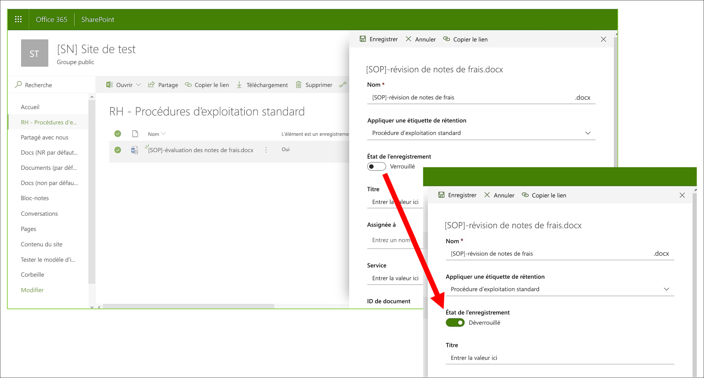
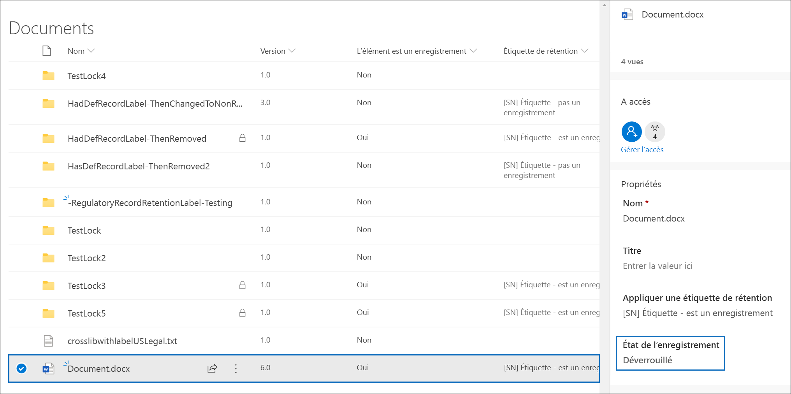
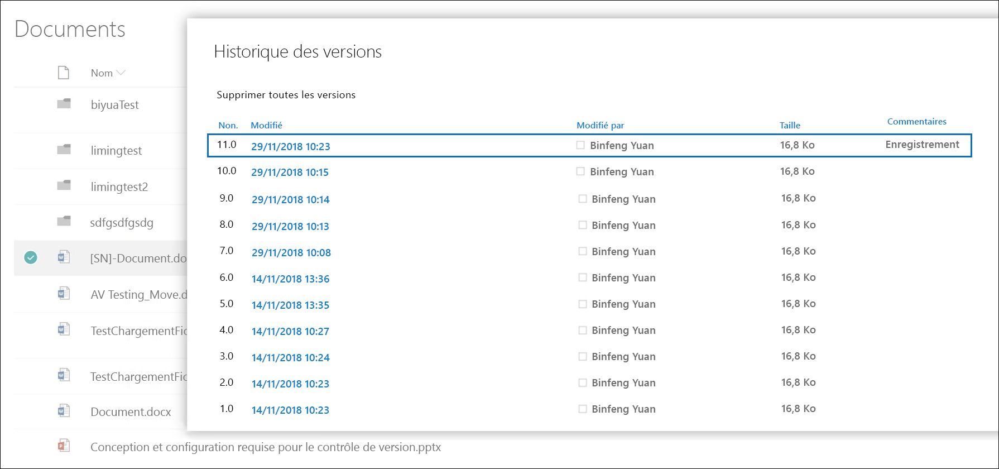
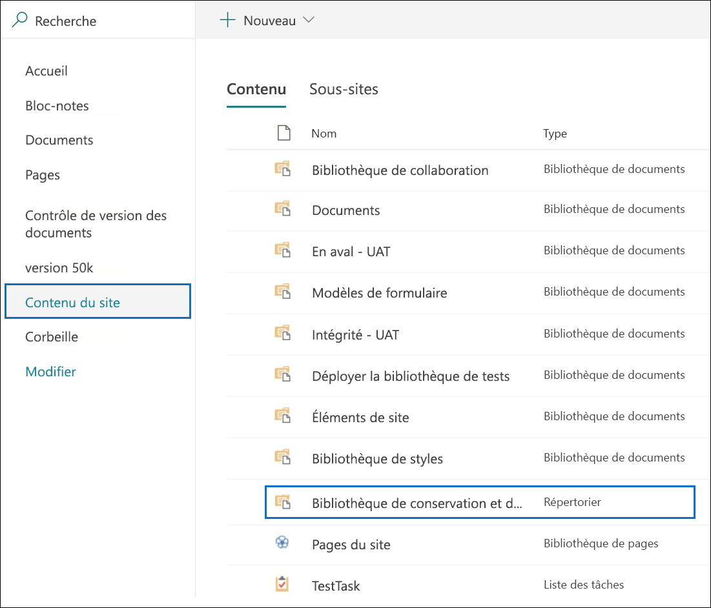
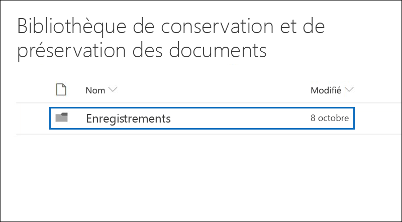
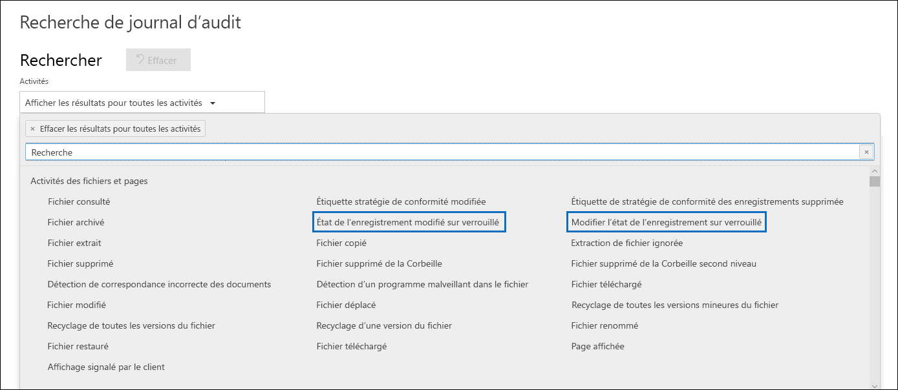

# Découvrir les enregistrements

>*[Guide de sécurité et conformité pour les licences Microsoft 365](https://aka.ms/ComplianceSD).*

La gestion des enregistrements dans Microsoft 365 permet à votre organisation de respecter les stratégies d’entreprise et les obligations légales ou réglementaires, tout en réduisant les risques et la responsabilité juridique.

Lorsque le contenu est marqué comme enregistrement :

- L’élément devient immuable, ce qui signifie qu’il ne peut pas être modifié ou supprimé.

- Des activités supplémentaires sur l’élément sont enregistrées.

- Vous avez une preuve de destruction lorsqu’elles sont supprimées à la fin de la période de rétention.

Vous utilisez les [étiquettes de rétention](retention.md#retention-labels) pour marquer du contenu sous la forme d’un enregistrement. Une fois que vous avez créé des étiquettes de rétention qui déclarent des enregistrements, vous pouvez soit publier ces étiquettes pour permettre aux utilisateurs et aux administrateurs de les appliquer manuellement au contenu, soit appliquer automatiquement ces étiquettes au contenu que vous voulez marquer comme enregistrement.

En utilisant des étiquettes de rétention pour déclarer des enregistrements, vous pouvez implémenter une stratégie de gestion des enregistrements unique et cohérente dans votre environnement Microsoft 365.

Quelques rappels à propos des enregistrements :

  - **Les enregistrements sont immuables.** Une étiquette de rétention qui signale du contenu en tant qu’enregistrement peut être appliquée au contenu dans Exchange, en plus de SharePoint et OneDrive. Toutefois, [le contrôle de version d’enregistrement ](#record-versioning) est disponible uniquement dans SharePoint et OneDrive, et pas pour Exchange.

    Dans Exchange, le contenu étiqueté en tant qu’enregistrement est immuable jusqu’à sa suppression finale. Lorsqu’un élément Exchange est étiqueté en tant qu’enregistrement, quatre événements se produisent :

    - L’élément ne peut pas être supprimé définitivement.

    - L’élément ne peut pas être modifié.

    - L’étiquette ne peut pas être modifiée.

    - L’étiquette ne peut pas être supprimée.

  - **Enregistrements et dossiers.** Vous pouvez appliquer une étiquette de rétention à un dossier dans Exchange, SharePoint et OneDrive. Si un dossier est étiqueté en tant qu’enregistrement et que vous déplacez un élément vers ce dossier, l’élément est étiqueté en tant qu’enregistrement. Lorsque vous déplacez l’élément hors du dossier, l’élément reste étiqueté en tant qu’enregistrement.

    En outre, si vous changez l'étiquette qui est appliquée à un dossier (dans SharePoint et OneDrive) pour une étiquette de rétention qui ne déclare pas le contenu sous la forme d'un enregistrement, les éléments contenus dans le dossier conservent leur étiquette d'enregistrement existante.

    Pour plus d'informations sur l'application des étiquettes de rétention aux dossiers SharePoint et OneDrive, voir [Application d’une étiquette de rétention par défaut à tout le contenu dans une bibliothèque SharePoint, un dossier ou un ensemble de documents](create-apply-retention-labels.md#applying-a-default-retention-label-to-all-content-in-a-sharepoint-library-folder-or-document-set).

  - **Impossible de supprimer les enregistrements**. Si un utilisateur essaie de supprimer un enregistrement dans Exchange, l’élément est déplacé vers le dossier Éléments récupérables, comme décrit dans la rubrique [Fonctionnement de la rétention avec Exchange](retention-policies-exchange.md#how-retention-works-for-exchange).

    Si un utilisateur essaie de supprimer un enregistrement dans SharePoint, une erreur annonce que l’élément n’a pas été supprimé, et l’élément reste dans la bibliothèque.

    

    Si un utilisateur essaie de supprimer un enregistrement dans OneDrive, l’élément est déplacé vers la bibliothèque de conservation et de préservation des documents, comme décrit dans la rubrique [Fonctionnement de la rétention avec SharePoint et OneDrive](retention-policies-sharepoint.md#how-retention-works-for-sharepoint-and-onedrive).

  - **Les étiquettes d’enregistrement ne peuvent pas être supprimées.** Une fois qu’une étiquette d’enregistrement a été appliquée à un élément, seul l’administrateur de cet emplacement (par exemple, un administrateur de collection de sites d’un site SharePoint) peut supprimer cette étiquette d’enregistrement.

## Utilisation d’étiquettes de rétention pour déclarer des enregistrements

Lorsque vous créez une étiquette de rétention, vous pouvez l’utiliser pour marquer le contenu en tant qu’enregistrement :

1. Dans le centre de conformité Microsoft 365, accédez à **Gestion des enregistrements** \> **plan de gestion de fichiers**. Dans la page **plan de fichiers**, cliquez **créer une étiquette**.

2. Sur la page **Paramètres d’étiquette** de l’Assistant, choisissez l’option permettant de définir l’étiquette de rétention pour déclarer du contenu sous la forme d’un enregistrement.
    
   

3. Appliquer l’étiquette de rétention aux sites SharePoint et aux comptes OneDrive :
    
    - [Créer des étiquettes de rétention et les appliquer dans les applications](create-apply-retention-labels.md)
    
    - [Appliquer automatiquement une étiquette de rétention au contenu](apply-retention-labels-automatically.md)

### Application d’une étiquette de rétention au contenu

Pour Exchange, tout utilisateur disposant d’un accès en écriture à la boîte aux lettres peut appliquer une étiquette d’enregistrement à un message électronique. Pour le contenu dans SharePoint et OneDrive, tous les utilisateurs du groupe Membres par défaut (niveau d’autorisation Collaboration) peuvent appliquer une étiquette d’enregistrement au contenu. Seul un administrateur de la collection de sites peut supprimer ou modifier cette étiquette d’enregistrement une fois qu’elle a été appliquée. Comme indiqué précédemment, une étiquette de rétention qui classifie le contenu en tant qu’enregistrement peut être appliquée automatiquement au contenu.

Voici à quoi cela ressemble lorsque une étiquette d’enregistrement est appliquée à un document sur un site SharePoint ou un compte OneDrive.
  

## Contrôle de version d’enregistrement

Une partie essentielle de la gestion des enregistrements est la possibilité de déclarer un document sous la forme d’un enregistrement et de rendre cet enregistrement immuable. Toutefois, l’immuabilité de l’enregistrement empêche la collaboration sur le document si des personnes ont besoin de créer des versions ultérieures. Par exemple, il peut arriver que vous déclariez un contrat de vente sous la forme d’un enregistrement, mais qu’ensuite vous deviez mettre à jour le contrat avec de nouvelles conditions et déclarer la dernière version comme nouvel enregistrement tout en conservant la version précédente de l’enregistrement. Pour ces types de scénarios, SharePoint et OneDrive Entreprise prennent désormais en charge le *contrôle de version d’enregistrement*. Les dossiers de bloc-notes OneNote ne prennent pas en charge le contrôle de version d’enregistrement.

Pour utiliser le contrôle de version des enregistrements, la première étape consiste à utiliser le centre de conformité Microsoft 365 pour créer des étiquettes de rétention qui déclarent des enregistrements et les publient sur tous les sites SharePoint et comptes OneDrive, ou les publient sur des sites SharePoint ou des comptes OneDrive spécifiques. L’étape suivante consiste à appliquer une étiquette de rétention d’enregistrement publiée à un document. Dans ce cas, une propriété de document appelée *Statut de l’enregistrement* s’affiche en regard de l’étiquette de rétention, et le statut de l’enregistrement initial est **Verrouillé**. À ce stade, vous pouvez :

  - **Modifiez sans limites et déclarez les versions individuelles du document en tant qu’enregistrements en déverrouillant et verrouillant la propriété Statut de l’enregistrement.** Seules les versions déclarées en tant qu’enregistrements sont conservées lorsque la propriété **Statut de l’enregistrement** est paramétrée sur **Verrouillé**. Cela permet de réduire le risque de conserver des versions et des copies du document superflues.

  - **Stockez automatiquement les enregistrements dans un référentiel d’enregistrements situé localement au sein de la collection de sites.** Chaque collection de sites dans SharePoint et OneDrive conserve le contenu dans la bibliothèque de conservation et de préservation. Les versions des enregistrements sont stockées dans le dossier Enregistrements de cette bibliothèque.

  - **Tenez à jour un document évolutif contenant toutes les versions.** Par défaut, un historique des versions est disponible dans le menu élément pour chaque document SharePoint et OneDrive. Dans cet historique des versions, vous pouvez facilement identifier quelles versions sont des enregistrements et afficher ces documents.

Le contrôle de version d’enregistrement est disponible automatiquement pour tout document comportant une étiquette de rétention qui déclare l’élément comme enregistrement. Lorsqu’un utilisateur affiche les propriétés du document dans le volet Détails, il bascule le **Statut de l’enregistrement** de **Verrouillé** vers **Déverrouillé**. D’un seul clic, il crée un enregistrement dans le dossier Enregistrements de la bibliothèque de conservation et de préservation, où il résidera jusqu’à la fin de la période de rétention. 

Lorsque le document est déverrouillé, les utilisateurs disposant des autorisations appropriées peuvent modifier le fichier. Toutefois, les utilisateurs ne peuvent pas supprimer le fichier, car il est considéré comme un enregistrement. Une fois que les modifications nécessaires ont été apportées, l’utilisateur peut basculer le **Statut de l’enregistrement** de **Déverrouillé** à **Verrouillé**, si bien que le document est de nouveau déclaré comme un enregistrement et ne peut pas être modifié.
  

### Verrouillage et déverrouillage d'un enregistrement

Lorsqu’une étiquette d’enregistrement est attribuée à un document, tous les utilisateurs ayant des autorisations de collaboration ou un niveau d'autorisation plus réduit peuvent déverrouiller un enregistrement ou verrouiller un enregistrement déverrouillé.
  

Lorsqu’un utilisateur déverrouille un enregistrement, il se produit les actions suivantes :

1. Si la collection de sites actuelle ne possède pas de bibliothèque de conservation et de préservation, une bibliothèque est créée.

2. Si la bibliothèque de conservation et de préservation ne possède pas de dossier Enregistrements, un dossier est créé.

3. Une action **Copier vers** copie la dernière version du document dans le dossier Enregistrements. L’action **Copier vers** inclut uniquement la dernière version et aucune version antérieure. Ce document copié est désormais considéré comme une version d’enregistrement du document et son nom de fichier présente le format suivant : \[Titre GUID Version\#\]

4. La copie créée dans le dossier Enregistrements est ajoutée à l’historique des versions du document d’origine et cette version affiche le mot **Enregistrement** dans le champ commentaires.

5. Le document d’origine est une nouvelle version qui peut être modifiée (mais pas supprimée). La colonne bibliothèque de documents **L’Élément est un Enregistrement** affiche toujours la valeur **Oui** parce que le document est toujours considéré comme un enregistrement, même s’il peut désormais être modifié.

Lorsqu’un utilisateur verrouille un enregistrement, le document d’origine ne peut pas être modifié. Mais c’est l’action de déverrouiller un enregistrement qui copie une version dans le dossier Enregistrements de la bibliothèque de conservation et de préservation.

### Versions d’enregistrement

Chaque fois qu’un utilisateur déverrouille un enregistrement, la version la plus récente est copiée dans le dossier Enregistrements de la bibliothèque de conservation et de préservation et cette version contient la valeur **Enregistrement** dans le champ **Commentaires** de l’historique des versions.
  

Pour afficher l’historique des versions, sélectionnez un document dans la bibliothèque de documents, puis cliquez sur **Historique des versions** dans le menu élément.

### Où sont stockés les enregistrements

Les enregistrements sont stockés dans le dossier Enregistrements de la bibliothèque de conservation et de préservation du site de niveau supérieur de la collection de sites. Dans le volet de navigation gauche, dans le site de niveau supérieur, sélectionnez **Contenu du site** \> **Bibliothèque de conservation et de préservation**.
  

  

La bibliothèque de conservation et de préservation est visible uniquement par les administrateurs de collection de sites. De plus, la bibliothèque de conservation et de préservation n’existe pas par défaut. Elle est créée uniquement lorsque le contenu soumis à une étiquette de rétention ou une stratégie de rétention est supprimé pour la première fois dans la collection de sites.

### Rechercher dans le journal d’audit les événements de contrôle de version d’enregistrement

Les actions de verrouillage et déverrouillage des enregistrements sont enregistrées dans le journal d’audit. Vous pouvez rechercher les activités spécifiques **Statut de l’enregistrement basculé sur verrouillé** et **Statut de l’enregistrement basculé sur déverrouillé**, situées dans la section **Activités de fichier et de page** dans la liste déroulante **Activités** sur la page **Effectuer une recherche dans le journal d’audit** du centre de sécurité et conformité.
  

Pour plus d’informations sur la recherche de ces événements, voir la section « Activités de fichier et de page » dans [Effectuer une recherche dans le journal d’audit dans le Centre de sécurité et conformité](search-the-audit-log-in-security-and-compliance.md#file-and-page-activities).

## Étapes suivantes

Si vous n’avez pas encore d’étiquettes de rétention à utiliser pour la gestion des enregistrements, consultez [Prise en main des stratégies de rétention et des étiquettes de rétention](get-started-with-retention.md).

Pour regarder des vidéos relatives à la configuration et à l’utilisation de la gestion des enregistrements, voir les [sélections de gouvernance des données sur YouTube](https://go.microsoft.com/fwlink/?linkid=867039).
