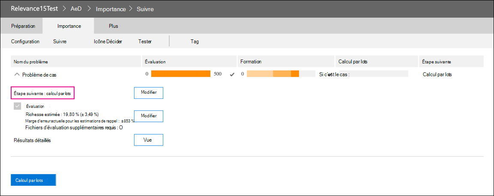

# Retrait du module Pertinence dans Advanced eDiscovery

Le 10 mars 2021, nous allons retirer le module Pertinence dans Advanced eDiscovery. Ce retrait signifie que les organisations n’auront plus accès au module Pertinence (en accédant à Gérer l’ensemble de révision Pertinence dans un cas Advanced eDiscovery) ou ne pourront plus accéder aux modèles  >   Pertinence existants. Le module de pertinence actuel qui est retiré sera remplacé par une nouvelle solution de codage prédictif au deuxième trimestre 2021 de l’exercice 2021. Cette nouvelle fonctionnalité permettra aux organisations de créer leurs propres modèles de codage prédictifs dans un flux de travail plus simple et plus intuitif.

Pour préparer ce retrait à venir, nous recommandons aux organisations qui utilisent le module Pertinence d’exporter la sortie de leur modèle avant la date de retrait en exécutant un calcul Par lot pour tous les modèles existants. Tous les scores de pertinence de votre modèle sont stockés définitivement dans le jeu à réviser correspondant et accessibles lorsque des documents sont exportés. Les scores de pertinence sont également conservés en tant que métadonnées dans le fichier de chargement. En outre, vous pourrez toujours filtrer le contenu du jeu à réviser en fonction du score de pertinence et avoir accès à toutes les métadonnées produites par vos modèles de pertinence.

## Modèles inachevés complets

Pour les modèles de pertinence non terminés, veuillez effectuer une évaluation, une formation et un calcul par lot afin de pouvoir appliquer le modèle aux documents d’un jeu à réviser. L’exécution du calcul batch permet de conserver les informations après la date de retrait du module de pertinence.

Voici les étapes à suivre pour effectuer les modèles non terminés :

1. Formez votre modèle jusqu’à ce qu’il soit stabilisé et prêt pour le calcul par lots. Voir [Marquage et formation sur la pertinence.](tagging-and-relevance-training-in-advanced-ediscovery.md)

   La capture d’écran suivante montre un module prêt pour un calcul par lot. Notez que l’évaluation et la formation sont terminées et que l’étape suivante consiste à exécuter le calcul par lots.

   

2. Exécutez le calcul par lots. Voir [Effectuer le calcul par lots.](track-relevance-analysis-in-advanced-ediscovery.md#performing-batch-calculation)

3. Vérifiez que le calcul par lots a réussi. Voir [les résultats de calcul par lot.](track-relevance-analysis-in-advanced-ediscovery.md#batch-calculation-results)

Pour obtenir de l’aide sur la réalisation de modèles de pertinence non terminés, contactez le Support Microsoft.
