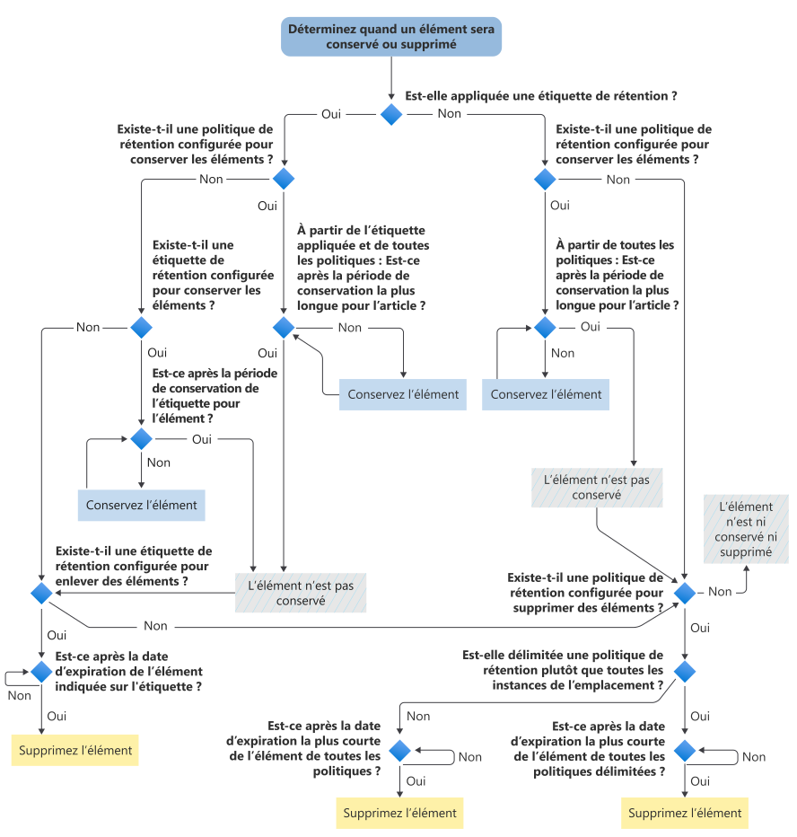

# Organigramme pour déterminer quand un élément sera conservé ou supprimé définitivement

>*[Guide de sécurité et conformité pour les licences Microsoft 365](/office365/servicedescriptions/microsoft-365-service-descriptions/microsoft-365-tenantlevel-services-licensing-guidance/microsoft-365-security-compliance-licensing-guidance).*

Utilisez l'organigramme suivant pour appliquer les [principes de rétention](retention.md#the-principles-of-retention-or-what-takes-precedence) à un élément afin de déterminer si le système le conservera ou le supprimera définitivement à la suite d'une étiquette ou d'une stratégie de rétention.

Ce flux logique est utilisé pour un élément lorsque l’une des conditions suivantes s’applique :

- Plusieurs stratégies de rétention sont appliquées
- Il existe une étiquette de rétention et une ou plusieurs stratégies de rétention

Lorsqu’un élément est soumis à une conservation eDiscovery (ou aux anciennes technologies de conservation pour litige ou de conservation inaltérable), il est toujours conservé avant les flux de décision pour les stratégies de rétention et une étiquette de rétention.

Si l’un des termes utilisés dans cet organigramme ne vous est pas familier, consultez [En savoir plus sur les stratégies de rétention et les étiquettes de rétention.](retention.md)

   

> [!NOTE]
> Il est important de faire la distinction entre la période de rétention la plus longue pour l'élément et la période la plus longue spécifiée dans une stratégie ou une étiquette de rétention. De même, entre la date d'expiration la plus courte pour l'élément et la période la plus courte spécifiée dans une stratégie de rétention.
> 
> Pour plus d’informations, consultez l’explication après le graphique dans la section [principes de rétention](retention.md#the-principles-of-retention-or-what-takes-precedence).
