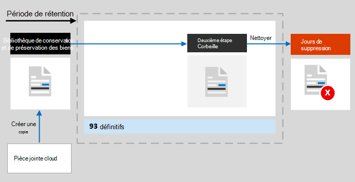

# Découvrir la rétention pour SharePoint et OneDrive

>*[Guide de sécurité et conformité pour les licences Microsoft 365](/office365/servicedescriptions/microsoft-365-service-descriptions/microsoft-365-tenantlevel-services-licensing-guidance/microsoft-365-security-compliance-licensing-guidance).*

[!include[Purview banner](../includes/purview-rebrand-banner.md)]

Les informations contenues dans cet article complètent l’article [Découvrir la rétention](retention.md), car elles contiennent des informations spécifiques à SharePoint et OneDrive.

Pour les autres charges de travail, consultez:

- [En savoir plus sur la rétention dans Microsoft Teams](retention-policies-teams.md)
- [Découvrir la rétention pour Yammer](retention-policies-yammer.md)
- [Découvrir la rétention pour Exchange](retention-policies-exchange.md)

## Éléments composant la rétention et la suppression

Tous les fichiers stockés dans SharePoint ou OneDrive peuvent être conservés en appliquant une stratégie de rétention ou une étiquette de rétention. 

Les fichiers suivants peuvent être supprimés:

- Lorsque vous utilisez une stratégie de rétention : tous les fichiers dans les bibliothèques de documents, y compris les bibliothèques de documents SharePoint créées automatiquement, telles que **Eléments de site**.
    
- Lorsque vous utilisez des étiquettes de rétention : tous les fichiers dans toutes les bibliothèques de documents et tous les fichiers au niveau racine qui ne se trouvent pas dans un dossier.
    
> [!TIP]
> Lorsque vous utilisez une [requête avec une stratégie d’application automatique pour une étiquette de rétention](apply-retention-labels-automatically.md#auto-apply-labels-to-content-with-keywords-or-searchable-properties), vous pouvez exclure des bibliothèques de documents à l’aide de cette entrée : `NOT(DocumentLink:"<URL to document library>")`

Les éléments de liste ne sont pas pris en charge par les stratégies de rétention, mais sont pris en charge par les étiquettes de rétention à l’exception des éléments dans les listes. Il s’agit de listes masquées permettant à SharePoint de gérer le système et d’inclure le catalogue de pages maîtres, le catalogue de solutions et les sources de données. Lorsque des étiquettes de rétention sont appliquées à des éléments de liste pris en charge, elles sont toujours conservées en fonction des paramètres de rétention, mais pas supprimées si elles sont masquées dans la recherche.

Lorsque vous appliquez une étiquette de rétention à un élément de liste pris en charge qui contient une pièce jointe au document :
- Pour une étiquette de rétention standard (qui ne déclare pas l'élément comme étant un document) :
    - La pièce jointe au document n’hérite pas automatiquement des paramètres de rétention de l’étiquette, mais peut être étiquetée de manière indépendante.
- Pour une étiquette de rétention qui déclare que l'élément est un document : 
    - La pièce jointe du document hérite automatiquement des paramètres de rétention de l'étiquette si le document n'est pas déjà étiqueté.

Les paramètres de rétention des stratégies de rétention et des étiquettes de rétention ne s’appliquent pas à l’organisation de structures qui incluent des bibliothèques, des listes et des dossiers.

Pour les stratégies de rétention et les stratégies d’application automatique des étiquettes : l’indexation des sites SharePoint est nécessaire pour l’application des paramètres de rétention. Cependant, si des éléments dans les bibliothèques de documents SharePoint sont configurés pour ne pas s’afficher dans les résultats de la recherche, cette configuration n’exclut pas les fichiers des paramètres de rétention.

## Fonctionnement de la rétention pour SharePoint et OneDrive

Pour stocker les contenus qui doivent être conservés, SharePoint et OneDrive créent une bibliothèque de conservation et de préservation des documents si elle n'existe pas. La bibliothèque de conservation et de préservation des documents n’est pas conçue pour être utilisée de manière interactive, mais stocke automatiquement les fichiers lorsque cela est nécessaire pour des raisons de conformité. Elle fonctionne de la manière suivante :

Lorsqu’un utilisateur modifie ou supprime un élément soumis à la rétention, une vérification est effectuée pour savoir si le contenu a été modifié depuis l’application des paramètres de rétention. S’il s’agit de la première modification depuis l’application des paramètres de rétention, le contenu est copié dans la bibliothèque de conservation et de préservation des documents, ce qui permet à l’utilisateur de modifier ou de supprimer le contenu d’origine.

Un travail du minuteur s’exécute régulièrement dans la bibliothèque de conservation et de préservation des documents. Pour le contenu ayant passé plus de 30 jours dans la bibliothèque de conservation et de préservation des documents, ce travail compare le contenu à toutes les requêtes utilisées par les paramètres de rétention de ce contenu. Le contenu plus ancien que la période de rétention configurée est ensuite supprimé de la bibliothèque de conservation et de préservation des documents, et de l’emplacement d’origine s’il est toujours là. Ce travail de timer s’exécute tous les sept jours, ce qui signifie qu’avec un minimum de 30 jours, la suppression du contenu de la bibliothèque de conservation et de préservation des documents peut prendre jusqu’à 37 jours.

Ce comportement de copie de fichiers dans la bibliothèque de conservation et de préservation des documents s'applique au contenu qui existe lorsque les paramètres de conservation ont été appliqués. De plus, pour les stratégies de rétention, tout nouveau contenu créé ou ajouté au site après son inclusion dans la stratégie sera conservé dans la bibliothèque de conservation. Cependant, le nouveau contenu n'est pas copié dans la bibliothèque de conservation et de préservation des documents la première fois qu'il est modifié, uniquement lorsqu'il est supprimé. Pour conserver toutes les versions d'un fichier, le [contrôle de version](#how-retention-works-with-document-versions) doit être activé pour le site d’origine.
  
Les utilisateurs voient un message d'erreur s'ils essaient de supprimer une bibliothèque, une liste, un dossier ou un site qui est soumis à la conservation. Ils peuvent supprimer un dossier s'ils déplacent ou suppriment d'abord tous les fichiers du dossier qui sont soumis à la conservation.

Les utilisateurs voient également un message d’erreur s’ils tentent de supprimer un élément étiqueté dans l’une des situations suivantes. L’élément n’est pas copié dans la bibliothèque de conservation et de préservation des documents, mais reste à l’emplacement d’origine :

- Le paramètre de gestion des enregistrements qui permet aux utilisateurs de supprimer des éléments étiquetés est désactivé.
    
    Pour vérifier ou modifier ce paramètre, accédez à la solution de **gestion des enregistrements** dans le portail de conformité Microsoft Purview > **Gestion des enregistrements** > **Paramètres de gestion des enregistrements** > **Étiquettes de conservation** > **Suppression des éléments**. Il existe des paramètres distincts pour SharePoint et OneDrive.
    
    Sinon, et si vous n’avez pas accès à la solution de **gestion des enregistrements**, vous pouvez utiliser *AllowFilesWithKeepLabelToBeDeletedSPO* et *AllowFilesWithKeepLabelToBeDeletedODB* à partir de [Get-PnPTenant](https://pnp.github.io/powershell/cmdlets/Get-PnPTenant.html) et [Set-PnPTenant](https://pnp.github.io/powershell/cmdlets/Set-PnPTenant.html).

- L’étiquette de rétention marque les éléments en tant qu’enregistrements et elle est [verrouillée](record-versioning.md).
    
    Ce n’est que lorsque l’enregistrement est déverrouillé qu’une copie de la dernière version est stockée dans la bibliothèque de conservation et de préservation des documents.

- L’étiquette de rétention marque les éléments en tant qu’[enregistrements réglementaires](records-management.md#compare-restrictions-for-what-actions-are-allowed-or-blocked), ce qui empêche continuellement la modification ou la suppression de l’élément.

Une fois que les paramètres de rétention sont attribués à un compte OneDrive ou un site SharePoint, les chemins d’accès au contenu sont fonction des paramètres de rétention qui consistent à conserver et à supprimer, à conserver uniquement ou à supprimer uniquement.

Lorsque les paramètres de la stratégie de rétention consistent à conserver et supprimer :

  
1. **Si le contenu est modifié ou supprimé** pendant la période de rétention, une copie du contenu d’origine tel qu’il existait lors de l’attribution des paramètres de rétention est créée dans la bibliothèque de conservation et de préservation des documents. Là, le travail du minuteur identifie les éléments dont la période de rétention a expiré. Ces éléments sont déplacés vers la corbeille de second niveau, où ils sont définitivement supprimés au bout de 93 jours. La corbeille second niveau n’est pas visible par les utilisateurs finaux (seule le premier niveau de la corbeille l’est), mais les administrateurs de collection de sites peuvent afficher et restaurer du contenu à partir de cet emplacement.

    > [!NOTE]
    > Pour éviter toute perte de données par inadvertance, nous ne supprimons plus définitivement le contenu de la bibliothèque de conservation. Au lieu de cela, nous ne supprimons définitivement que le contenu de la corbeille de façon à ce que tout le contenu de la bibliothèque de conservation et de préservation passe transmis par la corbeille second niveau .
    
2. **Si le contenu n'est pas modifié ou supprimé** pendant la période de rétention, le travail du minuteur déplace ce contenu vers la Corbeille de première étape à la fin de la période de rétention. Si un utilisateur en supprime le contenu ou vide cette corbeille (également appelée purge), le document est déplacé vers la corbeille secondaire. Une période de rétention de 93 jours couvre à la fois les corbeilles de recyclage de première et de deuxième étape. Au bout de 93 jours, le document est définitivement supprimé où qu'il se trouve, dans la corbeille de première ou de deuxième étape. La Corbeille n'est pas indexée et donc indisponible pour la recherche. Par conséquent, une recherche eDiscovery ne peut trouver aucun contenu de la corbeille sur lequel placer une conservation.

> [!NOTE]
> En raison du [premier principe de rétention](retention.md#the-principles-of-retention-or-what-takes-precedence), la suppression définitive est toujours suspendue si le même élément doit être retenu à cause d’une autre stratégie de rétention ou d’une étiquette de rétention ou qu’il est bloqué pour des raisons juridiques ou d’enquête.

Lorsque les paramètres de la stratégie de rétention sont définis sur conserver uniquement ou supprimer uniquement, les chemins d’accès du contenu sont des variantes de l’option conserver et supprimer :

### Chemins d’accès du contenu pour la stratégie de rétention de conservation uniquement

1. **Si le contenu est modifié ou supprimé** pendant la période de rétention : une copie du document d’origine est créée dans la bibliothèque de conservation et de préservation et conservée jusqu’à la fin de la période de rétention, lorsque celle-ci est déplacée vers la corbeille second niveau et supprimée définitivement après 93 jours.

2. **Si le contenu n’est pas modifié ou supprimé** pendant la période de rétention : rien ne se passe avant et après la période de rétention ; le document reste à son emplacement d’origine.

### Chemins d’accès au contenu pour les paramètres de rétention uniquement pour la suppression

1. **Si le contenu est supprimé** pendant la période configurée : le document est déplacé vers la corbeille de premier niveau. Si un utilisateur supprime le contenu à partir de là ou vide cette corbeille, le document est déplacé vers la corbeille second niveau. La période de rétention de 93 jours concerne tant la corbeille premier niveau que la corbeille second niveau. À la fin des 93 jours, le document est définitivement supprimé de l’emplacement en question (corbeille premier niveau ou second niveau). Si le contenu est modifié pendant la période configurée, il suit le même chemin de suppression après la période configurée.

2. **Si le contenu n'est pas supprimé** pendant la période configurée : À la fin de la période configurée dans la politique de rétention, le document est déplacé vers la Corbeille de première étape. Si un utilisateur supprime le document à partir de là ou vide cette corbeille (également appelée purge), le document est déplacé vers la corbeille secondaire. Une période de rétention de 93 jours couvre à la fois les corbeilles de recyclage de première et de deuxième étape. Au bout de 93 jours, le document est définitivement supprimé de l'endroit où il se trouve, dans la corbeille de première étape ou de deuxième étape. La Corbeille n'est pas indexée et donc indisponible pour la recherche. Par conséquent, une recherche eDiscovery ne peut trouver aucun contenu de la corbeille sur lequel placer une conservation.

## Fonctionnement de la rétention avec les pièces jointes cloud

Les pièces jointes dans le cloud sont des liens incorporés vers des fichiers partagés par les utilisateurs, qui peuvent être conservés et supprimés lorsque vos utilisateurs les partagent dans Outlook courriers électroniques et Teams messages électroniques. Lorsque vous appliquez automatiquement une étiquette de rétention aux pièces [jointes](apply-retention-labels-automatically.md#auto-apply-labels-to-cloud-attachments)cloud, l’étiquette de rétention est appliquée à une copie du fichier partagé, qui est stocké dans la bibliothèque de conservation et de préservation des documents.

Pour ce scénario, nous vous recommandons de configurer le paramètre d’étiquette pour démarrer la période de rétention en fonction du moment où l’élément est étiqueté. Si vous configurez la période de rétention en fonction de la date de création ou de dernière modification de l’élément, cette date est tirée du fichier d’origine au moment du partage. Si vous configurez le début de la rétention à la dernière modification, ce paramètre n’a aucun effet sur cette copie dans la bibliothèque de conservation et de préservation des documents.

Toutefois, si le fichier d’origine est modifié, puis partagé à nouveau, une nouvelle copie du fichier en tant que nouvelle version est enregistrée et étiquetée dans la bibliothèque de conservation et de préservation des données.

Si le fichier d’origine est partagé à nouveau mais n’est pas modifié, la date étiquetée de la copie dans la bibliothèque de conservation et de préservation des données est mise à jour. Cette action réinitialise le début de la période de rétention et c’est pourquoi nous vous recommandons de configurer le début de la période de rétention en fonction du moment où l’élément est étiqueté.

Étant donné que l’étiquette de rétention n’est pas appliquée au fichier d’origine, le fichier étiqueté n’est jamais modifié ou supprimé par un utilisateur. Le fichier étiqueté reste dans la bibliothèque Preservation Hold jusqu'à ce que le travail de minuterie identifie que sa période de conservation a expiré. Si les paramètres de rétention sont configurés pour supprimer des éléments, le fichier est ensuite déplacé vers la Corbeille second niveau, où il est définitivement supprimé au bout de 93 jours :

La copie stockée dans la bibliothèque de conservation et de préservation des données est généralement créée dans l’heure qui s’agit de la pièce jointe cloud partagée.

## Fonctionnement de la rétention avec OneNote contenu

Lorsque vous appliquez une stratégie de rétention à un emplacement qui inclut du contenu OneNote ou une étiquette de rétention à un dossier OneNote, en arrière-plan, les différentes pages et sections OneNote sont des fichiers individuels qui héritent des paramètres de rétention. Cela signifie que chaque section d’une page sera conservée et supprimée individuellement, conformément aux paramètres de rétention que vous spécifiez.

Seules les pages et sections sont touchées par les paramètres de rétention que vous spécifiez. Par exemple, même si vous voyez une date de **modification** pour chaque bloc-notes individuel, cette date n’est pas utilisée par Microsoft 365 rétention.

## Fonctionnement de la rétention avec des versions de documents

La gestion des versions est une fonctionnalité de toutes les listes de documents et bibliothèques dans Microsoft Office SharePoint Online et OneDrive. Par défaut, la gestion des versions conserve un minimum de 500 versions majeures, bien que vous puissiez augmenter cette limite. Pour plus d'informations, consultez [Activer et configurer le contrôle de version pour une liste ou une bibliothèque](https://support.office.com/article/1555d642-23ee-446a-990a-bcab618c7a37) et [Fonctionnement du contrôle de version dans les listes et les bibliothèques](https://support.microsoft.com/office/how-versioning-works-in-lists-and-libraries-0f6cd105-974f-44a4-aadb-43ac5bdfd247).
  
Lorsqu’un document avec plusieurs versions est soumis à des paramètres de rétention pour conserver le contenu, les versions copiées dans la bibliothèque de conservation et de préservation des documents sont des éléments distincts. Si vous avez configuré les paramètres de rétention pour suppression à la fin de la période de rétention :

- Si la période de rétention est basée sur la date de création du contenu, chaque version comporte la même date d’expiration que le document d’origine. Le document d’origine et toutes ses versions expirent en même temps.

- Si la période de rétention est basée sur la date de la dernière modification du contenu, chaque version possède sa propre date d’expiration basée sur la date à laquelle le document d’origine a été modifié pour créer cette version. Le document d’origine et ses versions expirent séparément l’un de l’autre.

Lorsque l’action de rétention consiste à supprimer le document, elle supprime simultanément toutes les versions absentes de la bibliothèque de conservation et de préservation des documents, en fonction de la version actuelle.

Pour les éléments soumis à une stratégie de rétention (ou une conservation eDiscovery), le programme ignore les limites de contrôle de version de la bibliothèque de documents jusqu’à la période de rétention du document (où jusqu’à la fin de la conservation eDiscovery).Dans ce scénario, les anciennes versions ne sont pas purgées automatiquement et les utilisateurs ne peuvent pas supprimer les versions.

Ce n’est pas le cas des étiquettes de rétention lorsque le contenu n’est pas soumis à une stratégie de rétention (ou à une conservation eDiscovery). Au lieu de cela, les limites de contrôle de version sont honorées de sorte que les versions antérieures soient automatiquement supprimées afin de pouvoir accueillir les nouvelles versions, mais les utilisateurs ne peuvent pas supprimer les versions.

## Lorsqu’un utilisateur quitte l’organisation

**SharePoint** :

Lorsqu’un utilisateur quitte votre organisation, le contenu qu’il a créé n’est pas affecté car SharePoint est considéré comme un environnement collaboratif, contrairement à la boîte aux lettres ou au compte OneDrive de l’utilisateur.

**OneDrive** :

Si un utilisateur quitte votre organisation, tous les fichiers qui sont soumis à une politique de conservation ou qui ont un label de conservation resteront soumis aux paramètres de conservation pour la durée de la période de conservation spécifiée dans la politique ou le label. Pendant ce temps, tout l’accès au partage continue de fonctionner et le contenu reste découvrable par la recherche de contenu et eDiscovery. 

Lorsque la période de rétention expire et que les paramètres de rétention incluent une action de suppression, le contenu se déplace dans la Corbeille de la collection de sites et n’est accessible à personne sauf à l’administrateur.

## Instructions de configuration

Si vous débutez avec la configuration de la rétention dans Microsoft 365, consultez [Démarrage avec la gestion du cycle de vie des données](get-started-with-data-lifecycle-management.md).

Si vous êtes prêt à configurer une stratégie ou une étiquette de rétention pour Exchange, consultez les instructions suivantes :
- [Créer et configurer des stratégies de rétention](create-retention-policies.md)
- [Publier des étiquettes de rétention et les appliquer dans les applications](create-apply-retention-labels.md)
- [Appliquer automatiquement une étiquette de rétention au contenu](apply-retention-labels-automatically.md)
