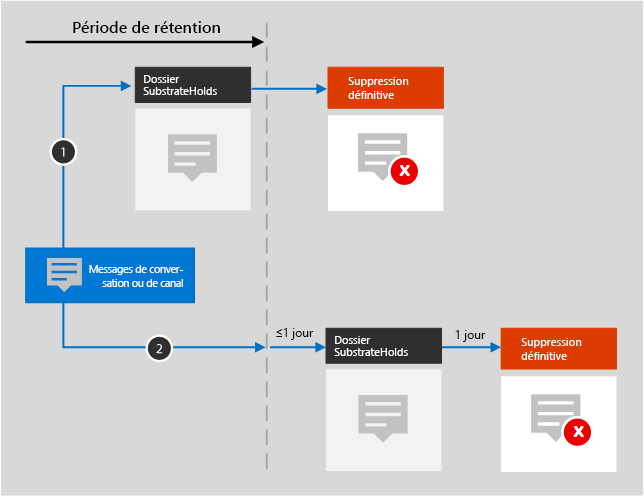

# En savoir plus sur la rétention dans Microsoft Teams

>*[Guide de sécurité et conformité pour les licences Microsoft 365](https://aka.ms/ComplianceSD).*

Les informations contenues dans cet article complètent l’article [Découvrir la rétention](retention.md) car elles contiennent des informations spécifiques à Microsoft Teams.

## Fonctionnement de la rétention avec Microsoft Teams

Vous pouvez utiliser une stratégie de rétention pour conserver des conversations et des messages de canal dans Teams. Les conversations Teams sont stockées dans un dossier masqué de la boîte aux lettres de chaque utilisateur participant à la conversation. Les messages de canal Teams sont stockés dans un dossier masqué similaire dans la boîte aux lettres de groupe de l’équipe. 

Il est important de comprendre que Teams utilise un service de conversation Azure qui stocke également ces données. Par défaut, ce service stocke les données sans limite de durée. C’est pour cette raison qu’il est recommandé de créer une stratégie de rétention qui utilise les emplacements Teams pour conserver et supprimer ces données Teams. Cette stratégie de rétention peut supprimer les données de manière définitive dans les boîtes aux lettres Exchange et le service de conversation Azure sous-jacent. Si vous souhaitez en savoir plus, consultez la page [ Sécurité et conformité dans Microsoft Teams](https://go.microsoft.com/fwlink/?linkid=871258) et plus précisément, la section [Architecture de protection des informations](https://docs.microsoft.com/MicrosoftTeams/security-compliance-overview#information-protection-architecture).

Les conversations et les messages de canal Teams ne sont pas affectés par les stratégies de rétention configurées pour les boîtes aux lettres des utilisateurs et des groupes. Même si les conversations et les messages de canal Teams sont stockés dans Exchange, ces données Teams sont incluses uniquement par une stratégie de rétention configurée pour les **messages de canal Teams** et les emplacements des **conversations Teams**.

> [!NOTE]
> Si un utilisateur est inclus dans une stratégie de rétention active qui conserve les données Teams et que vous supprimez une boîte aux lettres d’un utilisateur inclus dans cette stratégie, la boîte aux lettres est convertie en [boîte aux lettres inactive](inactive-mailboxes-in-office-365.md) pour conserver les données Teams. Si vous n’avez pas besoin de conserver ces données Teams pour l’utilisateur, excluez son compte de la stratégie de rétention avant de supprimer sa boîte aux lettres.

Une fois qu’une stratégie de rétention est configurée pour les conversations et les messages de canal, les chemins d’accès empruntés par le contenu dépendent de la stratégie de rétention qui soit conserve et supprime le contenu, soit le conserve uniquement, soit le supprime uniquement.

Lorsque la stratégie de rétention doit conserver et supprimer le contenu :

1. **Si une conversation ou un message de canal est modifié ou supprimé** par l’utilisateur pendant la période de rétention, le message est déplacé (ou copié, en cas de modification) dans le dossier SubstrateHolds (qui est un dossier masqué dans chaque boîte aux lettres d’utilisateur ou de groupe) et est stocké dans ce dossier jusqu’à l’expiration de la période de rétention. Les messages sont supprimés définitivement le jour où la période de rétention expire.

2. **Si une conversation ou un message de canal n’est pas supprimé** pendant la période de rétention, le message est déplacé vers le dossier SubstrateHolds dans un délai d’un jour après l’expiration de la période de rétention (cela prend entre 0 et 24 heures). Le message est définitivement supprimé un jour après son déplacement vers le dossier SubstrateHolds. 

> [!NOTE]
> Les messages dans le dossier SubstrateHolds peuvent faire l’objet de recherches par les outils eDiscovery. Une fois un message supprimé définitivement, il n’apparaîtra pas dans les recherches eDiscovery.

Lorsque la stratégie de rétention consiste à conserver uniquement ou à supprimer uniquement, les chemins d'accès au contenu sont des variantes de rétention et de suppression.

### Chemins d’accès au contenu pour la stratégie de rétention de conservation uniquement

1. **Si une conversation ou un message de canal est modifié ou supprimé** pendant la période de rétention : une copie du message d’origine est créée dans le dossier SubstrateHolds et conservée jusqu’à la fin de la période de rétention, lorsque la copie dans le dossier SubstrateHolds est définitivement supprimée un jour après l’expiration de l’élément. 

2. **Si l’élément n’est ni modifié ni supprimé** pendant la période de rétention : rien ne se passe avant et après la période de rétention. Le message reste à son emplacement d’origine.

### Chemins d’accès du contenu pour la stratégie de rétention de suppression uniquement

1. **Si le message n’est pas supprimé** pendant la période de rétention : à la fin de la période de rétention, il est déplacé vers le dossier SubstrateHolds. 

2. **Si l’élément est supprimé par l’utilisateur** pendant la période de rétention, l’élément est placé immédiatement dans le dossier SubstrateHolds. Si un utilisateur supprime le message à partir du dossier SubstrateHolds ou vide celui-ci, l’élément est définitivement supprimé. Sinon, le message est définitivement supprimé un jour après son déplacement vers le dossier SubstrateHolds.

## Interopérabilité des conversations Skype Entreprise et Teams

Lorsqu’une conversation Skype Entreprise intervient dans Teams, celle-ci devient un message de la conversation Teams et est stockée dans la boîte aux lettres appropriée. Les stratégies de conservation Teams appliqueront ces messages du fil de conversation Teams. 

Cependant, si l’historique des conversations est activé pour Skype Entreprise et par le côté client Skype Entreprise, celui-ci est enregistré dans une boîte aux lettres. Ces données de conversation ne sont pas gérées par une stratégie de rétention Teams. Pour ce contenu, utilisez une stratégie de rétention configurée pour Skype entreprise.

## Réunions et utilisateurs externes

Les messages de réunion de canal sont stockés de la même façon que les messages de canal. Par conséquent, pour ces données, sélectionnez l’emplacement des **messages de canal Teams** lorsque vous configurez votre stratégie de rétention.

Les messages de réunion impromptus sont stockés de la même façon que les messages de conversation de groupe. Par conséquent, pour ces données, sélectionnez l’emplacement des **conversations Teams** lorsque vous configurez votre stratégie de rétention.

Lorsque des utilisateurs externes sont inclus dans une réunion organisée par votre organisation :

- si un utilisateur externe se connecte à l’aide d’un compte invité dans votre client, il dispose d’une boîte aux lettres fantôme qui peut être soumise à la stratégie de rétention de votre organisation pour Teams. Les messages de la réunion sont stockés dans la boîte aux lettres de vos utilisateurs et dans la boîte aux lettres fantôme. 

- Si un utilisateur externe se connecte à l’aide d’un compte d’une autre organisation Microsoft 365, vos stratégies de rétention ne peuvent pas supprimer les messages de cet utilisateur, car ils sont stockés dans sa boîte aux lettres dans un autre client. Cependant, pour la même réunion, vos stratégies de rétention peuvent supprimer des messages pour vos utilisateurs.

## Lorsqu’un utilisateur quitte l’organisation 

Si un utilisateur quitte votre organisation et que son compte Microsoft 365 est supprimé, les messages de conversation soumis à une rétention sont stockés dans une boîte aux lettres inactive. Les messages de conversation restent soumis à une stratégie de rétention qui a été placée sur l’utilisateur avant que sa boîte aux lettres ne soit inactive et que le contenu soit disponible pour une recherche eDiscovery. Pour plus d’informations, consultez [Boîtes aux lettres inactives dans Exchange Online](inactive-mailboxes-in-office-365.md). 

Si l’utilisateur a stocké des fichiers dans Teams, consultez la [section équivalente](retention-policies-sharepoint.md#when-a-user-leaves-the-organization) pour SharePoint et OneDrive.

## Limites

Nous travaillons sans cesse afin d’optimiser les fonctionnalités de rétention dans Teams. En attendant, voici quelques limitations à prendre en compte lors de l’utilisation de la rétention pour les messages et conversations de canal Teams :
  
- **Teams nécessite une stratégie de rétention distincte**. Lorsque vous créez une stratégie de rétention et activez les emplacements Teams, tous les autres emplacements sont désactivés. Une stratégie de rétention qui inclut Teams ne peut inclure que Teams et aucun autre emplacement.

- **Teams n’est pas inclus dans une stratégie à l’échelle de l’organisation**. Si vous créez une stratégie à l’échelle de l’organisation, les messages de canal et les conversations Teams ne sont pas inclus, car ils nécessitent une stratégie de rétention distincte.

- **Teams ne prend pas en charge les rétentions avancées**. Lorsque vous créez une stratégie de rétention, si vous choisissez les [Paramètres avancés permettant d’identifier du contenu qui répond à certaines conditions](create-retention-policies.md#advanced-settings-to-identify-content-that-meets-specific-conditions), les emplacements Teams ne sont pas disponibles. Pour le moment, la rétention dans Teams s’applique à l’ensemble du contenu des conversations et des messages de canal lorsque vous sélectionnez ces emplacements.

- **Les messages Teams dans les canaux privés ne sont pas inclus lorsque vous configurez une stratégie de rétention pour les messages de canal Teams**. Les canaux privés ne sont actuellement pas pris en charge par les stratégies de rétention. 

- **Les mentions j’aime et les autres réactions ne sont pas conservées pour les messages de conversation et le canal équipes**. Les réactions d’autres personnes sous la forme d’émoticônes ne sont pas prises en charge par les stratégies de rétention.

- **Un délai de sept jours peut être nécessaire pour nettoyer les messages arrivés à expiration**. Une stratégie de rétention appliquée à Teams supprimera les conversations et les messages de canal à l’expiration de la période de rétention. Toutefois, la suppression de ces messages et la suppression définitive de ces messages peuvent prendre entre trois et sept jours. De plus, les conversations et les messages de canal pourront faire l’objet d’une recherche avec les outils eDiscovery entre le moment qui suit l’expiration de la période de rétention et celui où les messages sont supprimés définitivement.
    
    > [!NOTE]
    > Auparavant, une stratégie de rétention ne pouvait pas supprimer du contenu de Teams qui avait moins de 30 jours, mais nous avons supprimé cette limitation. Vous pouvez désormais choisir le nombre de jours de la période de rétention du contenu de Teams, et ce peut être seulement un jour. Si vous avez une période de rétention d’un jour, il faudra jusqu’à sept jours après l’expiration de la période de rétention avant la suppression définitive des messages.

- **Problème d’affichage incorrect dans Outlook**. Si vous créez des stratégies de rétention pour les emplacements Skype ou Teams, l’une de ces stratégies apparaît comme stratégie de dossier par défaut lorsqu’un utilisateur affiche les propriétés d’un dossier de boîte aux lettres dans le client de la version bureau de Outlook. Il s’agit [d’un problème connu](https://support.microsoft.com/help/4491013/outlook-client-displays-teams-or-skype-for-business-retention-policies)d’affichage incorrect dans Outlook. Ce qui doit s’afficher comme stratégie de dossier par défaut est la stratégie de rétention de boîte aux lettres appliquée au dossier. La stratégie de rétention de Skype ou Teams n’est pas appliquée à la boîte aux lettres de l’utilisateur.

- **Problèmes liés à la configuration** : 
    - Lorsque vous sélectionnez **Choisir les équipes** pour l’emplacement des **messages de canal d’équipes**, les groupes Microsoft 365, qui ne sont pas des équipes, peuvent s’afficher. Ne sélectionnez pas ces groupes.
    
    - Lorsque vous sélectionnez **Choisir les utilisateurs** pour l’emplacement des **conversations Teams**, les invités et les utilisateurs qui n’utilisent pas de boîte aux lettres peuvent être s’afficher. Les stratégies de rétention ne sont pas conçues pour ces utilisateurs. Ne les sélectionnez pas.

## Instructions de configuration

Si vous êtes prêt à configurer la rétention dans Microsoft 365, voir [Prise en main des stratégies de rétention et des étiquettes de rétention](get-started-with-retention.md).
