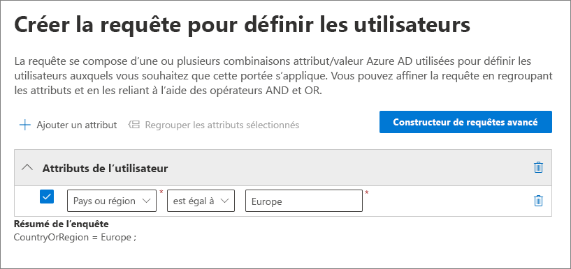
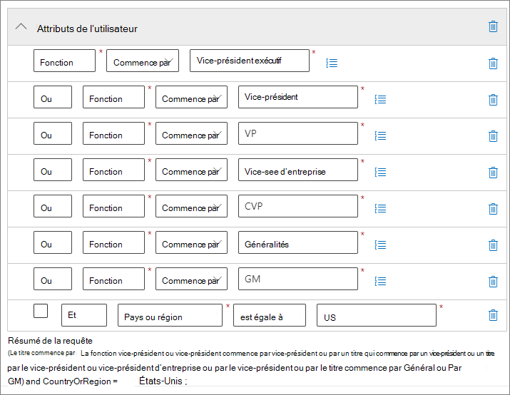
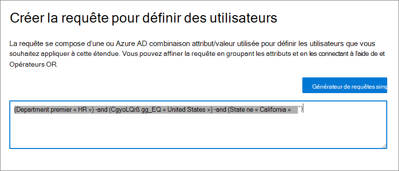
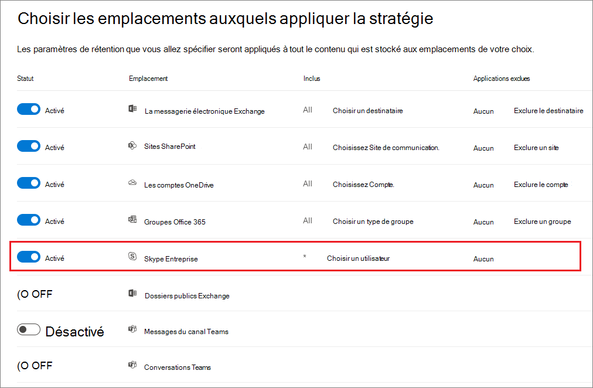
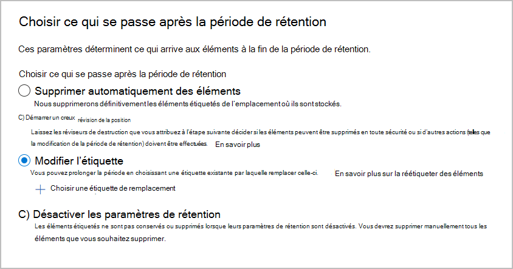

# <a name="common-settings-for-retention-policies-and-retention-label-policies"></a>Paramètres courants des stratégies de rétention et stratégies d’étiquettes de rétention

>*[Guide de sécurité et conformité pour les licences Microsoft 365](https://aka.ms/ComplianceSD).*

[!include[Purview banner](../includes/purview-rebrand-banner.md)]

De nombreux paramètres de rétention sont communs aux stratégies de rétention et aux stratégies d’étiquette de rétention. Utiliser les informations suivantes pour vous aider à configurer ces paramètres pour conserver de manière proactive le contenu, supprimer du contenu ou les deux, conserver, puis supprimer le contenu.

Pour connaître les scénarios qui prennent en charge ces stratégies de rétention, consultez :

- [Créer et configurer des stratégies de rétention](create-retention-policies.md).
- [Publier des étiquettes de rétention et les appliquer dans les applications](create-apply-retention-labels.md)
- [Appliquer automatiquement une étiquette de rétention au contenu](apply-retention-labels-automatically.md)

Les paramètres spécifiques à chaque scénario sont expliqués dans leur documentation respective.

Pour en savoir plus sur les stratégies de rétention et le fonctionnement de la rétention dans Microsoft 365, consultez la page [Découvrir les stratégies et étiquettes de rétention](retention.md).

## <a name="scopes---adaptive-and-static"></a>Étendues : adaptatives et statiques

Si vous n’êtes pas familiarisé avec les étendues adaptatives et statiques, et pour vous aider à choisir celle à utiliser lorsque vous configurez une stratégie pour la rétention, consultez [Étendues de stratégie adaptatives ou statiques pour la rétention](retention.md#adaptive-or-static-policy-scopes-for-retention). 

Lorsque vous avez décidé d’utiliser une étendue adaptative ou statique, utilisez les informations suivantes pour vous aider à la configurer :
- [Informations de configuration pour les étendues adaptatives](#configuration-information-for-adaptive-scopes)
- [Informations de configuration pour les étendues statiques](#configuration-information-for-static-scopes)

> [!TIP]
> Si vous avez des stratégies qui utilisent des étendues statiques et que vous souhaitez les convertir en étendues adaptatives, laissez vos stratégies existantes en place pendant que vous créez de nouvelles stratégies qui utilisent des étendues adaptatives avec les mêmes paramètres de rétention. Vérifiez que ces nouvelles stratégies ciblent les utilisateurs, sites et groupes appropriés avant de désactiver ou de supprimer les anciennes stratégies avec des étendues statiques.

### <a name="configuration-information-for-adaptive-scopes"></a>Informations de configuration pour les étendues adaptatives

Lorsque vous choisissez d’utiliser des étendues adaptatives, vous êtes invité à sélectionner le type d’étendue adaptative souhaité. Il existe trois types d’étendues adaptatives différents et chacune prend en charge des attributs ou des propriétés différents :

| Type d’étendue adaptative | Les attributs ou propriétés pris en charge sont les suivants : |
|:-----|:-----|
|**Utilisateurs** : s’applique à :  <br/> E-mail Exchange <br/> Comptes OneDrive <br/> Conversations Teams <br/> Messages d’un canal privé Teams <br/> Messages utilisateur Yammer| Prénom <br/> Nom  <br/>Nom d’affichage <br/> Fonction <br/> Service <br/> Bureau <br/>Rue <br/> Ville <br/>Département ou région <br/>Code postal <br/> Pays ou région <br/> Adresses de messagerie <br/> Alias <br/> Attributs personnalisés Exchange : attributs personnalisés1 : attributs personnalisés15|
|**Microsoft Office SharePoint Online** : s’applique à :  <br/> Sites Microsoft Office SharePoint Online <br/> Comptes OneDrive |URL du site <br/>Nom du site <br/> Propriétés personnalisées Microsoft Office SharePoint Online : RefinableString00 : RefinableString99 |
|**Groupes Microsoft 365** : s’applique à :  <br/> - Groupes Microsoft 365 <br/> - Messages de canal Teams (standard et partagés) <br/> Messages de la communauté Yammer |Nom <br/> Nom <br/> Description <br/> Adresses de messagerie <br/> Alias <br/> Attributs personnalisés Exchange : attributs personnalisés1 : attributs personnalisés15 |

Les noms des propriétés des sites sont basés sur les propriétés gérées des sites SharePoint. Pour plus d'informations sur les attributs personnalisés, voir [Utilisation de propriétés de site SharePoint personnalisées pour appliquer la rétention Microsoft 365 avec des étendues de politique adaptative](https://techcommunity.microsoft.com/t5/security-compliance-and-identity/using-custom-sharepoint-site-properties-to-apply-microsoft-365/ba-p/3133970).

Les noms d'attributs des utilisateurs et des groupes sont basés [sur les propriétés](/powershell/exchange/recipientfilter-properties#filterable-recipient-properties) filtrables des destinataires qui correspondent aux attributs d'Azure AD. Par exemple :

- **Alias** correspond au nom LDAP **mailNickname**, qui s’affiche comme **e-mail** dans le centre d’administration Azure AD.
- **Adresses e-mail** correspond au nom LDAP **adresses proxy**, qui s’affiche sous la forme **adresse proxy** dans le centre d’administration Azure AD.

Les attributs et propriétés répertoriés dans la table peuvent être facilement spécifiés lorsque vous configurez une étendue adaptative à l’aide du générateur de requêtes simple. Les attributs et propriétés supplémentaires sont pris en charge avec le générateur de requêtes avancé, comme décrit dans la section suivante.

> [!TIP]
> Pour plus d’informations sur l’utilisation du générateur de requêtes avancé, consultez les webinaires suivants : 
> - [La création de requêtes avancées pour les utilisateurs et les groupes avec des étendues de stratégies adaptatives](https://mipc.eventbuilder.com/event/52683/occurrence/49452/recording?rauth=853.3181650.1f2b6e8b4a05b4441f19b890dfeadcec24c4325e90ac492b7a58eb3045c546ea)
> - [La création de requêtes pour les sites SharePoint avec des étendues de stratégie adaptative](https://aka.ms/AdaptivePolicyScopes-AdvancedSharePoint)

Une stratégie unique de rétention peut avoir une ou plusieurs étendues adaptatives.

#### <a name="to-configure-an-adaptive-scope"></a>Pour configurer une étendue adaptative

Avant de configurer votre portée adaptative, utilisez la section précédente pour identifier le type de portée à créer et les attributs et valeurs que vous utiliserez. Vous devrez peut-être travailler avec d'autres administrateurs pour confirmer ces informations. 

Pour les sites SharePoint, une configuration SharePoint supplémentaire peut être nécessaire si vous prévoyez d'utiliser des [propriétés de site personnalisées](https://techcommunity.microsoft.com/t5/security-compliance-and-identity/using-custom-sharepoint-site-properties-to-apply-microsoft-365/ba-p/3133970).

1. Dans le [Centre de conformité Microsoft Purview](https://compliance.microsoft.com/), accédez à l’un des emplacements suivants :
    
    - Si vous utilisez la solution de gestion des enregistrements :
        - **Solutions** > **Gestion des enregistrements** > **étendues adaptatives** onglet > + **Créer l’étendue**
        
    - Si vous utilisez la solution de gestion du cycle de vie des données :
       - **Solutions** > **Gestion du cycle de vie des données** > **Étendues adaptatives** onglet > + **Créer une étendue**
    
    Vous ne voyez pas immédiatement votre solution dans le volet de navigation ? Sélectionnez d'abord **Afficher tout**. 

2. Suivez les invites de la configuration pour sélectionner d’abord le type d’étendue, puis sélectionnez les attributs ou propriétés que vous souhaitez utiliser pour générer l’appartenance dynamique, puis tapez les valeurs d’attribut ou de propriété.
    
    Par exemple, pour configurer une étendue adaptative qui sera utilisée pour identifier les utilisateurs en Europe, commencez par sélectionner **Utilisateurs** comme type d’étendue, puis sélectionnez l’attribut **pays ou région**, puis tapez **Europe** :
    
    
    
    Une fois par jour, cette requête s’exécutera sur Azure AD et identifiera tous les utilisateurs qui ont une valeur **Europe** spécifiée dans leur compte pour l’attribut **Pays ou région**.
    
    > [!IMPORTANT]
    > Étant donné que la requête ne s’exécute pas immédiatement, il n’y a aucune validation que vous ailliez tapée correctement dans la valeur.
    
    Sélectionnez **Ajouter des attributs** (pour les utilisateurs et les groupes) ou **Ajouter des propriétés** (pour les sites) pour utiliser toute combinaison d’attributs ou de propriétés prises en charge pour leur type d’étendue, ainsi que des opérateurs logiques pour générer des requêtes. Les opérateurs pris en charge sont **est égal à**, **n’est pas égal à**, **commence avec**, et **ne commence pas avec**, et vous pouvez regrouper les attributs ou propriétés sélectionnés. Par exemple :
    
    
    
    Vous pouvez également sélectionner **Générateur de requêtes** pour spécifier vos propres requêtes :
    
    - Pour **utilisateur** et étendues de **groupe Microsoft 365**, utilisez [Syntaxe de filtrage OPATH](/powershell/exchange/recipient-filters). Par exemple, pour créer une étendue utilisateur qui définit son appartenance par département, pays et état :
    
        
        
        L'un des avantages de l'utilisation du générateur de requêtes avancées pour ces champs d'application est un choix plus large d'opérateurs de requête :
        - **et**
        - **ou**
        - **pas**
        - **eq** (égal à)
        - **ne** (n’est pas égal à)
        - **lt** (inférieur à)
        - **gt** (supérieur à)
        - **like**(comparaison de chaînes)
        - **n’aime pas**(comparaison de chaînes)
    
    - Pour les **sites Microsoft Office SharePoint Online** étendues, utilisez le langage KQL (Keyword Query Language). Vous connaissez peut-être déjà l’utilisation de KQL pour rechercher Microsoft Office SharePoint Online à l’aide de propriétés de site indexées. Pour vous aider à spécifier ces requêtes KQL, consultez [En savoir plus sur la syntaxe KQL](/sharepoint/dev/general-development/keyword-query-language-kql-syntax-reference).
        
        Par exemple, étant donné que les étendues d'application des sites SharePoint incluent automatiquement tous les types de sites SharePoint, qui comprennent les sites Microsoft 365 connectés à un groupe et les sites OneDrive, vous pouvez utiliser la propriété de site indexée **SiteTemplate** pour inclure ou exclure des types de sites spécifiques. Les modèles que vous pouvez spécifier :
        - `SITEPAGEPUBLISHING` pour les sites de communication modernes
        - `GROUP` pour les sites Microsoft 365 connectés à un groupe
        - `TEAMCHANNEL` pour les sites de canal privé Microsoft Teams
        - `STS` pour un site d’équipe SharePoint classique
        - `SPSPERS` pour les sites OneDrive
        
        Ainsi, pour créer une portée adaptative qui inclut uniquement les sites de communication modernes et exclut les sites Microsoft 365 connectés à un groupe et les sites OneDrive, spécifiez la requête KQL suivante :
        ````console
        SiteTemplate=SITEPAGEPUBLISHING
        ````
    
    Vous pouvez [valider ces requêtes avancées](#validating-advanced-queries)indépendamment de la configuration de l’étendue.
    
    > [!TIP]
    > Vous devez utiliser le générateur de requêtes avancé si vous souhaitez exclure des boîtes aux lettres inactives. Ou inversement, ciblez simplement les boîtes aux lettres inactives. Pour cette configuration, utilisez la propriété OPATH *IsInactiveMailbox*:
    > 
    > - Pour exclure les boîtes aux lettres inactives, assurez-vous que la requête inclut : `(IsInactiveMailbox -eq "False")`
    > - Pour cibler uniquement les boîtes aux lettres inactives, spécifiez : `(IsInactiveMailbox -eq "True")`

3. Créez autant d’étendues adaptatives que nécessaire. Vous pouvez sélectionner une ou plusieurs étendues adaptatives lorsque vous créez votre stratégie pour la rétention.

> [!NOTE]
> Le remplissage complet des requêtes peut prendre jusqu’à cinq jours et les modifications ne seront pas immédiates. Prenez en compte ce délai en patientant quelques jours avant d’ajouter une étendue nouvellement créée à une stratégie pour la rétention.

Pour confirmer les modifications actuelles de l’appartenance et de l’appartenance pour une étendue adaptative :

1. Double-cliquez (ou sélectionnez et appuyez sur Entrée) sur l’étendue dans la page **étendues adaptatives**

2. Dans le volet **Détails**, sélectionnez **Détails de l’étendue**. 
    
    Passez en revue les informations qui identifient tous les utilisateurs, sites ou groupes actuellement dans l’étendue, s’ils ont été automatiquement ajoutés ou supprimés, ainsi que la date et l’heure de ce changement d’appartenance.

> [!TIP]
> Utilisez l’option de [stratégie lookup](retention.md#policy-lookup) pour vous aider à identifier les stratégies actuellement affectées à des utilisateurs, sites et groupes Microsoft 365 spécifiques.

#### <a name="validating-advanced-queries"></a>Validation des requêtes avancées

Vous pouvez valider manuellement les requêtes avancées à l’aide de PowerShell et de la recherche Microsoft Office SharePoint Online :
- Utilisez PowerShell pour les types d’étendue **Utilisateurs** et **Groupes Microsoft 365**
- Utilisez la recherche Microsoft Office SharePoint Online pour le type d’étendue **Sites Microsoft Office SharePoint Online**

Pour exécuter une requête à l’aide de PowerShell :

1. [Connecter à Exchange Online PowerShell à l’aide](/powershell/exchange/connect-to-exchange-online-powershell) d’un compte avec les [autorisations Exchange Online administrateur appropriés.](/powershell/exchange/find-exchange-cmdlet-permissions#use-powershell-to-find-the-permissions-required-to-run-a-cmdlet)

2. Utilisez [Get-Recipient](/powershell/module/exchange/get-recipient), [Get-Mailbox](/powershell/module/exchange/get-mailbox) ou [Get-User](/powershell/module/exchange/get-user) avec le paramètre *-Filter* et votre [Requête OPATH](/powershell/exchange/filter-properties) pour l’étendue adaptative entre crochets (`{`,`}`). Si vos valeurs d’attribut sont des chaînes, mettez ces valeurs entre guillemets doubles ou simples.

    Vous pouvez déterminer s’il faut utiliser Get-Mailbox, Get-Recipient ou Get-User pour la validation en identifiant l’applet de commande prise en charge par la [Propriété OPATH](/powershell/exchange/filter-properties) que vous choisissez pour votre requête.

    > [!IMPORTANT]
    > Get-Mailbox ne prend pas en charge le type de destinataire *MailUser*. Par conséquent, Get-Recipient ou Get-User doit être utilisé pour valider les requêtes qui incluent des boîtes aux lettres locales dans un environnement hybride.

    Pour valider une étendue **Utilisateur**, utilisez la commande appropriée :
    - `Get-Mailbox` avec *-RecipientTypeDetails UserMailbox,SharedMailbox,RoomMailbox,EquipmentMailbox*
    - `Get-Recipient` avec *-RecipientTypeDetails UserMailbox,MailUser,SharedMailbox,RoomMailbox,EquipmentMailbox*
    
    Pour valider une étendue **groupe Microsoft 365** utilisez :
    - `Get-Mailbox` avec *-GroupMailbox* ou `Get-Recipient` avec *-RecipientTypeDetails GroupMailbox*

    Par exemple, pour valider une **étendue Utilisateur,** vous pouvez utiliser :
    
    ````PowerShell
    Get-Recipient -RecipientTypeDetails UserMailbox,MailUser -Filter {Department -eq "Marketing"} -ResultSize Unlimited
    ````
    
    Pour valider une **étendue Microsoft 365 groupe,** vous pouvez utiliser :
    
    ```PowerShell
    Get-Mailbox -RecipientTypeDetails GroupMailbox -Filter {CustomAttribute15 -eq "Marketing"} -ResultSize Unlimited
    ```
    
    > [!TIP]
    > Lorsque vous utilisez ces commandes pour valider une étendue utilisateur, si le nombre de destinataires renvoyés est supérieur à celui attendu, cela peut être dû au fait qu’elle inclut les utilisateurs qui n’ont pas de licence valide pour les étendues adaptatives. Les paramètres de rétention ne sont pas appliqués à ces utilisateurs.
    > 
    > Par exemple, dans un environnement hybride, vous pouvez avoir des comptes d’utilisateurs synchronisés sans licence sans boîte aux lettres Exchange localement ou dans Exchange Online. Vous pouvez identifier ces utilisateurs en exécutant la commande suivante : `Get-User -RecipientTypeDetails User`

3. Vérifiez que la sortie correspond aux utilisateurs ou groupes attendus pour votre étendue adaptative. Si ce n’est pas le cas, vérifiez votre requête et les valeurs auprès de l’administrateur approprié pour Azure AD ou Exchange.
 
Pour exécuter une requête à l’aide de la recherche Microsoft Office SharePoint Online :

1. À l’aide d’un compte d’administrateur général ou d’un compte doté du rôle d’administrateur Microsoft Office SharePoint Online, accédez à `https://<your_tenant>.sharepoint.com/search`.

2. Utilisez la barre de recherche pour spécifier votre requête KQL.

3. Vérifiez que les résultats de la recherche correspondent aux URL de site attendues pour votre étendue adaptative. Si ce n’est pas le cas, vérifiez votre requête et les URL auprès de l’administrateur approprié pour Microsoft Office SharePoint Online.

### <a name="configuration-information-for-static-scopes"></a>Informations de configuration pour les étendues statiques

Lorsque vous choisissez d’utiliser des étendues statiques, vous devez décider d’appliquer la stratégie à toutes les instances de l’emplacement sélectionné (l’emplacement entier) ou d’inclure ou d’exclure des instances spécifiques (inclusions ou exclusions spécifiques).

#### <a name="a-policy-that-applies-to-entire-locations"></a>Une stratégie qui s’applique à des emplacements entiers

À l’exception de Skype Entreprise, la valeur par défaut est que toutes les instances des emplacements sélectionnés sont automatiquement incluses dans la stratégie sans que vous ayez à les spécifier comme inclus.

Par exemple, Tous les **destinataires** pour l'emplacement de la **messagerie Exchange**. Avec ce paramètre par défaut, toutes les boîtes aux lettres utilisateur existantes seront incluses dans la stratégie, et toute nouvelle boîte aux lettres créée après l'application de la stratégie héritera automatiquement de celle-ci.

#### <a name="a-policy-with-specific-inclusions-or-exclusions"></a>Une stratégie avec des inclusions ou des exclusions spécifiques

Sachez que si vous utilisez la configuration optionnelle pour étendre vos paramètres de rétention à des utilisateurs spécifiques, des groupes Microsoft 365 spécifiques ou des sites spécifiques, il faut tenir compte de certaines limites par politique. Pour plus d’informations, voir [Limites des stratégies de rétention et stratégies d’étiquettes de rétention](retention-limits.md). 

Pour utiliser la configuration optionnelle afin de définir vos paramètres de conservation, assurez-vous que **le statut** de ce lieu est **activé**, puis utilisez les liens pour inclure ou exclure des utilisateurs, des groupes Microsoft 365 ou des sites spécifiques.

> [!WARNING]
> Si vous configurez des instances à inclure, et supprimez la dernière, la configuration revient à **tous** pour l’emplacement.  Assurez-vous qu'il s'agit bien de la configuration que vous souhaitez avant d'enregistrer la stratégie.
>
> Par exemple, si vous spécifiez un site SharePoint à inclure dans votre stratégie de conservation configurée pour supprimer les données, puis que vous supprimez ce site unique, tous les sites SharePoint seront alors soumis par défaut à la stratégie de conservation qui supprime définitivement les données. Il en va de même pour les inclusions de destinataires Exchange, de comptes OneDrive, d'utilisateurs de chats Teams.
>
> Dans ce scénario, désactivez l'emplacement si vous ne voulez pas que le paramètre **Tout** de l'emplacement soit soumis à la stratégie de conservation. Vous pouvez également spécifier d'exclure les instances qui seront exemptées de la stratégie.

## <a name="locations"></a>Emplacements

Les emplacements dans les stratégies de rétention identifient des services Microsoft 365 spécifiques qui prennent en charge les paramètres de rétention, tels que la messagerie Exchange et les sites Microsoft Office SharePoint Online. Utilisez la section suivante pour les emplacements qui ont des détails de configuration et des exceptions possibles dont vous devez être conscient lorsque vous les sélectionnez pour votre stratégie.

### <a name="configuration-information-for-exchange-email-and-exchange-public-folders"></a>Informations de configuration pour la messagerie Exchange et les dossiers publics Exchange

L’emplacement de **Courrier Exchange** et l’emplacement des **dossiers publics Exchange** nécessitent que les boîtes aux lettres aient au moins 10 Mo de données avant que les paramètres de rétention ne s’appliquent à celles-ci.

L’emplacement de l’**E-mail Exchange** prend en charge la rétention pour la messagerie, le calendrier et d’autres éléments de boîte aux lettres des utilisateurs, en appliquant des paramètres de rétention au niveau d’une boîte aux lettres. Les boîtes aux lettres partagées et les boîtes aux lettres de ressources pour l’équipement et les salles sont également prises en charge.

Les contacts de messagerie et les boîtes aux lettres de groupe Microsoft 365 ne sont pas pris en charge pour les e-mails Exchange. Pour boîtes aux lettres de groupe Microsoft 365, sélectionnez plutôt l’emplacement **Groupes Microsoft 365** . Bien que l’emplacement Exchange autorise initialement la sélection d’une boîte aux lettres de groupe pour une étendue statique, lorsque vous essayez d’enregistrer la stratégie de rétention, vous recevez une erreur indiquant que « RemoteGroupMailbox » n’est pas une sélection valide pour cet emplacement.

Selon la configuration de votre stratégie, les boîtes aux lettres [inactives](inactive-mailboxes-in-office-365.md) peuvent être incluses ou non :

- Les étendues de stratégie statique incluent les boîtes aux lettres inactives lorsque vous utilisez la configuration par défaut Tous les **destinataires,** mais ne sont pas pris en charge pour des [inclusions ou des exclusions spécifiques.](#a-policy-with-specific-inclusions-or-exclusions) Toutefois, si vous incluez ou excluez un destinataire qui possède une boîte aux lettres active au moment où la stratégie est appliquée et que la boîte aux lettres devient inactive par la suite, les paramètres de rétention continuent d’être appliqués ou exclus.

- Les étendues de stratégie adaptative, par défaut, incluent les boîtes aux lettres inactives lorsqu’elles répondent à la requête de l’étendue. Vous pouvez les exclure à l’aide du générateur de requêtes avancé et de la propriété OPATH *IsInactiveMailbox*:
    
    ```console
    (IsInactiveMailbox -eq "False")
    ```

Si vous utilisez une étendue de stratégie statique et choisissez des destinataires à inclure ou à exclure, vous pouvez sélectionner des groupes de distribution et des groupes de sécurité à messagerie comme moyen efficace de sélectionner plusieurs destinataires au lieu de les sélectionner un par un. Lorsque vous utilisez cette option, en arrière-plan, ces groupes sont automatiquement développés au moment de la configuration pour sélectionner les boîtes aux lettres des utilisateurs du groupe. Si l’appartenance à ces groupes change ultérieurement, votre stratégie de rétention existante n’est pas automatiquement mise à jour, contrairement aux étendues de stratégie adaptative.

Si vous souhaitez en savoir plus sur les éléments de boîte aux lettres inclus et exclus lors de la configuration des paramètres de rétention d’Exchange, veuillez consulter la rubrique [Éléments composant la rétention et la suppression](retention-policies-exchange.md#whats-included-for-retention-and-deletion).

L’emplacement **Dossiers publics Exchange** applique les paramètres de rétention à tous les dossiers publics et ne peut pas être appliqué au niveau d’un dossier ou d’une boîte aux lettres.

#### <a name="exceptions-for-auto-apply-policies-configured-for-sensitive-information-types"></a>Exceptions pour les stratégies d’application automatique configurées pour les types d’informations sensibles

Lorsque vous configurez une stratégie d’application automatique qui utilise des types d’informations sensibles et sélectionnez l’emplacement **e-mail Exchange** :

- Les boîtes aux lettres de groupe Microsoft 365 sont incluses.

- Toutes les boîtes aux lettres sont automatiquement incluses, même si vous configurez une étendue adaptative pour identifier des boîtes aux lettres spécifiques. Si vous avez choisi une étendue de stratégie statique, vous ne pourrez pas spécifier les destinataires à inclure ou exclure.

### <a name="configuration-information-for-sharepoint-sites-and-onedrive-accounts"></a>Informations de configuration pour les sites SharePoint et les comptes OneDrive

Lorsque vous choisissez l’emplacement des **sites Microsoft Office SharePoint Online**, la stratégie de rétention peut conserver et supprimer les documents des sites de communication Microsoft Office SharePoint Online, des sites d’équipe qui ne sont pas connectés par des groupes Microsoft 365 ainsi que des sites classiques. Sauf si vous utilisez des [étendues de stratégie adaptative](#exceptions-for-adaptive-policy-scopes), les sites d’équipe connectés par des groupes Microsoft 365 ne sont pas pris en charge avec cette option et utilisent plutôt l’emplacement **Groupes Microsoft 365** qui s’applique au contenu de la boîte aux lettres, du site et des fichiers du groupe.

> [!TIP]
> Vous pouvez utiliser un [filtre dans le Centre d’administration SharePoint](/sharepoint/customize-admin-center-site-list) ou une [commande PowerShell SharePoint](/powershell/module/sharepoint-online/get-sposite#example-10) pour vérifier qu’un site est connecté à un groupe. Pour les étendues statiques, ces sites sont pris en charge avec l’emplacement **Groupes Microsoft 365**.

Si vous souhaitez en savoir plus sur les éléments inclus et exclus lors de la configuration des paramètres de rétention de SharePoint et OneDrive, veuillez consulter la rubrique [Éléments composant la rétention et la suppression](retention-policies-sharepoint.md#whats-included-for-retention-and-deletion).

Lorsque vous spécifiez vos emplacements pour les sites Microsoft Office SharePoint Online ou les comptes OneDrive, vous n’avez pas besoin d’autorisations pour accéder aux sites. Pour les étendues statiques, aucune validation n’est effectuée au moment où vous spécifiez l’URL sur la page **Modifier les emplacements**. Toutefois, les sites Microsoft Office SharePoint Online que vous spécifiez sont vérifiés qu’ils existent sur la dernière page de la dernière page de la configuration. Si cette vérification échoue, un message apparaît pour vous informer que la validation de l’URL entrée a échoué, et que la stratégie de rétention ne peut être créée tant que la vérification de validation n’aura pas réussie. Si ce message apparaît, revenez au processus de configuration pour modifier l’URL ou supprimer le site de la stratégie de rétention.

Pour spécifier des comptes OneDrive individuels, consultez [Obtenir la liste de toutes les URL OneDrive des utilisateurs de votre organisation.](/onedrive/list-onedrive-urls)

> [!NOTE]
> Lorsque vous spécifiez des comptes OneDrive individuels, sachez qu'à moins que les comptes OneDrive ne soient [pré-approvisionnés](/onedrive/pre-provision-accounts), l'URL n'est pas créée tant qu'un utilisateur n'accède pas à son OneDrive pour la première fois.
>
> De plus, l'URL OneDrive [change automatiquement](/onedrive/upn-changes) en cas de modification de l'UPN de l'utilisateur. Par exemple, un événement de changement de nom tel qu’un mariage ou un changement de nom de domaine pour prendre en charge le changement de nom d’une organisation ou la restructuration de l’entreprise. Si l’UPN change, vous devez mettre à jour les URL OneDrive que vous spécifiez pour les paramètres de rétention.
>
> En raison des défis liés à la spécification fiable des URL que les utilisateurs individuels doivent inclure ou exclure pour les étendues statiques, [étendues adaptatives](retention.md#adaptive-or-static-policy-scopes-for-retention) avec le type d’étendue **utilisateur** qui convient mieux à cet effet.

#### <a name="exceptions-for-adaptive-policy-scopes"></a>Exceptions pour les champs d'application de stratégie adaptative

Lorsque vous configurez une stratégie de rétention qui utilise des étendues de stratégie adaptatives et sélectionnez l'emplacement **des sites Microsoft Office SharePoint Online** :

- Les sites OneDrive et les sites connectés aux groupes Microsoft 365 sont inclus en plus des sites de communication SharePoint, des sites d'équipe qui ne sont pas connectés par des groupes Microsoft 365 et des sites classiques.

### <a name="configuration-information-for-microsoft-365-groups"></a>Informations de configuration pour les Groupes Microsoft 365

Pour conserver ou supprimer le contenu d’un groupe Microsoft 365 (anciennement groupe Office 365), utilisez l’emplacement **Groupes Microsoft 365**. Pour les stratégies de rétention, cet emplacement inclut la boîte aux lettres de groupe et SharePoint site d’équipes. Pour les étiquettes de rétention, cet emplacement inclut SharePoint site d’équipes uniquement.

Les boîtes aux lettres que vous ciblez avec cet emplacement de stratégie nécessitent au moins 10 Mo de données avant que les paramètres de rétention ne s’appliquent à celles-ci.

> [!NOTE]
> Même si un groupe Microsoft 365 possède une boîte aux lettres Exchange, une stratégie de rétention qui inclut l’ensemble de l’emplacement de la **messagerie Exchange** n’inclut pas le contenu des boîtes aux lettres du groupe Microsoft 365.

Si vous utilisez des étendues statiques : bien que l’emplacement de l’**E-mail Exchange** pour une étendue statique vous permette initialement de spécifier une boîte aux lettres de groupe à inclure ou à exclure, lorsque vous essayez d’enregistrer la stratégie de rétention, vous verrez une erreur indiquant que « RemoteGroupMailbox » n’est pas une sélection valide pour l’emplacement Exchange.

Par défaut, la stratégie de rétention d’un groupe Microsoft 365 comprend la boîte aux lettres de groupe et le site d’équipes SharePoint.. Les fichiers stockés sur le site d’équipes SharePoint sont couverts par cet emplacement, à la différence des conversations Teams ou des messages de canal Teams qui ont leur propre emplacements de stratégie de rétention.

Pour modifier la valeur par défaut, car vous souhaitez que la stratégie de rétention s’applique uniquement aux boîtes aux lettres Microsoft 365 ou aux sites SharePoint Teams connectés, utilisez l’applet de commande PowerShell [Set-RetentionCompliancePolicy](/powershell/module/exchange/set-retentioncompliancepolicy) et le paramètre *Applications* avec l’une des valeurs suivantes :

- `Group:Exchange` pour les boîtes aux lettres Microsoft 365 uniquement connectées au groupe.
- `Group:SharePoint` pour les sites SharePoint uniquement connectées au groupe.

Pour revenir à la valeur par défaut de la boîte aux lettres et du site SharePoint pour les groupes Microsoft 365 sélectionnés, spécifiez `Group:Exchange,SharePoint`.

#### <a name="exceptions-for-auto-apply-policies-configured-for-sensitive-information-types"></a>Exceptions pour les stratégies d’application automatique configurées pour les types d’informations sensibles

Lorsque vous configurez une stratégie d’application automatique qui utilise des types d’informations sensibles et sélectionnez l’emplacement **Groupes Microsoft 365** :

- Les boîtes aux lettres de groupe Microsoft 365 ne sont pas incluses. Pour inclure ces boîtes aux lettres dans votre stratégie, sélectionnez plutôt l'emplacement de la **messagerie Exchange**.

#### <a name="what-happens-if-a-microsoft-365-group-is-deleted-after-a-policy-is-applied"></a>Que se passe-t-il si un groupe Microsoft 365 est supprimé après l'application d'une stratégie

Lorsqu’une stratégie de rétention (étendue de stratégie statique ou adaptative) est appliquée à un groupe Microsoft 365, et que ce groupe est ensuite supprimé de Azure Active Directory :

- Le site SharePoint connecté au groupe est conservé et continue d'être géré par la politique de rétention avec l'emplacement des **groupes Microsoft 365**. Le site reste accessible aux personnes qui y avaient accès avant la suppression du groupe, et toute nouvelle autorisation doit désormais être gérée via Microsoft Office SharePoint Online.
    
    À ce stade, vous ne pouvez pas exclure le site de l'emplacement des groupes Microsoft 365, car vous ne pouvez pas spécifier le groupe supprimé. Si vous devez libérer la stratégie de rétention de ce site, contactez le Support Microsoft. Par exemple, [ouvrez une demande de support dans le centre d’administration Microsoft 365](/microsoft-365/admin/get-help-support#online-support).

- La boîte aux lettres du groupe supprimé devient inactive et, comme le site Microsoft Office SharePoint Online, reste soumise aux paramètres de rétention. Pour plus d’informations, consultez [Boîtes aux lettres inactives dans Exchange Online](inactive-mailboxes-in-office-365.md).

### <a name="configuration-information-for-skype-for-business"></a>Informations de configuration de Skype Entreprise

> [!NOTE]
> Skype Entreprise été [retiré le 31 juillet 2021](https://techcommunity.microsoft.com/t5/microsoft-teams-blog/skype-for-business-online-to-be-retired-in-2021/ba-p/777833) et nous encourageons les clients à migrer vers Microsoft Teams. Toutefois, les stratégies de rétention Skype Entreprise sont toujours pris en charge pour les clients existants.

Au contraire de Courrier Exchange, il est impossible de basculer l’état de l’emplacement Skype pour inclure automatiquement tous les utilisateurs : quand cet emplacement est activé, vous devez choisir manuellement les utilisateurs dont vous voulez conserver les conversations :



Après avoir sélectionné cette option **Modifier**, dans le volet **Skype Entreprise**, vous pouvez inclure rapidement tous les utilisateurs en sélectionnant la zone masquée avant la colonne **Nom**. Toutefois, il est important de comprendre que chaque utilisateur compte comme une inclusion particulière dans la stratégie. Par conséquent, si vous incluez 1 000 utilisateurs en sélectionnant cette zone équivaut à sélectionner manuellement 1 000 utilisateurs à inclure, ce qui est le maximum pris en charge pour Skype Entreprise.

Sachez que **l'historique des conversations**, un dossier dans Outlook, est une fonction qui n'a rien à voir avec l'archivage de Skype. **L'historique des conversations** peut être désactivé par l'utilisateur final, mais l'archivage de Skype se fait en stockant une copie des conversations Skype dans un dossier caché inaccessible à l'utilisateur mais disponible pour l'eDiscovery.

## <a name="settings-for-retaining-and-deleting-content"></a>Paramètres pour la conservation et la suppression de contenu

En choisissant les paramètres de conservation et de suppression de contenu, votre stratégie de rétention aura l’une des configurations suivantes pendant une période donnée lorsque vous sélectionnez les paramètres de conservation et de suppression de contenu :

- Conserver uniquement
    
    Pour cette configuration, choisissez les options suivantes :
    
    - Pour les stratégies de rétention : sur la page **Décider si vous souhaitez conserver du contenu, le supprimer ou les deux**, sélectionnez **Conserver les éléments pendant une période spécifique**, spécifiez la période de rétention, puis pour **À la fin de la période de rétention**, sélectionnez **Ne rien faire** pour que les paramètres de rétention à supprimer. Vous pouvez également conserver sans date de fin en sélectionnant **Conserver les éléments indéfiniment** sur cette page.
    
    - Pour les étiquettes de rétention : dans la **page Définir les paramètres d’étiquette**, sélectionnez **Conserver les éléments indéfiniment ou pendant une période spécifique**, puis :
        - Pour que les paramètres de rétention ne soient plus en vigueur sur le contenu étiqueté après une durée spécifique : dans la page **Définir la période de rétention**, pour **Conserver les éléments pendant**, spécifiez la période. Ensuite, dans la page **Choisir ce qui se passe après la période de rétention**, sélectionnez **Désactiver les paramètres de rétention**. L’étiquette reste sur le contenu, mais sans aucune restriction, comme s’il s’agissait d’une [étiquette qui classe simplement](retention.md#classifying-content-without-applying-any-actions).
        - Pour une conservation sans date de fin : dans la page **Définir la période de rétention**, pour **Conserver les éléments pendant**, sélectionnez **Une période indéfinie**. L’étiquette reste sur le contenu avec toutes les [restrictions existantes](records-management.md#compare-restrictions-for-what-actions-are-allowed-or-blocked ).

- Conserver puis supprimer

    Pour cette configuration, choisissez les options suivantes :
    
    - Pour les stratégies de rétention : sur la page **Décider si vous souhaitez conserver du contenu, le supprimer ou les deux**, sélectionnez **Conserver les éléments pendant une période spécifique**, spécifiez la période de rétention, puis pour **À la fin de la période de rétention**, sélectionnez **Supprimer automatiquement les éléments**.
    
    - Pour les étiquettes de rétention : dans la page **Définir les paramètres d’étiquette**, sélectionnez **Conserver les éléments indéfiniment ou pendant une période spécifique**, spécifiez la période de rétention, puis pour **Choisir ce qui se passe après la période de rétention**, sélectionnez **Supprimer automatiquement** ou **Démarrer une révision avant destruction**. Pour obtenir des informations sur les révisions avant destruction, voir [Révision avant destruction](disposition.md#disposition-reviews).

- Supprimer uniquement

    Pour cette configuration, choisissez les options suivantes :
    
    - Pour les stratégies de rétention : sur la page **Décider si vous souhaitez conserver du contenu, le supprimer ou les deux**, sélectionnez **Supprimer uniquement les éléments lorsqu’ils atteignent un certain âge**, puis spécifiez la période.
    
    - Pour les étiquettes de rétention : sur la page **Définir les paramètres d’étiquette**, sélectionnez **Appliquer les actions après une période spécifique**, puis spécifiez la période, toujours appelée période de rétention. L’option **Choisir ce qui se passe après la période** est automatiquement définie sur **Supprimer automatiquement les éléments**.

### <a name="retaining-content-for-a-specific-period-of-time"></a>Conservation du contenu sur une période donnée

Lorsque vous configurez une étiquette ou une stratégie de rétention pour conserver du contenu, vous choisissez de conserver des éléments pour un nombre spécifique de jours, de mois (30 jours pour un mois) ou d’années. Ou bien de conserver les éléments indéfiniment. La période de rétention n’est pas calculée à partir du moment où la stratégie a été affectée, mais en fonction du début de la période de rétention spécifiée.

Pour le début de la période de rétention, vous pouvez choisir le moment où le contenu a été créé ou, pris en charge uniquement pour les fichiers et les groupes SharePoint, OneDrive et Microsoft 365, la dernière modification du contenu. Pour les étiquettes de rétention, vous pouvez démarrer la période de rétention à partir du contenu étiqueté et lorsqu’un événement se produit.

Exemples :

- SharePoint : si vous souhaitez conserver des éléments dans une collection de site pendant sept ans après la date de dernière modification du contenu et qu’un document de cette collection de site n’a pas été modifié depuis six ans, celui-ci ne sera conservé que pendant une autre année sauf s’il est modifié entre-temps. Si le document est de nouveau modifié, l’âge du document est calculé à partir de la date de dernière modification, et il sera conservé pendant sept années supplémentaires.

- Exchange : Si vous souhaitez conserver les éléments dans une boîte aux lettres pendant sept ans et qu’un message a été envoyé il y a six ans, celui-ci ne sera conservé que pendant une autre année. Pour les éléments Exchange, l’âge est basé sur la date de réception du courrier entrant et d’envoi du courrier sortant. La rétention d’éléments sur la base de la date de dernière modification ne s’applique qu’au contenu de site sur OneDrive et SharePoint.

À la fin de la période de rétention, vous choisissez de supprimer définitivement le contenu. Par exemple, pour les stratégies de rétention :


Comme nous l’expliquons dans la section suivante, les étiquettes de rétention disposent d’une autre option : appliquer une autre étiquette de rétention avec sa propre période de rétention.

Avant de configurer la rétention, familiarisez-vous tout d’abord avec les limites de capacité et de stockage pour les charges de travail respectives :

- Pour SharePoint et OneDrive, les éléments conservés sont stockés dans la bibliothèque de conservation et de préservation du site, qui est incluse dans le quota de stockage du site. Pour plus d’informations, consultez [Gérer les limites de stockage de site](/sharepoint/manage-site-collection-storage-limits) de la documentation SharePoint.

- Pour Exchange, Teams et Yammer, où les messages conservés sont stockés dans des boîtes aux lettres, consultez [Limites Exchange Online](/office365/servicedescriptions/exchange-online-service-description/exchange-online-limits) et activez [Archivage à extension automatique](autoexpanding-archiving.md).
    
    Dans les cas extrêmes où un volume élevé d’e-mails est supprimé sur une courte période, soit par des utilisateurs, soit automatiquement à partir des paramètres de stratégie, vous devrez peut-être également configurer Exchange pour déplacer plus fréquemment des éléments du dossier Éléments récupérables de la boîte aux lettres principale de l’utilisateur vers le dossier Éléments récupérables de leur boîte aux lettres d’archivage. Pour obtenir des instructions pas à pas, consultez [Augmenter le quota d’éléments récupérables pour les boîtes aux lettres en attente](increase-the-recoverable-quota-for-mailboxes-on-hold.md).

#### <a name="relabeling-at-the-end-of-the-retention-period"></a>Réétiquetage à la fin de la période de rétention

> [!NOTE]
> Cette option est actuellement déployée en version préliminaire et est susceptible d’être modifiée.

Lorsque vous configurez une étiquette de rétention pour appliquer automatiquement une autre étiquette de rétention à la fin de la période de rétention, l’élément est alors soumis aux paramètres de rétention de l’étiquette de rétention nouvellement sélectionnée. Cette option vous permet de modifier automatiquement les paramètres de rétention de l’élément.

Vous pouvez modifier l’étiquette de remplacement après avoir créé et enregistré l’étiquette de rétention principale. Pour les éléments auxquels l’étiquette de rétention principale est déjà appliquée et qui se trouvent dans la période de rétention configurée, la modification de l’étiquette de remplacement est synchronisée avec ces éléments. Comme pour les autres modifications d’étiquette, prévoyez jusqu’à 7 jours pour cette période de synchronisation.

Pour l’étiquette de remplacement, vous choisissez généralement une étiquette dont la période de rétention est plus longue que celle de l’étiquette de rétention principale. Toutefois, ce n’est pas nécessairement le cas, car l’étiquette fixe le début de la période de rétention. Par exemple, l’étiquette de rétention principale est configurée pour démarrer la période de rétention lorsque l’élément est créé, et l’étiquette de remplacement démarre la période de rétention lorsqu’elle est étiquetée ou lorsqu’un événement se produit.

En outre, si l’étiquette [indique que l’élément est un enregistrement ou un enregistrement régulier](declare-records.md), l’étiquette de remplacement peut également modifier les [restrictions relatives aux actions autorisées ou bloquées](records-management.md#records) pour cet élément.

##### <a name="relabeling-example-configuration"></a>Configuration de l’exemple de réétiquetage

Vous créez et configurez une étiquette de rétention pour une exigence de conformité du secteur consistant à conserver le contenu pendant trois ans après sa création, puis vous marquez l’élément en tant qu’enregistrement. Une fois cette étiquette est appliquée, les utilisateurs ne peuvent pas supprimer l’élément de leur application, car il s’agit de l’une des restrictions d’un enregistrement.

Au terme des trois années, vous souhaitez conserver automatiquement le contenu pendant deux années supplémentaires en raison de stratégies de conformité internes, mais il n’est pas nécessaire de le marquer comme un enregistrement avec les restrictions appliquées par cette configuration.

Pour terminer la configuration, vous sélectionnez le paramètre d’étiquette pour modifier l’étiquette à la fin de la période de rétention, puis choisissez une étiquette qui conserve le contenu pendant cinq ans après sa création, et ne marque pas l’élément en tant qu’enregistrement. 

Avec ces paramètres concaténés, les utilisateurs peuvent supprimer l’élément de leur application au bout de trois ans, mais il reste accessible pour les recherches eDiscovery pendant cinq ans.

##### <a name="considerations-for-the-relabeling-option"></a>Considérations relatives à l’option de réétiquetage

- Vous ne pouvez pas réétiqueter un enregistrement réglementaire, mais l’étiquette de remplacement peut être configurée pour marquer le contenu en tant qu’enregistrement réglementaire.

- Vous ne pourrez pas supprimer une étiquette de rétention sélectionnée en tant qu’étiquette de remplacement.

- Vous pouvez choisir une étiquette de remplacement configurée pour appliquer une autre étiquette de remplacement. Il n’existe aucune limite au nombre d’étiquettes de remplacement dont un élément peut disposer.

- Si l’étiquette de remplacement marque l’élément comme étant un enregistrement ou un enregistrement réglementaire, mais qu’elle ne peut pas être appliquée parce que le fichier est en cours d’extraction, le processus de réétiquetage est relancé lorsque le fichier est à nouveau extrait, ou l’extraction est ignorée.

- En tant que problème connu pour cette version préliminaire, une étiquette de remplacement est visible pour les utilisateurs dans Outlook uniquement si cette étiquette est incluse dans une stratégie d’étiquette publiée pour le même emplacement, ou si elle est configurée pour être supprimée uniquement.

##### <a name="configuration-paths-for-relabeling"></a>Chemins de configuration pour le réétiquetage

L’option de réétiquetage à la fin de la période de rétention présente deux chemins de configuration lorsque vous créez une étiquette de rétention :

- Si vous devez initialement conserver le contenu avec l’étiquette principale (le plus souvent) : sur la page **Définir les paramètres d’étiquette**, sélectionnez **Conserver les éléments indéfiniment ou pour une période spécifique**, puis spécifiez la période de rétention. Ensuite, sur la page **Choisir ce qui se passe après la période de rétention**, sélectionnez **Modifier l’étiquette** > **Choisir une étiquette**.

- Si vous n’avez pas besoin de conserver initialement le contenu avec l’étiquette principale : sur la page **Définir les paramètres d’étiquette**, sélectionnez **Appliquer les actions après une période spécifique**, spécifiez la période de rétention, puis sélectionnez **Modifier l’étiquette** > **Choisir une étiquette**.

Dans les deux cas, l’étiquette de remplacement doit déjà être créée mais ne doit pas nécessairement être incluse dans une stratégie d’étiquette existante.



Les réviseurs avant destruction peuvent également sélectionner manuellement une étiquette de remplacement dans le cadre du [processus de révision avant destruction](disposition.md#disposition-reviews) si le paramètre d’étiquette **Démarrer une révision avant destruction** est sélectionné sur la page **Choisir ce qui se passe après la période de rétention**.

### <a name="deleting-content-thats-older-than-a-specific-age"></a>Suppression du contenu antérieur à une date spécifique

Les paramètres de rétention peuvent conserver puis supprimer des éléments, ou bien supprimer de vieux éléments sans les conserver.

Dans les deux cas, si vos paramètres de rétention suppriment des éléments, il est important de comprendre que la période que vous spécifiez n’est pas calculée à partir du moment où la stratégie a été affectée, mais en fonction du début de la période de rétention spécifiée. Par exemple, à partir du moment où l’élément a été créé, modifié ou étiqueté.

Pour cette raison, tenez d’abord compte de l’âge du contenu existant et de la façon dont les paramètres peuvent affecter ce contenu. Envisagez de communiquer les paramètres de votre choix à vos utilisateurs et au support technique avant application des paramètres au contenu, ce qui leur donne le temps d’évaluer l’impact possible.

### <a name="a-policy-that-applies-to-entire-locations"></a>Une stratégie qui s’applique à des emplacements entiers

Lorsque vous choisissez des emplacements, à l’exception de Skype Entreprise, le paramètre par défaut est **Tout** lorsque l’état de l’emplacement est **Activé**.

Quand une stratégie de rétention s’applique sur une combinaison d’emplacements entiers, le nombre de destinataires, sites, comptes, groupes, etc., que la stratégie peut inclure n’est pas limité.

Par exemple, si la stratégie inclut tous les courriers électroniques sur Exchange et tous les sites sur SharePoint, tous les sites et destinataires seront inclus, quel qu’en soit le nombre. Pour Exchange, toute nouvelle boîte aux lettres créée après l’application de la stratégie hérite automatiquement de la stratégie.

### <a name="a-policy-with-specific-inclusions-or-exclusions"></a>Une stratégie avec des inclusions ou des exclusions spécifiques

Sachez que si vous utilisez la configuration optionnelle pour étendre vos paramètres de rétention à des utilisateurs spécifiques, des groupes Microsoft 365 spécifiques ou des sites spécifiques, il faut tenir compte de certaines limites par politique. Pour plus d’informations, voir [Limites des stratégies de rétention et stratégies d’étiquettes de rétention](retention-limits.md). 

Pour utiliser la configuration optionnelle afin de définir vos paramètres de conservation, assurez-vous que **le statut** de ce lieu est **activé**, puis utilisez les liens pour inclure ou exclure des utilisateurs, des groupes Microsoft 365 ou des sites spécifiques.

> [!WARNING]
> Si vous configurez inclut et supprimez ensuite le dernier, la configuration revient à **Tout** pour l’emplacement.  Assurez-vous qu'il s'agit bien de la configuration que vous souhaitez avant d'enregistrer la stratégie.
>
> Par exemple, si vous spécifiez un site SharePoint à inclure dans votre stratégie de conservation configurée pour supprimer les données, puis que vous supprimez ce site, tous les sites SharePoint seront alors soumis par défaut à la stratégie de conservation qui supprime définitivement les données. Il en va de même pour les inclusions de destinataires Exchange, de comptes OneDrive, d'utilisateurs de chats Teams.
>
> Dans ce scénario, désactivez l'emplacement si vous ne voulez pas que le paramètre **Tout** de l'emplacement soit soumis à la politique de conservation. Vous pouvez également spécifier des exclusions pour être exempté de la stratégie.

## <a name="updating-policies-for-retention"></a>Mise à jour des stratégies pour la rétention

Certains paramètres ne peuvent pas être modifiés une fois la stratégie de rétention créée et enregistrée, notamment :
- Le nom de la stratégie de rétention et les paramètres de rétention à l’exception de la période de rétention et le début de la période de rétention.

Si vous modifiez une stratégie de rétention et que des éléments y sont déjà sujets aux paramètres originaux, vos paramètres mis à jour seront automatiquement appliqués à ces éléments en plus des éléments qui seront nouvellement identifiés.

En règle générale, cette mise à jour est assez rapide, mais peut prendre plusieurs jours. Une fois la réplication de stratégie sur vos emplacements Microsoft 365 terminée, l’état de la stratégie de rétention dans le portail de conformité Microsoft Purview passe de **Activé (en attente)** à **Activé (opération réussie)**.

## <a name="locking-the-policy-to-prevent-changes"></a>Verrouillage de la stratégie pour empêcher toute modification

Si vous avez besoin de vérifier que personne ne peut désactiver la stratégie, supprimer la stratégie ou la rendre moins restrictive, veuillez consulter la rubrique [Utiliser le Verrou de Conservation pour restreindre les modifications apportées aux stratégies de rétention et aux stratégies d’étiquette de rétention](retention-preservation-lock.md).
