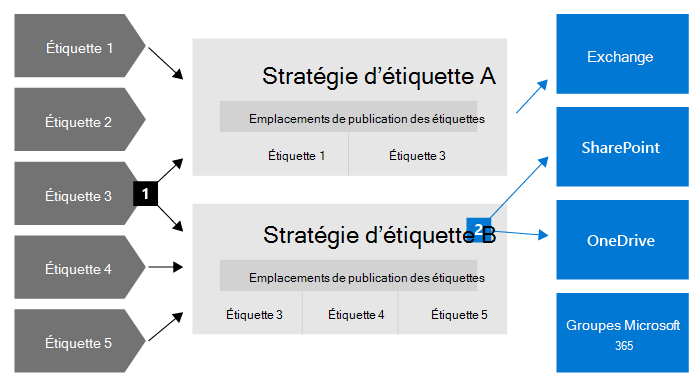
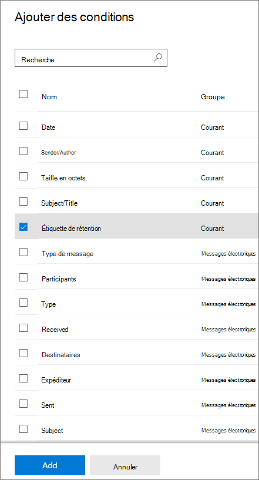
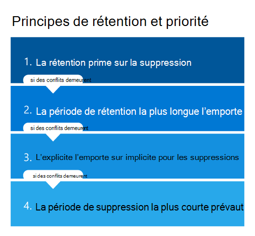

# En savoir plus sur les stratégies et les étiquettes de rétention

>*[Guide de sécurité et conformité pour les licences Microsoft 365](https://aka.ms/ComplianceSD).*

> [!NOTE]
> Si vous voyez des messages concernant les stratégies de rétention dans vos applications, contactez votre service informatique pour obtenir des informations sur leur configuration. Si ces messages sont pour les messages de conversation ou de canal Teams, consultez [Teams sur les stratégies de rétention](https://support.microsoft.com/office/teams-messages-about-retention-policies-c151fa2f-1558-4cf9-8e51-854e925b483b).
>
> Les informations sur cette page sont pour les administrateurs informatiques qui peuvent créer des stratégies de rétention et des étiquettes de rétention pour des raisons de conformité.

Le volume et la complexité des données e-mails, documents, messages instantanés et autres de la majorité des organisations augmentent quotidiennement. Il est important de gérer et de gouverner efficacement ces informations, car vous devez :
  
- **respecter de façon proactive les réglementations du secteur et les stratégies internes** qui vous obligent à conserver du contenu pendant une période minimale. Par exemple, la loi Sarbanes-Oxley vous oblige à conserver certains types de contenu pendant sept ans. 

- **réduire les risques en cas de litige ou de violation de la sécurité** en supprimant définitivement le contenu ancien qu’il n’est plus obligatoire de conserver ; 
    
- **aider votre organisation à partager efficacement les connaissances et à être plus agile** en vérifiant que vos utilisateurs traitent uniquement le contenu actuel et pertinent pour eux. 
    
La configuration des paramètres de rétention peut vous aider à atteindre tous ces objectifs. La gestion du contenu nécessite généralement deux actions :
  
- **Conservation** du contenu afin que celui-ci ne puisse pas être supprimé définitivement avant la fin de la période de rétention. 
    
- **Suppression** définitive du contenu à la fin de la période de rétention. 
    

Avec ces deux actions de rétention, vous pouvez configurer les paramètres de rétention pour les résultats suivants :

- Conservation uniquement : conserver le contenu définitivement ou pour une période spécifiée.
- Suppression uniquement : supprimez le contenu après une période spécifiée.
- Conservation puis suppression : conserver le contenu pendant une période spécifiée, puis le supprimer.

Ces paramètres de rétention fonctionnent avec du contenu en place, ce qui vous permet d’éviter les charges liées à la création et à la configuration d’un espace de stockage supplémentaire pour conserver du contenu pour des raisons de conformité. Vous n’avez plus besoin non plus d’implémenter des processus personnalisés pour copier et synchroniser ces données.

## Fonctionnement des paramètres de rétention avec le contenu en place

Si des paramètres de rétention sont affectés au contenu, celui-ci reste à son emplacement d’origine. Les utilisateurs peuvent continuer à travailler avec leurs documents ou la messagerie comme si rien n’avait changé. Toutefois, s’ils modifient ou suppriment le contenu qui est inclus dans la stratégie de rétention, une copie du contenu est automatiquement conservée.
  
- Pour les sites SharePoint et OneDrive : la copie est conservée dans la bibliothèque de **Conservation et préservation**.

- Pour les boîtes aux lettres Exchange : la copie est conservée dans le dossier **Éléments récupérables**. 

- Pour les messages Teams et Yammer : la copie est conservée dans un dossier masqué appelé **SubstrateHolds** sous la forme d’un sous-dossier dans le dossier **Éléments récupérables** de Exchange.

> [!NOTE]
> La bibliothèque de Conservation et préservation utilise un espace de stockage qui n’est pas exempté du quota de stockage d’un site. Il se peut que vous deviez augmenter votre espace de stockage lorsque vous utilisez des paramètres de rétention pour SharePoint et les groupes Microsoft 365.
> 
Ces emplacements sécurisés et le contenu conservé ne sont pas visibles pour la plupart des utilisateurs. Dans la plupart des cas, les personnes n’ont même pas besoin de savoir que leur contenu est soumis aux paramètres de rétention.

Pour plus d’informations sur le fonctionnement des paramètres de rétention en fonction des différentes charges de travail, consultez les articles suivants :

- [En savoir plus sur la rétention dans SharePoint et OneDrive](retention-policies-sharepoint.md)
- [En savoir plus sur la rétention dans Microsoft Teams](retention-policies-teams.md)
- [Découvrir la rétention pour Yammer](retention-policies-yammer.md)
- [Découvrir la rétention pour Exchange](retention-policies-exchange.md)

## Stratégies de rétention et étiquettes de rétention.

Pour affecter vos paramètres de rétention au contenu, utilisez des **stratégies rétention** et **étiquettes de rétention avec des stratégies des étiquettes**. Vous pouvez n’utiliser qu’une de ces méthodes ou les combiner.

Utilisez une stratégie de rétention pour attribuer les mêmes paramètres de rétention au contenu au niveau d’un site ou d’une boîte aux lettres, et utiliser une étiquette de rétention pour affecter des paramètres de rétention à l’échelle d’un élément (dossier, document, courrier électronique).

Par exemple, si tous les documents d’un site SharePoint doivent être conservés pendant cinq ans, il est plus efficace de le faire avec une stratégie de rétention que d’appliquer la même étiquette de rétention à tous les documents de ce site. Toutefois, si certains documents de ce site doivent être conservés pendant cinq ans et d’autres pendant dix ans, une stratégie de rétention ne fonctionnera pas. Lorsque vous devez spécifier les paramètres de rétention au niveau de l’élément, utilisez les étiquettes de rétention. 

Contrairement aux stratégies de rétention, les paramètres de rétention des étiquettes de rétention circulent avec le contenu s’il est déplacé vers un autre emplacement au sein de votre client Microsoft 365. De plus, les étiquettes de rétention présentent les fonctionnalités suivantes, non prises en charge par les stratégies de rétention : 
 
- Options de démarrage de la période de rétention à partir de la date d’étiquetage du contenu ou en fonction d’un événement, en plus de l’âge du contenu ou du moment de la dernière modification de celui-ci.

- Utilisez [classifieurs entraînables](classifier-learn-about.md) pour identifier le contenu à étiqueter.

- Appliquez une étiquette par défaut pour les documents SharePoint.

- Utilisez [révision avant destruction](disposition-reviews.md) pour réviser le contenu avant sa suppression définitive.

- Marquez le contenu en tant qu’[enregistrement ](records-management.md#records) au niveau des paramètres d’étiquette, et conservez toujours une  [preuve de destruction](disposition.md#disposition-of-records) lorsque le contenu est supprimé à la fin de sa période de rétention.

### Stratégies de rétention

Les stratégies de rétention peuvent être appliquées aux emplacements suivants :
- Messagerie électronique Exchange
- Site SharePoint
- Comptes OneDrive
- Groupes Microsoft 365
- Skype Entreprise
- Dossiers publics Exchange
- Messages du canal Teams
- Conversations Teams
- Messages communautaires Yammer
- Messages privés Yammer

L’application d’une stratégie unique à plusieurs emplacements, ou à des emplacements ou des utilisateurs spécifiques, est d’une grande efficacité.

Pour le début de la période de rétention, vous pouvez choisir la date de création ou de la prise en charge du contenu uniquement pour les fichiers et les emplacements SharePoint, OneDrive et Office 365, pour la date de la dernière modification du contenu.

Les éléments héritent des paramètres de rétention de leur conteneur spécifié dans la stratégie de rétention. S’ils sont ensuite déplacés à l’extérieur de ce conteneur lorsque la stratégie est configurée de manière à conserver le contenu, une copie de cet élément est conservée dans l’emplacement sécurisé de la charge de travail. Toutefois, les paramètres de rétention ne sont pas acheminés avec le contenu dans son nouvel emplacement. Si nécessaire, utilisez des étiquettes de rétention au lieu de stratégies de rétention.

### Étiquettes de rétention

Utilisez les étiquettes de rétention pour les différents types de contenus nécessitant différents paramètres de rétention. Par exemple :
  
- Formulaires fiscaux qui doivent être conservés pendant une période minimale de temps. 
    
- Documents de presse qui doivent être définitivement supprimés après une date déterminée. 
    
- Recherche concurrentielle qui doit être conservée pour une période spécifique, puis définitivement supprimée. 
    
- Permis de travail qui doivent être enregistrés afin de ne pas être modifiés ou supprimés. 
    
Dans tous ces cas, les étiquettes de rétention vous permettent d’appliquer des paramètres de rétention au niveau de l’élément (document ou courrier électronique).
  
Avec les étiquettes de rétention, vous pouvez effectuer les actions suivantes :
  
- **Permettre aux personnel de votre organisation d’appliquer une étiquette de rétention manuellement** à du contenu dans Outlook, Outlook sur le web, OneDrive, SharePoint et des groupes Microsoft 365. Les utilisateurs savent souvent mieux quel type de contenu ils utilisent, ils peuvent donc le classer et appliquer les paramètres de rétention appropriés. 
    
- **Appliquer automatiquement des étiquettes de rétention au contenu** s’il répond à des conditions spécifiques, comme lorsque le contenu contient : 
    - des types spécifiques d’informations sensibles.
    - des mots clés spécifiques correspondant à une requête que vous créez.
    - Le modèle correspond à un classifieur entraînable.

- **Démarrer la période de rétention à compter de la date d’étiquetage du contenu** pour les documents des sites SharePoint et les comptes OneDrive, ainsi que pour les éléments de courrier à l’exception des éléments de calendrier. Si vous appliquez une étiquette de rétention avec cette configuration à un élément de calendrier, la période de rétention commence à partir de la date d’envoi.

- **Démarrer la période de rétention à la date d’un événement** par exemple, employés quittant l’organisation ou expiration du contrat.

- **Appliquer une étiquette de rétention par défaut à une bibliothèque de documents, un dossier ou un ensemble de documents** dans SharePoint, afin que tous les documents stockés dans cette bibliothèque obtiennent l’étiquette de rétention par défaut.

De plus, les étiquettes de rétention prennent en charge la [gestion des enregistrements](records-management.md) pour les e-mails et les documents dans les applications et les services Microsoft 365. Vous pouvez utiliser une étiquette de rétention pour marquer des éléments comme enregistrement. Lorsque cela se produit et que le contenu reste dans Microsoft 365, l’étiquette place des restrictions supplémentaires sur le contenu qui peuvent être nécessaires pour des raisons réglementaires. Pour obtenir plus d’informations, consultez [Comparer des restrictions relatives aux actions autorisées ou bloquées](records-management.md#compare-restrictions-for-what-actions-are-allowed-or-blocked).

Les étiquettes de rétention, contrairement [aux étiquettes de confidentialité ](sensitivity-labels.md), ne sont pas conservées si le contenu est déplacé en dehors de Microsoft 365.

Il n’y a pas de limite au nombre d’étiquettes de rétention qui sont prises en charge pour un client. Toutefois, le nombre maximal de stratégies prises en charge pour un client est de 10 000, et cela inclut les stratégies qui appliquent les étiquettes (stratégies d’étiquette de rétention et stratégies de rétention qui s’appliquent automatiquement), ainsi que les stratégies de rétention.

#### Classification de contenu sans application d’action

Bien que l’objectif principal des étiquettes de rétention soit la conservation ou la suppression de contenu, vous pouvez également les utiliser sans activer de rétention ni d’autres actions. Dans ce cas, vous pouvez utiliser une étiquette de rétention comme une simple étiquette de texte, sans appliquer la moindre action.
  
Par exemple, vous pouvez créer et appliquer une étiquette de rétention appelée « À vérifier », qui ne déclenche aucune action, puis utiliser cette étiquette pour retrouver plus tard le contenu étiqueté.
  

#### Utilisation d’une étiquette de rétention comme condition dans une stratégie DLP

Vous pouvez spécifier une étiquette de rétention comme condition dans une stratégie de protection contre la perte de données (DLP) pour les documents dans SharePoint. Par exemple, vous pouvez configurer une stratégie DLP pour empêcher le partage de documents hors de l’organisation si une étiquette de rétention spécifique leur est appliquée.

Pour plus d’informations, consultez [Utilisation d’une étiquette de rétention comme condition dans une stratégie DLP](data-loss-prevention-policies.md#using-a-retention-label-as-a-condition-in-a-dlp-policy).

#### Étiquettes de rétention et stratégies qui les appliquent

Lorsque vous publiez des étiquettes de rétention, celles-ci sont incluses dans une **stratégie d’étiquette de rétention** qui les rend disponibles à l’application à du contenu par les administrateurs et les utilisateurs. Comme le montre ce diagramme :

1. Une étiquette de conservation peut être incluse dans de multiples stratégies d’étiquette de rétention.

2. Les stratégies d’étiquette de rétention définissent les emplacements où publier les étiquettes de rétention. Le même emplacement peut être inclus dans de multiples stratégies d’étiquette de rétention.

Vous pouvez également créer une ou plusieurs **stratégies à application automatique**, chacune avec une seule étiquette de rétention. Avec cette stratégie, une étiquette de rétention est appliquée automatiquement lorsque les conditions que vous spécifiez dans la stratégie sont réunies.

#### Stratégies d’étiquette de rétention et emplacements

Différents types d’étiquettes de rétention peuvent être publiés dans différents emplacements, en fonction du descriptif de l’étiquette de rétention.
  
| Si l’étiquette de rétention est... | La stratégie d’étiquette peut être appliquée à... |
|:-----|:-----|
|Publiée pour les administrateurs et les utilisateurs finaux    |Exchange, SharePoint, OneDrive et Groupes Microsoft 365    |
|Appliquée automatiquement en fonction des types d’informations sensibles ou des classifieurs entraînables    |Exchange (toutes les boîtes aux lettres uniquement), SharePoint, OneDrive    |
|Appliquée automatiquement en fonction d’une requête    |Exchange, SharePoint, OneDrive et Groupes Microsoft 365    |
   
Dans Exchange, les étiquettes de rétention que vous appliquez automatiquement sont le sont uniquement aux nouveaux messages envoyés (données en transit) et pas à tous les éléments présents dans la boîte aux lettres (données au repos). Par ailleurs, les étiquettes de rétention à application automatique pour les types d’informations sensibles et les classifieurs entraînables s’appliquent à toutes les boîtes aux lettres. Vous ne pouvez pas sélectionner de boîtes aux lettres spécifiques.
  
Les dossiers publics Exchange, les messages Skype, Teams et Yammer ne prennent pas en charge les étiquettes de rétention. Pour conserver et supprimer du contenu stocké sur ces emplacements, utilisez plutôt les stratégies de rétention.

#### Une seule étiquette de rétention à la fois

Il n’est possible d’attribuer qu’une seule étiquette de rétention à un courrier électronique ou à un document. Une étiquette de rétention peut être appliquée [manuellement](create-apply-retention-labels.md#manually-apply-retention-labels) par un administrateur ou un utilisateur final, ou automatiquement à l’aide de l’une des méthodes suivantes :

- [Stratégies d’étiquette à application automatique](apply-retention-labels-automatically.md)
- [Modèle de présentation de document dans Microsoft SharePoint Syntex](https://docs.microsoft.com/microsoft-365/contentunderstanding/apply-a-retention-label-to-a-model)
- [Étiquette par défaut pour SharePoint](create-apply-retention-labels.md#applying-a-default-retention-label-to-all-content-in-a-sharepoint-library-folder-or-document-set) ou [Outlook](create-apply-retention-labels.md#applying-a-default-retention-label-to-an-outlook-folder)
- [Règles d’Outlook](create-apply-retention-labels.md#automatically-applying-a-retention-label-to-email-by-using-rules)

Pour les étiquettes de rétention standard (les éléments ne sont pas marqués comme [enregistrement ou réglementaire](records-management.md#records)) :

- Les administrateurs et les utilisateurs finaux peuvent modifier ou supprimer manuellement une étiquette de rétention existante appliquée au contenu. 

- Lorsqu’une étiquette de rétention est déjà appliquée au contenu, celle-ci n’est pas automatiquement supprimée ou remplacée par une autre étiquette de rétention, à une exception près : l’étiquette existante a été appliquée comme étiquette par défaut.
    
    Pour plus d’informations sur le comportement des étiquettes lorsqu’elles sont appliquées à l’aide d’une étiquette par défaut :
    - Étiquette par défaut de SharePoint : [le comportement des étiquettes lorsque vous utilisez une étiquette par défaut pour SharePoint](create-apply-retention-labels.md#label-behavior-when-you-use-a-default-label-for-sharepoint)
    - Étiquette par défaut pour Outlook : [l’application d’une étiquette de rétention par défaut à un dossier Outlook](create-apply-retention-labels.md#applying-a-default-retention-label-to-an-outlook-folder)

- S’il existe plusieurs règles qui affectent une étiquette à appliquer automatiquement et que le contenu remplit les critères de plusieurs stratégies, l’étiquette de rétention de la plus ancienne stratégie d'étiquetage automatique (par date de création) est affectée.

Lorsque les étiquettes de rétention indiquent des éléments sous la forme d’un enregistrement ou d’un enregistrement réglementaire, ces étiquettes ne sont jamais modifiées automatiquement. Seuls les administrateurs du conteneur peuvent modifier ou supprimer manuellement les étiquettes de rétention qui marquent les éléments comme un enregistrement, mais pas les enregistrements réglementaires. Pour obtenir plus d’informations, voir [Comparer des restrictions relatives aux actions autorisées ou bloquées](records-management.md#compare-restrictions-for-what-actions-are-allowed-or-blocked).

#### Contrôle des étiquettes de conservation

Depuis le centre de conformité Microsoft 365, utilisez l'outil **Aperçu** > **de la classification des données** pour surveiller l'utilisation de vos étiquettes de conservation chez votre locataire et identifier où se trouvent vos articles étiquetés. Pour plus d'informations, notamment sur les conditions préalables importantes, voir [Connaître ses données - Aperçu de la classification des données](data-classification-overview.md).

Vous pouvez ensuite approfondir vos informations à l’aide de [Explorateur de contenu](data-classification-content-explorer.md) et l’[explorateur d'activités](data-classification-activity-explorer.md).

> [!TIP]
>Envisagez d’utiliser d’autres informations sur la classification des données, telles que les classifieurs et les types d’informations sensibles, pour vous aider à identifier le contenu que vous devrez peut-être conserver ou supprimer, ou à gérer comme enregistrements.

Le Centre de sécurité et conformité Office 365 contient des informations de présentation équivalentes pour les étiquettes de rétention de **tableau de bord** > **gouvernance d’informations**, ainsi que des informations plus détaillées de **la gouvernance des informations** > **d’activité des étiquettes**. Pour plus d’informations sur la surveillance des étiquettes de rétention dans cet ancien centre d’administration, voir la documentation suivante :
- [Afficher les rapports de gouvernance des données](view-the-data-governance-reports.md)
- [Prise en main de la classification des données](data-classification-overview.md).
- [Afficher l’activité des étiquettes pour les documents](view-label-activity-for-documents.md)

#### Utilisation de la recherche de contenu pour rechercher tout le contenu portant une étiquette de rétention spécifique

Lorsque les étiquettes de rétention sont affectées au contenu par les utilisateurs ou automatiquement, vous pouvez utiliser la recherche de contenu pour rechercher les contenus classés et dotés d’étiquettes de rétention spécifiques.

Lorsque vous créez une recherche de contenu, sélectionnez la condition **Étiquette de rétention**, puis entrez le nom complet ou une partie du nom de l’étiquette de rétention et utilisez un caractère générique. Si vous souhaitez en savoir plus, consultez la page [Requêtes par mots-clés et conditions de recherche pour la recherche de contenu](keyword-queries-and-search-conditions.md).
  

## Comparer les fonctionnalités des stratégies et des étiquettes de rétention

Utilisez le tableau suivant pour savoir si vous devez utiliser une stratégie ou une étiquette de rétention, selon leurs fonctionnalités.

|Fonctionnalité|Stratégie de rétention |Étiquette de rétention|
|:-----|:-----|:-----|:-----|
|Paramètres de rétention permettant conservation puis suppression, conservation uniquement ou suppression uniquement |Oui |Oui |
|Charges de travail prises en charge :  - Exchange  - SharePoint  - OneDrive  - Groupes Microsoft 365  - Skype Entreprise  - Teams - Yammer|  Oui   Oui   Oui   Oui   Oui   Oui   Oui |   Oui, sauf dossiers publics   Oui   Oui   Oui   Non   Non   Non |
|Rétention appliquée automatiquement | Oui | Oui |
|Rétention appliquée en fonction de conditions   – types d’informations sensibles, requêtes KQL et mots clés, classificateurs entrainables | Non | Oui |
|Rétention appliquée manuellement | Non | Oui |
|Présence d’interface utilisateur pour les utilisateurs finals | Non | Oui |
|Persiste si le contenu est déplacé | Non | Oui, au sein de votre client Microsoft 365 |
|Déclaration d’un élément comme enregistrement| Non | Oui |
|Démarrage de la période de rétention à la date d’étiquetage ou en fonction d’un événement | Non | Oui |
|Révisions avant élimination | Non| Oui |
|Preuve de la destruction pendant 7 ans | Non |Oui, lorsque l’élément est déclaré comme enregistrement|
|Audit des activités administratives| Oui | Oui|
|Identification des éléments soumis à une stratégie de rétention :   - Recherche de contenu   - Page classification des données, explorateur de contenu, explorateur d’activité |   Non   Non |   Oui   Oui|

Notez que vous pouvez utiliser les stratégies de rétention et les étiquettes de rétention comme méthodes de rétention complémentaires. Par exemple :

1. Vous créez et configurez une stratégie de rétention qui supprime automatiquement le contenu cinq ans après sa dernière modification, et l’appliquez à tous les comptes OneDrive.

2. Vous créez et configurez une étiquette de rétention qui conserve du contenu de façon définitive et l’ajoutez à une stratégie d’étiquette que vous publiez sur tous les comptes OneDrive. Vous expliquez aux utilisateurs comment appliquer manuellement cette étiquette à des documents spécifiques, qui ne doivent pas être supprimés automatiquement, même s’ils n’ont pas été modifiés depuis cinq ans.

Pour plus d’informations sur la façon dont les stratégies et les étiquettes de rétention fonctionnent conjointement, et sur la manière de déterminer le résultat de leur combinaison, voir la section suivante, qui explique les principes de la rétention et l’application des priorités.

## Principes de rétention et priorité

Contrairement aux étiquettes de rétention, vous pouvez appliquer plusieurs stratégies de rétention au même contenu. Chaque stratégie de rétention peut engendrer une action de conservation et une action de suppression. De plus, cet élément peut également être soumis à ces actions à partir d’une étiquette de rétention.

Dans ce scénario, lorsque les éléments peuvent être soumis à plusieurs paramètres de rétention qui peuvent entrer en conflit avec un autre, qu’est-ce qui a priorité sur la détermination du résultat ?

Le résultat n’est pas la stratégie de rétention unique ou  l’étiquette de rétention unique qui l’emporte, mais la durée de conservation d’un élément (le cas échéant) et la suppression d’un élément (le cas échéant). Ces deux actions sont calculées indépendamment l’une de l’autre, à partir des paramètres de rétention appliqués à un élément.

Par exemple, un élément peut être soumis à une stratégie de rétention configurée pour une action de suppression seule et une autre stratégie de rétention configurée pour conserver et supprimer. Par conséquent, cet élément ne contient qu’une action de conservation, mais deux actions de suppression. La rétention et la suppression des actions peuvent être contradictoires l’une avec l’autre et les deux actions de suppression peuvent avoir une date conflictuelle. Pour étudier les résultats, vous devez appliquer les principes de rétention.

À un niveau élevé, vous pouvez être certain que la rétention a toujours la priorité sur la suppression, et que la période de rétention la plus longue l’emporte. Ces deux règles simples déterminent toujours la durée pendant laquelle un élément est conservé.

Plusieurs facteurs déterminent la suppression d’un élément, notamment l’action de suppression d’une étiquette de rétention a la priorité sur l’action de suppression d’une stratégie de rétention.

Utilisez ce flux pour comprendre les résultats de la rétention et de la suppression d’un seul élément, où chaque niveau agit comme l’élément décisif pour les conflits, de haut en bas. Si le résultat est déterminé par le premier niveau, car il n’y a plus de conflits, il n’est pas nécessaire de passer au niveau supérieur, et ainsi de suite.

> [!IMPORTANT]
> Si vous utilisez des étiquettes de rétention : avant d’utiliser ce flux pour déterminer le résultat de plusieurs paramètres de rétention sur le même élément, assurez-vous de [ l’étiquette de rétention qui est appliquée](#only-one-retention-label-at-a-time).

  
Explication pour les quatre niveaux :
  
1. **La rétention prend le pas sur la suppression.** Le contenu n’est pas supprimé définitivement lorsqu’il dispose également de paramètres de rétention pour conserver celui-ci.  
    
    Exemple : un e-mail est soumis à une stratégie de rétention pour Exchange configurée pour supprimer les éléments après trois ans et dispose d’une étiquette de rétention également appliquée et configurée de manière à conserver les éléments pendant 5 ans.
    
    L’e-mail est conservé pendant cinq ans, car cette action de rétention a la priorité sur la suppression. L’e-mail est supprimé à la fin de la période de cinq ans en raison de l’action de suppression différée.

2. **La période de rétention la plus longue l’emporte.** Si du contenu est soumis à plusieurs paramètres de rétention pour différentes périodes, il est conservé jusqu’à la fin de la période de rétention la plus longue.
    
    Exemple : les documents du site SharePoint marketing sont soumis à deux stratégies de rétention. La première stratégie de rétention est configurée pour que tous les sites SharePoint conservent des éléments pendant cinq ans. La seconde stratégie de rétention est configurée pour que tous les sites SharePoint conservent des éléments pendant dix ans.
    
    Les documents de ce site SharePoint marketing sont conservés pendant 10 ans, car il s’agit de la période de rétention la plus longue.

3. **L’explicite l’emporte sur l’implicite.** Applicable pour déterminer quand les éléments seront supprimés : 
    
    1. Une étiquette de rétention (même appliquée) fournit une rétention explicite par rapport aux stratégies de rétention, car les paramètres de rétention sont appliqués à un élément individuel plutôt qu’affecté à partir d’un conteneur de façon implicite. Cela signifie qu’une action de suppression d’une étiquette de rétention est toujours prioritaire par rapport à une action de suppression de toute stratégie de rétention.
        
        Exemple : un document est soumis à deux stratégies de rétention qui ont respectivement une action de suppression de cinq ans et de dix ans, et également une étiquette de rétention qui a une action de suppression de sept ans.
        
        Le document est supprimé après 7 ans, car l’action de suppression de l’étiquette de rétention est prioritaire.
    
    2. Lorsque vous disposez de stratégies de rétention uniquement : si une stratégie de rétention pour un emplacement est définie pour l’utilisation d’une configuration d’inclusion (par exemple, des utilisateurs spécifiques à la courrier Exchange), la stratégie de rétention a la priorité sur les stratégies de rétention non étendues pour le même emplacement.
        
        Une stratégie de rétention non étendue est où un emplacement est sélectionné sans spécifier d’instances spécifiques. Par exemple, **Courrier Exchange** et le paramètre par défaut **Tous les destinataires** est une stratégie de rétention non étendue. Ou, **sites SharePoint** et le paramètre par défaut de **Tous les sites**. Lorsque les stratégies de rétention sont étendues, elles ont une priorité égale à ce niveau.
        
        Exemple 1 : un courrier électronique est soumis à deux stratégies de rétention. La première stratégie de rétention est non étendue et supprime les éléments après dix ans. La deuxième stratégie de rétention est étendue aux boîtes aux lettres spécifiques et supprime les éléments après cinq ans.
        
        Le courrier électronique est supprimé après cinq ans, car l’action de suppression de la stratégie de rétention étendue a la priorité sur la stratégie de rétention non étendue.
        
        Exemple 2 : un document dans le compte OneDrive d’un utilisateur est soumis à deux stratégies de rétention. La première stratégie de rétention est étendue à l’inclusion du compte OneDrive de cet utilisateur et a une action de suppression après 10 ans. La seconde stratégie de rétention est étendue à l’inclusion du compte OneDrive de cet utilisateur et a une action de suppression après sept ans.
        
        La suppression de ce document ne peut pas être déterminée à ce niveau, car les deux stratégies de rétention sont étendues.

4. **La période de suppression la plus courte l’emporte** Applicable pour déterminer quand les éléments seront supprimés des stratégies de rétention et que les résultats n’ont pas pu être résolus à partir du niveau précédent : le contenu est supprimé à la fin de la période de rétention la plus courte.
    
    Exemple : un document dans le compte OneDrive d’un utilisateur est soumis à deux stratégies de rétention. La première stratégie de rétention est étendue à l’inclusion du compte OneDrive de cet utilisateur et a une action de suppression après 10 ans. La seconde stratégie de rétention est étendue à l’inclusion du compte OneDrive de cet utilisateur et a une action de suppression après sept ans.
    
    Ce document sera supprimé après sept ans, car il s’agit de la période de rétention la plus courte pour ces deux stratégies de rétention étendue.

Notez que les éléments soumis à la conservation eDiscovery sont également soumis au premier principe de rétention. ils ne peuvent pas être supprimés par une stratégie de rétention ou une étiquette de rétention. Lorsque cette suspension est libérée, les principes de rétention continuent de s’appliquer. Par exemple, ils peuvent être soumis à une période de rétention non expirée ou à une action de suppression différée.

Exemples plus complexes qui combinent les actions de conservation et de suppression :

1. Ces paramètres de rétention sont appliqués à un élément :
    
    - Une stratégie de rétention pour la suppression uniquement après cinq ans
    - Une stratégie de rétention qui conserve pendant trois ans, puis supprime
    - Une étiquette de rétention qui conserve uniquement pendant sept ans uniquement
    
    **Résultat**: l’élément est conservé pendant sept ans, car la rétention a la priorité sur la suppression et la période de rétention la plus longue est de sept ans. À la fin de cette période de rétention, l’élément est supprimé en raison de l’action de suppression des stratégies de rétention qui a été différée pendant la conservation de l’élément.
    
    Bien que les deux stratégies de rétention aient des dates différentes pour les actions de suppression, l’élément le plus ancien possible peut être supprimé à la fin de la période de rétention la plus longue, qui dépasse les deux dates de suppression. Dans cet exemple, il n’y a pas de conflit à résoudre pour les dates de suppression de sorte que tous les conflits soient résolus par le deuxième niveau.

2.  Ces paramètres de rétention sont appliqués à un élément :
    
    - Une stratégie de rétention non étendue qui supprime uniquement après dix ans
    - Une stratégie de rétention étendue qui conserve pendant cinq ans, puis supprime
    - Une étiquette de rétention qui conserve pendant trois ans, puis supprime
    
    **Résultat**: l’élément est conservé pendant cinq ans parce qu’il s’agit de la période de rétention la plus longue. À la fin de cette période de rétention, l’élément est supprimé en raison de l’action de suppression de trois ans de l’étiquette de rétention qui a été différée pendant la conservation de l’élément. La suppression des étiquettes de rétention a la priorité sur la suppression de toutes les stratégies de rétention. Dans cet exemple, tous les conflits sont résolus au troisième niveau.

## Utiliser le verrouillage de conservation pour restreindre les modifications aux stratégies

Certaines organisations doivent peut-être respecter des règles définies par des organismes de réglementation telles que la règle 17A -4 de la SEC (Securities and Exchange Commission), stipulant qu’après l’activation d’une stratégie de rétention, celle-ci ne peut être désactivée ou modifiée pour être moins restrictive. 

Le verrouillage de conservation permet à votre organisation de répondre à ces exigences réglementaires, car il verrouille une stratégie de rétention ou d’étiquette de conservation pour que personne, y compris l’administrateur, ne puisse désactiver la stratégie, supprimer la stratégie ou la rendre moins restrictive.
  
Vous devez appliquer un verrou de conservation une fois la stratégie de rétention ou d’étiquette de rétention créée. Pour plus d’informations et d’instructions, voir [Utiliser le verrouillage de conservation pour restreindre les modifications apportées aux stratégies de rétention et aux stratégies d’étiquette de conservation](retention-preservation-lock.md).

## Publication d’une stratégie de rétention

Mettre en place des stratégies de rétention n’octroie pas de verrouillage de conservation, vous pouvez supprimer vos stratégies à tout moment, ce qui a pour effet de désactiver les paramètres de rétention appliqués précédemment. Vous pouvez également conserver la stratégie, mais définir l’état d’emplacement comme « désactivé ».
 
Lorsque vous effectuez l’une de ces actions, le contenu SharePoint ou OneDrive conservé dans la bibliothèque de conservation n’est pas immédiatement et définitivement supprimé. Au lieu de cela, pour éviter la perte accidentelle de données, il existe une période de grâce de 30 jours pendant laquelle l’expiration du contenu de cette stratégie ne se produit pas dans la bibliothèque de conservation de conservation, afin que vous puissiez restaurer tout contenu à partir de cet emplacement, le cas échéant. De plus, vous ne pouvez pas supprimer manuellement ce contenu au cours de la période de grâce.

Vous pouvez rétablir le statut d’emplacement sur « activé » pendant la période de grâce. Aucun contenu n’est supprimé pour cette stratégie.

Cette période de grâce de 30 jours dans SharePoint et OneDrive correspond à un délai de 30 jours dans Exchange. Pour des informations supplémentaires, consultez [Gestion des boîtes aux lettres avec période de grâce](identify-a-hold-on-an-exchange-online-mailbox.md#managing-mailboxes-on-delay-hold).

## Audit de la configuration de rétention

Les actions de l'administrateur concernant les politiques de rétention et les étiquettes de rétention sont enregistrées dans le journal d'audit lorsque [l'audit est activé](turn-audit-log-search-on-or-off.md). Par exemple, un événement d’audit est créé lors de la création, la configuration ou la suppression d’une politique de rétention ou d’une étiquette. Pour obtenir la liste complète, voir [Politiques de rétention et activités d’étiquette de rétention](search-the-audit-log-in-security-and-compliance.md#retention-policy-and-retention-label-activities).

## Applets de commande pour les stratégies et étiquettes de rétention

Pour utiliser les applets de commande, vous devez tout d’abord [vous connecter au Centre de sécurité et conformité Office 365 – PowerShell](https://docs.microsoft.com/powershell/exchange/connect-to-scc-powershell). Utilisez ensuite l’une des applets de commande suivantes :

- [Get-ComplianceTag](https://docs.microsoft.com/powershell/module/exchange/get-compliancetag)

- [New-ComplianceTag](https://docs.microsoft.com/powershell/module/exchange/new-compliancetag)

- [Remove-ComplianceTag](https://docs.microsoft.com/powershell/module/exchange/remove-compliancetag)

- [Set-ComplianceTag](https://docs.microsoft.com/powershell/module/exchange/set-compliancetag)

- [Enable-ComplianceTagStorage](https://docs.microsoft.com/powershell/module/exchange/enable-compliancetagstorage)

- [Get-ComplianceTagStorage](https://docs.microsoft.com/powershell/module/exchange/get-compliancetagstorage)

- [Get-RetentionCompliancePolicy](https://docs.microsoft.com/powershell/module/exchange/get-retentioncompliancepolicy)

- [New-RetentionCompliancePolicy](https://docs.microsoft.com/powershell/module/exchange/new-retentioncompliancepolicy)

- [Remove-RetentionCompliancePolicy](https://docs.microsoft.com/powershell/module/exchange/remove-retentioncompliancepolicy)

- [Set-RetentionCompliancePolicy](https://docs.microsoft.com/powershell/module/exchange/set-retentioncompliancepolicy)

- [Get-RetentionComplianceRule](https://docs.microsoft.com/powershell/module/exchange/get-retentioncompliancerule)

- [New-RetentionComplianceRule](https://docs.microsoft.com/powershell/module/exchange/new-retentioncompliancerule)

- [Remove-RetentionComplianceRule](https://docs.microsoft.com/powershell/module/exchange/remove-retentioncompliancerule)

- [Set-RetentionComplianceRule](https://docs.microsoft.com/powershell/module/exchange/set-retentioncompliancerule)

## Moment d’utilisation des stratégies et étiquettes de rétention ou des conservations eDiscovery 

Bien que les paramètres de rétention et [les conservations que vous créez avec un cas eDiscovery](create-ediscovery-holds.md) peuvent empêcher la suppression définitive de données, ils sont conçus pour des scénarios différents. Pour comprendre les différences et faire votre choix, suivez ces instructions:

- Les paramètres de rétention que vous spécifiez dans les stratégies et les étiquettes de rétention sont conçus pour une stratégie de gestion des informations à long terme pour la conservation ou la suppression des données pour les exigences de conformité. L’étendue est généralement large, avec l’emplacement et le contenu comme focus principal plutôt que les utilisateurs individuels. Le début et la fin de la période de rétention sont configurables, avec l’option de suppression automatique de contenu sans intervention supplémentaire de l’administrateur.

- Les conservations eDiscovery (Core eDiscovery ou Advanced eDiscovery) sont conçues pour une durée limitée afin de conserver les données pour une investigation juridique. L’étendue est spécifique avec le contenu des utilisateurs identifiés comme focus. Le début et la fin de la période de conservation ne sont pas configurables, mais dépendent d’actions d’administrateur individuelles, sans option de suppression automatique de contenu lorsque la conservation est libérée.

Synthèse de la comparaison de la rétention et des conservations:

|Considération|Rétention |Conservations eDiscovery|
|:-----|:-----|:-----|:-----|
|Besoin commercial : |Conformité |Informations juridiques |
|Étendue du temps: |À long terme |Court terme |
|Focus: |Vaste, basé sur le contenu |Spécifique, basé sur l’utilisateur |
|Dates de début et de fin configurables: |Oui |Non |
|Suppression de contenu: |Oui (facultatif) |Non |
|Frais généraux d’administration: |Faible |Élevé |

Si le contenu est soumis à la fois aux paramètres de rétention et à une conservation eDiscovery, la conservation eDiscovery est prioritaire pour la préservation du contenu. De cette façon, les [principes de rétention](#the-principles-of-retention-or-what-takes-precedence) s’élargissent aux conservations eDiscovery parce qu’ils préservent les données jusqu’à ce qu’un administrateur libère manuellement la conservation. Cependant, malgré cette priorité, n’utilisez pas les conservations eDiscovery pour la gestion des informations à long terme. Si vous vous préoccupez de la suppression automatique des données, vous pouvez configurer les paramètres de rétention pour conserver les éléments indéfiniment, ou utiliser [révision des suppressions](disposition.md#disposition-reviews) avec les étiquettes de rétention.

Si vous utilisez des outils eDiscovery plus anciens pour conserver les données, consultez ces ressources:

- Exchange : 
    - [Conservation inaltérable et conservation pour litige](https://go.microsoft.com/fwlink/?linkid=846124)
    - [Comment identifier le type de conservation placé sur une boîte aux lettres Exchange Online](https://docs.microsoft.com/microsoft-365/compliance/identify-a-hold-on-an-exchange-online-mailbox)

- SharePoint et OneDrive: 
    - [Ajouter du contenu à un incident et placer des sources en conservation dans le centre eDiscovery](https://docs.microsoft.com/SharePoint/governance/add-content-to-a-case-and-place-sources-on-hold-in-the-ediscovery-center)

- [Retrait des outils eDiscovery hérités](legacy-ediscovery-retirement.md)

## Utilisez des stratégies et étiquettes de rétention plutôt que les anciennes fonctionnalités

Si, dans le cadre de la gouvernance des informations, vous avez besoin de conserver ou de supprimer proactivement du contenu dans Microsoft 365, nous vous recommandons d’utiliser les stratégies de rétention et les étiquettes de rétention plutôt que les anciennes fonctionnalités suivantes.

Si vous utilisez ces fonctionnalités, elles continueront de fonctionner parallèlement aux stratégies et étiquettes de rétention. Toutefois, nous vous recommandons d’utiliser à l’avenir les stratégies de rétention et les étiquettes de rétention à la place. Elles vous fournissent un mécanisme unique pour gérer de manière centralisée la rétention et la suppression de contenu dans Microsoft 365.

**Anciennes fonctionnalités dans Exchange Online :**

- [Balises de rétention et stratégies de rétention](https://go.microsoft.com/fwlink/?linkid=846125), aussi appelées [gestion des enregistrements de messagerie (MRM)](https://go.microsoft.com/fwlink/?linkid=846126) (suppression uniquement)

**Anciennes fonctionnalités dans SharePoint et OneDrive :**

- [Stratégies de suppression des documents](https://support.office.com/article/Create-a-document-deletion-policy-in-SharePoint-Server-2016-4fe26e19-4849-4eb9-a044-840ab47458ff) (suppression uniquement)
    
- [Configuration en place de gestion des enregistrements](https://support.office.com/article/7707a878-780c-4be6-9cb0-9718ecde050a) (rétention uniquement) 
    
- [Utilisation de stratégies pour la fermeture et la suppression de sites](https://support.microsoft.com/fr-FR/office/use-policies-for-site-closure-and-deletion-a8280d82-27fd-48c5-9adf-8a5431208ba5) (suppression uniquement)
    
- [Stratégies de gestion des informations](intro-to-info-mgmt-policies.md) (suppression uniquement)
     
Si vous avez configuré des sites SharePoint pour des stratégies de type de contenu ou des stratégies de gestion des informations afin de conserver du contenu pour une liste ou une bibliothèque, ces stratégies sont ignorées tant qu’une stratégie de rétention est en vigueur. 

## Informations connexes

- [Limites de SharePoint Online](https://docs.microsoft.com/office365/servicedescriptions/sharepoint-online-service-description/sharepoint-online-limits)
- [Limites et spécifications de Microsoft Teams](https://docs.microsoft.com/microsoftteams/limits-specifications-teams) 
- [Ressources pour vous aider à respecter les réglementations en matière de gouvernance des informations et de gestion des enregistrements](retention-regulatory-requirements.md)

## Instructions de configuration

Si vous êtes prêt à créer des stratégies de rétention, voir [Créer et configurer des stratégies de rétention](create-retention-policies.md).

Pour créer et publier des étiquettes de rétention :
- [Créer des étiquettes de rétention et les appliquer dans les applications](create-apply-retention-labels.md)
- [Appliquer automatiquement une étiquette de rétention au contenu](apply-retention-labels-automatically.md)

