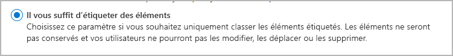
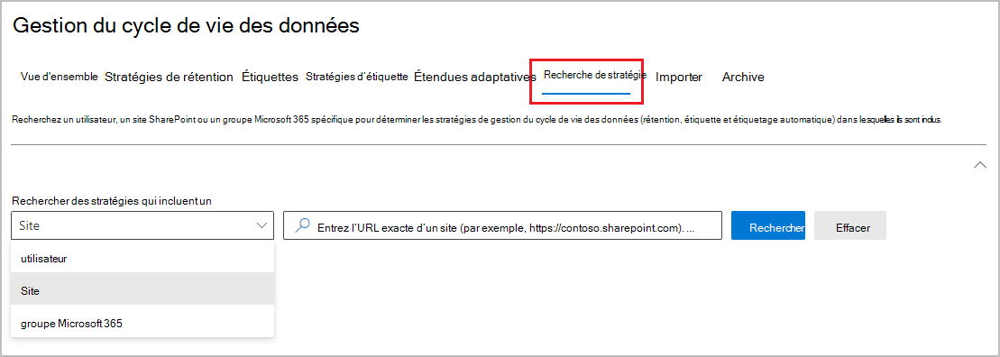

# En savoir plus sur les stratégies et les étiquettes de rétention

>*[Guide de sécurité et conformité pour les licences Microsoft 365](/office365/servicedescriptions/microsoft-365-service-descriptions/microsoft-365-tenantlevel-services-licensing-guidance/microsoft-365-security-compliance-licensing-guidance).*

> [!NOTE]
> Si vous voyez des messages concernant des stratégies de rétention dans Teams ou avez des questions relatives aux étiquettes de rétention, contactez votre service informatique pour obtenir des informations sur leur configuration. En attendant, les articles suivants vous seront peut-être utiles :
> -  [Messages et stratégies de rétention Teams](https://support.microsoft.com/office/teams-messages-about-retention-policies-c151fa2f-1558-4cf9-8e51-854e925b483b)
> - [Appliquer des étiquettes de rétention aux fichiers dans SharePoint ou OneDrive](https://support.microsoft.com/office/apply-retention-labels-to-files-in-sharepoint-or-onedrive-11a6835b-ec9f-40db-8aca-6f5ef18132df)
>
> Les informations sur cette page sont pour les administrateurs informatiques qui peuvent créer des stratégies de rétention et des étiquettes de rétention pour des raisons de conformité.

Le volume et la complexité des données e-mails, documents, messages instantanés et autres de la majorité des organisations augmentent quotidiennement. Il est important de gérer et de gouverner efficacement ces informations, car vous devez :

- **respecter de façon proactive les réglementations du secteur et les stratégies internes** qui vous obligent à conserver du contenu pendant une période minimale. Par exemple, la loi Sarbanes-Oxley vous oblige à conserver certains types de contenu pendant sept ans.

- **réduire les risques en cas de litige ou de violation de la sécurité** en supprimant définitivement le contenu ancien qu’il n’est plus obligatoire de conserver ;

- **aider votre organisation à partager efficacement les connaissances et à être plus agile** en vérifiant que vos utilisateurs traitent uniquement le contenu actuel et pertinent pour eux.

La configuration des paramètres de rétention peut vous aider à atteindre ces objectifs. La gestion du contenu nécessite généralement deux actions :

| Action| Objectif |
|:-----|:-----|
|Conserver un contenu. | Empêcher la suppression définitive et rester disponible pour eDiscovery |
|Supprimer un contenu | Supprimer définitivement un contenu de votre organisation|

Avec ces deux actions de rétention, vous pouvez configurer les paramètres de rétention pour les résultats suivants :

- Conservation uniquement : conserver le contenu définitivement ou pour une période spécifiée.
- Suppression uniquement : supprimez un contenu après une période spécifiée.
- Conservation puis suppression : conserver un contenu pendant une période spécifiée, puis le supprimer définitivement.

Ces paramètres de rétention fonctionnent avec du contenu en place, ce qui vous permet d’éviter les charges liées à la création et à la configuration d’un espace de stockage supplémentaire pour conserver du contenu pour des raisons de conformité. Vous n’avez plus besoin non plus d’implémenter des processus personnalisés pour copier et synchroniser ces données.

Utilisez ces sections pour en savoir plus sur le fonctionnement des stratégies de rétention et des étiquettes de rétention, le moment de leur utilisation, et comment elles se complètent. Mais si vous êtes prêt à commencer et à déployer des paramètres de rétention pour des scénarios courants, consultez [Prendre en main les stratégies de rétention et les étiquettes de rétention](get-started-with-retention.md).

## Fonctionnement des paramètres de rétention avec le contenu en place

Lorsque des paramètres de conservation sont attribués à un contenu, ce dernier reste à son emplacement d'origine. La plupart du temps, les gens continuent à travailler avec leurs documents ou leur courrier comme si rien n'avait changé. Mais s'ils modifient ou suppriment un contenu inclus dans la politique de conservation, une copie de ce contenu est automatiquement conservée.
  
- Pour les sites SharePoint et OneDrive : la copie est conservée dans la bibliothèque de **Conservation et préservation**.

- Pour les boîtes aux lettres Exchange : la copie est conservée dans le dossier **Éléments récupérables**. 

- Pour les messages Teams et Yammer : la copie est conservée dans un dossier masqué appelé **SubstrateHolds** sous la forme d’un sous-dossier dans le dossier **Éléments récupérables** de Exchange.

> [!NOTE]
> Étant donné que la bibliothèque de conservation et de préservation des documents est incluse dans le quota de stockage, vous pourriez avoir besoin d’augmenter votre espace de stockage lorsque vous utilisez des paramètres de rétention pour SharePoint et les groupes Microsoft 365.
> 
Ces emplacements sécurisés et le contenu conservé ne sont pas visibles pour la plupart des utilisateurs. Dans la plupart des cas, les personnes n’ont même pas besoin de savoir que leur contenu est soumis aux paramètres de rétention.

Pour plus d’informations sur le fonctionnement des paramètres de rétention en fonction des différentes charges de travail, consultez les articles suivants :

- [En savoir plus sur la rétention dans SharePoint et OneDrive](retention-policies-sharepoint.md)
- [En savoir plus sur la rétention dans Microsoft Teams](retention-policies-teams.md)
- [Découvrir la rétention pour Yammer](retention-policies-yammer.md)
- [Découvrir la rétention pour Exchange](retention-policies-exchange.md)

## Stratégies de rétention et étiquettes de rétention.

Pour affecter vos paramètres de rétention au contenu, utilisez des **stratégies rétention** et **étiquettes de rétention avec des stratégies des étiquettes**. Vous pouvez n’utiliser qu’une de ces méthodes ou les combiner.

Utilisez une stratégie de rétention pour attribuer les mêmes paramètres de rétention au contenu au niveau d’un site ou d’une boîte aux lettres, et utiliser une étiquette de rétention pour affecter des paramètres de rétention à l’échelle d’un élément (dossier, document, courrier électronique).

Par exemple, si tous les documents d’un site SharePoint doivent être conservés pendant cinq ans, il est plus efficace de le faire avec une stratégie de rétention que d’appliquer la même étiquette de rétention à tous les documents de ce site. Toutefois, si certains documents de ce site doivent être conservés pendant cinq ans et d’autres pendant dix ans, une stratégie de rétention ne fonctionnera pas. Lorsque vous devez spécifier les paramètres de rétention au niveau de l’élément, utilisez les étiquettes de rétention. 

Contrairement aux stratégies de rétention, les paramètres de rétention des étiquettes de rétention circulent avec le contenu s’il est déplacé vers un autre emplacement au sein de votre client Microsoft 365. De plus, les étiquettes de rétention présentent les fonctionnalités suivantes, non prises en charge par les stratégies de rétention : 
 
- Options de démarrage de la période de rétention à partir de la date d’étiquetage du contenu ou en fonction d’un événement, en plus de l’âge du contenu ou du moment de la dernière modification de celui-ci.

- Utilisez [classifieurs entraînables](classifier-learn-about.md) pour identifier le contenu à étiqueter.

- Appliquez une étiquette par défaut pour les documents SharePoint.

- Utilisez [révision avant destruction](./disposition.md) pour réviser le contenu avant sa suppression définitive.

- Marquez le contenu en tant qu’[enregistrement ](records-management.md#records) au niveau des paramètres d’étiquette, et conservez toujours une  [preuve de destruction](disposition.md#disposition-of-records) lorsque le contenu est supprimé à la fin de sa période de rétention.

### Stratégies de rétention

Les stratégies de rétention peuvent être appliquées aux emplacements suivants :
- Messagerie électronique Exchange
- Site SharePoint
- Comptes OneDrive
- Groupes Microsoft 365
- Skype Entreprise
- Dossiers publics Exchange
- Messages du canal Teams
- Conversations Teams
- Messages du canal privé Teams
- Messages communautaires Yammer
- Messages utilisateur de Yammer

L’application d’une stratégie unique à plusieurs emplacements, ou à des emplacements ou des utilisateurs spécifiques, est d’une grande efficacité.

Pour le début de la période de rétention, vous pouvez choisir la date de création ou de la prise en charge du contenu uniquement pour les fichiers et les emplacements SharePoint, OneDrive et Office 365, pour la date de la dernière modification du contenu.

Les éléments héritent des paramètres de rétention de leur conteneur spécifié dans la stratégie de rétention. S’ils sont ensuite déplacés à l’extérieur de ce conteneur lorsque la stratégie est configurée de manière à conserver le contenu, une copie de cet élément est conservée dans l’emplacement sécurisé de la charge de travail. Toutefois, les paramètres de rétention ne sont pas acheminés avec le contenu dans son nouvel emplacement. Si nécessaire, utilisez des étiquettes de rétention au lieu de stratégies de rétention.

### Étiquettes de rétention

Utilisez les étiquettes de rétention pour les différents types de contenus nécessitant différents paramètres de rétention. Par exemple :
  
- Formulaires fiscaux qui doivent être conservés pendant une période minimale de temps. 
    
- Documents de presse qui doivent être définitivement supprimés après une date déterminée. 
    
- Recherche concurrentielle qui doit être conservée pour une période spécifique, puis définitivement supprimée. 
    
- Permis de travail qui doivent être enregistrés afin de ne pas être modifiés ou supprimés. 
    
Dans tous ces cas, les étiquettes de rétention vous permettent d’appliquer des paramètres de rétention au niveau de l’élément (document ou courrier électronique).
  
Avec les étiquettes de rétention, vous pouvez effectuer les actions suivantes :
  
- **Permettre aux personnes de votre organisation d’appliquer manuellement une étiquette de rétention** à du contenu dans Outlook, Outlook sur le web, OneDrive, SharePoint et Groupes Microsoft 365. Les utilisateurs ont souvent une meilleure connaissance du type de contenu qu’ils utilisent. Ils peuvent donc le classer et lui appliquer la stratégie appropriée. 
    
- **Appliquez automatiquement des étiquettes de rétention au contenu** s’il correspond à des conditions spécifiques, qui incluent des pièces jointes cloud partagées dans un e-mail ou des Teams, ou lorsque le contenu contient : 
    - des types spécifiques d’informations sensibles.
    - des mots clés spécifiques correspondant à une requête que vous créez.
    - Le modèle correspond à un classifieur entraînable.

- **Démarrer la période de rétention à compter de la date d’étiquetage du contenu** pour les documents des sites SharePoint et les comptes OneDrive, ainsi que pour les éléments de courrier.

- **Démarrer la période de rétention à la date d’un événement** par exemple, employés quittant l’organisation ou expiration du contrat.

- **Appliquer une étiquette de rétention par défaut à une bibliothèque de documents, un dossier ou un ensemble de documents** dans SharePoint, afin que tous les documents stockés dans cette bibliothèque obtiennent l’étiquette de rétention par défaut.

De plus, les étiquettes de rétention prennent en charge la [gestion des enregistrements](records-management.md) pour les e-mails et les documents dans les applications et les services Microsoft 365. Vous pouvez utiliser une étiquette de rétention pour marquer des éléments comme enregistrement. Lorsque cela se produit et que le contenu reste dans Microsoft 365, l’étiquette place des restrictions supplémentaires sur le contenu qui peuvent être nécessaires pour des raisons réglementaires. Pour obtenir plus d’informations, consultez [Comparer des restrictions relatives aux actions autorisées ou bloquées](records-management.md#compare-restrictions-for-what-actions-are-allowed-or-blocked).

Les étiquettes de rétention, contrairement [aux étiquettes de confidentialité ](sensitivity-labels.md), ne sont pas conservées si le contenu est déplacé en dehors de Microsoft 365.

#### Classification de contenu sans application d’action

Bien que l’objectif principal des étiquettes de rétention soit la conservation ou la suppression de contenu, vous pouvez également les utiliser sans activer de rétention ni d’autres actions. Dans ce cas, vous pouvez utiliser une étiquette de rétention comme une simple étiquette de texte, sans appliquer la moindre action.
  
Par exemple, vous pouvez créer et appliquer une étiquette de rétention appelée « À vérifier », qui ne déclenche aucune action, puis utiliser cette étiquette pour retrouver plus tard le contenu étiqueté.
  

#### Utilisation d’une étiquette de rétention comme condition dans une stratégie DLP

Vous pouvez spécifier une étiquette de rétention comme condition dans une stratégie de protection contre la perte de données (DLP) pour les documents dans SharePoint. Par exemple, vous pouvez configurer une stratégie DLP pour empêcher le partage de documents hors de l’organisation si une étiquette de rétention spécifique leur est appliquée.

Pour plus d’informations, consultez [Utilisation d’une étiquette de rétention comme condition dans une stratégie DLP](data-loss-prevention-policies.md#using-a-retention-label-as-a-condition-in-a-dlp-policy).

#### Étiquettes de rétention et stratégies qui les appliquent

Lorsque vous publiez des étiquettes de rétention, celles-ci sont incluses dans une **stratégie d’étiquette de rétention** qui les rend disponibles à l’application à du contenu par les administrateurs et les utilisateurs. Comme le diagramme suivant l’illustre :

1. Une étiquette de conservation peut être incluse dans de multiples stratégies d’étiquette de rétention.

2. Les stratégies d’étiquette de rétention définissent les emplacements où publier les étiquettes de rétention. Le même emplacement peut être inclus dans de multiples stratégies d’étiquette de rétention.

Vous pouvez également créer une ou plusieurs **stratégies à application automatique**, chacune avec une seule étiquette de rétention. Avec cette stratégie, une étiquette de rétention est appliquée automatiquement lorsque les conditions que vous spécifiez dans la stratégie sont réunies.

#### Stratégies d’étiquette de rétention et emplacements

Les étiquettes de rétention peuvent être publiées à différents emplacements, en fonction de l’effet de l’étiquette de rétention.
  
| Si l’étiquette de rétention est... | La stratégie d’étiquette peut être appliquée à... |
|:-----|:-----|
|Publiée pour les administrateurs et les utilisateurs finaux  |Exchange, SharePoint, OneDrive et Groupes Microsoft 365  |
|Appliquée automatiquement en fonction des types d’informations sensibles ou des classifieurs entraînables  |Exchange, SharePoint, OneDrive  |
|Appliquée automatiquement en fonction d’une requête ou de mots clés  |Exchange, SharePoint, OneDrive et Groupes Microsoft 365  |
|Appliqué automatiquement aux pièces jointes cloud  |SharePoint, OneDrive, Microsoft 365 groupes  |

Les dossiers publics Exchange, les messages Skype, Teams et Yammer ne prennent pas en charge les étiquettes de rétention. Pour conserver et supprimer du contenu de ces emplacements, utilisez plutôt des stratégies de rétention.

#### Une seule étiquette de rétention à la fois

Il n’est possible d’attribuer qu’une seule étiquette de rétention à un courrier électronique ou à un document. Une étiquette de rétention peut être appliquée [manuellement](create-apply-retention-labels.md#manually-apply-retention-labels) par un administrateur ou un utilisateur final, ou automatiquement à l’aide de l’une des méthodes suivantes :

- [Stratégies d’étiquette à application automatique](apply-retention-labels-automatically.md)
- [Modèle de présentation de document dans Microsoft SharePoint Syntex](../contentunderstanding/apply-a-retention-label-to-a-model.md)
- [Étiquette par défaut pour SharePoint](create-apply-retention-labels.md#applying-a-default-retention-label-to-all-content-in-a-sharepoint-library-folder-or-document-set) ou [Outlook](create-apply-retention-labels.md#applying-a-default-retention-label-to-an-outlook-folder)
- [Règles d’Outlook](create-apply-retention-labels.md#automatically-applying-a-retention-label-to-email-by-using-rules)

Pour les étiquettes de rétention standard (les éléments ne sont pas marqués comme [enregistrement ou réglementaire](records-management.md#records)) :

- Les administrateurs et les utilisateurs finaux peuvent modifier ou supprimer manuellement une étiquette de rétention existante appliquée au contenu. 

- Lorsqu’une étiquette de rétention est déjà appliquée au contenu, celle-ci n’est pas automatiquement supprimée ou remplacée par une autre étiquette de rétention, à une exception près : l’étiquette existante a été appliquée comme étiquette par défaut. Lorsque vous utilisez une étiquette par défaut, il existe certains scénarios où elle peut être remplacée par une autre étiquette par défaut ou automatiquement supprimée. 
    
    Pour plus d’informations sur le comportement des étiquettes lorsqu’elles sont appliquées à l’aide d’une étiquette par défaut :
    - Étiquette par défaut de SharePoint : [le comportement des étiquettes lorsque vous utilisez une étiquette par défaut pour SharePoint](create-apply-retention-labels.md#label-behavior-when-you-use-a-default-label-for-sharepoint)
    - Étiquette par défaut pour Outlook : [l’application d’une étiquette de rétention par défaut à un dossier Outlook](create-apply-retention-labels.md#applying-a-default-retention-label-to-an-outlook-folder)

- S’il existe plusieurs règles qui affectent une étiquette à appliquer automatiquement et que le contenu remplit les critères de plusieurs stratégies, l’étiquette de rétention de la plus ancienne stratégie d'étiquetage automatique (par date de création) est affectée.

Lorsque les étiquettes de rétention indiquent des éléments sous la forme d’un enregistrement ou d’un enregistrement réglementaire, ces étiquettes ne sont jamais modifiées automatiquement. Seuls les administrateurs du conteneur peuvent modifier ou supprimer manuellement les étiquettes de rétention qui marquent les éléments comme un enregistrement, mais pas les enregistrements réglementaires. Pour obtenir plus d’informations, voir [Comparer des restrictions relatives aux actions autorisées ou bloquées](records-management.md#compare-restrictions-for-what-actions-are-allowed-or-blocked).

#### Contrôle des étiquettes de conservation

Dans le Centre de conformité Microsoft 365, sélectionnez **Classification des données** et la page **Vue d’ensemble** pour surveiller la façon dont vos étiquettes de rétention sont utilisées dans votre locataire et identifier l’emplacement où se trouvent vos éléments étiquetés. Pour plus d’informations, notamment les conditions préalables, voir [En savoir plus sur la classification des données](data-classification-overview.md).

Vous pouvez ensuite approfondir vos informations à l’aide de [Explorateur de contenu](data-classification-content-explorer.md) et l’[explorateur d'activités](data-classification-activity-explorer.md).

> [!TIP]
>Envisagez d’utiliser d’autres informations sur la classification des données, telles que les classifieurs et les types d’informations sensibles, pour vous aider à identifier le contenu que vous devrez peut-être conserver ou supprimer, ou à gérer comme enregistrements.

#### Utilisation de la recherche de contenu pour rechercher tout le contenu portant une étiquette de rétention spécifique

Lorsque les étiquettes de rétention sont affectées au contenu par les utilisateurs ou automatiquement, vous pouvez utiliser la recherche de contenu pour rechercher les contenus classés et dotés d’étiquettes de rétention spécifiques.

Lorsque vous créez une recherche de contenu, sélectionnez la condition **Étiquette de rétention**, puis saisissez l’intégralité ou une partie du nom de l’étiquette de rétention et utilisez un caractère générique. Pour obtenir plus d’informations, consultez l’article [Requêtes par mots clés et conditions de recherche pour la recherche de contenu](keyword-queries-and-search-conditions.md).
  

## Comparer les fonctionnalités des stratégies et des étiquettes de rétention

Utilisez le tableau suivant pour savoir si vous devez utiliser une stratégie ou une étiquette de rétention, selon leurs fonctionnalités.

|Fonctionnalité|Stratégie de rétention |Étiquette de rétention|
|:-----|:-----|:-----|:-----|
|Paramètres de rétention permettant conservation puis suppression, conservation uniquement ou suppression uniquement |Oui |Oui |
|Charges de travail prises en charge :  - Exchange  - SharePoint  - OneDrive  - Groupes Microsoft 365  - Skype Entreprise  - Teams - Yammer|  Oui   Oui   Oui   Oui   Oui   Oui   Oui |   Oui, sauf dossiers publics   Oui   Oui   Oui   Non   Non   Non |
|Rétention appliquée automatiquement | Oui | Oui |
|Rétention appliquée en fonction de conditions   - types d'informations sensibles, requêtes KQL et mots-clés, classificateurs entraînables, pièces jointes en nuage| Non | Oui |
|Rétention appliquée manuellement | Non | Oui |
|Interaction de l’utilisateur final | Non | Oui |
|Persiste si le contenu est déplacé | Non | Oui, au sein de votre client Microsoft 365 |
|Déclaration d’un élément comme enregistrement| Non | Oui |
|Démarrage de la période de rétention à la date d’étiquetage ou en fonction d’un événement | Non | Oui |
|Révisions avant élimination | Non| Oui |
|Preuve de la destruction pendant 7 ans | Non |Oui, lorsque vous utilisez la révision avant destruction ou que l’élément est marqué comme enregistrement|
|Audit des activités administratives| Oui | Oui|
|Auditer les actions de rétention| Non | Oui \* |
|Identification des éléments soumis à une stratégie de rétention :   - Recherche de contenu   - Page classification des données, explorateur de contenu, explorateur d’activité |   Non   Non |   Oui   Oui|

**Note de bas de page :**

\* Pour les étiquettes de rétention qui ne marquent pas le contenu comme enregistrement ou enregistrement réglementaire, les événements d’audit sont limités à ceux dans lequel un élément dans SharePoint ou OneDrive dispose d’une étiquette appliquée, modifiée ou supprimée. Pour des informations sur l’audit des étiquettes de rétention, voir la section [Audit des actions de rétention](#auditing-retention-actions) sur cette page.

### Combinaison de stratégies de rétention et d’étiquettes de rétention

Vous ne devez pas choisir entre les stratégies de rétention uniquement et les étiquettes de rétention uniquement. Les deux méthodes peuvent être utilisées ensemble et se complètent en fait l’une l’autre pour une solution plus complète. Par exemple :

1. Vous créez et configurez une stratégie de rétention qui supprime automatiquement le contenu cinq ans après sa dernière modification, et l’appliquez à tous les comptes OneDrive.

2. Vous créez et configurez une étiquette de rétention qui conserve du contenu de façon définitive et l’ajoutez à une stratégie d’étiquette que vous publiez sur tous les comptes OneDrive. Vous expliquez aux utilisateurs comment appliquer manuellement cette étiquette à des documents spécifiques, qui ne doivent pas être supprimés automatiquement, même s’ils n’ont pas été modifiés depuis cinq ans.

Pour plus d’informations sur la façon dont les stratégies et les étiquettes de rétention fonctionnent conjointement, et sur la manière de déterminer le résultat de leur combinaison, voir la section suivante, qui explique les principes de la rétention et l’application des priorités.

## Étendues de stratégie adaptatives ou statiques pour la rétention

> [!NOTE]
> Les étendues de stratégie adaptative en tant que nouvelle fonctionnalité sont actuellement en prévisualisation et peuvent faire l’objet de changements. L’autre option est une étendue statique, qui offre le même comportement avant l’introduction des étendues adaptatives et peut être utilisée si les étendues adaptatives ne répondent pas aux besoins de votre entreprise.

Lorsque vous créez une stratégie de rétention ou une stratégie d’étiquette de rétention, vous devez choisir entre adaptatif et statique pour définir l’étendue de la stratégie.

- Une **étendue adaptative** utilise une requête que vous spécifiez, de sorte que l’appartenance n’est pas statique mais dynamique en s’exécutant quotidiennement sur les attributs ou propriétés que vous spécifiez pour les emplacements sélectionnés. Vous pouvez utiliser plusieurs étendues adaptatives avec une seule stratégie.
    
    Exemple : les messages électroniques et les documents OneDrive pour les cadres nécessitent une période de rétention plus longue que les utilisateurs standard. Vous créez une stratégie de rétention avec une étendue adaptative qui utilise la fonction d’attribut Azure AD « Executive », puis sélectionnez les emplacements des comptes de messagerie Exchange et OneDrive pour la stratégie. Il n’est pas nécessaire de spécifier des adresses e-mail ou des URL OneDrive pour ces utilisateurs, car l’étendue adaptative récupère automatiquement ces valeurs. Pour les nouveaux cadres, il n’est pas nécessaire de reconfigurer la stratégie de rétention, car ces nouveaux utilisateurs avec leurs valeurs correspondantes pour les e-mails et les OneDrive sont automatiquement pris en compte.

- Une **étendue statique** n’utilise pas de requêtes et est limitée dans la configuration dans la façon dont elle peut s’appliquer à toutes les instances pour un emplacement spécifié, ou utiliser l’inclusion et les exclusions pour des instances spécifiques pour cet emplacement. Ces trois choix sont parfois appelés « à l’échelle de l’organisation », « inclut » et « exclut » respectivement.
    
    Exemple : les messages électroniques et les documents OneDrive pour les cadres nécessitent une période de rétention plus longue que les utilisateurs standard. Vous créez une stratégie de rétention avec une étendue statique qui sélectionne les Exchange et les OneDrive de comptes pour la stratégie. Pour l’emplacement de messagerie Exchange, vous pouvez identifier un groupe qui contient uniquement les cadres. Vous spécifiez donc ce groupe pour la stratégie de rétention, et l’appartenance au groupe avec les adresses de messagerie respectives est récupérée lors de la création de la stratégie. Pour l'emplacement des comptes OneDrive, vous devez identifier et ensuite spécifier des URL OneDrive individuels pour chaque cadre. Pour les nouveaux cadres, vous devez reconfigurer la stratégie de rétention pour ajouter les nouvelles adresses e-mail et OneDrive URL. Vous devez également mettre à jour les URL OneDrive lors de chaque modification du nom d’utilisateur principal (UPN) d’un cadre.
    
    OneDrive Les URL sont particulièrement difficiles à spécifier de manière fiable, car par défaut, ces URL ne sont pas créées tant que l’utilisateur n’a pas accédé à sa OneDrive pour la première fois. Et si l’UPN d’un utilisateur change, ce que vous ne connaissez peut-être pas, son URL OneDrive change automatiquement.

Avantages de l’utilisation des étendues adaptatives :

- Aucune limite sur le nombre [d’éléments par stratégie.](retention-limits.md#maximum-number-of-items-per-policy) Bien que les stratégies adaptatives soient toujours soumises au [nombre maximal](retention-limits.md#maximum-number-of-policies-per-tenant) de stratégies par client, une configuration plus flexible entraîne probablement beaucoup moins de stratégies.

- Ciblage plus puissant pour vos besoins de rétention Par exemple, vous pouvez affecter différents paramètres de rétention aux utilisateurs en fonction de leur emplacement géographique en utilisant des attributs Azure AD existants sans la surcharge administrative de création et de maintenance de groupes à cet effet.

- L’appartenance basée sur une requête offre une résilience contre les changements d’entreprise qui peuvent ne pas être reflétés de manière fiable dans l’appartenance à un groupe ou les processus externes qui reposent sur la communication entre les services.

- Une stratégie de rétention unique peut inclure des emplacements pour Microsoft Teams et Yammer, alors que lorsque vous utilisez une étendue statique, ces emplacements nécessitent leur propre stratégie de rétention.
    
- Vous pouvez appliquer des paramètres de rétention spécifiques aux boîtes aux lettres inactives. Cette configuration n’est pas possible avec une étendue statique, car au moment de l’attribution de la stratégie, les étendues statiques ne prennent pas en charge l’inclusion spécifique de destinataires avec des boîtes aux lettres inactives.

Avantages de l’utilisation d’étendues statiques :

- Configuration plus simple si vous souhaitez que toutes les instances soit automatiquement sélectionnées pour une charge de travail.
    
    Pour « inclut » et « exclut », ce choix peut être une configuration plus simple initialement si le nombre d’instances que vous devez spécifier est faible et ne change pas. Toutefois, lorsque le nombre d’instances commence à augmenter et que votre organisation est régulièrement modifiée et que vous devez reconfigurer vos stratégies, les étendues adaptatives peuvent être plus simples à configurer et beaucoup plus faciles à gérer.

- Les **emplacements Skype Entreprise** et **Exchange dossiers** publics ne sont pas adaptés aux étendues adaptatives. Pour ces emplacements, vous devez utiliser une étendue statique. 

Pour plus d’informations sur la configuration, voir [Configuration des étendues adaptatives.](retention-settings.md#configuration-information-for-adaptive-scopes)

Pour regarder un webinaire enregistré (nécessite une inscription), visitez [Deep Dive sur les étendues adaptatives.](https://mipc.eventbuilder.com/event/45703)

> [!IMPORTANT]
> Actuellement, les scopes adaptatifs ne prennent pas en charge [le verrouillage de la conservation pour restreindre les modifications des stratégies de conservation et des stratégies d'étiquetage de conservation](#use-preservation-lock-to-restrict-changes-to-policies).

## Recherche de la stratégie

> [!NOTE]
> La consultation des stratégies est actuellement en cours de préparation et est sujette à modification.

Vous pouvez configurer plusieurs stratégies de rétention pour Microsoft 365 de rétention, ainsi que plusieurs stratégies d’étiquette de rétention que vous publiez ou appliquez automatiquement. Pour rechercher les stratégies de rétention affectées à des utilisateurs, **des sites et des groupes Microsoft 365 spécifiques**, utilisez la recherche de stratégie à partir de la **solution** de gouvernance des informations dans la Centre de conformité Microsoft 365 :

Vous devez spécifier l’adresse e-mail exacte d’un utilisateur, l’URL exacte d’un site ou l’adresse e-mail exacte de Microsoft 365 groupe.

L’option pour les sites inclut OneDrive comptes. Pour plus d’informations sur la spécification de l’URL du compte OneDrive d’un utilisateur, voir Obtenir la liste de toutes les URL de OneDrive [utilisateur dans votre organisation.](/onedrive/list-onedrive-urls)

## Principes de rétention et priorité

Contrairement aux étiquettes de rétention, vous pouvez appliquer plusieurs stratégies de rétention au même contenu. Chaque stratégie de rétention peut engendrer une action de conservation et une action de suppression. De plus, cet élément peut également être soumis à ces actions à partir d’une étiquette de rétention.

Dans ce scénario, lorsque les éléments peuvent être soumis à plusieurs paramètres de rétention qui peuvent entrer en conflit avec un autre, qu’est-ce qui a priorité sur la détermination du résultat ?

Le résultat n’est pas la stratégie de rétention unique ou  l’étiquette de rétention unique qui l’emporte, mais la durée de conservation d’un élément (le cas échéant) et la suppression d’un élément (le cas échéant). Ces deux actions sont calculées indépendamment l’une de l’autre, à partir des paramètres de rétention appliqués à un élément.

Par exemple, un élément peut être soumis à une stratégie de rétention configurée pour une action de suppression seule et une autre stratégie de rétention configurée pour conserver et supprimer. Par conséquent, cet élément ne contient qu’une action de conservation, mais deux actions de suppression. La rétention et la suppression des actions peuvent être contradictoires l’une avec l’autre et les deux actions de suppression peuvent avoir une date conflictuelle. Les principes de rétention expliquent le résultat.

À un niveau élevé, vous pouvez être certain que la rétention est toujours prioritaire sur la suppression permanente et que la période de rétention la plus longue l’emporte. Ces deux règles simples déterminent toujours la durée pendant laquelle un élément est conservé.

Il existe quelques facteurs supplémentaires qui déterminent quand un élément sera supprimé définitivement, notamment l’action de suppression d’une étiquette de rétention qui est toujours prioritaire sur l’action de suppression d’une stratégie de rétention.

Utilisez ce flux pour comprendre les résultats de la rétention et de la suppression d’un seul élément, où chaque niveau agit comme l’élément décisif pour les conflits, de haut en bas. Si le résultat est déterminé par le premier niveau, car il n’y a plus de conflits, il n’est pas nécessaire de passer au niveau supérieur, et ainsi de suite.

> [!IMPORTANT]
> Si vous utilisez des étiquettes de rétention : avant d’utiliser les principes pour déterminer le résultat de plusieurs paramètres de rétention sur le même élément, assurez-vous de [ l’étiquette de rétention qui est appliquée](#only-one-retention-label-at-a-time).

Avant d’expliquer plus en détails chaque principe, il est important de comprendre la différence entre la période de rétention pour l’élément et la période de rétention spécifiée dans la stratégie de rétention ou l’étiquette de rétention. La raison est que, bien que la configuration par défaut a pour but de démarrer la période de rétention quand un élément est créé de manière à ce que la fin de la période de rétention de celui-ci soit fixée, les fichiers prennent également en charge la configuration pour le démarrage de la période de rétention à partir de la dernière date de modification du fichier. Avec cette configuration de remplacement, le démarrage de la période de rétention est réinitialisé lors de chaque modification du fichier, ce qui prolonge la fin de la période de rétention de l’élément. Les étiquettes de rétention prennent également en charge le démarrage de la période de rétention lorsqu’ils est étiqueté et au début d’un événement.

Pour appliquer les principes en action avec une série de questions Oui et Non, vous pouvez également utiliser [l’organigramme de rétention](retention-flowchart.md).

Explication des quatre principes différents :
  
1. **La rétention prend le pas sur la suppression.** Le contenu n’est pas supprimé définitivement lorsqu’il dispose également de paramètres de rétention pour conserver celui-ci. Bien que ce principe garantit que le contenu est conservé pour des raisons de conformité, le processus de suppression peut toujours être initié (initié par l’utilisateur ou initié par le système) et par conséquent, peut supprimer le contenu de l’affichage principal des utilisateurs. Toutefois, la suppression permanente est suspendue. Pour plus d’informations sur la façon dont et où le contenu est conservé, utilisez les liens suivants pour chaque charge de travail :
    
    - [Fonctionnement de la rétention pour SharePoint et OneDrive](retention-policies-sharepoint.md#how-retention-works-for-sharepoint-and-onedrive)
    - [Fonctionnement de la rétention avec Microsoft Teams](retention-policies-teams.md#how-retention-works-with-microsoft-teams)
    - [Fonctionnement de la rétention pour Yammer](retention-policies-yammer.md#how-retention-works-with-yammer)
    - [Fonctionnement de la rétention pour Exchange](retention-policies-exchange.md#how-retention-works-for-exchange)
    
    **Exemple pour ce premier principe** : un e-mail est soumis à une stratégie de rétention pour Exchange configurée pour supprimer les éléments trois ans après leur création et dispose d’une étiquette de rétention également appliquée et configurée de manière à conserver les éléments 5 ans après leur création.
    
    L’e-mail est conservé pendant cinq ans, car cette action de rétention a la priorité sur la suppression. Le message électronique est définitivement supprimé à la fin des cinq ans en raison de l’action de suppression qui a été suspendue pendant que l’action de rétention était en vigueur.

2. **La période de rétention la plus longue est gagnante.** Si du contenu est soumis à plusieurs paramètres de rétention pour différentes périodes, il est conservé jusqu’à la fin de la période de rétention la plus longue pour l’élément.
    
    > [!NOTE]
    > Il est possible qu’une période de rétention de 5 ans dans une stratégie ou une étiquette de rétention prenne le pas sur une période de rétention de 7 ans dans une stratégie ou une étiquette de rétention, car la période de 5 ans est configurée pour démarrer en fonction de la date de dernière modification du fichier et la période de 7 ans est configurée pour démarrer à partir du moment où le fichier est créé.
    
    **Exemple pour ce deuxième principe** : les documents du site Marketing SharePoint sont soumis à deux stratégies de rétention. La première stratégie de rétention est configurée pour que tous les sites SharePoint conservent des éléments cinq ans après leur création. La seconde stratégie de rétention est configurée pour que tous les sites SharePoint conservent des éléments dix ans après leur création.
    
    Les documents de ce site Marketing SharePoint sont conservés pendant 10 ans, car il s’agit de la période de rétention la plus longue pour l’élément.

3. **L’explicite l’emporte sur l’implicite pour les suppressions.** Les conflits étant désormais résolus pour la rétention, seuls les conflits de suppression restent : 
    
    1. Une étiquette de rétention (même appliquée) fournit une rétention explicite par rapport aux stratégies de rétention, car les paramètres de rétention sont appliqués à un élément individuel plutôt qu’affecté à partir d’un conteneur de façon implicite. Cela signifie qu’une action de suppression d’une étiquette de rétention est toujours prioritaire par rapport à une action de suppression de toute stratégie de rétention.
        
        **Exemple pour ce troisième principe (étiquette)** : un document est soumis à deux stratégies de rétention qui ont respectivement une action de suppression de cinq ans et de dix ans, et également une étiquette de rétention qui a une action de suppression de sept ans.
        
        Le document est définitivement supprimé après sept ans, car l’action de suppression de l’étiquette de rétention est prioritaire.
    
    2. Lorsque vous avez des stratégies de rétention uniquement : si une stratégie de rétention pour un emplacement utilise une étendue adaptative ou une étendue statique qui inclut des instances spécifiques (telles que des utilisateurs spécifiques pour la messagerie Exchange), cette stratégie de rétention est prioritaire sur une étendue statique configurée pour toutes les instances pour le même emplacement.
        
        Une étendue statique configurée pour toutes les instances d’un emplacement est parfois appelée « stratégie à l’échelle de l’organisation ». Par exemple, **Courrier Exchange** et le paramètre par défaut **Tous les destinataires**. Ou, **sites SharePoint** et le paramètre par défaut de **Tous les sites**. Lorsque les stratégies de rétention ne sont pas à l’échelle de l’organisation, mais qu’elles ont été configurées avec une étendue adaptative ou une étendue statique qui inclut des instances spécifiques, elles ont la même priorité à ce niveau.
        
        **Exemple 1 pour ce troisième principe (stratégies)** : un courrier électronique est soumis à deux stratégies de rétention. La première stratégie de rétention est non étendue et supprime les éléments après dix ans. La deuxième stratégie de rétention est étendue aux boîtes aux lettres spécifiques et supprime les éléments après cinq ans.
        
        Le courrier électronique est définitivement supprimé après cinq ans, car l’action de suppression de la stratégie de rétention étendue a la priorité sur la stratégie de rétention à l’échelle de l’organisation.
        
        **Exemple 2 pour ce troisième principe (stratégies)** : un document dans le compte OneDrive d’un utilisateur est soumis à deux stratégies de rétention. La première stratégie de rétention est étendue à l’inclusion du compte OneDrive de cet utilisateur et a une action de suppression après 10 ans. La seconde stratégie de rétention est étendue à l’inclusion du compte OneDrive de cet utilisateur et a une action de suppression après sept ans.
        
        Le moment où ce document sera définitivement supprimé ne peut pas être déterminé à ce niveau, car les deux stratégies de rétention sont délimitées pour inclure des instances spécifiques.

4. **La période de rétention la plus courte est gagnante.** Applicable pour déterminer quand les éléments seront supprimés des stratégies de rétention et que les résultats n’ont pas pu être résolus à partir du niveau précédent : le contenu est supprimé définitivement à la fin de la période de rétention la plus courte pour l’élément.
    
    > [!NOTE]
    > Il est possible qu’une stratégie de rétention ayant une période de rétention de 7 ans prenne le pas sur une stratégie de rétention de 5 ans, car la première stratégie est configurée pour démarrer la période de rétention en fonction de la date de création du fichier et la deuxième stratégie de rétention en fonction de la dernière modification du fichier.
    
    **Exemple pour ce quatrième principe** : un document dans le compte OneDrive d’un utilisateur est soumis à deux stratégies de rétention. La première stratégie de rétention est étendue à l’inclusion du compte OneDrive de cet utilisateur et a une action de suppression de 10 ans après la création du fichier. La deuxième stratégie de rétention est étendue à l’inclusion du compte OneDrive de cet utilisateur et a une action de suppression sept ans après la création du fichier.
    
    Ce document sera définitivement supprimé après sept ans, car il s’agit de la période de rétention la plus courte pour l’élément de ces deux stratégies de rétention étendue.

Les éléments soumis à la conservation eDiscovery sont également soumis au premier principe de rétention. ils ne peuvent pas être définitivement supprimés par une stratégie de rétention ou une étiquette de rétention. Lorsque cette suspension est libérée, les principes de rétention continuent de s’appliquer. Par exemple, ils peuvent ensuite faire l’objet d’une période de rétention non expirée ou d’une action de suppression.

### Exemples de principes de rétention qui combinent les actions de conservation et de suppression :

Les exemples suivants sont pour complexes pour illustrer les principes de rétention lorsque plusieurs actions de conservation et de suppression sont combinées. Pour faciliter le suivi des exemples, toutes les stratégies et étiquettes de rétention utilisent le paramètre par défaut de démarrage de la période de rétention lorsque l’élément est créé pour que la fin de la période de rétention soit la même pour l’élément.

1. Ces paramètres de rétention sont appliqués à un élément :
    
    - Une stratégie de rétention pour la suppression uniquement après cinq ans
    - Une stratégie de rétention qui conserve pendant trois ans, puis supprime
    - Une étiquette de rétention qui conserve uniquement pendant sept ans uniquement
    
    **Résultat**: l’élément est conservé pendant sept ans, car la rétention a la priorité sur la suppression et la période de rétention la plus longue est de sept ans pour l’élément. À la fin de cette période de rétention, l’élément est définitivement supprimé en raison de l’action de suppression des stratégies de rétention.
    
    Bien que les deux stratégies de rétention aient des dates différentes pour les actions de suppression, la période la plus proche à laquelle l’élément peut être supprimé définitivement est à la fin de la période de rétention la plus longue, qui est plus longue que les deux dates de suppression. 

2.  Ces paramètres de rétention sont appliqués à un élément :
    
    - Une stratégie de rétention à l’échelle de l’organisation qui supprime uniquement après dix ans.
    - Une stratégie de rétention étendue qui conserve pendant cinq ans, puis supprime.
    - Une étiquette de rétention qui conserve pendant trois ans, puis supprime
    
    **Résultat** : l’élément est conservé pendant cinq ans parce qu’il s’agit de la période de rétention la plus longue pour l’élément. À la fin de cette période de rétention, l’élément est définitivement supprimé en raison de l’action de suppression de trois ans de l’étiquette de rétention. La suppression des étiquettes de rétention a la priorité sur la suppression de toutes les stratégies de rétention. Dans cet exemple, tous les conflits sont résolus au troisième niveau.

## Utiliser le verrouillage de conservation pour restreindre les modifications aux stratégies

Certaines organisations doivent peut-être respecter des règles définies par des organismes de réglementation telles que la règle 17A -4 de la SEC (Securities and Exchange Commission), stipulant qu’après l’activation d’une stratégie de rétention, celle-ci ne peut être désactivée ou modifiée pour être moins restrictive. 

Le verrouillage de conservation permet à votre organisation de répondre à ces exigences réglementaires, car il verrouille une stratégie de rétention ou d’étiquette de conservation pour que personne, y compris l’administrateur, ne puisse désactiver la stratégie, supprimer la stratégie ou la rendre moins restrictive.
  
Vous devez appliquer un verrou de conservation une fois la stratégie de rétention ou d’étiquette de rétention créée. Pour plus d’informations et d’instructions, voir [Utiliser le verrouillage de conservation pour restreindre les modifications apportées aux stratégies de rétention et aux stratégies d’étiquette de conservation](retention-preservation-lock.md).

## Publication d’une stratégie de rétention

La fourniture de vos stratégies de rétention n’a pas de verrouillage de conservation, vous pouvez supprimer vos stratégies à tout moment, ce qui permet de désactiver efficacement les paramètres de rétention d’une stratégie de rétention et les étiquettes de rétention ne peuvent plus être appliquées à partir des stratégies d’étiquette de rétention. Toutes les étiquettes de rétention précédemment appliquées restent avec leurs paramètres de rétention configurés et, pour ces étiquettes, vous pouvez encore mettre à jour la période de rétention lorsqu’elle n’est pas basée sur la période où les éléments ont été étiquetés.

Vous pouvez également conserver une stratégie, mais désactiver l’état de l’emplacement ou désactiver la stratégie. Une autre option consiste à reconfigurer la stratégie afin qu’elle n’inclut plus des utilisateurs, des sites, des groupes spécifiques, etc. 

Informations supplémentaires pour des emplacements spécifiques :

- **Sites SharePoint et comptes OneDrive :**
    
    Lorsque vous publiez une stratégie de rétention pour les sites SharePoint et les comptes OneDrive, tout contenu soumis à une rétention de la stratégie continue d’être conservé pendant 30 jours afin d’éviter toute perte de données accidentelle. Pendant cette période de grâce de 30 jours, les fichiers supprimés sont toujours conservés (les fichiers continuent d’être ajoutés à la bibliothèque de conservation et de préservation des documents), mais la tâche de la minuterie qui nettoie périodiquement la bibliothèque de conservation et de préservation des documents est suspendue pour ces fichiers de sorte que vous pouvez les restaurer si nécessaire.
    
    Une exception à cette période de grâce de 30 jours est effective lorsque vous mettez à jour la stratégie pour exclure un ou plusieurs sites pour SharePoint ou des comptes pour OneDrive. Dans ce cas, le travail du minuteur supprime les fichiers de ces emplacements dans la bibliothèque de conservation et de préservation des documents sans le délai de 30 jours.
    
    Pour plus d’informations sur la bibliothèque de conservation et de préservation des documents, consultez [Fonctionnement de la rétention pour SharePoint et OneDrive](retention-policies-sharepoint.md#how-retention-works-for-sharepoint-and-onedrive).
    
    En raison du comportement pendant la période de grâce, si vous rétablissez la stratégie ou rétablissez l’état de l’emplacement dans un délai de 30 jours, la stratégie reprend sans perte de données permanente pendant cette période.

- **Courrier Exchange et groupes Microsoft 365**
    
    Lorsque vous publiez une stratégie de rétention pour les boîtes aux lettres [inactives](inactive-mailboxes-in-office-365.md) au moment de la publication de la stratégie :
    
    - Si la stratégie de rétention est explicitement appliquée à une boîte aux lettres, les paramètres de rétention ne s’appliquent plus. Si aucun paramètre de rétention n’est appliqué, une boîte aux lettres inactive peut être automatiquement supprimée de la manière habituelle.
        
        Une stratégie de rétention explicite nécessite soit une étendue de stratégie adaptative, soit une étendue de stratégie statique avec une configuration Inclure qui a spécifié une boîte aux lettres active au moment où la stratégie a été appliquée et est devenue inactive par la suite
    
    - Si la stratégie de rétention est implicitement appliquée à une boîte aux lettres et que l’action de rétention configurée est de conserver, la stratégie de rétention continue de s’appliquer et une boîte aux lettres inactive ne devient jamais éligible pour la suppression automatique. Lorsque l’action de rétention ne s’applique plus car la période de rétention a expiré, l’administrateur Exchange peut désormais [supprimer manuellement la boîte aux lettres inactive](delete-an-inactive-mailbox.md)
        
        Une stratégie de rétention implicite nécessite une étendue de stratégie statique avec la configuration **Tous les destinataires** (pour le courrier Exchange) ou **Tous les groupes** (pour les groupes Microsoft 365).
    
    Pour plus d’informations sur les boîtes aux lettres inactives pour qui des stratégies de rétention sont appliquées, voir [Boîtes aux lettres inactives et rétention de Microsoft 365](inactive-mailboxes-in-office-365.md#inactive-mailboxes-and-microsoft-365-retention).

## Audit de la configuration et des actions de rétention

Lorsque [l’audit est activé](turn-audit-log-search-on-or-off.md), les événements d’audit pour la rétention sont pris en charge pour la configuration d’administration (stratégies de rétention et étiquettes de rétention) et les actions de rétention (étiquettes de rétention uniquement).

### Audit de la configuration de rétention

La configuration de l’administrateur pour les stratégies de rétention et les étiquettes de rétention est journalisée comme événement d’audit lorsqu’une stratégie ou étiquette de rétention est créée, reconfigurée ou supprimée.

Pour obtenir la liste complète des événements d’audit, voir [Politiques de rétention et activités d’étiquette de rétention](search-the-audit-log-in-security-and-compliance.md#retention-policy-and-retention-label-activities).

### Audit des actions de rétention

Les actions de rétention qui sont journalisées comme événements d’audit sont disponibles uniquement pour les étiquettes de rétention et non pour les stratégies de rétention :

- Lorsqu’une étiquette de rétention est appliquée, modifiée ou supprimée d’un élément dans SharePoint ou OneDrive :
    - Dans **Activités sur les fichiers et les pages**, sélectionnez **Changement d’une étiquette de rétention pour un fichier** 

- Lorsqu’un élément étiqueté dans SharePoint est marqué comme enregistrement et qu’il est débloqué ou bloqué par un utilisateur :
    - Dans **Activités de fichier et de page**, sélectionnez **Modification de l’état de l’enregistrement à « déverrouillé »,** et **Modification de l’état de l’enregistrement à « verrouillé »**

- Lorsqu’une étiquette de rétention qui marque le contenu comme enregistrement ou enregistrement réglementaire est appliquée à un élément dans Exchange :
    - Dans **Activités sur la boîte aux lettres Exchange**, sélectionnez **Message étiqueté comme enregistrement**

- Lorsqu’un élément étiqueté dans SharePoint, OneDrive ou Exchange est marqué comme enregistrement ou enregistrement réglementaire et qu’il définitivement supprimé :
    - Dans **Activités sur les fichiers et les pages**, sélectionnez **Fichier supprimé marqué comme enregistrement**

- Lorsqu’un réviseur de destruction prend des mesures pour un élément qui a atteint la fin de sa période de rétention :
    -  Dans **Activités de révision de disposition**, sélectionnez **Élimination approuvée**, **Période de rétention étendue**, **Éléments réétiquetés** ou **Relecteurs ajoutés**

## Applets de commande pour les stratégies et étiquettes de rétention

Pour utiliser les applets de commande, vous devez tout d’abord [vous connecter au Centre de sécurité et conformité Office 365 – PowerShell](/powershell/exchange/connect-to-scc-powershell). Puis utilisez l’un des cmdlets suivantes :

- [Get-ComplianceTag](/powershell/module/exchange/get-compliancetag)

- [New-ComplianceTag](/powershell/module/exchange/new-compliancetag)

- [Remove-ComplianceTag](/powershell/module/exchange/remove-compliancetag)

- [Set-ComplianceTag](/powershell/module/exchange/set-compliancetag)

- [Enable-ComplianceTagStorage](/powershell/module/exchange/enable-compliancetagstorage)

- [Get-ComplianceTagStorage](/powershell/module/exchange/get-compliancetagstorage)

- [Get-RecordReviewNotificationTemplateConfig](/powershell/module/exchange/get-recordreviewnotificationtemplateconfig)

- [Get-RetentionCompliancePolicy](/powershell/module/exchange/get-retentioncompliancepolicy)

- [New-RetentionCompliancePolicy](/powershell/module/exchange/new-retentioncompliancepolicy)

- [Remove-RetentionCompliancePolicy](/powershell/module/exchange/remove-retentioncompliancepolicy)

- [Set-RecordReviewNotificationTemplateConfig](/powershell/module/exchange/set-recordreviewnotificationtemplateconfig)

- [Set-RetentionCompliancePolicy](/powershell/module/exchange/set-retentioncompliancepolicy)

- [Get-RetentionComplianceRule](/powershell/module/exchange/get-retentioncompliancerule)

- [New-RetentionComplianceRule](/powershell/module/exchange/new-retentioncompliancerule)

- [Remove-RetentionComplianceRule](/powershell/module/exchange/remove-retentioncompliancerule)

- [Set-RetentionComplianceRule](/powershell/module/exchange/set-retentioncompliancerule)

## Moment d’utilisation des stratégies et étiquettes de rétention ou des conservations eDiscovery 

Bien que les paramètres de rétention et [les conservations que vous créez avec un cas eDiscovery](create-ediscovery-holds.md) peuvent empêcher la suppression définitive de données, ils sont conçus pour des scénarios différents. Pour comprendre les différences et faire votre choix, suivez ces instructions:

- Les paramètres de rétention que vous spécifiez dans les stratégies et les étiquettes de rétention sont conçus pour une stratégie de gestion des informations à long terme pour la conservation ou la suppression des données pour les exigences de conformité. L’étendue est généralement large, avec l’emplacement et le contenu comme focus principal plutôt que les utilisateurs individuels. Le début et la fin de la période de rétention sont configurables, avec l’option de suppression automatique de contenu sans intervention supplémentaire de l’administrateur.

- Les conservations eDiscovery (Core eDiscovery ou Advanced eDiscovery) sont conçues pour une durée limitée afin de conserver les données pour une investigation juridique. L’étendue est spécifique avec le contenu des utilisateurs identifiés comme focus. Le début et la fin de la période de conservation ne sont pas configurables, mais dépendent d’actions d’administrateur individuelles, sans option de suppression automatique de contenu lorsque la conservation est libérée.

Synthèse de la comparaison de la rétention et des conservations:

|Considération|Rétention |Conservations eDiscovery|
|:-----|:-----|:-----|:-----|
|Besoin commercial : |Conformité |Informations juridiques |
|Étendue du temps: |À long terme |Court terme |
|Focus: |Vaste, basé sur le contenu |Spécifique, basé sur l’utilisateur |
|Dates de début et de fin configurables: |Oui |Non |
|Suppression de contenu: |Oui (facultatif) |Non |
|Frais généraux d’administration: |Faible |Élevé |

Si le contenu est soumis à la fois aux paramètres de rétention et à une conservation eDiscovery, la conservation eDiscovery est prioritaire pour la préservation du contenu. De cette façon, les [principes de rétention](#the-principles-of-retention-or-what-takes-precedence) s’élargissent aux conservations eDiscovery parce qu’ils préservent les données jusqu’à ce qu’un administrateur libère manuellement la conservation. Cependant, malgré cette priorité, n’utilisez pas les conservations eDiscovery pour la gestion des informations à long terme. Si vous vous préoccupez de la suppression automatique des données, vous pouvez configurer les paramètres de rétention pour conserver les éléments indéfiniment, ou utiliser [révision des suppressions](disposition.md#disposition-reviews) avec les étiquettes de rétention.

Si vous utilisez des outils eDiscovery plus anciens pour conserver les données, consultez ces ressources:

- Exchange : 
    - [Conservation inaltérable et conservation pour litige](/exchange/security-and-compliance/in-place-and-litigation-holds)
    - [Comment identifier le type de conservation placé sur une boîte aux lettres Exchange Online](./identify-a-hold-on-an-exchange-online-mailbox.md)

- SharePoint et OneDrive: 
    - [Ajouter du contenu à un incident et placer des sources en conservation dans le centre eDiscovery](/SharePoint/governance/add-content-to-a-case-and-place-sources-on-hold-in-the-ediscovery-center)

- [Retrait des outils eDiscovery hérités](legacy-ediscovery-retirement.md)

## Utilisez des stratégies et étiquettes de rétention plutôt que les anciennes fonctionnalités

Si, dans le cadre de la gouvernance des informations, vous avez besoin de conserver ou de supprimer proactivement du contenu dans Microsoft 365, nous vous recommandons d’utiliser les stratégies de rétention et les étiquettes de rétention plutôt que les anciennes fonctionnalités suivantes.

Si vous utilisez actuellement ces fonctionnalités, elles continueront de fonctionner parallèlement à Microsoft 365 aux stratégies et étiquettes de rétention. Toutefois, nous vous recommandons d’utiliser à l’avenir, Microsoft 365 des stratégies et des étiquettes de rétention pour tirer parti d’une solution unique afin de gérer la rétention et la suppression de contenu sur plusieurs charges de travail dans Microsoft 365.

**Anciennes fonctionnalités dans Exchange Online :**

- [Balises de rétention et stratégies de rétention](/exchange/security-and-compliance/messaging-records-management/retention-tags-and-policies), aussi appelées [gestion des enregistrements de messagerie (MRM)](/exchange/security-and-compliance/messaging-records-management/messaging-records-management) (suppression uniquement)
    
    Toutefois, si vous utilisez les fonctionnalités MRM suivantes, sachez qu’elles ne sont actuellement pas prises en charge par Microsoft 365 stratégies de rétention:
    
    - Une stratégie d’archivage pour [archive mailboxes](enable-archive-mailboxes.md) pour déplacer automatiquement les e-mails de la boîte aux lettres principale d’un utilisateur vers sa boîte aux lettres d’archivage après une période spécifiée. Une stratégie d’archivage (avec tous les paramètres) peut être utilisée conjointement avec une stratégie de rétention Microsoft 365 qui s’applique à la boîte aux lettres principale et d’archivage d’un utilisateur.
    
    - Stratégies de rétention appliquées par un administrateur à des dossiers spécifiques au sein d’une boîte aux lettres. Une stratégie de rétention Microsoft 365 s’applique à tous les dossiers de la boîte aux lettres. Toutefois, un administrateur peut configurer différents paramètres de rétention à l’aide d’étiquettes de rétention qu’un utilisateur peut appliquer aux dossiers dans Outlook en tant que [étiquette de rétention par défaut](create-apply-retention-labels.md#applying-a-default-retention-label-to-an-outlook-folder).

- [Conservation pour litige](create-a-litigation-hold.md) (rétention uniquement)
    
   Bien que les conservations pour litige soient toujours prises en charge, nous vous recommandons d’utiliser Microsoft 365 rétention ou des conservations eDiscovery, [comme approprié](#when-to-use-retention-policies-and-retention-labels-or-ediscovery-holds). 

**Anciennes fonctionnalités dans SharePoint et OneDrive :**

- [Stratégies de suppression des documents](https://support.office.com/article/Create-a-document-deletion-policy-in-SharePoint-Server-2016-4fe26e19-4849-4eb9-a044-840ab47458ff) (suppression uniquement)
    
- [Configuration en place de gestion des enregistrements](https://support.office.com/article/7707a878-780c-4be6-9cb0-9718ecde050a) (rétention uniquement) 
    
- [Utilisation de stratégies pour la fermeture et la suppression de sites](https://support.microsoft.com/en-us/office/use-policies-for-site-closure-and-deletion-a8280d82-27fd-48c5-9adf-8a5431208ba5) (suppression uniquement)
    
- [Stratégies de gestion des informations](intro-to-info-mgmt-policies.md) (suppression uniquement)
     
Si vous avez configuré des sites SharePoint pour des stratégies de type de contenu ou des stratégies de gestion des informations afin de conserver du contenu pour une liste ou une bibliothèque, ces stratégies sont ignorées tant qu’une stratégie de rétention est en vigueur. 

## Informations connexes

- [Limites de SharePoint Online](/office365/servicedescriptions/sharepoint-online-service-description/sharepoint-online-limits)
- [Limites et spécifications de Microsoft Teams](/microsoftteams/limits-specifications-teams) 
- [Ressources pour vous aider à respecter les réglementations en matière de gouvernance des informations et de gestion des enregistrements](retention-regulatory-requirements.md)

## Instructions de configuration

Consultez [Démarrage avec les stratégies de rétention et les étiquettes de rétention](get-started-with-retention.md). Cet article contient des informations sur les abonnements, les autorisations et des liens vers des conseils de configuration de bout en bout pour les scénarios de rétention.
