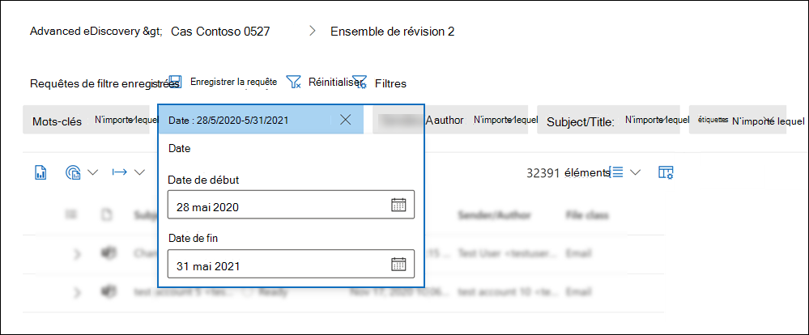
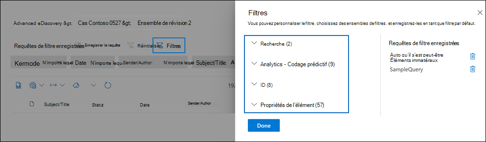
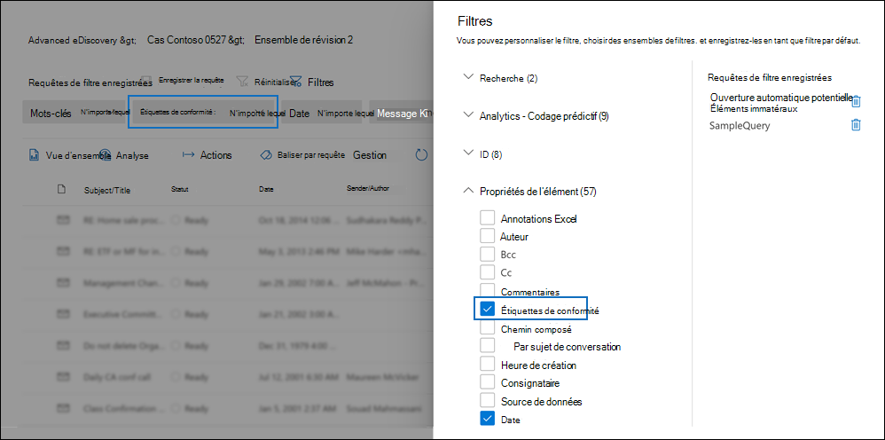
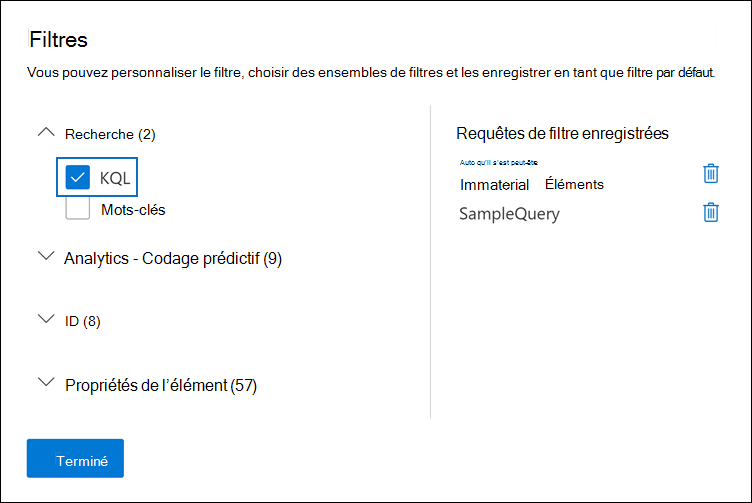

# Interroger et filtrer le contenu d’un jeu à réviser

Dans la plupart des cas, il est utile d’approfondir le contenu d’un jeu à réviser et de l’organiser pour faciliter une révision plus efficace. L’utilisation de filtres et de requêtes dans un ensemble de révision vous permet de vous concentrer sur un sous-ensemble de documents qui répondent aux critères de votre avis.

## Filtres par défaut

Dans un jeu à réviser, il existe cinq filtres par défaut qui sont pré-chargés dans le jeu à réviser :

- Mots-clés
- Date
- Sender/Author
- Objet/Titre
- Balises

Cliquez sur chaque filtre pour le développer et attribuer une valeur. Cliquez en dehors du filtre pour appliquer automatiquement le filtre au jeu à réviser. La capture d’écran suivante montre le filtre Date configuré pour afficher les documents dans une plage de dates.

## Ajouter ou supprimer des filtres

Pour ajouter ou supprimer des filtres qui sont affichés pour le jeu à réviser, sélectionnez **Filtres** pour ouvrir le panneau de filtrage, qui s’affiche sur une page volante. 

Les filtres disponibles sont organisés en quatre sections :

- **Recherche**: filtres qui fournissent différentes fonctionnalités de recherche.

- **Codage analytique &** prédictif : filtre les propriétés générées et ajoutées aux documents lorsque vous exécutez le travail d’analyse de messagerie électronique **Document &** ou que vous utilisez des modèles de codage prédictifs.

- **ID :** filtre toutes les propriétés d’ID des documents.

- **Propriétés d’élément**: filtre les propriétés de document. 

Développez chaque section et sélectionnez ou désélectionnez des filtres pour les ajouter ou les supprimer dans l’ensemble de filtres. Lorsque vous ajoutez un filtre, il s’affiche dans le jeu de filtres. 

> [!NOTE]
> Lorsque vous développez une section dans le panneau de filtrage, vous remarquerez que les types de filtres par défaut sont sélectionnés. Vous pouvez conserver ces éléments sélectionnés ou les désélectionner et les supprimer du jeu de filtres. 

## Types de filtre

Chaque champ utilisable dans une recherche dans un jeu à réviser possède un filtre correspondant que vous pouvez utiliser pour filtrer des éléments en fonction d’un champ spécifique.

Il existe plusieurs types de filtres :

- **Texte libre**: un filtre de texte libre est appliqué à des champs de texte tels que « Subject ». Vous pouvez lister plusieurs termes de recherche en les séparant par une virgule.

- **Date**: un filtre de date est utilisé pour les champs de date tels que « Date de dernière modification ».

- **Options de** recherche : un filtre d’options de recherche fournit une liste des valeurs possibles (chaque valeur est affichée avec une case à cocher que vous pouvez sélectionner) pour des champs particuliers dans l’avis. Ce filtre est utilisé pour les champs, tels que « Expéditeur », où il existe un nombre fini de valeurs possibles dans le jeu à réviser.

- **Mot** clé : une condition de mot clé est une instance spécifique de condition de texte libre que vous pouvez utiliser pour rechercher des termes. Vous pouvez également utiliser un langage de requête de type KQL dans ce type de filtre. Pour plus d’informations, voir les sections Langage de requête et Générateur de requêtes avancé dans cette rubrique.

## Inclure et exclure des relations de filtre

Vous avez la possibilité de modifier la relation Inclure et exclure pour un filtre particulier. Par exemple, dans le filtre Balise, vous pouvez exclure les éléments **marqués** avec une balise particulière en sélectionnant Égal à aucun des éléments du filtre de ladown. 

## Enregistrer des filtres en tant que requêtes

Une fois que vous êtes satisfait de vos filtres, vous pouvez enregistrer la combinaison de filtres en tant que requête de filtre. Cela vous permet d’appliquer le filtre dans les prochaines sessions de révision.

Pour enregistrer un filtre, **sélectionnez Enregistrer la requête et** nommez-la. Vous ou d’autres réviseurs pouvez exécuter  des requêtes de filtre précédemment enregistrées en sélectionnant la dropdown des requêtes de filtre enregistrées et en sélectionnant une requête de filtre à appliquer aux documents de l’ensemble de révision. 

Pour supprimer une requête de filtre, ouvrez le panneau de filtrage et sélectionnez l’icône de corbeille en côté de la requête.

## Langage de requête

En plus d’utiliser des filtres, vous pouvez également utiliser un langage de requête KQL dans le filtre Mots clés pour créer votre requête de recherche de jeu à réviser. Le langage de requête pour les requêtes de jeu à réviser prend en charge les opérateurs booléens standard, tels que **AND**, **OR**, **NOT** et **NEAR**. Il prend également en charge un caractère générique à caractère unique (?) et un caractère générique à plusieurs caractères (*).

## Générateur de requêtes avancé

Vous pouvez également créer des requêtes plus avancées pour rechercher des documents dans un jeu à réviser.

1. Ouvrez le panneau de filtrage, **sélectionnez Filtres** et **développez** la section Recherche.

  

2. Sélectionnez **le filtre KQL,** puis cliquez **sur Ouvrir le générateur de requêtes.**

   Dans ce panneau, vous pouvez créer des requêtes KQL complexes à l’aide du générateur de requêtes. Vous pouvez ajouter des conditions ou des groupes de conditions composés de plusieurs conditions connectées logiquement par des **relations AND** ou **OR.**

   
