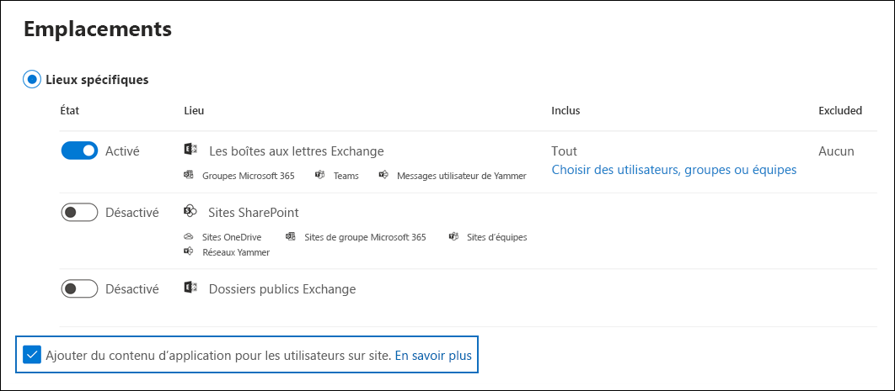

# <a name="search-for-teams-chat-data-for-on-premises-users"></a>Recherche de données de conversations Teams pour les utilisateurs locaux

Si votre organisation dispose d'un déploiement hybride d'Exchange (ou si votre organisation synchronise une organisation Exchange sur site avec Office 365) et a activé Microsoft Teams, les utilisateurs locaux peuvent utiliser l'application de conversation Teams pour la messagerie instantanée. Pour un utilisateur dans le cloud, les données de conversation Teams (également appelées *1x1 ou conversations 1x1*) sont enregistrées dans sa boîte aux lettres principale basée sur le cloud. Lorsqu’un utilisateur local utilise l’application de conversation Teams, ses messages de conversation ne peuvent pas être stockés dans sa boîte aux lettres principale qui se situe en local. Pour contourner cette limitation, Microsoft a publié une nouvelle fonctionnalité dans laquelle une zone de stockage basée sur le cloud est crée pour que vous utilisiez les outils eDiscovery pour rechercher et exporter des données de conversation Teams pour les utilisateurs locaux.
  
Voici la configuration requise et les limitations applicables à l’activation du stockage cloud pour les utilisateurs locaux :
  
- Les comptes d’utilisateurs dans votre service d’annuaire local (par exemple, Active Directory) doivent être synchronisés avec Azure Active Directory (service d’annuaire dans Microsoft 365). Cela signifie qu’un compte d’utilisateur de courrier est créé dans Microsoft 365 et est associé à un utilisateur dont la boîte aux lettres principale se trouve dans l’organisation locale.

- Une licence Microsoft Teams doit être attribuée à l’utilisateur dont la boîte aux lettres principale se trouve dans l’organisation locale et au minimum d’une licence Exchange Online (plan 1).

- Si votre organisation ne comporte pas de déploiement Exchange hybride, vous devez synchroniser votre schéma Exchange local avec Azure Active Directory. Sinon, vous risquez de créer des boîtes aux lettres informatiques en double dans Exchange Online pour les utilisateurs disposant d’une boîte aux lettres dans votre organisation Exchange locale.

- Seules les données de conversation Teams associées à un utilisateur local sont stockées dans la zone de stockage basée sur le cloud. Un utilisateur local ne peut en aucune façon accéder à cette zone de stockage.

> [!NOTE]
> Les conversations pa canaux Teams sont toujours stockées dans la boîte aux lettres basée sur le cloud qui est associée à Teams, ce qui signifie que vous pouvez rechercher des conversations dans les canaux. Pour plus d’informations sur la recherche conversations par canaux Teams, consultez[Recherche Microsoft Teams et Groupes Microsoft 365](content-search-reference.md#searching-microsoft-teams-and-microsoft-365-groups).
  
## <a name="how-it-works"></a>Mode de fonctionnement

Si un utilisateur Microsoft Teams a une boîte aux lettres locale et que son compte d’utilisateur/son identité est synchronisé avec le cloud, Microsoft crée un stockage dans le cloud pour l’associer aux données de conversations Teams 1xN de l’utilisateur local. Les données de conversations Teams pour les utilisateurs locaux sont indexées pour la recherche. Cela vous permet d’utiliser la recherche de contenu (et les recherches associées à des cas Core et Advanced eDiscovery) pour rechercher, afficher un aperçu, et exporter des données de conversation Teams des utilisateurs locaux. Vous pouvez également utiliser les applets de commande **\*ComplianceSearch** dans le centre de conformité et de sécurité PowerShell pour rechercher des données de conversation Teams pour les utilisateurs locaux.
  
Le graphique suivant montre comment Teams peut consulter les données de conversation pour les utilisateurs locaux pour pouvoir effectuer des recherches, des aperçus et des exportations.
  

  
En plus de cette fonctionnalité, vous pouvez également utiliser les outils eDiscovery pour rechercher, afficher un aperçu, et exporter du contenu Teams sur le site SharePoint utilisant le cloud et sur la boîte aux lettres Exchange associée à chaque donnée de conversation Microsoft Teams et 1xN Teams dans la boîte aux lettres Exchange Online pour les utilisateurs du cloud.

### <a name="how-this-feature-is-supported-in-content-search-and-core-ediscovery-search-tools"></a>Prise en charge de cette fonctionnalité dans les outils de Recherche de contenu et Core eDiscovery

Ces éléments d’interface utilisateur de la recherche de contenu et de l’outil de recherche associés aux cas Core eDiscovery principaux dans le Centre de conformité Microsoft 365 :
  
- La case à cocher **Ajouter du contenu d’application pour des utilisateurs locaux** s’affiche dans la page de l’Assistant **Emplacements** de l’outil de recherche de contenu et est sélectionnée par défaut. Conservez cette case à cocher sélectionnée pour inclure le stockage basé sur le cloud pour les utilisateurs locaux dans une recherche de contenu.

    
  
- Vous pouvez rechercher des utilisateurs locaux lorsque vous sélectionnez des utilisateurs spécifiques à rechercher.

## <a name="searching-for-teams-chat-content-for-on-premises-users"></a>Recherche du contenu de conversations Teams pour des utilisateurs locaux

Voici comment utiliser la recherche de contenu dans le Centre de conformité Microsoft 365 pour rechercher des données de conversation de Teams des utilisateurs locaux.
  
1. Dans le centre de conformité Microsoft 365, accédez à **Recherche de contenu**.

2. Sous l’onglet **Recherches** , cliquez sur **Nouvelle recherche**, puis nommez la nouvelle recherche.

3. Dans la page **Emplacements** , définissez la bascule sur **Activé** pour les boîtes aux lettres Exchange. Notez que la case à cocher **Ajouter du contenu d’application pour les utilisateurs locaux** est affichée et sélectionnée par défaut.

4. Pour rechercher du contenu Teams pour des utilisateurs spécifiques, sélectionnez **Sélectionner un utilisateur, des groupes ou des équipes**, puis choisissez les utilisateurs spécifiques à inclure dans la recherche. Sinon, cliquez sur **Suivant** pour rechercher du contenu Teams pour tous les utilisateurs, y compris les utilisateurs locaux.

5. Dans la page **Définir vos conditions de recherche**, créez une requête mot clé et ajoutez des conditions à la requête de recherche si nécessaire. Pour rechercher uniquement les données de conversations Teams, vous pouvez ajouter la requête suivante dans la zone **Mots clés** :

    ```text
    kind:im AND kind:microsoftteams
    ```

6. Envoyez et exécutez la recherche. Les résultats de recherche pour des utilisateurs locaux peuvent être prévisualisés comme tout autre résultat de recherche. Vous pouvez également exporter les résultats de la recherche (y compris les données de conversation des équipes) vers un fichier PST. Pour plus d’informations, voir :

    - [Créer une recherche](content-search.md)

    - [Aperçu des résultats de la recherche](preview-ediscovery-search-results.md)

    - [Exporter les résultats de la recherche](export-search-results.md)

## <a name="using-powershell-to-search-for-teams-chat-data-for-on-premises-users"></a>Utilisation de PowerShell pour la recherche de données de conversations Teams pour les utilisateurs locaux

Vous pouvez utiliser les applets de commande **New-ComplianceSearch** et **ComplianceSearch** dans le centre de sécurité et conformité PowerShell pour effectuer une recherche de données de conversations Teams pour les utilisateurs locaux. Comme indiqué précédemment, vous n’êtes pas obligé de soumettre une demande de support pour utiliser PowerShell pour rechercher des données de conversation Teams pour les utilisateurs locaux.
  
1. [Se connecter à l’interface PowerShell du Centre de sécurité et conformité](/powershell/exchange/connect-to-scc-powershell).

2. Exécutez la commande PowerShell suivante pour créer une recherche de contenu qui recherche des données de conversations Teams pour des utilisateurs locaux.

    ```powershell
    New-ComplianceSearch <name of new search> -ContentMatchQuery <search query> -ExchangeLocation <on-premises user> -IncludeUserAppContent $true -AllowNotFoundExchangeLocationsEnabled $true  
    ```

    Le paramètre *IncludeUserAppContent* est utilisé pour spécifier le stockage cloud pour l’utilisateur ou les utilisateurs spécifiés par le paramètre *ExchangeLocation*. *AllowNotFoundExchangeLocationsEnabled* vous permet d’effectuer une recherche dans le stockage cloud pour les utilisateurs locaux. Lorsque vous utilisez la valeur `$true` pour ce paramètre, la recherche n’essaie pas de valider l’existence de la boîte aux lettres avant son exécution. Celle-ci est nécessaire pour effectuer des recherches dans le stockage cloud des utilisateurs locaux, car ce stockage cloud n’est pas résolu comme une boîte aux lettres cloud normale.

    L’exemple suivant recherche les conversations Teams qui contiennent le mot clé « redstone » dans le stockage basé sur le cloud de Marie Davis, utilisateur local de l’organisation Contoso.
  
    ```powershell
    New-ComplianceSearch "Redstone_Search" -ContentMatchQuery "redstone AND (kind:im AND kind:microsoftteams)" -ExchangeLocation sarad@contoso.com -IncludeUserAppContent $true -AllowNotFoundExchangeLocationsEnabled $true  
    ```

   Une fois que vous avez créé une recherche, veillez à utiliser l’applet de commande **Start-ComplianceSearch** pour lancer la recherche.
  
Pour plus d’informations sur l’utilisation de ces applets de commande, consultez :
  
- [New-ComplianceSearch](/powershell/module/exchange/new-compliancesearch)

- [Set-ComplianceSearch](/powershell/module/exchange/set-compliancesearch)

- [Start-ComplianceSearch](/powershell/module/exchange/start-compliancesearch)

## <a name="known-issues"></a>Problèmes connus

- Pour l’instant, vous pouvez rechercher, afficher un aperçu et exporter des données de conversations Teams pour les utilisateurs locaux. Vous pouvez également placer en attente des données de conversations Teams pour un utilisateur local sur un cas Core ou Advanced eDiscovery, et appliquer une stratégie de rétention pour les conversations Teams ou les messages de canal pour les utilisateurs locaux. Pour l’instant, vous ne pouvez pas appliquer une stratégie de rétention pour d’autres emplacements de contenu (tels que les boîtes aux lettres Exchange et les sites SharePoint) pour les utilisateurs locaux.

## <a name="frequently-asked-questions"></a>Questions fréquemment posées

**Dois-je soumettre une demande de support pour rechercher des messages de conversation d’utilisateurs locaux ?**

Non. Cette fonctionnalité est activée par défaut pour toutes les organisations. À un moment, vous deviez contacter le support Microsoft, mais ce n’est plus le cas.
  
 **Les outils eDiscovery peuvent-ils rechercher des anciennes données de conversation Teams d’utilisateurs locaux datant de la période antérieure à l’activation par défaut de cette fonctionnalité pour toutes les organisations ?**
  
Microsoft a commencé à stocker des données de conversations Teams pour les utilisateurs locaux le 31 janvier 2018. Par conséquent, si l’identité d’un utilisateur Teams local a été synchronisée entre Active Directory locale et Azure Active Directory dans Microsoft 365 depuis cette date, ses données de conversation Teams sont stockées dans le cloud et peuvent faire l’objet d’une recherche à l’aide des outils eDiscovery.

 **Les utilisateurs locaux ont-ils besoin d’une licence pour stocker leurs données de conversations Teams dans le cloud ?**
  
Oui. Pour stocker les données de conversations Teams pour un utilisateur local dans un stockage basé sur le cloud, l’utilisateur doit avoir une licence Microsoft Teams et une licence Exchange Online plan dans Office 365 (ou Microsoft 365).

**Où se trouve le stockage cloud pour les utilisateurs locaux ?**
  
Les données de conversation de Teams sont stockées dans le site PDL (Preferred Data Location) d’un utilisateur local. Le PDL est respecté à la fois dans les environnements Mono-Géo et Multi-Géo. Pour en savoir plus, consultez [Microsoft 365 Multigéographie](../enterprise/microsoft-365-multi-geo.md).

**Y a-t-il un risque de perdre les données de conversation Teams si la boîte aux lettres locale de l’utilisateur est déplacée vers le cloud ?**
  
Non. Lorsque vous migrez la boîte aux lettres principale d’un utilisateur local vers le cloud, les informations de conversation associées à cet utilisateur sont déplacées vers leur nouvelle boîte aux lettres principale basée sur le cloud.
  
 **Puis-je appliquer une conservation eDiscovery ou des stratégies de rétention à des utilisateurs locaux ?**
  
Oui. Vous pouvez appliquer des conservations eDiscovery ou des stratégies de rétention pour les conversations Teams et les messages de canaux pour les utilisateurs locaux. Toutefois, pour préserver ou conserver le contenu Teams des utilisateurs locaux, une licence Exchange Online Plan 2 doit leur être attribuée.
