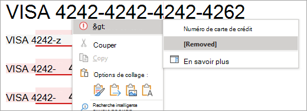

# Pourquoi choisir l'étiquetage intégré plutôt que le module complémentaire AIP pour les applications Office

>*[Guide de sécurité et conformité pour les licences Microsoft 365](/office365/servicedescriptions/microsoft-365-service-descriptions/microsoft-365-tenantlevel-services-licensing-guidance/microsoft-365-security-compliance-licensing-guidance).*

Lorsque vous utilisez des [étiquettes de sensibilité](sensitivity-labels.md) dans les applications Microsoft 365 sur des ordinateurs Windows, vous avez le choix entre utiliser l'étiquetage intégré aux applications Office ou un complément du client d'étiquetage unifié [Azure Information Protection (AIP)](/azure/information-protection/rms-client/aip-clientv2). 

L'étiquetage intégré constitue la pierre angulaire d'un déploiement de [Microsoft Purview Information Protection](information-protection-solution.md), car cette technologie d'étiquetage s'étend sur toutes les plateformes (Windows, macOS, iOS, Android et Web), ainsi que sur les applications et services Microsoft, et au-delà. L'étiquetage intégré est également conçu pour fonctionner avec d'autres fonctionnalités Microsoft Purview, telles que la classification des données et la prévention des pertes de données Microsoft Purview.

Comme les étiquettes intégrées n'utilisent pas de module complémentaire d'Office, elles bénéficient d'une plus grande stabilité et de meilleures performances. Ils prennent également en charge les fonctionnalités Microsoft Purview les plus récentes, telles que les classifieurs avancés.

Par défaut, l'étiquetage intégré est désactivé dans les applications Office pour Windows lorsque le client AIP est installé. Vous pouvez modifier ce comportement par défaut en utilisant les instructions de la section suivante, [Comment désactiver le module complémentaire AIP pour utiliser l'étiquetage intégré pour les applications Office](#how-to-disable-the-aip-add-in-to-use-built-in-labeling-for-office-apps).

Lorsque vous conservez le client AIP installé mais désactivé dans les applications Office, les autres fonctionnalités du client AIP restent prises en charge :

- Options de clic droit dans l'explorateur de fichiers pour que les utilisateurs puissent appliquer des étiquettes à tous les types de fichiers.

- Une visionneuse pour afficher les fichiers cryptés pour les textes, les images ou les documents PDF.

- Module PowerShell pour découvrir des informations sensibles dans des fichiers locaux, et appliquer ou supprimer des étiquettes et un chiffrement à partir de ces fichiers.

- Un scanner pour découvrir les informations sensibles stockées dans les magasins de données sur site, puis, en option, étiqueter ce contenu.

Pour plus d'informations sur ces fonctionnalités qui étendent l'étiquetage au-delà des applications Office, voir [le guide de l'administrateur du client d'étiquetage unifié ](/azure/information-protection/rms-client/clientv2-admin-guide)d' Azure Information Protection dans la documentation AIP.

Indépendamment de l'étiquetage, vous pouvez continuer à utiliser le module PowerShell [AIPService](/powershell/module/aipservice) pour la gestion du service de chiffrement au niveau des locataires. Par exemple, configurez l'accès des super-utilisateurs lorsque vous devez supprimer le cryptage pour la récupération des données, suivre et révoquer les documents qui ont été ouverts par le client AIP, et configurer la période de validité de la licence d'utilisation pour l'accès hors ligne. Pour plus d'informations, voir [Administrer la protection d' Azure Information Protection à l'aide de PowerShell](/azure/information-protection/administer-powershell).

## Décider d'utiliser l'étiquetage intégré pour les applications Office ou le module complémentaire AIP.

Maintenant que le client AIP est en [mode maintenance](https://techcommunity.microsoft.com/t5/security-compliance-and-identity/announcing-aip-unified-labeling-client-maintenance-mode-and/ba-p/3043613), nous ne vous recommandons pas d'utiliser le complément AIP pour les applications Office pour les raisons suivantes :

- Aucune nouvelle fonctionnalité d'étiquetage ne sera prise en charge.
- Les modules complémentaires sont moins stables car ils peuvent entrer en conflit avec d'autres modules complémentaires, ce qui peut entraîner la suspension ou le plantage des applications Office ou la désactivation automatique du module complémentaire.
- En tant que module complémentaire, il fonctionne plus lentement et peut être désactivé par les utilisateurs pour contourner les exigences d'étiquetage.
- Toute correction de bogue nécessitera la réinstallation du client Azure Information Protection.
- L’expérience d’étiquetage des utilisateurs est légèrement différente des étiquettes intégrées que les utilisateurs ont sur leurs autres appareils (macOS, iOS, Android) et lorsqu’ils utilisent Office pour le web. Cette différence peut augmenter les coûts de formation et de support.
- Il existe déjà de nouvelles fonctionnalités d'étiquetage Office publiées qui [ne sont prises en charge que par l'étiquetage intégré](#features-supported-only-by-built-in-labeling-for-office-apps), et la liste augmente en permanence.

Utilisez le complément AIP pour vos applications Windows Office uniquement si vous l'avez déjà déployé auprès des utilisateurs et que vous avez besoin de temps pour les faire migrer vers l'étiquetage intégré. Ou encore, les utilisateurs ont besoin d'une fonctionnalité qui n'est pas prise en charge par l'étiquetage intégré. Utilisez les [informations de parité des fonctionnalités](#feature-parity-for-built-in-labeling-and-the-aip-add-in-for-office-apps) de cette page pour vous aider à identifier ces fonctionnalités.

## Fonctionnalités prises en charge uniquement par l'étiquetage intégré pour les applications Office

> [!NOTE]
> De nombreuses nouvelles fonctionnalités d’étiquetage sont en cours de planification ou de développement. Attendez-vous donc à ce que la liste de cette section augmente au fil du temps.

Certaines fonctionnalités sont uniquement prises en charge par l’étiquetage intégré pour les applications Office et ne sont pas prises en charge par le complément AIP. Il s’agit notamment des éléments suivants :

- Pour l’étiquetage automatique et recommandé :
    - Accès aux services de classification intelligents qui incluent [les classifieurs entraînables](classifier-learn-about.md), [la correspondance exacte des données (EDM)](sit-learn-about-exact-data-match-based-sits.md) et [les entités nommées](named-entities-learn.md)
    - Détection d'informations sensibles au moment de la saisie des utilisateurs
    - Dans Word, les utilisateurs peuvent examiner et supprimer le contenu sensible identifié.
- [Prise en charge du format PDF](sensitivity-labels-office-apps.md#pdf-support)
- Pour les étiquettes qui permettent aux utilisateurs d'attribuer des permissions, différentes permissions (lecture ou modification) peuvent être accordées aux utilisateurs ou aux groupes.
- Cryptage uniquement pour les e-mails
- Visibilité des étiquettes sur la barre d'état
- Support pour le changement de compte
- Les utilisateurs ne peuvent pas désactiver l'étiquetage

Exemple montrant comment les utilisateurs peuvent examiner et éventuellement supprimer le contenu sensible identifié dans Word :

Pour être informé de la disponibilité de nouvelles fonctionnalités d'étiquetage intégré, voir les sections [Nouveautés de Microsoft Purview](whats-new.md) et **Étiquettes de sensibilité**.

## Comment désactiver le complément AIP pour utiliser l'étiquetage intégré des applications Office ?

Lorsque vous avez installé le client AIP pour étendre l'étiquetage au-delà des applications Office, mais que vous souhaitez empêcher le chargement du module complémentaire du client dans les applications Office, utilisez le paramètre de stratégie de groupe **Liste des modules complémentaires** gérés, comme indiqué dans Aucun module [ complémentaire chargé en raison des paramètres de stratégie de groupe pour les programmes Office 2013 et Office 2016](https://support.microsoft.com/help/2733070/no-add-ins-loaded-due-to-group-policy-settings-for-office-2013-and-off).

Pour vos applications Windows Office qui prennent en charge l'étiquetage intégré, utilisez la configuration pour Microsoft Word 2016, Excel 2016, PowerPoint 2016 et Outlook 2016, spécifiez les identifiants programmatiques (ProgID) suivants pour le client AIP, et définissez l'option sur 0 **: Le module complémentaire est toujours désactivé (bloqué)**

|Application  |ProgID  |
|---------|---------|
|Word     |     `MSIP.WordAddin`    |
|Excel     |  `MSIP.ExcelAddin`       |
|PowerPoint     |   `MSIP.PowerPointAddin`      |
|Outlook | `MSIP.OutlookAddin` |
| | | 

Déployez ce paramètre à l’aide d’une stratégie de groupe ou à l’aide du [service de stratégies cloud Office](/DeployOffice/overview-office-cloud-policy-service).

> [!IMPORTANT]
> Si vous utilisez le paramètre de stratégie de groupe **Utiliser la fonction de sensibilité dans Office pour appliquer et afficher des étiquettes** de sensibilité et que vous le définissez sur **1**, il est possible que le module complémentaire AIP se charge quand même dans les applications Office. Si vous bloquez le chargement du complément dans chaque application, cela ne se produira pas.

Vous pouvez également désactiver ou supprimer de manière interactive le complément Office **Microsoft Azure Information Protection** de Word, Excel, PowerPoint et Outlook. Cette méthode est appropriée pour un ordinateur unique et des tests ad-hoc. Pour obtenir de instructions, consultez [Afficher, gérer et installer des compléments dans les programmes Office (pour les utilisateurs)](https://support.office.com/article/16278816-1948-4028-91e5-76dca5380f8d).

Quelle que soit la méthode choisie, les modifications prennent effet au redémarrage des applications Office.

Si, après avoir apporté ces modifications, le bouton **Sensibilité** ne s’affiche pas sur le ruban Office, vérifiez si l’étiquetage de confidentialité a été [désactivé](sensitivity-labels-office-apps.md#if-you-need-to-turn-off-built-in-labeling-in-office-apps-on-windows). Bien qu’il ne s’agisse pas de la configuration par défaut, un administrateur peut avoir défini explicitement cette configuration à l’aide de stratégie de groupe ou en modifiant directement le Registre.

> [!NOTE]
> Les étiquettes intégrées nécessitent une édition d’abonnement des applications Office. Si vous disposez d’éditions autonomes d’Office, parfois appelées « Office Perpetual », nous vous recommandons d’effectuer une mise à niveau vers Microsoft 365 Apps for Enterprise pour tirer parti des [dernières fonctionnalités d’étiquetage](sensitivity-labels-office-apps.md#support-for-sensitivity-label-capabilities-in-apps).

N'oubliez pas que lorsque vous utilisez cette méthode pour désactiver le complément AIP, vous pouvez toujours utiliser le client AIP pour étendre l'étiquetage au-delà des applications Office.

## Parité des fonctionnalités pour l'étiquetage intégré et le complément AIP pour les applications Office.

De nombreuses fonctions d'étiquetage prises en charge par le complément AIP sont désormais prises en charge par l'étiquetage intégré. Pour une liste plus détaillée des capacités, des versions minimales éventuellement nécessaires et des informations de configuration, voir [Gérer les étiquettes de sensibilité dans les applications Office](sensitivity-labels-office-apps.md).

D’autres fonctionnalités sont planifiées et en cours de développement. S’il existe une fonctionnalité spécifique qui vous intéresse, consultez la [feuille de route Microsoft 365](https://www.microsoft.com/microsoft-365/roadmap?filters=Microsoft%20Information%20Protection&searchterms=label) et envisagez de rejoindre le [Microsoft Information Protection dans Office Private Preview](https://aka.ms/MIP/PreviewRing).

Utilisez les informations suivantes pour vous aider à identifier si vous utilisez une fonctionnalité du complément AIP qui n'est pas encore prise en charge par l'étiquetage intégré :

|Fonction ou capacité complémentaire de l'AIP|Étiquetage intégré |
|:-------------------------------|:----------------:|
|**Catégorie : Général** ||
|Rapports et audits centraux|  [Si vous souhaitez en savoir plus](sensitivity-labels-office-apps.md#auditing-labeling-activities) |
|Cloud pour le secteur public||
|L'administrateur peut désactiver l'étiquetage   - Toutes les applications|    [Si vous souhaitez en savoir plus](sensitivity-labels-office-apps.md#if-you-need-to-turn-off-built-in-labeling-in-office-apps-on-windows)|
|L'administrateur peut désactiver l'étiquetage   – Par application|  En cours de planification ou de développement|
|**Catégorie : Expérience utilisateur** ||
|Bouton d'étiquetage sur le ruban||
|Prise en charge multilingue des noms d'étiquettes et des infobulles|   [Si vous souhaitez en savoir plus](create-sensitivity-labels.md#example-configuration-to-configure-a-sensitivity-label-for-different-languages) |
|Couleurs des étiquettes| En cours de planification ou de développement |
|Visibilité des étiquettes sur la barre d'outils| En cours de planification ou de développement |
|**Catégorie : actions d’étiquetage** ||
|Étiquetage manuel |    [Si vous souhaitez en savoir plus](https://support.microsoft.com/office/apply-sensitivity-labels-to-your-files-and-email-in-office-2f96e7cd-d5a4-403b-8bd7-4cc636bae0f9) |
|Étiquetage par défaut |   [Si vous souhaitez en savoir plus](sensitivity-labels.md#what-label-policies-can-do)|
|Étiquette par défaut   – Articles nouveaux et existants   - Paramètres distincts pour le mail|    [Si vous souhaitez en savoir plus](sensitivity-labels.md#what-label-policies-can-do) |
|Recommandé ou automatique |  [Si vous souhaitez en savoir plus](apply-sensitivity-label-automatically.md#how-to-configure-auto-labeling-for-office-apps) |
|Justification du déclassement |    [Si vous souhaitez en savoir plus](sensitivity-labels.md#what-label-policies-can-do)|
| **Catégorie : Marquage visuel** | |
|En-têtes, pieds de page, filigrane|   [Si vous souhaitez en savoir plus](sensitivity-labels.md#what-label-policies-can-do)|
|Marquage dynamique|   [Si vous souhaitez en savoir plus](sensitivity-labels-office-apps.md#dynamic-markings-with-variables)|
|Marquage visuel par application|   [Si vous souhaitez en savoir plus](sensitivity-labels-office-apps.md#setting-different-visual-markings-for-word-excel-powerpoint-and-outlook)|
| **Catégorie : Cryptage** | |
|Autorisations définies par l'administrateur |   [Si vous souhaitez en savoir plus](encryption-sensitivity-labels.md#assign-permissions-now) |
|Permissions définies par l'utilisateur   - Ne pas transférer pour Outlook   – Permissions personnalisées des utilisateurs et des groupes pour Word, Excel, PowerPoint|   [Si vous souhaitez en savoir plus](encryption-sensitivity-labels.md#let-users-assign-permissions)|
|Permissions définies par l'utilisateur   – Autorisations personnalisées à l'échelle de l'organisation en spécifiant les domaines pour Word, Excel, PowerPoint. | [Dans la préversion](encryption-sensitivity-labels.md#support-for-organization-wide-custom-permissions) |
|Co-auteur et AutoSave |   [Si vous souhaitez en savoir plus](sensitivity-labels-coauthoring.md) |
|Cryptage à double clé | En cours de planification ou de développement |
|Révocation de documents pour les utilisateurs | En cours de révision |
| | |

### Prise en charge des paramètres avancés de PowerShell

Le client AIP supporte de nombreuses personnalisations en utilisant les [paramètres avancés de PowerShell](/azure/information-protection/rms-client/clientv2-admin-guide-customizations#configuring-advanced-settings-for-the-client-via-powershell). Certains de ces paramètres avancés sont désormais pris en charge par l'étiquetage intégré, comme indiqué dans [New-Label](/powershell/module/exchange/new-label) ou [Set-Label](/powershell/module/exchange/set-label) , et [New-LabelPolicy](/powershell/module/exchange/new-labelpolicy) ou [Set-LabelPolicy](/powershell/module/exchange/set-labelpolicy).

Cependant, il se peut que vous n'ayez pas besoin d'utiliser PowerShell pour configurer les paramètres pris en charge, car ils sont inclus dans la configuration standard du portail de conformité Microsoft Purview. Par exemple, la possibilité de désactiver l'étiquetage obligatoire pour Outlook et de définir une autre étiquette par défaut.

Les configurations suivantes du complément AIP ne sont pas encore prises en charge par l'étiquetage intégré :

- [Héritage des étiquettes à partir des pièces jointes des e-mails](/azure/information-protection/rms-client/clientv2-admin-guide-customizations#for-email-messages-with-attachments-apply-a-label-that-matches-the-highest-classification-of-those-attachments)
- [S/MIME pour Outlook](/azure/information-protection/rms-client/clientv2-admin-guide-customizations#configure-a-label-to-apply-smime-protection-in-outlook)
    - Ce paramètre commence à être [déployé en avant-première pour l'étiquetage intégré sur toutes les plateformes.](sensitivity-labels-office-apps.md#configure-a-label-to-apply-smime-protection-in-outlook)
- [Messages popup de partage excessif pour Outlook](/azure/information-protection/rms-client/clientv2-admin-guide-customizations#implement-pop-up-messages-in-outlook-that-warn-justify-or-block-emails-being-sent)
- [Sous-étiquette par défaut pour une étiquette parent](/azure/information-protection/rms-client/clientv2-admin-guide-customizations#specify-a-default-sublabel-for-a-parent-label)
- [Supprimer les marquages de contenu externe](/azure/information-protection/rms-client/clientv2-admin-guide-customizations#remove-headers-and-footers-from-other-labeling-solution )

## Fonctionnalités non prévues pour être prises en charge par l'étiquetage intégré pour les applications Office

Bien que de nouvelles fonctionnalités pour l'étiquetage intégré soient ajoutées en permanence, le module complémentaire AIP Office prend en charge les fonctionnalités suivantes dont la disponibilité n’est pas prévue dans les futures versions de l'étiquetage intégré :

- Application des étiquettes aux formats Microsoft Office 97-2003, tels que les fichiers .doc.
- Journalisation de l’utilisation locale dans le journal des événements Windows
- Ordinateurs déconnectés de façon permanente
- Des éditions autonomes d'Office (parfois appelées « Office perpétuelle ») plutôt que des éditions sur abonnement.

## Étapes suivantes

Pour obtenir des instructions sur la création et la configuration de ces capacités d'étiquetage, voir [créer et configurer des étiquettes de sensibilité et leurs stratégies](create-sensitivity-labels.md).

> [!TIP]
> Si vous disposez déjà d'étiquettes de sensibilité dans le portail de conformité Microsoft Purview, vous ne pourrez pas bénéficier de la création automatique d'étiquettes par défaut. Cependant, vous pouvez toujours trouver utile de faire référence à leur configuration : [Étiquettes de sensibilité par défaut](mip-easy-trials.md#default-sensitivity-labels). 
