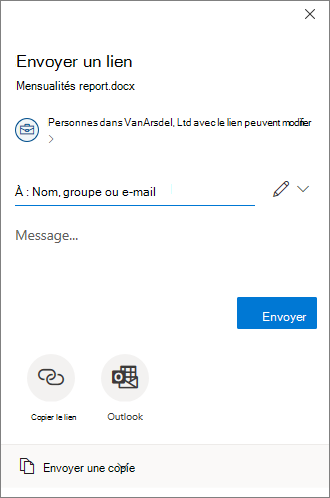

# <a name="use-sensitivity-labels-to-configure-the-default-sharing-link-type-for-sites-and-documents-in-sharepoint-and-onedrive"></a>Utilisez les étiquettes de confidentialité pour configurer le type de lien de partage par défaut pour les sites et les documents dans SharePoint et OneDrive.

>*[Guide de sécurité et conformité pour les licences Microsoft 365](/office365/servicedescriptions/microsoft-365-service-descriptions/microsoft-365-tenantlevel-services-licensing-guidance/microsoft-365-security-compliance-licensing-guidance).*

Comme configuration supplémentaire aux paramètres que vous voyez dans le portail de conformité Microsoft Purview pour les [étiquettes de sensibilité](sensitivity-labels.md) , vous pouvez utiliser ces étiquettes pour configurer les paramètres pour le type de lien de partage par défaut pour un site SharePoint ou un compte OneDrive, et pour des documents individuels. Ces paramètres sont automatiquement sélectionnés, mais ne sont pas très visibles pour les utilisateurs lorsqu'ils sélectionnent le bouton **Partager** dans leurs applications Office. Par exemple :



Le type de lien de partage par défaut définit l'étendue (qui) et les autorisations (afficher ou modifier) qui sont automatiquement sélectionnées lorsque les utilisateurs partagent des fichiers et des dossiers. Bien que les utilisateurs puissent toujours remplacer ces paramètres par défaut avant d'envoyer le lien de partage, les paramètres que vous choisissez constituent une base de référence sécuritaire. En général, les utilisateurs ne modifient pas les paramètres avant le partage.

Au niveau du site (site SharePoint ou compte OneDrive), les étiquettes de confidentialité constituent une alternative pratique pour définir le type de lien de partage par défaut qui peut être configuré pour un site dans le centre d'administration SharePoint. Pour plus d'informations, consultez la section [Modifier le type de lien par défaut pour un site](/sharepoint/change-default-sharing-link) de la documentation SharePoint.

Cette configuration au niveau du site fonctionne bien pour les sites SharePoint qui comportent des documents ayant tous le même niveau de sensibilité. Mais si les sites contiennent certains documents ayant un niveau de sensibilité plus élevé qui nécessitent des paramètres plus restrictifs, vous pouvez configurer une étiquette de sensibilité avec des paramètres différents pour le type de lien de partage par défaut, puis appliquer cette étiquette aux documents.

Dans ce scénario où le site a des paramètres de type de lien de partage par défaut, et un document dans ce site a des paramètres de type de lien par défaut différents, les paramètres de portée plus restrictifs seront appliqués au moment où l'utilisateur sélectionne l'option de partage pour le document. Par exemple :

- Le type de lien de partage par défaut pour le site s'applique à tous les membres de votre organisation. Un document de ce site est étiqueté avec le type de lien de partage par défaut défini sur des personnes spécifiques. Lorsqu'un utilisateur partage ce document, le type de lien de partage par défaut sélectionné sera étendu à des personnes spécifiques.

- Le type de lien de partage par défaut pour le site est réservé à des personnes spécifiques, avec des droits de modification. Un document de ce site est étiqueté avec le type de lien de partage par défaut défini sur n'importe qui dans l'organisation, avec des autorisations de visualisation. Lorsqu'un utilisateur partage ce document, le type de lien de partage par défaut sélectionné sera réservé à des personnes spécifiques disposant de droits de modification.

La configuration du type de lien par défaut pour les documents peut également être appropriée sans le paramètre de niveau site. Par exemple, si les sites SharePoint sont généralement organisés pour accueillir le même type de documents, ce n'est pas le cas des comptes OneDrive. Les utilisateurs enregistrent généralement un large éventail de fichiers sur OneDrive, comprenant souvent un mélange de documents personnels et professionnels. Définir un type de lien par défaut pour tous les documents du compte OneDrive d'un utilisateur n'est probablement pas pratique, mais les documents individuels peuvent tout de même bénéficier de ces paramètres. Par exemple :

- Les documents étiquetés **hautement** confidentiels ont un type de lien de partage par défaut qui limite le partage à des personnes spécifiques plutôt qu’à toute personne de l’organisation.
- Les documents étiquetés **Général** ont un type de lien de partage par défaut qui limite le partage aux personnes de votre organisation.
- Les documents étiquetés **Personnel** ont un type de lien de partage par défaut qui permet le partage à tout le monde avec le lien.

## <a name="prerequisites"></a>Conditions requises

Pour appliquer le type de lien de partage par défaut pour les sites, les étiquettes de confidentialité doivent être activées pour les conteneurs. Si cette fonctionnalité n’est pas encore activée pour votre client, voir Comment activer les étiquettes de confidentialité pour les conteneurs et [synchroniser les étiquettes](sensitivity-labels-teams-groups-sites.md#how-to-enable-sensitivity-labels-for-containers-and-synchronize-labels).

Pour appliquer le type de lien de partage par défaut aux documents dans SharePoint et OneDrive, les étiquettes de confidentialité doivent être activées pour ces services. Si cette fonctionnalité n'est pas encore activée pour votre locataire, afficher [Comment activer les étiquettes de confidentialité pour SharePoint et OneDrive (opt-in)](sensitivity-labels-sharepoint-onedrive-files.md#how-to-enable-sensitivity-labels-for-sharepoint-and-onedrive-opt-in).

Dans une session PowerShell, vous devez vous [connecter au PowerShell de sécurité et de conformité d’Office 365](/powershell/exchange/office-365-scc/connect-to-scc-powershell/connect-to-scc-powershell) pour configurer les paramètres du type de lien de partage par défaut.

> [!NOTE]
> Bien que cela ne soit pas obligatoire, il est plus facile de [créer et de configurer des étiquettes de sensibilité dans le portail](create-sensitivity-labels.md) de conformité Microsoft Purview, puis de modifier ces étiquettes avec les paramètres qui configurent le type de lien de partage par défaut.

## <a name="how-to-configure-settings-for-the-default-sharing-link-type"></a>Comment configurer les paramètres pour le type de lien de partage par défaut ?

Les paramètres de configuration du type de lien de partage par défaut utilisent le paramètre PowerShell *AdvancedSettings* avec les applets de commande [Set-Label](/powershell/module/exchange/set-label) et [New-Label](/powershell/module/exchange/new-labelpolicy) du [ PowerShell de sécurité et de conformité](/powershell/exchange/scc-powershell):

- **DefaultSharingScope** : les valeurs disponibles sont :
    - **SpecificPeople** : définit le lien de partage par défaut pour le site sur le lien « Personnes spécifiques »
    - **Organisation** : définit le lien de partage par défaut pour le site sur le lien « organisation » ou le lien partageable par l’entreprise
    - **Tout le monde** : définit le lien de partage par défaut pour le site sur un lien Accès anonyme ou Tout le monde

- **DefaultShareLinkPermission** : les valeurs disponibles sont :
    - **Affichage** : définit l’autorisation de lien par défaut pour le site sur les autorisations « afficher »
    - **Modifier** : définit l’autorisation de lien par défaut pour le site sur les autorisations « modifier »

Ces deux paramètres et valeurs sont équivalents aux paramètres *DefaultSharingScope* et *DefaultShareLinkPermission* de la cmdlet [Set-SPOSite](/powershell/module/sharepoint-online/set-sposite).

Exemples PowerShell, où le GUID de l’étiquette de sensibilité est **8faca7b8-8d20-48a3-8ea2-0f96310a848e** :

- Pour définir le type de lien de partage sur SpecificPeople :
    
    ````powershell
    Set-Label -Identity 8faca7b8-8d20-48a3-8ea2-0f96310a848e -AdvancedSettings @{DefaultSharingScope="SpecificPeople"}
    ````

- Pour définir les autorisations de lien de partage sur Modifier :
    
    ````powershell
    Set-Label -Identity 8faca7b8-8d20-48a3-8ea2-0f96310a848e -AdvancedSettings @{DefaultShareLinkPermission="Edit"}
    ````

Pour plus d’informations sur la spécification des paramètres avancés de PowerShell, consultez [Conseils PowerShell pour la spécification des paramètres avancés](create-sensitivity-labels.md#powershell-tips-for-specifying-the-advanced-settings).

Pour configurer les paramètres du type de lien de partage par défaut pour un site, la portée [de l'étiquette de sensibilité](sensitivity-labels.md#label-scopes) doit inclure les **groupes et les sites** lorsque vous créez l'étiquette de sensibilité dans le portail de conformité Microsoft Purview. Une fois créé, le paramètre **Site, UnifiedGroup** dans la colonne **Étendue** de la page **Étiquettes** s’affiche et le paramètre *ContentType* PowerShell affiche également cette même valeur. Pour les documents, l’étendue doit inclure **fichiers & courriers électroniques**, qui s’affiche en tant **que fichier, courrier électronique**. Ensuite :

- Lorsque l’étendue inclut **groupes & sites**, vous pouvez appliquer l’étiquette à un site, qui définit le type de lien de partage par défaut pour ce site. Pour plus d’informations sur l’application d’une étiquette de confidentialité à un site, afficher [Comment appliquer des étiquettes de niveau de confidentialité aux conteneurs](sensitivity-labels-teams-groups-sites.md#how-to-apply-sensitivity-labels-to-containers).

- Lorsque la portée de l'étiquette de sensibilité comprend les **fichiers et les e-mails**, vous pouvez appliquer l'étiquette aux documents, ce qui définit le type de lien de partage par défaut pour ce document. L'étiquette peut être appliquée [manuellement](https://support.microsoft.com/office/apply-sensitivity-labels-to-your-files-and-email-in-office-2f96e7cd-d5a4-403b-8bd7-4cc636bae0f9) ou [automatiquement](apply-sensitivity-label-automatically.md).

> [!TIP]
> Vous pouvez également spécifier que l’étiquette est l’étiquette de confidentialité par défaut à appliquer aux nouveaux sites ou nouveaux documents, en tant que paramètre de stratégie [d’étiquette](sensitivity-labels.md#what-label-policies-can-do).
