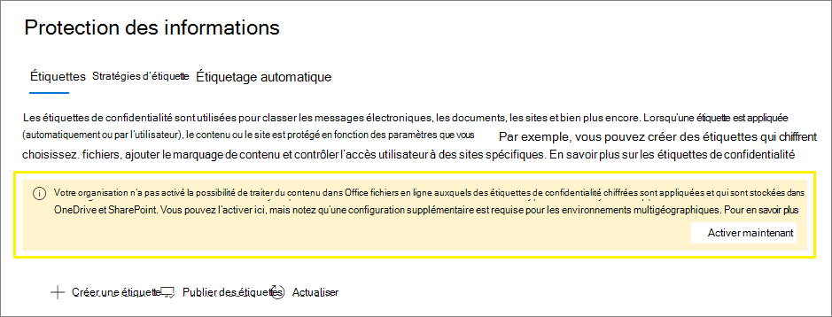

# <a name="enable-sensitivity-labels-for-office-files-in-sharepoint-and-onedrive"></a>Activer les étiquettes de confidentialité pour les fichiers Office dans SharePoint et OneDrive

>*[Guide de sécurité et conformité pour les licences Microsoft 365](https://aka.ms/ComplianceSD).*

Avant d’activer les étiquettes de confidentialité pour les fichiers Office dans SharePoint et OneDrive, vous ne pouvez pas appliquer vos [étiquettes de sensibilité](sensitivity-labels.md) dans Office sur le Web. Vous ne voyez pas le bouton de **confidentialité** sur le ruban ou le nom d’étiquette appliqué sur la barre d’État. En outre, si vous utilisez des applications de bureau pour étiqueter vos fichiers, puis les enregistrer sur SharePoint ou OneDrive, le service ne peut pas traiter le contenu de ces fichiers si l’étiquette a appliqué le chiffrement. La co-création, la découverte électronique, la protection contre la perte de données, la recherche et d’autres fonctionnalités collaboratives ne fonctionneront pas dans ces circonstances.

Lorsque vous activez les étiquettes de sensibilité pour les fichiers Office dans SharePoint et OneDrive, toutes ces fonctionnalités sont activées. En plus de l’affichage des étiquettes de confidentialité pour les utilisateurs, pour les fichiers nouveaux et modifiés dont l’étiquette de sensibilité est appliquée et qui inclut le chiffrement avec une clé basée sur le Cloud :

- Pour les fichiers Word, Excel et PowerPoint, SharePoint reconnaît l’étiquette et est désormais capable de traiter le contenu du fichier chiffré.

- Lorsque vous téléchargez ou accédez à ces fichiers à partir de SharePoint ou de OneDrive, l’étiquette de sensibilité et tous les paramètres de chiffrement de l’étiquette sont appliqués et demeurent avec le fichier, quel que soit l’emplacement où il est stocké. Assurez-vous que vous fournissez une aide aux utilisateurs pour n’utiliser que des étiquettes pour protéger des documents. Pour plus d’informations, consultez la rubrique [options de gestion des droits relatifs à l’information (IRM) et les étiquettes de confidentialité](sensitivity-labels-office-apps.md#information-rights-management-irm-options-and-sensitivity-labels).

- Lorsque les utilisateurs téléchargent des fichiers étiquetés et chiffrés dans SharePoint, ils doivent au moins avoir des droits d’affichage sur ces fichiers. Par exemple, ils peuvent ouvrir les fichiers en dehors de SharePoint. S’ils ne bénéficient pas de ce droit d’utilisation minimal, le chargement réussit, mais SharePoint ne reconnaît pas l’étiquette et ne peut pas traiter le contenu du fichier.

- Utilisez Office sur le Web (Word, Excel, PowerPoint) pour ouvrir et modifier les fichiers Office dont les étiquettes de confidentialité appliquent le chiffrement. Les autorisations qui ont été affectées au chiffrement sont appliquées. Avec Word sur le Web, vous pouvez également utiliser l’étiquetage automatique lorsque vous modifiez ces documents.

- Les utilisateurs externes peuvent accéder aux documents étiquetés avec le chiffrement à l’aide de comptes invités. Pour plus d’informations, consultez la rubrique [prise en charge des utilisateurs externes et du contenu étiqueté](sensitivity-labels-office-apps.md#support-for-external-users-and-labeled-content). 

- Office 365 eDiscovery prend en charge la recherche de texte intégral pour ces fichiers. Les stratégies de protection contre la perte de données (DLP) prennent en charge le contenu de ces fichiers.

> [!NOTE]
> Si le chiffrement n’a pas été appliqué avec une clé basée sur le Cloud, mais une clé locale, une topologie de gestion de clés est souvent appelée « conserver votre propre clé » (HYOK), le comportement de SharePoint pour le traitement du contenu du fichier n’est pas modifié.
>
> Le comportement de SharePoint ne change pas non plus pour les fichiers étiquetés et chiffrés existants dans SharePoint. Pour que ces fichiers bénéficient des nouvelles fonctionnalités, vous devez les télécharger et les charger ou les modifier après avoir exécuté la commande afin d’activer les étiquettes de confidentialité pour SharePoint et OneDrive. SharePoint peut ensuite traiter ces fichiers. Par exemple, ils seront renvoyés dans les résultats de recherche et de découverte électronique.

Une fois que vous avez activé les étiquettes de confidentialité pour les fichiers Office dans SharePoint et OneDrive, trois nouveaux [événements d’audit](search-the-audit-log-in-security-and-compliance.md#sensitivity-label-activities) sont disponibles pour la surveillance des étiquettes de confidentialité appliquées aux documents dans SharePoint et onedrive :
- **Étiquette de confidentialité appliquée au fichier**
- **Étiquette de confidentialité modifiée appliquée au fichier**
- **Suppression de l'étiquette de confidentialité sur le document**

Regardez la vidéo suivante (pas de son) pour voir les nouvelles fonctionnalités en action :

> [!VIDEO https://www.microsoft.com/videoplayer/embed//RE4ornZ]

Vous avez toujours la possibilité de désactiver les étiquettes de confidentialité pour les fichiers Office dans SharePoint et[OneDrive (à tout moment.](#how-to-disable-sensitivity-labels-for-sharepoint-and-onedrive-opt-out)

Si vous protégez actuellement des documents dans SharePoint à l’aide de la gestion des droits relatifs à l’information (IRM) de SharePoint, veillez à consulter la section gestion des droits relatifs à l' [information (IRM) et les étiquettes de confidentialité](#sharepoint-information-rights-management-irm-and-sensitivity-labels) de SharePoint sur cette page. 

## <a name="requirements"></a>Configuration requise

Ces nouvelles fonctionnalités fonctionnent uniquement avec les [étiquettes de confidentialité](sensitivity-labels.md) . Si vous disposez actuellement d’étiquettes Azure information protection, commencez par les migrer vers les étiquettes de confidentialité afin de pouvoir activer ces fonctionnalités pour les nouveaux fichiers que vous téléchargez. Pour obtenir des instructions, voir [Comment migrer des étiquettes Azure information protection vers des étiquettes de confidentialité unifiée](https://docs.microsoft.com/azure/information-protection/configure-policy-migrate-labels)

Utilisez la version 19.002.0121.0008 ou une version ultérieure de l’application de synchronisation OneDrive sur Windows et la version 19.002.0107.0008 ou ultérieure sur Mac. Ces deux versions ont été publiées le 28 janvier 2019 et sont actuellement publiées sur toutes les sonneries. Pour plus d’informations, consultez les [notes de publication de OneDrive](https://support.office.com/article/845dcf18-f921-435e-bf28-4e24b95e5fc0). Une fois que vous avez activé les étiquettes de confidentialité pour les fichiers Office dans SharePoint et OneDrive, les utilisateurs qui exécutent une version plus ancienne de l’application de synchronisation sont invités à les mettre à jour.

## <a name="limitations"></a>Limites

- SharePoint n’applique pas automatiquement les étiquettes de confidentialité aux fichiers existants que vous avez déjà chiffrés à l’aide des étiquettes Azure information protection. Au lieu de cela, pour que les fonctionnalités fonctionnent après l’activation des étiquettes de sensibilité pour les fichiers Office dans SharePoint et OneDrive, effectuez les tâches suivantes :
    
    1. Assurez-vous que vous avez [déplacé les étiquettes Azure information protection](https://docs.microsoft.com/azure/information-protection/configure-policy-migrate-labels) sur les étiquettes de confidentialité et les avez [publiées](create-sensitivity-labels.md#publish-sensitivity-labels-by-creating-a-label-policy) à partir du centre de conformité Microsoft 365 ou du centre d’administration des étiquettes équivalent.
    
    2. Téléchargez les fichiers, puis téléchargez-les vers SharePoint.

- SharePoint ne peut pas traiter les fichiers chiffrés lorsque l’étiquette qui a appliqué le chiffrement a l’une des [configurations suivantes pour le chiffrement](encryption-sensitivity-labels.md#configure-encryption-settings):
    - **Autoriser les utilisateurs à attribuer des autorisations lorsqu’ils appliquent l’étiquette** et la case à cocher **dans Word, PowerPoint et Excel, inviter les utilisateurs à spécifier des autorisations** est sélectionné. Ce paramètre est parfois appelé « autorisations définies par l’utilisateur ».
    - **L’accès des utilisateurs au contenu expire** est défini sur une valeur autre que **jamais**.
    
    Pour les étiquettes avec l’une de ces configurations de chiffrement, les étiquettes ne sont pas affichées pour les utilisateurs dans Office sur le Web. En outre, les nouvelles fonctionnalités ne peuvent pas être utilisées avec des documents étiquetés qui possèdent déjà ces paramètres de chiffrement. Par exemple, ces documents ne seront pas renvoyés dans les résultats de recherche, même s’ils sont mis à jour.

- Pour un document chiffré qui accorde des autorisations de modification à un utilisateur, la copie ne peut pas être bloquée dans les versions Web des applications Office.

- Le site de suivi des documents Azure information protection n’est pas pris en charge.

- Les applications de bureau Office et les applications mobiles ne prennent pas en charge la co-création pour les fichiers étiquetés avec le chiffrement. Ces applications continuent à ouvrir des fichiers étiquetés et chiffrés en mode d’édition exclusive.

- Si un administrateur modifie les paramètres d’une étiquette publiée déjà appliquée aux fichiers téléchargés sur le client de synchronisation des utilisateurs, il se peut que les utilisateurs ne puissent pas enregistrer les modifications qu’ils ont apportées au fichier dans leur dossier de synchronisation OneDrive. Ce scénario s’applique aux fichiers étiquetés avec chiffrement, ainsi que la modification de l’étiquette d’une étiquette qui n’a pas appliqué le chiffrement à une étiquette qui applique le chiffrement. Les utilisateurs voient un [cercle rouge avec une erreur d’icône en croix blanche](https://support.office.com/article/what-do-the-onedrive-icons-mean-11143026-8000-44f8-aaa9-67c985aa49b3)et ils sont invités à enregistrer les nouvelles modifications en tant que copie distincte. Au lieu de cela, ils peuvent fermer et rouvrir le fichier ou utiliser Office sur le Web.

- Si un document étiqueté est téléchargé vers SharePoint et que l’étiquette a été appliquée à l’aide d’un compte d’un nom principal de service, le document ne peut pas être ouvert dans Office sur le Web. Les exemples de scénarios incluent Microsoft Cloud App Security et un fichier envoyé à teams par courrier électronique.

- Les utilisateurs peuvent rencontrer des problèmes d’enregistrement après avoir effectué une mise hors connexion ou en mode veille quand, au lieu d’utiliser Office pour le Web, ils utilisent le bureau et les applications mobiles pour Word, Excel ou PowerPoint. Pour ces utilisateurs, lorsqu’ils reprennent leur session d’application Office et essaient d’enregistrer les modifications, ils voient s’afficher un message d’échec de téléchargement avec une option permettant d’enregistrer une copie au lieu d’enregistrer le fichier d’origine. 

- Les documents qui ont été chiffrés de la manière suivante ne peuvent pas être ouverts dans Office sur le Web :
    - Chiffrement qui utilise une clé locale (« conserver votre propre clé » ou HYOK)
    - Chiffrement appliqué indépendamment d’une étiquette, par exemple, en appliquant directement un modèle de protection des droits de gestion des droits.

- Si vous supprimez une étiquette qui a été appliquée à un document dans SharePoint, au lieu de supprimer l’étiquette de la stratégie d’étiquette applicable, le document lorsqu’il est téléchargé ne sera pas étiqueté ou chiffré. En comparaison, si le document étiqueté est stocké en dehors de SharePoint, le document reste chiffré si l’étiquette est supprimée. Notez que même si vous pouvez supprimer des étiquettes pendant une phase de test, il est très rare de supprimer une étiquette dans un environnement de production.

## <a name="how-to-enable-sensitivity-labels-for-sharepoint-and-onedrive-opt-in"></a>Procédure d’activation des étiquettes de confidentialité pour SharePoint et OneDrive (opt-in)

Vous pouvez activer les nouvelles fonctionnalités à l’aide du centre de conformité Microsoft 365 ou de PowerShell.

### <a name="use-the-compliance-center-to-enable-support-for-sensitivity-labels"></a>Utiliser le centre de conformité pour activer la prise en charge des étiquettes de sensibilité

Cette option est la méthode la plus simple pour activer les étiquettes de confidentialité pour SharePoint et OneDrive.

L’administrateur général de votre organisation dispose des autorisations totales pour créer et gérer tous les aspects des étiquettes de confidentialité. Si vous ne vous connectez pas en tant qu’administrateur général, voir [Autorisations nécessaires pour créer et gérer des étiquettes de confidentialité](get-started-with-sensitivity-labels.md#permissions-required-to-create-and-manage-sensitivity-labels).

1. Connectez-vous au [Centre de conformité Microsoft 365](https://compliance.microsoft.com/)et accédez à **solutions**  >  **information protection**
    
    Si vous ne voyez pas immédiatement cette option, sélectionnez tout d’abord **Tout afficher**. 

2. Si un message s’affiche pour activer la fonctionnalité de traitement du contenu dans les fichiers Office Online, sélectionnez **Activer maintenant**:
    
    
    
    La commande est exécutée immédiatement et lors de l’actualisation suivante de la page, le message ou le bouton ne s’affiche plus. 

> [!NOTE]
> Si vous disposez de Microsoft 365 multi-géo, vous devez utiliser PowerShell pour activer ces fonctionnalités pour tous vos emplacements géographiques. Pour plus d’informations, voir la section suivante.

### <a name="use-powershell-to-enable-support-for-sensitivity-labels"></a>Utiliser PowerShell pour activer la prise en charge des étiquettes de sensibilité

Au lieu d’utiliser le centre de conformité, vous pouvez activer la prise en charge des étiquettes de sensibilité à l’aide de la cmdlet [Set-SPOTenant](https://docs.microsoft.com/powershell/module/sharepoint-online/set-spotenant?view=sharepoint-ps) à partir de SharePoint Online PowerShell. 

Si vous disposez de Microsoft 365 multi-géo, vous devez utiliser PowerShell pour activer cette prise en charge de tous les emplacements géographiques.

#### <a name="prepare-the-sharepoint-online-management-shell"></a>Préparer SharePoint Online Management Shell

Avant d’exécuter la commande PowerShell pour activer les étiquettes de sensibilité pour les fichiers Office dans SharePoint et OneDrive, vérifiez que vous exécutez SharePoint Online Management Shell version 16.0.19418.12000 ou ultérieure. Si vous disposez déjà de la dernière version, vous pouvez passer à la [procédure suivante](#run-the-powershell-command-to-enable-support-for-sensitivity-labels) pour exécuter la commande PowerShell.

1. Si vous avez installé une version antérieure de SharePoint Online Management Shell à partir de la Galerie PowerShell, vous pouvez mettre à jour le module en exécutant l’applet de commande suivante.

    ```PowerShell
    Update-Module -Name Microsoft.Online.SharePoint.PowerShell
    ```

2. Par ailleurs, si vous avez installé une version antérieure de SharePoint Online Management Shell à partir du centre de téléchargement Microsoft, vous pouvez également accéder à la console **Ajout/suppression de programmes** et désinstaller SharePoint Online Management Shell.

3. Dans un navigateur web, accédez à la page du Centre de téléchargement et [Téléchargez la dernière version de SharePoint Online Management Shell](https://go.microsoft.com/fwlink/p/?LinkId=255251).

4. Sélectionnez votre langue, puis cliquez sur **Télécharger**.

5. Choisissez entre le fichier x64 et x86 .msi. Téléchargez le fichier x64 si vous exécutez la version 64 bits de Windows ou le fichier x86 si vous exécutez la version 32 bits. Si vous ne le Sachez pas, consultez [la version du système d’exploitation Windows que je suis en cours d’exécution ?](https://support.microsoft.com/help/13443/windows-which-operating-system)

6. Une fois que vous avez téléchargé le fichier, exécutez le fichier et suivez les étapes de l’Assistant d’installation.

#### <a name="run-the-powershell-command-to-enable-support-for-sensitivity-labels"></a>Exécuter la commande PowerShell pour activer la prise en charge des étiquettes de sensibilité

Pour activer les nouvelles fonctionnalités, utilisez la cmdlet [Set-SPOTenant](https://docs.microsoft.com/powershell/module/sharepoint-online/set-spotenant?view=sharepoint-ps) avec le paramètre *EnableAIPIntegration* :

1. À l’aide d’un compte professionnel ou scolaire disposant de privilèges d’administrateur général ou d’administrateur SharePoint dans Microsoft 365, connectez-vous à SharePoint. Pour savoir comment procéder, reportez-vous à l’article [Prise en main de SharePoint Online Management Shell](https://docs.microsoft.com/powershell/sharepoint/sharepoint-online/connect-sharepoint-online).
    
    Remarque : Si vous disposez de Microsoft 365 multi-géo, utilisez le paramètre-URL avec [Connect-SPOService](https://docs.microsoft.com/powershell/module/sharepoint-online/connect-sposervice?view=sharepoint-ps)et spécifiez l’URL du site Centre d’administration SharePoint Online pour l’un de vos emplacements géographiques.

2. Exécutez la commande suivante et appuyez sur **Y** pour confirmer :

    ```PowerShell
    Set-SPOTenant -EnableAIPIntegration $true  
    ```
3. Pour Microsoft 365 multi-géo : Répétez les étapes 1 et 2 pour chacun de vos emplacements géographiques restants.

## <a name="schedule-roll-out-after-you-create-or-change-a-sensitivity-label"></a>Planifier le déploiement après la création ou la modification d’une étiquette de sensibilité

Une fois que vous avez créé ou modifié une étiquette de sensibilité dans le centre de conformité Microsoft 365, publiez-le par étapes. Si vous publiez des étiquettes qui n’ont pas été entièrement synchronisées, lorsque les utilisateurs appliquent les étiquettes aux fichiers et les chargent sur SharePoint, les fichiers ne peuvent pas être ouverts dans les versions Web des applications Office. La recherche et eDiscovery ne fonctionnent pas non plus pour les fichiers.

Nous vous recommandons de suivre les étapes suivantes :

1. Publiez l’étiquette de confidentialité nouvelle ou modifiée uniquement sur une ou deux personnes.

2. Patientez pendant au moins 24 heures après la publication initiale. Vérifiez que l’étiquette est entièrement synchronisée.

3. Publiez l’étiquette plus largement.

## <a name="sharepoint-information-rights-management-irm-and-sensitivity-labels"></a>Étiquettes de confidentialité et de gestion des droits relatifs à l’information (IRM) SharePoint

La gestion des droits relatifs à l' [information (IRM) de SharePoint](set-up-irm-in-sp-admin-center.md) est une ancienne technologie permettant de protéger les fichiers au niveau de la liste et de la bibliothèque en appliquant le chiffrement et les restrictions lors du téléchargement des fichiers. Cette technologie de protection plus ancienne est conçue pour empêcher les utilisateurs non autorisés d’ouvrir le fichier pendant qu’il est en dehors de SharePoint.

En comparaison, les étiquettes de sensibilité fournissent les paramètres de protection des marques visuelles (en-têtes, pieds de page, filigranes) en plus du chiffrement. Les paramètres de chiffrement prennent en charge l’ensemble des [droits d’utilisation](https://docs.microsoft.com/azure/information-protection/configure-usage-rights) pour limiter ce que les utilisateurs peuvent faire avec le contenu, et les mêmes étiquettes de confidentialité sont prises en charge pour de [nombreux scénarios](get-started-with-sensitivity-labels.md#common-scenarios-for-sensitivity-labels). L’utilisation de la même méthode de protection avec des paramètres cohérents entre les charges de travail et les applications génère une stratégie de protection cohérente.

Toutefois, vous pouvez utiliser les deux solutions de protection conjointement et le comportement est le suivant : 

- Si vous téléchargez un fichier avec une étiquette de sensibilité qui applique le chiffrement, SharePoint ne peut pas traiter ce fichier de sorte que la co-création, eDiscovery, DLP et la recherche ne fonctionnent pas pour ce fichier.

- Si vous étiquetez un fichier à l’aide d’Office sur le Web, tous les paramètres de chiffrement de l’étiquette sont appliqués. Pour ces fichiers, la co-création, la découverte électronique, DLP et la recherche sont prises en charge.

- Si vous téléchargez un fichier étiqueté à l’aide d’Office sur le Web, l’étiquette est conservée et tous les paramètres de chiffrement de l’étiquette sont appliqués au lieu des paramètres de restriction IRM.

- Si vous téléchargez un fichier Office ou PDF qui n’est pas chiffré avec une étiquette de sensibilité, les paramètres IRM sont appliqués.

- Si vous avez activé les paramètres supplémentaires de la bibliothèque IRM, ce qui implique d’empêcher les utilisateurs de télécharger des documents qui ne prennent pas en charge la gestion des droits relatifs à l’information (IRM), ces paramètres sont appliqués.

Dans ce cas, vous pouvez être sûr que tous les fichiers Office et PDF sont protégés contre tout accès non autorisé s’ils sont téléchargés, même s’ils ne sont pas étiquetés. Toutefois, les fichiers étiquetés téléchargés ne bénéficieront pas des nouvelles fonctionnalités.

## <a name="search-for-documents-by-sensitivity-label"></a>Rechercher des documents par étiquette de sensibilité

Utilisez la propriété gérée **InformationProtectionLabelId** pour rechercher tous les documents dans SharePoint ou OneDrive dont l’étiquette de confidentialité est spécifique. Utilisez la syntaxe suivante :`InformationProtectionLabelId:<GUID>`

Par exemple, pour rechercher tous les documents qui ont été étiquetés comme « confidentiel » et cette étiquette a le GUID « 8faca7b8-8d20-48A3-8ea2-0f96310a848e », dans la zone de recherche, tapez :

`InformationProtectionLabelId: 8faca7b8-8d20-48a3-8ea2-0f96310a848e`

Pour obtenir les GUID pour vos étiquettes de sensibilité, utilisez la cmdlet [Get-label](https://docs.microsoft.com/powershell/module/exchange/get-label?view=exchange-ps) :
    
1. Tout d’abord,[connectez-vous au Centre de sécurité et conformité Office 365 PowerShell](/powershell/exchange/office-365-scc/connect-to-scc-powershell/connect-to-scc-powershell). 
    
    Par exemple, dans une session PowerShell exécutée en tant qu’administrateur, connectez-vous à l’aide d’un compte d’administrateur général :
    
    ```powershell
    Set-ExecutionPolicy RemoteSigned
    $UserCredential = Get-Credential
    $Session = New-PSSession -ConfigurationName Microsoft.Exchange -ConnectionUri https://ps.compliance.protection.outlook.com/powershell-liveid/ -Credential $UserCredential -Authentication Basic -AllowRedirection
    Import-PSSession $Session -DisableNameChecking
    ```

2. Exécutez ensuite la commande suivante :
    
    ```powershell
    Get-Label |ft Name, Guid
    ```

Pour plus d’informations sur l’utilisation des propriétés gérées, voir [gérer le schéma de recherche dans SharePoint](https://docs.microsoft.com/sharepoint/manage-search-schema).

## <a name="how-to-disable-sensitivity-labels-for-sharepoint-and-onedrive-opt-out"></a>Procédure de désactivation des étiquettes de confidentialité pour SharePoint et OneDrive (exclusion)

Si vous désactivez ces nouvelles fonctionnalités, les fichiers que vous avez téléchargés après avoir activé les étiquettes de sensibilité pour SharePoint et OneDrive sont toujours protégés par l’étiquette car les paramètres d’étiquette continuent à être appliqués. Lorsque vous appliquez des étiquettes de confidentialité à de nouveaux fichiers après avoir désactivé ces nouvelles fonctionnalités, la recherche de texte intégral, la découverte électronique et la co-création ne fonctionneront plus.

Pour désactiver ces nouvelles fonctionnalités, vous devez utiliser PowerShell. À l’aide de SharePoint Online Management Shell et de la cmdlet [Set-SPOTenant](https://docs.microsoft.com/powershell/module/sharepoint-online/set-spotenant?view=sharepoint-ps) , spécifiez le même paramètre *EnableAIPIntegration* , comme décrit dans la section [Utiliser PowerShell pour activer la prise en charge des étiquettes de confidentialité](#use-powershell-to-enable-support-for-sensitivity-labels) . Mais cette fois-ci, définissez la valeur du paramètre sur false et appuyez sur **Y** pour confirmer :

```PowerShell
Set-SPOTenant -EnableAIPIntegration $false
```

Si vous disposez de Microsoft 365 multi-géo, vous devez exécuter cette commande pour chacun de vos emplacements géographiques.

## <a name="next-steps"></a>Étapes suivantes

Une fois que vous avez activé les étiquettes de sensibilité pour les fichiers Office dans SharePoint et OneDrive, envisagez d’étiqueter automatiquement ces fichiers à l’aide de stratégies d’étiquetage automatique. Pour plus d’informations, consultez [la rubrique appliquer automatiquement une étiquette de sensibilité au contenu](apply-sensitivity-label-automatically.md).