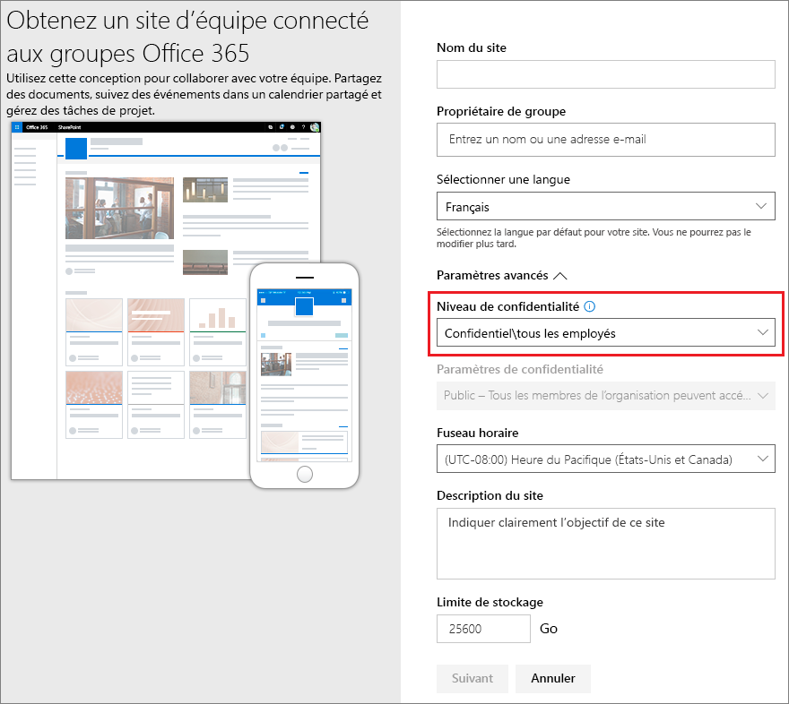
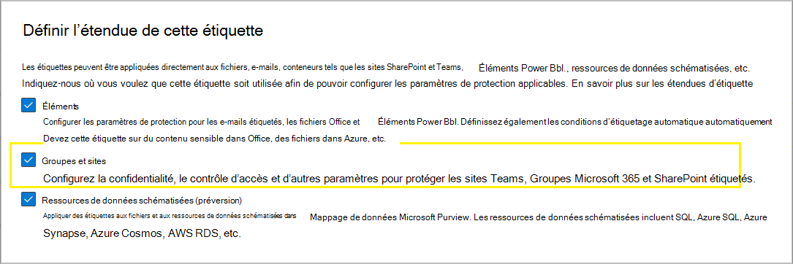
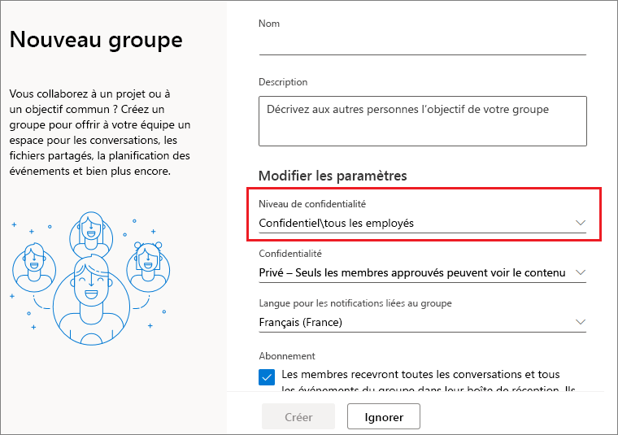
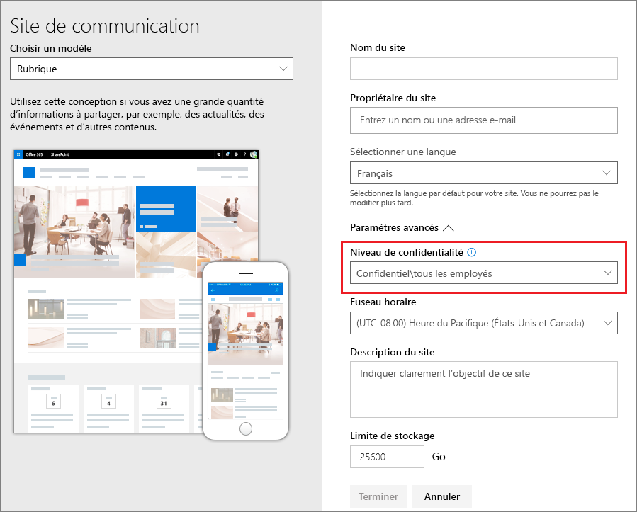

# <a name="use-sensitivity-labels-to-protect-content-in-microsoft-teams-microsoft-365-groups-and-sharepoint-sites"></a>Utiliser les étiquettes de confidentialité pour protéger le contenu dans Microsoft Teams, les Groupes Microsoft 365 et les sites SharePoint

>*[Guide de sécurité et conformité pour les licences Microsoft 365](/office365/servicedescriptions/microsoft-365-service-descriptions/microsoft-365-tenantlevel-services-licensing-guidance/microsoft-365-security-compliance-licensing-guidance).*

[!include[Purview banner](../includes/purview-rebrand-banner.md)]

Outre l’utilisation d' [étiquettes de confidentialité](sensitivity-labels.md) pour classifier et protéger les documents et les messages électroniques, vous pouvez également utiliser des étiquettes de confidentialité pour protéger du contenu dans les conteneurs suivants : sites Microsoft Teams, Microsoft 365 Groups ([anciennement les groupes Office 365](https://techcommunity.microsoft.com/t5/microsoft-365-blog/office-365-groups-will-become-microsoft-365-groups/ba-p/1303601)) et les sites Microsoft Office SharePoint Online. Pour cette protection au niveau du conteneur, utilisez les paramètres d’étiquettes suivants : 

- Confidentialité (privée ou publique) de sites Teams et groupes Microsoft 365
- Accès des utilisateurs externes
- Partage externe à partir des sites SharePoint
- Accès à partir d’appareils enregistrés
- Contextes d’authentification (en préversion)
- Lien de partage par défaut pour un site SharePoint (configuration PowerShell uniquement)
- En préversion : paramètres de partage de site (configuration PowerShell uniquement)

> [!IMPORTANT]
> Les paramètres pour les appareils non gérés et les contextes d’authentification fonctionnent conjointement avec l’accès conditionnel Azure Active Directory. Vous devez configurer cette fonctionnalité dépendante si vous souhaitez utiliser une étiquette de confidentialité pour ces paramètres. Des informations supplémentaires sont incluses dans les instructions qui suivent.

Lorsque vous appliquez cette étiquette de confidentialité à un conteneur pris en charge, l’étiquette applique automatiquement les paramètres de classification et de protection configurés au site ou au groupe.

Toutefois, le contenu de ces conteneurs n’hérite pas des étiquettes de la classification ni des paramètres pour les fichiers et e-mails, tels que les marques visuelles et le chiffrement. Pour que les utilisateurs puissent étiqueter leurs documents sur des sites SharePoint ou des sites d’équipe, assurez-vous que vous avez [activé les étiquettes de confidentialité pour les fichiers Office dans SharePoint et OneDrive](sensitivity-labels-sharepoint-onedrive-files.md).

## <a name="using-sensitivity-labels-for-microsoft-teams-microsoft-365-groups-and-sharepoint-sites"></a>Utilisation des étiquettes de confidentialité pour Microsoft Teams, les Groupes Microsoft 365 et les sites SharePoint

Avant d’activer les étiquettes de confidentialité pour les conteneurs et de configurer les étiquettes de confidentialité pour les nouveaux paramètres, les utilisateurs peuvent afficher et appliquer des étiquettes de confidentialité dans leurs applications. Par exemple, à partir de Word :


Une fois que vous avez activé et configuré des étiquettes de confidentialité pour les conteneurs, les utilisateurs peuvent également voir et appliquer des étiquettes de confidentialité aux sites d’équipe Microsoft, aux groupes Microsoft 365 et aux sites SharePoint. Par exemple, lorsque vous créez un nouveau site d’équipe à partir de SharePoint :



> [!NOTE]
> Les étiquettes de confidentialité pour les conteneurs prennent en charge les [canaux partagés Teams](/MicrosoftTeams/shared-channels), actuellement en préversion. Si une équipe a des canaux partagés, elle hérite automatiquement des paramètres d’étiquette de confidentialité de son équipe parente, et cette étiquette ne peut pas être supprimée ou remplacée par une autre étiquette.

## <a name="how-to-enable-sensitivity-labels-for-containers-and-synchronize-labels"></a>Comment activer les étiquettes de confidentialité pour les conteneurs et synchroniser les étiquettes

Si vous n’avez pas encore activé les étiquettes de confidentialité pour les conteneurs, vous devez suivre les étapes ci-après en tant que procédure une seule fois :

1. Cette fonctionnalité utilisant une fonctionnalité Azure Active Directory, suivez les instructions de la documentation Azure Active Directory pour activer la prise en charge des étiquettes de confidentialité : [Attribuer des étiquettes de confidentialité à des Groupes Microsoft 365 dans Azure Active Directory](/azure/active-directory/users-groups-roles/groups-assign-sensitivity-labels).

2. Vous devez à présent synchroniser vos étiquettes de confidentialité avec Azure AD. Tout d’abord, [connectez-vous à l’interface PowerShell du Centre de sécurité et conformité](/powershell/exchange/office-365-scc/connect-to-scc-powershell/connect-to-scc-powershell).

   Par exemple, dans une session PowerShell exécutée en tant qu’administrateur, connectez-vous à l’aide d’un compte d’administrateur général.

3. Exécutez ensuite la commande suivante afin de vous assurer que vos étiquettes de confidentialité peuvent être utilisées avec les groupes Microsoft 365 :

    ```powershell
    Execute-AzureAdLabelSync
    ```

## <a name="how-to-configure-groups-and-site-settings"></a>Comment configurer les paramètres de groupes et de sites

Une fois les étiquettes de confidentialité activées pour les conteneurs, comme décrit dans la section précédente, vous pouvez ensuite configurer les paramètres de protection pour les groupes et sites dans la configuration de l’étiquetage de niveau de confidentialité. Tant que les étiquettes de confidentialité ne sont pas activées pour les conteneurs, les paramètres sont visibles, mais vous ne pouvez pas les configurer.

1. Suivez les instructions générales pour [créer ou modifier une étiquette de confidentialité](create-sensitivity-labels.md#create-and-configure-sensitivity-labels) et assurez-vous de sélectionner **Groupes et sites** pour l’étendue de l’étiquette : 
    
    
    
    Lorsque seule l’étendue est sélectionnée pour l’étiquette, celle-ci ne s’affiche pas dans les applications Office qui prennent en charge les étiquettes de confidentialité et ne peuvent pas être appliquées aux fichiers et e-mails. La séparation des étiquettes peut être utile pour les utilisateurs et les administrateurs, mais peut également s’ajouter à la complexité de votre déploiement d’étiquettes.
    
    Par exemple, vous devez examiner soigneusement votre [classement d’étiquettes](sensitivity-labels.md#label-priority-order-matters), car SharePoint détecte tout document étiqueté chargé vers un site étiqueté. Dans ce scénario, nous générons automatiquement un événement d’audit et un e-mail lorsque l’étiquette de confidentialité présente une priorité supérieure à celle du site. Si vous souhaitez en savoir plus, veuillez consulter la section [Audit des activités d’étiquettes de confidentialité](#auditing-sensitivity-label-activities) sur cette page. 

2. Ensuite, sur la page **Définir les paramètres de protection pour les groupes et sites**, sélectionnez l’une des options suivantes ou les deux :
    
    - **Paramètres de confidentialité et d’accès des utilisateurs externes** pour configurer les paramètres **Confidentialité** et **Accès des utilisateurs externes**. 
    - **Paramètres de partage externe et d’accès conditionnel** pour configurer le paramètre **Contrôler le partage externe à partir de sites SharePoint étiquetés** et **Utiliser l’accès conditionnel Azure AD pour protéger les sites SharePoint étiquetés**.

3. Si vous avez sélectionné **Paramètres de confidentialité et d’accès des utilisateurs externes**, configurez désormais les paramètres suivants :
    
    - **Confidentialité** : conservez la valeur par défaut **Public** si vous souhaitez que tous les membres de votre organisation accèdent au site d’équipe ou au groupe auquel cette étiquette est appliquée.
        
        Sélectionnez **Privé** si vous voulez limiter l’accès aux seuls membres approuvés au sein de votre organisation.
        
        Sélectionnez **Aucun** si vous souhaitez protéger le contenu dans le conteneur à l’aide de l’étiquette de confidentialité, tout en laissant les utilisateurs configurer eux-même les paramètres de confidentialité.
        
        Les paramètres **Publique** ou **Privé** pour définir et verrouiller le paramètre de confidentialité lorsque vous appliquez cette étiquette au conteneur. Votre paramètre remplace le paramètre précédemment configuré pour l’équipe ou le groupe et verrouille la valeur de confidentialité afin qu’elle puisse être modifiée uniquement en supprimant d’abord l’étiquette de confidentialité du conteneur. Une fois l’étiquette de confidentialité supprimée, le paramètre de confidentialité de l’étiquette peut à nouveau être modifié par les utilisateurs.
    
    - **Accès des utilisateurs externes** : déterminez si le propriétaire du groupe peut [ajouter des invités au groupe](/office365/admin/create-groups/manage-guest-access-in-groups).

4. Si vous avez sélectionné les paramètres de partage externe et d’accès **conditionnel,** configurez maintenant les paramètres suivants :
    
    - **Contrôler le partage externe à partir de sites SharePoint étiquetés** : sélectionnez cette option pour ensuite sélectionner soit partage externe pour tout le monde, pour des invités nouveaux et existants, pour des invités existants ou pour les personnes de votre organisation uniquement. Pour plus d’informations sur cette configuration et sur les paramètres, consultez la documentation SharePoint [Activer ou désactiver le partage externe pour un site](/sharepoint/change-external-sharing-site).
    
    - **Utiliser l’accès conditionnel Azure AD pour protéger les sites Microsoft Office SharePoint Online étiquetés** : sélectionnez cette option uniquement si votre organisation a configuré et utilise l’[Azure Active Directory Domain Services](/azure/active-directory/conditional-access/overview) d’accès conditionnel. Sélectionnez ensuite l’un des paramètres suivants :
    
        - **Déterminer si les utilisateurs peuvent accéder à des sites SharePoint à partir d’appareils non gérés** : cette option utilise la fonctionnalité SharePoint qui utilise l’accès conditionnel Azure AD pour bloquer ou limiter l’accès aux contenus SharePoint et OneDrive provenant d’appareils non gérés. Pour plus d’informations, voir [Contrôler l’accès à partir des appareils non gérés](/sharepoint/control-access-from-unmanaged-devices) dans la documentation SharePoint. L’option spécifiée pour ce paramètre d’étiquette correspond à l’exécution d’une commande PowerShell pour un site, comme décrit dans les étapes 3 à 5 de la section [Bloquer ou limiter l’accès à un site SharePoint ou OneDrive spécifique](/sharepoint/control-access-from-unmanaged-devices#block-or-limit-access-to-a-specific-sharepoint-site-or-onedrive) des instructions de SharePoint.
            
            Pour plus d’informations sur la configuration, consultez [Plus d’informations sur les dépendances de l’option d’appareils non gérés](#more-information-about-the-dependencies-for-the-unmanaged-devices-option) à la fin de cette section.
            
        - **Choisir un contexte d’authentification existant** : actuellement en version préliminaire, cette option vous permet d’appliquer des conditions d’accès plus strictes lorsque les utilisateurs accèdent aux sites SharePoint sur lequel cette étiquette est appliquée. Ces conditions sont appliquées lorsque vous sélectionnez un contexte d’authentification existant qui a été créé et publié pour le déploiement de l’accès conditionnel de votre organisation. Si les utilisateurs ne respectent pas les conditions configurées ou s'ils utilisent des applications qui ne prennent pas en charge les contextes d'authentification, l'accès leur est refusé.
            
            Pour plus d’informations sur la configuration, consultez [Plus d’informations sur les dépendances de l’option de contexte d’authentification](#more-information-about-the-dependencies-for-the-authentication-context-option) à la fin de cette section.
            
            Exemples pour cette configuration d’étiquette :
            
             - Vous choisissez un contexte d'authentification qui est configuré de manière à nécessiter l’[Authentification multifacteur (MFA)](/azure/active-directory/conditional-access/untrusted-networks). Cette étiquette est ensuite appliquée à un site SharePoint qui contient des éléments hautement confidentiels. Par conséquent, lorsque les utilisateurs d'un réseau non sécurisé tentent d'accéder à un document sur ce site, ils voient apparaître l'invite MFA qu'ils doivent compléter avant de pouvoir accéder au document.
             
             - Vous choisissez un contexte d’authentification configuré pour les [stratégies de conditions d’utilisation (ToU)](/azure/active-directory/conditional-access/terms-of-use). Cette étiquette est ensuite appliquée à un site SharePoint qui contient des éléments nécessitant une acceptation des conditions d’utilisation pour des raisons juridiques ou de conformité. Par conséquent, lorsque les utilisateurs tentent d’accéder à un document de ce site, ils voient un document de conditions d’utilisation qu’ils doivent accepter avant de pouvoir accéder au document d’origine.

> [!IMPORTANT]
> Seuls ces paramètres de sites et de groupes prennent effet lorsque vous appliquez l’étiquette à une équipe, un groupe ou un site. Si l’[étendue de l’étiquette](sensitivity-labels.md#label-scopes) inclut des fichiers et e-mails, d’autres paramètres d’étiquette, tels que le chiffrement et le marquage de contenu, ne sont pas appliqués au contenu au sein de l’équipe, du groupe ou du site.

Si votre étiquette de confidentialité n’est pas encore publiée, publiez-la dès maintenant en [l’ajoutant à une stratégie d’étiquette de confidentialité](create-sensitivity-labels.md#publish-sensitivity-labels-by-creating-a-label-policy). Les utilisateurs auxquels sont assignés une stratégie d’étiquette de confidentialité incluant cette étiquette pourront la sélectionner pour des sites et des groupes.

##### <a name="more-information-about-the-dependencies-for-the-unmanaged-devices-option"></a>Informations supplémentaires sur les dépendances de l’option des appareils non gérés

Si vous ne configurez pas la stratégie d’accès conditionnel dépendante pour SharePoint comme décrit dans [Utiliser les restrictions appliquées par l’application](/sharepoint/app-enforced-restrictions), l’option spécifiée ici n’aura aucun effet. De plus, elle n’aura aucun effet si elle est moins restrictive qu’un paramètre configuré au niveau du client. Si vous avez configuré un paramètre à l’échelle de l’organisation pour les appareils non gérés, sélectionnez un paramètre d’étiquette identique ou plus restrictif.

Par exemple, si votre client est configuré pour **Autoriser un accès limité au web uniquement**, le paramètre d’étiquette qui autorise l’accès complet n’aura aucun effet, car il est moins restrictif. Pour ce paramètre de niveau client, sélectionnez le paramètre d’étiquette pour bloquer l’accès (plus restrictif) ou le paramètre d’étiquette pour un accès limité (identique au paramètre client).

Étant donné que vous pouvez configurer les paramètres de SharePoint séparément de la configuration d’étiquette, la procédure pour vérifier que les dépendances sont en place n’est pas effectuée dans la configuration des étiquettes de confidentialité. Ces dépendances peuvent être configurées une fois l’étiquette créée et publiée, et même une fois l’étiquette appliquée. Toutefois, si l’étiquette est déjà appliquée, le paramètre d’étiquette n’est appliqué qu’à la prochaine authentification de l’utilisateur.

##### <a name="more-information-about-the-dependencies-for-the-authentication-context-option"></a>Informations supplémentaires sur les dépendances pour l’option de contexte d’authentification

Pour s'afficher dans la liste déroulante de sélection, les contextes d'authentification doivent être créés, configurés et publiés dans le cadre de votre configuration Azure Active Directory Condition Access. Pour plus d’informations et d’instructions, voir la section [Configurer les contextes d’authentification](/azure/active-directory/conditional-access/concept-conditional-access-cloud-apps#configure-authentication-contexts) de la documentation Relative à l’accès conditionnel Azure AD.

Toutes les applications ne prennent pas en charge les contextes d'authentification. Si un utilisateur avec une application non prise en charge se connecte au site qui est configuré pour un contexte d'authentification, un message de refus d'accès s'affiche ou bien il est invité à s'authentifier mais sa demande est rejetée. Les applications qui prennent actuellement en charge les contextes d'authentification :

- Office pour le web, qui inclut Outlook pour le web

- Microsoft Teams pour Windows et macOS (exclut l’application web Teams)

- Microsoft Planner

- Microsoft 365 Apps pour Word, Excel et PowerPoint ; versions minimales :
    - Windows : 2103
    - macOS0: 16.45.1202
    - iOS : 2.48.303
    - Android : 16.0.13924.10000

- Microsoft 365 Apps pour Outlook versions minimales :
    - Windows : 2103
    - macOS0: 16.45.1202
    - iOS : 4.2109.0
    - Android : 4.2025.1

- Application de synchronisation OneDrive, versions minimales :
    - Windows : 21.002
    - macOS : 21.002
    - iOS : déploiement dans la mise à jour 12.30
    - Android : pas encore pris en charge

Restrictions connues pour cette version préliminaire :

- Pour l'application de synchronisation OneDrive, prise en charge pour OneDrive uniquement et non pour les autres sites.

- Les fonctionnalités et applications suivantes peuvent être incompatibles avec les contextes d'authentification. Nous vous encourageons donc à vérifier qu'elles continuent de fonctionner après qu'un utilisateur ait réussi à accéder à un site en utilisant un contexte d'authentification :
    
    - Flux de travail qui utilisent Power Apps ou Power Automate
    - Applications tierces

### <a name="configure-settings-for-the-default-sharing-link-type-for-a-site-by-using-powershell-advanced-settings"></a>Configurer les paramètres du type de lien de partage par défaut pour un site à l’aide de paramètres avancés PowerShell

En plus des paramètres d'étiquette pour les sites et les groupes que vous pouvez configurer à partir du portail de conformité Microsoft Purview, vous pouvez également configurer le type de lien de partage par défaut pour un site. Les étiquettes de confidentialité des documents peuvent également être configurées pour un type de lien de partage par défaut. Ces paramètres qui permettent d’empêcher le sur-partage sont automatiquement sélectionnés lorsque les utilisateurs sélectionnent le bouton **Partager** dans leurs applications Office. 

Pour plus d’informations et d’instructions, consultez [Utiliser des étiquettes de confidentialité pour configurer le type de lien de partage par défaut pour les sites et les documents dans SharePoint et OneDrive](sensitivity-labels-default-sharing-link.md).

### <a name="configure-site-sharing-permissions-by-using-powershell-advanced-settings"></a>Configurer les autorisations de partage de site à l’aide des paramètres avancés de PowerShell

> [!NOTE]
> Ce paramètre d’étiquette est actuellement en préversion.

Un autre paramètre avancé de PowerShell que vous pouvez configurer pour l’étiquette de sensibilité à appliquer à un site SharePoint est **MembersCanShare**. Ce paramètre est la configuration équivalente que vous pouvez définir à partir du Centre d’administration SharePoint > **Autorisations du site** > **Partage de site** > **Modifier les modalités de partage par les membres** > **Autorisations de partage**. 

Les trois options sont répertoriées avec les valeurs équivalentes pour le paramètre avancé PowerShell **MembersCanShare** :

|Option depuis le centre d’administration SharePoint |Valeur PowerShell équivalente pour MembersCanShare |
|----------------------------------------|------------------------------------------------|
|**Les propriétaires et les membres du site peuvent partager des fichiers, des dossiers et le site. Les personnes ayant des autorisations d’édition peuvent partager des fichiers et des dossiers.**| MemberShareAll|
|**Les propriétaires et les membres du site, et les personnes ayant des autorisations d’édition peuvent partager des fichiers et des dossiers, mais seuls les propriétaires de site peuvent partager le site.**|MemberShareFileAndFolder|
|**Seuls les propriétaires de site peuvent partager des fichiers, des dossiers et le site.**|MemberShareNone|

Pour plus d’informations sur ces options de configuration, voir [Modifier les modalités de partage par les membres](/microsoft-365/community/sharepoint-security-a-team-effort#change-how-members-can-share) à partir de la documentation de la communauté SharePoint.

Exemple, où le GUID de l’étiquette de sensibilité est **8faca7b8-8d20-48a3-8ea2-0f96310a848e** :

````powershell
Set-Label -Identity 8faca7b8-8d20-48a3-8ea2-0f96310a848e -AdvancedSettings @{MembersCanShare="MemberShareNone"}
````

Pour plus d’informations sur la spécification des paramètres avancés de PowerShell, consultez [Conseils PowerShell pour la spécification des paramètres avancés](sensitivity-labels-default-sharing-link.md#powershell-tips-for-specifying-the-advanced-settings).

## <a name="sensitivity-label-management"></a>Gestion des étiquettes de confidentialité

Utilisez les instructions suivantes pour créer, modifier ou supprimer des étiquettes de confidentialité configurées pour les sites et les groupes.

### <a name="creating-and-publishing-labels-that-are-configured-for-sites-and-groups"></a>Créer et publier des étiquettes configurées pour les sites et les groupes

Utilisez les instructions suivantes pour publier une étiquette pour vos utilisateurs lorsque cette étiquette est configurée pour les paramètres de site et de groupe :

1. Une fois que vous avez créé et configuré l’étiquette de confidentialité, ajoutez cette étiquette à une stratégie d’étiquette qui s’applique uniquement à quelques utilisateurs de test.

2. Patientez pendant la réplication de la modification :
    
   - Nouvelle étiquette : attendez au moins une heure.
   - Étiquette existante : attendez au moins 24 heures.
    
    Pour plus d’informations sur le minutage des étiquettes, consultez [Quand s’attendre à ce que les nouvelles étiquettes et modifications prennent effet](create-sensitivity-labels.md#when-to-expect-new-labels-and-changes-to-take-effect).

3. Au terme de ce délai d’attente, utilisez l’un des comptes d’utilisateur de test pour créer une équipe, un groupe Microsoft 365 ou un site SharePoint avec l’étiquette que vous avez créée à l’étape 1.

4. S’il n’y a pas d’erreur pendant cette opération de création, vous savez qu’il est possible de publier l’étiquette sur tous les utilisateurs de votre client.

### <a name="modifying-published-labels-that-are-configured-for-sites-and-groups"></a>Modification des étiquettes publiées configurées pour les sites et les groupes

Nous vous recommandons de ne pas modifier les paramètres du site et du groupe pour une étiquette de confidentialité une fois l’étiquette appliquée aux équipes, aux groupes ou aux sites. Si vous le faites, n’oubliez pas de patienter pendant 24 heures pour que les modifications se répliquent dans tous les conteneurs auxquels l’étiquette est appliquée.

De plus, si vos modifications incluent les **l’accès des utilisateurs externes** paramètre :

- Le nouveau paramètre s’applique aux nouveaux utilisateurs, mais pas aux utilisateurs existants. Par exemple, si ce paramètre a été préalablement sélectionné et, par conséquent, les utilisateurs invités ont accédé au site, ceux-ci peuvent continuer à accéder au site une fois ce paramètre désactivé dans la configuration d’étiquette.

- Les paramètres de confidentialité des propriétés de groupe hiddenMembership et roleEnabled ne sont pas mis à jour.

### <a name="deleting-published-labels-that-are-configured-for-sites-and-groups"></a>Suppression des étiquettes publiées configurées pour les sites et les groupes

Si vous supprimez une étiquette de confidentialité dont les paramètres de site et de groupe sont activés et que cette étiquette est incluse dans une ou plusieurs stratégies d’étiquette, cette action peut entraîner des problèmes de création pour les nouvelles équipes, les groupes et les sites. Pour éviter cette situation, suivez les instructions suivantes :

1. Supprimez l’étiquette de confidentialité de toutes les stratégies d’étiquette qui incluent l’étiquette.

2. Attendez au moins une heure.

3. Après cette période d’attente, essayez de créer une équipe, un groupe ou un site et confirmez que l’étiquette n’est plus visible.

4. Si l’étiquette de confidentialité n’est pas visible, vous pouvez désormais supprimer l’étiquette en toute sécurité.

## <a name="how-to-apply-sensitivity-labels-to-containers"></a>Comment appliquer des étiquettes de confidentialité aux conteneurs

Vous êtes maintenant prêt à appliquer les étiquettes ou étiquettes de confidentialité aux conteneurs suivants :

- [Groupe Microsoft 365 dans Azure AD](#apply-sensitivity-labels-to-microsoft-365-groups)
- [Site d’équipe Microsoft teams](#apply-a-sensitivity-label-to-a-new-team)
- [Groupe Microsoft 365 dans Outlook sur le Web](#apply-a-sensitivity-label-to-a-new-group-in-outlook-on-the-web)
- [Site SharePoint](#apply-a-sensitivity-label-to-a-new-site)

Vous pouvez utiliser PowerShell Si vous devez [appliquer une étiquette de confidentialité à plusieurs sites](#use-powershell-to-apply-a-sensitivity-label-to-multiple-sites).

### <a name="apply-sensitivity-labels-to-microsoft-365-groups"></a>Appliquer des étiquettes de confidentialité à des groupes Microsoft 365

Vous êtes désormais prêt à appliquer une ou plusieurs étiquettes de confidentialité à des Groupes Microsoft 365. Revenez à la documentation Azure Active Directory pour les instructions suivantes :

- [Attribuer une étiquette à un nouveau groupe dans le Portail Azure](/azure/active-directory/users-groups-roles/groups-assign-sensitivity-labels#assign-a-label-to-a-new-group-in-azure-portal)

- [Attribuer une étiquette à un groupe existant dans le Portail Azure](/azure/active-directory/users-groups-roles/groups-assign-sensitivity-labels#assign-a-label-to-an-existing-group-in-azure-portal)

- [Supprimer une étiquette dans un groupe existant dans le Portail Azure](/azure/active-directory/users-groups-roles/groups-assign-sensitivity-labels#remove-a-label-from-an-existing-group-in-azure-portal).

### <a name="apply-a-sensitivity-label-to-a-new-team"></a>Appliquez une étiquette de confidentialité à une nouvelle équipe

Les utilisateurs peuvent sélectionner des étiquettes de confidentialité lorsqu’ils créent des équipes dans Microsoft Teams. Lorsqu’ils sélectionnent l’étiquette dans la liste déroulante **Confidentialité**, le paramètre de confidentialité peut être modifié pour refléter la configuration de l’étiquette. Selon le paramètre d’accès pour les utilisateurs externes que vous avez sélectionné pour l’étiquette, les utilisateurs peuvent ajouter ou non des personnes extérieures à l’organisation.

[En savoir plus sur les étiquettes de niveau de confidentialité pour Teams](/microsoftteams/sensitivity-labels)


Une fois l’équipe créée, l’étiquette de confidentialité s’affiche dans le coin supérieur droit de tous les canaux.


Le service applique automatiquement la même étiquette de confidentialité au groupe Microsoft 365 et au site d’équipe SharePoint connecté.

### <a name="apply-a-sensitivity-label-to-a-new-group-in-outlook-on-the-web"></a>Appliquez une étiquette de confidentialité à un nouveau groupe dans Outlook sur le web

Dans Outlook sur le web, lorsque vous créez un groupe, vous pouvez sélectionner ou modifier l’option de **Confidentialité** pour les étiquettes publiées :



### <a name="apply-a-sensitivity-label-to-a-new-site"></a>Appliquez une étiquette de confidentialité à un nouveau site

Les administrateurs et les utilisateurs finaux peuvent sélectionner des étiquettes de confidentialité lorsqu’ils [créent des sites d’équipe et des sites de communication modernes](/sharepoint/create-site-collection), et développent les **Paramètres avancés** :



La liste déroulante affiche les noms d’étiquette pour la sélection, et l’icône d’aide affiche tous les noms d’étiquette avec leur info-bulle, ce qui peut aider les utilisateurs à déterminer l’étiquette correcte à appliquer.

Lorsque l’étiquette est appliquée et que les utilisateurs accèdent au site, ils voient le nom de l’étiquette et les stratégies appliquées. Par exemple, ce site est étiqueté comme **confidentiel** et le paramètre de confidentialité est défini sur **privé** :


### <a name="use-powershell-to-apply-a-sensitivity-label-to-multiple-sites"></a>Utiliser PowerShell pour appliquer une étiquette de confidentialité à plusieurs sites

Vous pouvez utiliser l’applet de commande [Set-SPOSite](/powershell/module/sharepoint-online/set-sposite) et [Set-SPOTenant a](/powershell/module/sharepoint-online/set-spotenant) avec le paramètre *SensitivityLabel* à partir de l’instance en cours de [Microsoft Office SharePoint Online Management Shell](/powershell/sharepoint/sharepoint-online/connect-sharepoint-online) actuel pour appliquer une étiquette de confidentialité à de nombreux sites.Les sites peuvent être n’importe quelle collection de sites Microsoft Office SharePoint Online ou un site OneDrive.

Vérifiez que vous disposez de la version 16.0.19418.12000 ou ultérieure de SharePoint Online Management Shell.

1. Ouvrez une session PowerShell avec l’option **Exécuter en tant qu’administrateur** .

2. Si vous ne connaissez pas votre GUID d’étiquette : [connectez-vous à l’interface PowerShell du Centre de sécurité et conformité Office 365](/powershell/exchange/connect-to-scc-powershell) et obtenez la liste des étiquettes de confidentialité et leurs GUID.

   ```powershell
   Get-Label |ft Name, Guid
   ```

3. À présent, [connectez-vous Microsoft Office SharePoint Online PowerShell](/powershell/sharepoint/sharepoint-online/connect-sharepoint-online) et stockez votre GUID d’étiquette en tant que variable.Par exemple :

   ```powershell
   $Id = [GUID]("e48058ea-98e8-4940-8db0-ba1310fd955e")
   ```

4. Créez une variable qui identifie plusieurs sites qui ont une chaîne d’identification en commun dans leur URL. Par exemple :

   ```powershell
   $sites = Get-SPOSite -IncludePersonalSite $true -Limit all -Filter "Url -like 'documents"
   ```

5. Exécutez la commande suivante pour appliquer l’étiquette à ces sites. À l’aide de nos exemples :

   ```powershell
   $sites | ForEach-Object {Set-SPOTenant $_.url -SensitivityLabel $Id}
   ```

Cette série de commandes vous permet d’étiqueter plusieurs sites de votre client avec la même étiquette de confidentialité. C’est pourquoi vous utilisez la cmdlet Set-SPOTenant, plutôt que la cmdlet Set-SPOSite qui est destinée à la configuration par site. Utilisez toutefois la cmdlet Set-SPOSite lorsque vous devez appliquer une autre étiquette à des sites spécifiques en répétant la commande suivante pour chacun de ces sites : `Set-SPOSite -Identity <URL> -SensitivityLabel "<labelguid>"`

## <a name="view-and-manage-sensitivity-labels-in-the-sharepoint-admin-center"></a>Afficher et gérer les étiquettes de confidentialité dans le Centre d’administration SharePoint

Pour afficher, trier et rechercher les étiquettes de confidentialité appliquées, utilisez <a href="https://go.microsoft.com/fwlink/?linkid=2185220" target="_blank">**Sites actifs**</a> dans le nouveau Centre d’administration SharePoint. Vous devrez peut-être d’abord ajouter la colonne de **Confidentialité**:


Pour plus d’informations sur la gestion des sites à partir de la page sites actifs, y compris l’ajout d’une colonne, voir [Gérer les sites dans le nouveau centre d’administration SharePoint](/sharepoint/manage-sites-in-new-admin-center).

Vous pouvez également modifier et appliquer une étiquette à partir de cette page :

1. Sélectionnez sur le nom du site pour ouvrir le volet de détails.

2. Sélectionnez l’onglet **Stratégies**, puis sélectionnez **Modifier** pour le paramètre **Sensibilité**.

3. Dans le volet **Modifier le paramètre de sensibilité**, sélectionnez l’étiquette de sensibilité que vous souhaitez appliquer au site. Contrairement aux applications utilisateur, où les étiquettes de sensibilité peuvent être attribuées à des utilisateurs spécifiques, le centre d’administration affiche toutes les étiquettes de niveau de sensibilité pour votre client. Une fois que vous avez choisi une étiquette, sélectionnez **Enregistrer**.

## <a name="support-for-sensitivity-labels"></a>Prise en charge des étiquettes de confidentialité

Lorsque vous utilisez des centres d’administration qui prennent en charge les étiquettes de confidentialité, à l’exception du portail Azure Active Directory, vous pouvez afficher toutes les étiquettes de confidentialité de votre client. En comparaison, les applications utilisateur et les services qui filtrent les étiquettes de confidentialité en fonction des stratégies de publication peuvent vous faire voir un sous-ensemble de ces étiquettes. Le portail Azure Active Directory filtre également les étiquettes en fonction des stratégies de publication.

Les applications et services suivants prennent en charge les étiquettes de confidentialité configurées pour les sites et les paramètres de groupe :

- Centres d’administrations :

  - Centre d’administration SharePoint
  - Centre d’administration Microsoft Teams
  - Centre d’administration Microsoft 365
  - Portail de conformité Microsoft Purview

- Utiliser les applications et services :

  - SharePoint
  - Équipes
  - Outlook sur le Web et pour Windows, macOS, iOS et Android
  - Formulaires
  - Flux
  - Planificateur 

Les applications et services suivants ne prennent actuellement pas en charge les étiquettes de sensibilité configurées pour les sites et les paramètres de groupe :

- Centres d’administrations :

  - Centre d’administration Exchange

- Utiliser les applications et services :

  - Dynamics 365
  - Yammer
  - Project
  - Power BI

## <a name="classic-azure-ad-group-classification"></a>Classification classique de groupes Azure Active Directory

Une fois que vous avez activé les étiquettes de niveau de sensibilité pour les conteneurs, les classifications de groupe d’Azure AD ne sont plus pris en charge par Microsoft 365 et ne s’affichent pas sur les sites qui prennent en charge des étiquettes de sensibilité. Toutefois, vous pouvez convertir vos anciennes classifications en étiquettes de confidentialité.

Pour consulter un exemple de la manière dont vous avez peut-être utilisé l’ancienne classification de groupe pour SharePoint, consultez la page [Classification des sites SharePoint « modernes »](/sharepoint/dev/solution-guidance/modern-experience-site-classification).

Ces classifications ont été configurées à l’aide d’Azure AD PowerShell ou de la bibliothèque principale PnP et par définition de valeurs pour le paramètre `ClassificationList`. Si votre client a défini des valeurs de classification, celles-ci s’affichent lorsque vous exécutez la commande suivante à partir du [module AzureADPreview PowerShell](https://www.powershellgallery.com/packages/AzureADPreview) :

```powershell
($setting["ClassificationList"])
```

Pour convertir vos anciennes classifications en étiquettes de confidentialité, réalisez l’une des opérations suivantes :

- Utiliser des étiquettes existantes : spécifiez les paramètres d’étiquette souhaités pour des sites et des groupes en modifiant les étiquettes de confidentialité de diffusion existantes déjà publiées.

- Créer des étiquettes : spécifiez les paramètres d’étiquette souhaités pour des sites et des groupes en créant et en publiant des étiquettes de confidentialité portant les mêmes noms que vos classifications existantes.

Ensuite :

1. Utilisez PowerShell pour appliquer les étiquettes de confidentialité aux groupes Microsoft 365 et sites SharePoint existants à l’aide du mappage de noms. Pour connaître les instructions, reportez-vous à la section suivante.

2. Supprimez les anciennes classifications dans les groupes et sites existants.

Bien que vous ne puissiez pas empêcher les utilisateurs de créer des groupes dans les applications et les services qui ne prennent pas encore en charge les étiquettes de confidentialité, vous pouvez exécuter un script PowerShell récurrent recherchant les nouveaux groupes créés par des utilisateurs à l’aide des anciennes classifications et les convertir pour utiliser des étiquettes de confidentialité.

Pour vous aider à gérer la coexistence des étiquettes de confidentialité et des classifications Azure AD pour les sites et les groupes, voir [étiquettes de confidentialité et de classification Azure Active Directory pour les groupes Microsoft 365](migrate-aad-classification-sensitivity-labels.md).

### <a name="use-powershell-to-convert-classifications-for-microsoft-365-groups-to-sensitivity-labels"></a>Utilisez PowerShell pour convertir des classifications de Groupes Microsoft 365 en étiquettes de confidentialité

1. Tout d’abord, [connectez-vous à l’interface PowerShell du Centre de sécurité et conformité](/powershell/exchange/office-365-scc/connect-to-scc-powershell/connect-to-scc-powershell).

   Par exemple, dans une session PowerShell exécutée en tant qu’administrateur, connectez-vous à l’aide d’un compte d’administrateur général :

2. Obtenez la liste des étiquettes de confidentialité et leurs GUID à l’aide de l’applet de commande [Get-Label](/powershell/module/exchange/get-label) :

   ```powershell
   Get-Label |ft Name, Guid
   ```

3. Notez les GUID des étiquettes de confidentialité que vous voulez appliquer à vos Groupes Microsoft 365.

4. À présent, [connectez-vous à Exchange Online PowerShell](/powershell/exchange/connect-to-exchange-online-powershell) dans une fenêtre Windows PowerShell distincte.

5. Utilisez la commande suivante en tant qu’exemple pour obtenir la liste des groupes qui ont actuellement la classification « Général » :

   ```PowerShell
   $Groups= Get-UnifiedGroup | Where {$_.classification -eq "General"}
   ```

6. Pour chaque groupe, ajoutez la nouvelle étiquette de confidentialité GUID. Par exemple :

    ```PowerShell
    foreach ($g in $groups)
    {Set-UnifiedGroup -Identity $g.Identity -SensitivityLabelId "457fa763-7c59-461c-b402-ad1ac6b703cc"}
    ```

7. Répétez les étapes 5 et 6 pour les classifications de groupe restantes.

## <a name="auditing-sensitivity-label-activities"></a>Audit sur les activités des étiquettes de confidentialité

> [!IMPORTANT]
> Si vous utilisez la séparation des étiquettes en sélectionnant uniquement l’étendue **Groupes et sites** pour les étiquettes qui protègent les conteneurs : en raison de la **non-concordance de la sensibilité au document détectée** des événements d’audit et des e-mails décrite dans cette section, envisagez de [classer ces étiquettes](sensitivity-labels.md#label-priority-order-matters) avant celles qui ont une étendue pour **Fichiers et e-mails**. 

Si un utilisateur télécharge un document sur un site protégé par une étiquette de confidentialité et son document comporte une étiquette de confidentialité [plus élevée](sensitivity-labels.md#label-priority-order-matters) que celle du site, cette action n’est pas bloquée. Par exemple, vous avez appliqué l’étiquette **Général** à un site SharePoint, et une personne télécharge un document étiqueté comme **Confidentiel**. Une étiquette de confidentialité ayant une priorité plus élevée identifie un contenu plus sensible qu’un contenu présentant un ordre de priorité plus faible, cette situation peut devenir un problème de sécurité.

Bien que l’action ne soit pas bloquée, elle est auditée et par défaut, génère automatiquement un courrier électronique à la personne qui a chargé le document et à l’administrateur du site. Par conséquent, l’utilisateur et les administrateurs peuvent identifier les documents comportant un mauvais alignement de la priorité d’étiquette et prendre des mesures, le cas échéant. Par exemple, supprimer ou déplacer le document téléchargé à partir du site.

Il ne s’agit pas d’un problème de sécurité si le document comprend une étiquette de confidentialité de priorité inférieure à celle appliquée sur le site. Par exemple, un document marqué **Général** est téléchargé sur un site intitulé **Confidentiel**. Dans ce scénario, l’événement d’audit et l’e-mail ne sont pas générés.

> [!NOTE]
> Comme pour l’option de stratégie qui exige que les utilisateurs fournissent une justification pour changer une étiquette vers une classification inférieure, les sous-étiquettes pour la même étiquette parente sont toutes considérées comme ayant la même priorité.

Pour rechercher le journal d’audit pour cet événement, recherchez **Correspondance incorrecte des documents détectés** dans la catégorie **Activités de fichiers et de pages**.

Le message électronique généré automatiquement a l’objet **Étiquette de confidentialité incompatible détectée** et que le courrier électronique décrit l’incompatibilité entre les étiquettes avec un lien vers le document et le site téléchargés. Il contient également un lien vers la documentation expliquant comment les utilisateurs peuvent modifier l’étiquette de confidentialité. Ces e-mails automatisés ne peuvent pas être personnalisés, mais vous pouvez les empêcher d’être envoyés lorsque vous utilisez la commande PowerShell suivante à partir de [Set-SPOTenant](/powershell/module/sharepoint-online/set-spotenant) :

```PowerShell
Set-SPOTenant -BlockSendLabelMismatchEmail $True
```

Lorsque quelqu’une personne ajoute ou supprime une étiquette de sensibilité sur ou à partir d’un site ou d’un groupe, ces activités sont également auditées, mais l’e-mail n’est pas généré automatiquement.

Ces événements d’audit peuvent être consultés dans la catégorie [Activités des d’étiquette de confidentialité](search-the-audit-log-in-security-and-compliance.md#sensitivity-label-activities). Pour obtenir des instructions sur les recherches dans un journal d’audit, consultez [Effectuer des recherches dans le journal d’audit du Centre de sécurité et conformité](search-the-audit-log-in-security-and-compliance.md).

## <a name="how-to-disable-sensitivity-labels-for-containers"></a>Comment désactiver les étiquettes de confidentialité pour les conteneurs

Vous pouvez désactiver les étiquettes de confidentialité pour Microsoft Teams, les groupes Microsoft 365 et les sites SharePoint en suivant les mêmes instructions de [Activer la prise en charge des étiquettes de confidentialité dans PowerShell](/azure/active-directory/users-groups-roles/groups-assign-sensitivity-labels#enable-sensitivity-label-support-in-powershell). Toutefois, pour désactiver la fonctionnalité, à l’étape 5, spécifiez `$setting["EnableMIPLabels"] = "False"`.

En plus de rendre indisponible l’ensemble des paramètres pour les groupes et les sites lorsque vous créez ou modifiez des étiquettes de confidentialité, cette action rétablit la propriété utilisée par les conteneurs pour leur configuration. Activer les étiquettes de confidentialité pour Microsoft Teams, les groupes Microsoft 365 et les sites SharePoint change la propriété utilisée à partir de **Classification** (utilisé pour [Classification de groupe Azure AD](#classic-azure-ad-group-classification)) pour **Sensibilité**. Lorsque vous désactivez les étiquettes de confidentialité pour les conteneurs, les conteneurs ignorent la propriété de Sensibilité et réutilisent la propriété de classification.

Cela signifie que les paramètres d’étiquette de sites et de groupes précédemment appliqués aux conteneurs ne sont pas appliqués et les conteneurs n’affichent plus les étiquettes.

Si ces conteneurs ont des valeurs de classification Azure AD qui leur sont appliquées, les conteneurs réactivent l’utilisation des classifications. N’oubliez pas que les nouveaux sites ou groupes créés après l’activation de la fonctionnalité n’affichent pas d’étiquette ou de classification. Pour ces conteneurs et les nouveaux conteneurs, vous pouvez désormais appliquer des valeurs de classification. Pour plus d’informations, voir [SharePoint « modern » de la classification de sites](/sharepoint/dev/solution-guidance/modern-experience-site-classification) et [Créer des classifications pour les groupes Office dans votre organisation](../enterprise/manage-microsoft-365-groups-with-powershell.md).

## <a name="additional-resources"></a>Ressources supplémentaires

Regardez l’enregistrement du webinaire et les questions traitées pour [Utilisation d’étiquettes de confidentialité avec Microsoft Teams, les groupes Office 365 et les sites SharePoint Online](https://techcommunity.microsoft.com/t5/security-privacy-and-compliance/using-sensitivity-labels-with-microsoft-teams-o365-groups-and/ba-p/1221885#M1380).

Ce webinaire a été enregistré lorsque la fonctionnalité était en version aperçu. vous remarquerez peut-être quelques différences dans l’interface utilisateur. Toutefois, les informations relatives à cette fonctionnalité sont encore précises, avec toutes les nouvelles fonctionnalités documentées sur cette page.

Pour plus d’informations sur la gestion des sites connectés et des sites de canaux Teams, consultez [Gérer les sites connectés Teams et les sites de canal](/SharePoint/teams-connected-sites).
