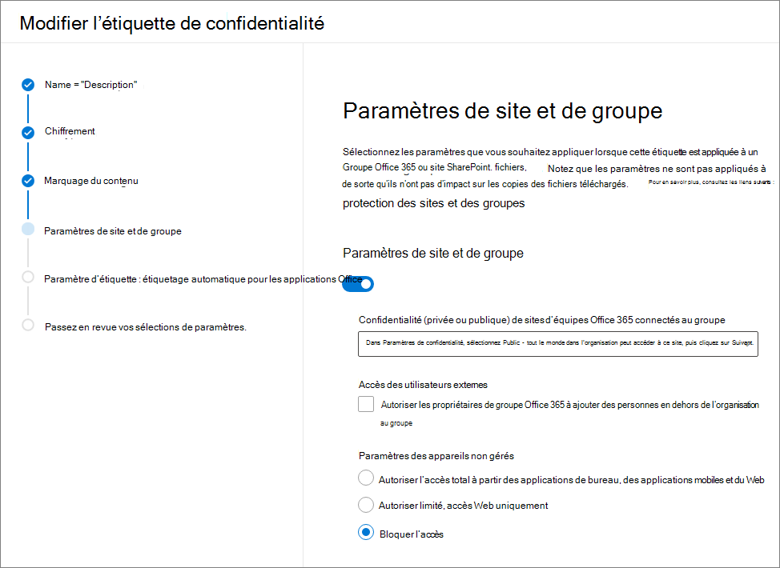

# <a name="use-sensitivity-labels-with-microsoft-teams-office-365-groups-and-sharepoint-sites-public-preview"></a>Utiliser des étiquettes de confidentialité avec Microsoft Teams, les groupes Office 365 et les sites SharePoint (préversion publique)

Lorsque vous créez des étiquettes de confidentialité dans le [Centre de conformité Microsoft 365](https://protection.office.com/), vous pouvez désormais les appliquer à Microsoft Teams, aux groupes Office 365 et aux sites SharePoint. Vous pouvez associer les stratégies aux étiquettes pour contrôler :

- Paramètres publics/privés
- Accès invité
- Accès à partir d’appareils enregistrés

Lorsque vous appliquez une étiquette à une équipe ou à un groupe, celle-ci s’applique automatiquement au site d’équipe SharePoint connecté et inversement.

Vous pouvez désormais activer les étiquettes de confidentialité pour les fichiers Office dans SharePoint et OneDrive. Pour en savoir plus, consulter [Activer les étiquettes de confidentialité pour les fichiers Office dans SharePoint et OneDrive (préversion publique)](sensitivity-labels-sharepoint-onedrive-files.md).

## <a name="about-the-public-preview-for-microsoft-teams-office-365-groups-and-sharepoint-sites"></a>À propos de la préversion publique Microsoft Teams, les groupes Office 365 et les sites SharePoint

Les étiquettes de confidentialité pour Microsoft Teams, les groupes Office 365 et les sites SharePoint sont progressivement déployés pour les locataires, et peuvent changer avant la publication finale.

Cette préversion publique ne fonctionne pas avec les réseaux de distribution de contenu Office 365 (CDN).

## <a name="overview"></a>Vue d’ensemble

Lorsque vous publiez des étiquettes de confidentialité, les utilisateurs dans Office 365 ont accès à la même liste d’étiquettes.

Ces images présentent les éléments suivants :

- Affichage de la liste lorsque vous créez un site d’équipe à partir de SharePoint

- Lorsque vous affichez la liste dans Word

Par exemple :


## <a name="enable-this-preview"></a>Activer ce préversion

Vous devez utiliser la version d’évaluation d’[Azure Active Directory PowerShell pour Graph (AzureAD)](https://docs.microsoft.com/powershell/azure/active-directory/overview?view=azureadps-2.0) (nom de module **AzureADPreview**) pour activer cette préversion des étiquettes de confidentialité avec Microsoft Teams, les groupes Office 365 et les sites SharePoint :

- Si vous n’avez jamais installé une version du module Azure AD PowerShell, consultez [l’installation du module Azure AD](https://docs.microsoft.com/powershell/azure/active-directory/install-adv2?view=azureadps-2.0-preview#installing-the-azure-ad-module) et suivez les instructions d’installation de la préversion publique.

- Si la version générale 2.0 du module Azure AD PowerShell (AzureAD) est installée sur votre ordinateur, vous devez la désinstaller en exécutant `Uninstall-Module AzureAD` dans votre session PowerShell, puis installer la préversion en exécutant `Install-Module AzureADPreview`.

- Si vous avez déjà installé lapréversion, exécutez `Install-Module AzureADPreview` pour vous assurer qu’il s’agit de la dernière version de ce module.

Vous êtes maintenant prêt à activer la préversion des étiquettes de confidentialité avec Microsoft Teams, les groupes Office 365 et les sites SharePoint :

1. Dans une session PowerShell, l’utilisation d’un compte professionnel ou scolaire disposant de privilèges d’administrateur général se connecte à Azure Active Directory. Par exemple, exécutez :
    
    ```powershell
    Connect-AzureAD
    ````
    
    Pour obtenir des instructions complètes, consultez[Se connecter à Azure AD](https://docs.microsoft.com/powershell/azure/active-directory/install-adv2?view=azureadps-2.0-preview#connect-to-azure-ad).

2. Exécutez les commandes suivantes :
    
    ```powershell
    $setting=(Get-AzureADDirectorySetting | where -Property DisplayName -Value "Group.Unified" -EQ)
    if ($setting -eq $null)
    {
    $template = Get-AzureADDirectorySettingTemplate -Id 62375ab9-6b52-47ed-826b-58e47e0e304b
    $setting = $template.CreateDirectorySetting()
    $setting["EnableMIPLabels"] = "True"
    New-AzureADDirectorySetting -DirectorySetting $setting
    }
    else
    {
    $setting["EnableMIPLabels"] = "True"
    Set-AzureADDirectorySetting -Id $setting.Id -DirectorySetting $setting
    }
    ```
    
    > [!NOTE]
    > Office 365 n’utilise plus les anciennes classifications pour les nouveaux groupes et les sites SharePoint lorsque vous activez cette préversion. Si vous avez utilisé [Classification de sites Azure AD](/sharepoint/dev/solution-guidance/modern-experience-site-classification) ($setting ["ClassificationList"]), les groupes et sites existants affichent encore les anciennes classifications. Pour afficher les nouvelles classifications, convertissez-les. Si vous souhaitez plus en savoir sur la manière de les convertir, consultez[Si vous avez utilisé la classification classique du site Microsoft Azure Active Directory](#if-you-used-classic-azure-ad-site-classification). 

3. Dans la même session PowerShell, connectez-vous désormais au Centre de sécurité et de conformité à l’aide d’un compte professionnel ou scolaire disposant de privilèges d’administrateur général. Pour obtenir des instructions, veuillez consulter [Se connecter au Centre de sécurité et conformité Office 365 PowerShell](/powershell/exchange/office-365-scc/connect-to-scc-powershell/connect-to-scc-powershell).

4. Exécutez les commandes suivantes pour synchroniser vos étiquettes avec Azure AD afin de pouvoir les utiliser avec des groupes Office 365 :
    
    ```powershell
    Set-ExecutionPolicy RemoteSigned
    $UserCredential = Get-Credential
    $Session = New-PSSession -ConfigurationName Microsoft.Exchange -ConnectionUri https://ps.compliance.protection.outlook.com/powershell-liveid/ -Credential $UserCredential -Authentication Basic -AllowRedirection
    Import-PSSession $Session -DisableNameChecking
    Execute-AzureAdLabelSync
    ```
## <a name="set-site-and-group-settings-when-you-create-or-edit-sensitivity-labels"></a>Définissez les paramètres de site et de groupe lorsque vous créez ou modifiez des étiquettes de confidentialité

Une fois la préversion activée, procédez comme suit pour créer ou modifier des étiquettes de confidentialité. Vous devez suivre ces étapes pour que les nouvelles étiquettes de confidentialité fonctionnent avec les sites et les groupes, même si des étiquettes sont déjà définies. La synchronisation des modifications apportées à ces paramètres peut prendre jusqu’à 24 heures.

1. Dans le Centre de conformité Microsoft 365, sélectionnez **Classification** > **Étiquettes de confidentialité**.

2. Sélectionnez **Créer une étiquette**. (si vous avez déjà une étiquette, passez à l’étape suivante).

3. Sélectionnez les options souhaitées, puis sous l’onglet **Paramètres du site et du groupe**, sélectionnez :
    
    - Confidentialité (public/privé) : privé signifie que seuls les membres approuvés de votre organisation peuvent en consulter le contenu. Tous les autres membres de votre organisation n’ont pas cette possibilité. [En savoir plus](https://support.office.com/article/36236e39-26d3-420b-b0ac-8072d2d2bedc)
    - Accès invité : vous pouvez contrôler si des invités peuvent être ajoutés à un groupe. [Découvrez comment gérer l'accès invité dans les Groupes Office 365](/office365/admin/create-groups/manage-guest-access-in-groups)
    - Appareils non gérés : ce paramètre vous permet de bloquer ou de limiter l’accès à du contenu SharePoint à partir d’appareils qui ne sont pas joints à AD hybride dans Intune. Si vous sélectionnez appareils non gérés, vous devez accéder à Azure AD pour terminer la configuration de la stratégie. SI vous souhaitez en savoir plus, veuillez consulter[Contrôler l’accès depuis des appareils enregistrés](/sharepoint/control-access-from-unmanaged-devices).
    
    

> [!IMPORTANT]
> Seuls les paramètres de site et de groupe prennent effet lorsque vous appliquez une étiquette à une équipe, un groupe ou un site. Les autres paramètres, tels que le chiffrement et le marquage de contenu, ne sont pas appliqués à tout le contenu au sein de l’équipe, du groupe ou du site.
> 
> De même, si vous créez une étiquette et que vous n’activez pas les paramètres de site et de groupe, l’étiquette reste disponible lorsque les utilisateurs créent des équipes, des groupes et des sites, mais elle les classe sans appliquer de paramètres.

[En savoir plus sur la publication des étiquettes de niveau de confidentialité](/microsoft-365/compliance/sensitivity-labels#what-label-policies-can-do)

## <a name="sensitivity-label-management"></a>Gestion des étiquettes de confidentialité

> [!WARNING]
> La création, la modification et la suppression des étiquettes de confidentialité utilisées pour Microsoft Teams, les groupes Office 365 et les sites SharePoint nécessitent une coordination soigneuse avec les stratégies de publication des étiquettes pour les utilisateurs. 

Évitez les erreurs de création pour les sites et les groupes pouvant affecter tous les utilisateurs à l’aide des instructions suivantes.

**Création et publication d’étiquettes :**

Une fois que vous avez créé et publié une étiquette de confidentialité, il peut s'écouler jusqu'à 24 heures pour que l’étiquette devienne visible pour les utilisateurs d’équipes, de groupes et de sites. Pour publier une étiquette pour tous les utilisateurs du client, procédez comme suit :

1. Créez l’étiquette de confidentialité et publiez-la pour quelques comptes d’utilisateur dans le locataire.

2. Patientez 24 heures.

3. Une fois cette attente de 24 heures écoulée, utilisez l'un des comptes utilisateur que vous avez spécifié à l'étape 1 pour créer une équipe, un groupe Office 365 ou un site SharePoint avec l'étiquette que vous avez créée à l'étape 1.

4. S’il n’y a pas d’erreur pendant l’opération de création à l’étape 3, publiez l’étiquette pour tous les utilisateurs de votre client. En cas d’erreur, contactez le [Support Microsoft](https://docs.microsoft.com/office365/admin/contact-support-for-business-products).

**Modification et suppression des étiquettes publiées :**

Si vous modifiez ou supprimez une étiquette de confidentialité incluse dans une ou plusieurs stratégies d’étiquette, ces actions peuvent entraîner des échecs de création pour toutes les équipes, les groupes et les sites. Pour éviter cette situation, suivez les instructions suivantes :

1. Supprimez l’étiquette de confidentialité de toutes les stratégies d’étiquette qui incluent l’étiquette.

2. Patientez 48 heures.

3. Une fois les 48 heures écoulées, essayez de créer une équipe, un groupe ou un site et vérifiez que l’étiquette n’est plus visible.

4. Si l’étiquette de confidentialité n’est pas visible, vous pouvez désormais modifier ou supprimer l’étiquette en toute sécurité. Si l’étiquette est toujours visible, contactez le [Support Microsoft](https://docs.microsoft.com/office365/admin/contact-support-for-business-products).

## <a name="troubleshoot-sensitivity-label-deployment"></a>Résoudre les problèmes de déploiement des étiquettes de confidentialité

### <a name="labels-not-visible-after-publishing"></a>Étiquettes non visibles après la publication
Si vous rencontrez des problèmes lors de la création d’une équipe ou d’un groupe Office 365 une fois que vous avez activé ces paramètres ou modifié la description de l’étiquette de confidentialité, enregistrez l’étiquette, patientez quelques heures, puis essayez de créer l’équipe ou le groupe. Pour plus d'informations, consultez [Planifier le déploiement après avoir créé ou modifié une étiquette de confidentialité](sensitivity-labels-sharepoint-onedrive-files.md#schedule-roll-out-after-you-create-or-change-a-sensitivity-label).

Si vous ne parvenez toujours pas à voir la nouvelle étiquette de confidentialité depuis SharePoint Online, contactez le [Support Microsoft](https://docs.microsoft.com/office365/admin/contact-support-for-business-products).

### <a name="team-group-or-sharepoint-site-creation-errors"></a>Erreurs de création d'équipe, de groupe ou de site SharePoint
Si vous rencontrez des erreurs de création dans le cadre de la préversion publique, deux options s’offrent à vous :

- Assurez-vous que les étiquettes de confidentialité ne sont pas obligatoires pour les utilisateurs.

- Vous pouvez désactiver les étiquettes de confidentialité pour Microsoft Teams, les groupes Office 365 et les sites SharePoint en suivant les instructions de la section [activer cette préversion](#enable-this-preview) sur cette page. Toutefois, pour désactiver la préversion, effectuez une recherche sur la ligne `$setting["EnableMIPLabels"] = "True"`et modifiez la valeur de **Vrai** en **Faux**.

## <a name="apply-a-sensitivity-label-to-a-new-team"></a>Appliquez une étiquette de confidentialité à une nouvelle équipe

Les utilisateurs peuvent sélectionner des étiquettes de confidentialité lorsqu’ils créent des équipes dans Microsoft Teams. Lorsqu’ils sélectionnent le niveau de confidentialité, le paramètre de confidentialité change autant de fois que nécessaire. Selon le paramètre d’accès invité que vous avez sélectionné pour l’étiquette, les utilisateurs peuvent ou ne peuvent pas ajouter des personnes extérieures à l’organisation.

[En savoir plus sur les étiquettes de niveau de confidentialité pour Teams](https://docs.microsoft.com/microsoftteams/sensitivity-labels)


Une fois l’équipe créée, l’étiquette de confidentialité s’affiche dans le coin supérieur droit de tous les canaux.


Le service applique automatiquement la même étiquette de confidentialité au groupe Office 365 et au site d’équipe SharePoint connecté.

## <a name="apply-a-sensitivity-label-to-a-new-group"></a>Appliquez une étiquette de confidentialité à un nouveau groupe

Dans Outlook sur le web, la nouvelle boîte de dialogue **Confidentialité** contient des étiquettes publiées. Si les utilisateurs ont besoin d’informations supplémentaires, ils peuvent cliquer sur l’icône aide pour consulter des informations sur les étiquettes disponibles et les stratégies associées.


## <a name="apply-a-sensitivity-label-to-a-new-site"></a>Appliquez une étiquette de confidentialité à un nouveau site

Les administrateurs et les utilisateurs finaux peuvent sélectionner des étiquettes de confidentialité lorsqu’ils créent des sites d’équipe et des sites de communication modernes.

[Découvrez comment créer un site dans le nouveau Centre d’administration SharePoint](/sharepoint/create-site-collection)

Lorsque les utilisateurs créent des sites d’équipe et de communication modernes, une étiquette de confidentialité est déjà sélectionnée par défaut. Les utilisateurs peuvent sélectionner l’icône aide pour en savoir plus sur les étiquettes.


Lorsque les utilisateurs accèdent au site, ils peuvent voir le nom de l’étiquette et les stratégies appliquées.


## <a name="manage-sensitivity-labels-in-the-sharepoint-admin-center"></a>Gérer les étiquettes de confidentialité dans le Centre d’administration SharePoint

Pour afficher et modifier les étiquettes, utilisez la page sites actifs dans le nouveau Centre d’administration SharePoint.


[EN savoir plus sur la gestion des sites dans le nouveau Centre d’administration SharePoint](/sharepoint/manage-sites-in-new-admin-center).

## <a name="change-site-and-group-settings-for-a-label"></a>Modifier les paramètres de site et de groupe pour une étiquette

Lorsque vous apportez des modifications aux paramètres de site et de groupe pour une étiquette, vous devez exécuter les commandes PowerShell suivantes pour que vos équipes, sites et groupes puissent employer les nouveaux paramètres. Nous vous conseillons de ne pas modifier les paramètres de site et de groupe pour une étiquette une fois que vous avez appliqué l'étiquette à plusieurs équipes, groupes ou sites.

1. Exécutez les commandes suivantes pour vous connecter au Centre de sécurité et de conformité PowerShell d'Office 365 et obtenir la liste des étiquettes de confidentialité et leurs GUIDS.
    
    ```powershell
    Set-ExecutionPolicy RemoteSigned
    $UserCredential = Get-Credential
    $Session = New-PSSession -ConfigurationName Microsoft.Exchange -ConnectionUri https://ps.compliance.protection.outlook.com/powershell-liveid -Authentication Basic -AllowRedirection -Credential $UserCredential
    Import-PSSession $Session
    Get-Label |ft Name, Guid
    ```

2. Notez le GUID de l’étiquette ou des étiquettes que vous avez modifiées.

3. Connectez-vous à Exchange Online PowerShell et exécutez l’applet de commande Get-UnifiedGroup, en indiquant votre GUID d’étiquette à la place du GUID d’exemple de « e48058ea-98e8-4940-8db0-ba1310fd955e » : 
    
    ```powershell
    Set-ExecutionPolicy RemoteSigned
    $UserCredential = Get-Credential
    $Session = New-PSSession -ConfigurationName Microsoft.Exchange -ConnectionUri https://outlook.office365.com/powershell-liveid/ -Credential $UserCredential -Authentication Basic -AllowRedirection
    Import-PSSession $Session
    $Groups= Get-UnifiedGroup | Where {$_.SensitivityLabel  -eq "e48058ea-98e8-4940-8db0-ba1310fd955e"}
    ```

4. Réappliquez l’étiquette de confidentialité pour chaque groupe, en spécifiant le GUID de votre étiquette à la place du GUID de l’exemple de « e48058ea-98e8-4940-8db0-ba1310fd955e » :
    
    ```powershell
    foreach ($g in $groups)
    {Set-UnifiedGroup -Identity $g.Identity -SensitivityLabelId "e48058ea-98e8-4940-8db0-ba1310fd955e"}
    ```

## <a name="support-for-the-new-sensitivity-labels"></a>Prise en charge des étiquettes de confidentialité

Les applications et services suivants prennent en charge les étiquettes de confidentialité dans cette préversion :

- Centre de conformité Microsoft 365
- SharePoint
- Outlook sur le web
- Équipes
- Centre d’administration SharePoint
- Centre d’administration d’Azure AD

Vous ne pouvez pas utiliser les applications et services suivants pour créer des groupes Office 365 avec les nouvelles étiquettes de confidentialité :

- Outlook pour Mac
- Outlook Mobile  
- Version de bureau d’Outlook pour Windows
- Formulaires  
- Dynamics 365  
- Yammer  
- Flux  
- Planificateur  
- Project  
- PowerBI  
- Centre d’administration Microsoft Teams  
- Centre d’administration Microsoft 365  
- Centre d’administration Exchange

## <a name="if-you-used-classic-azure-ad-site-classification"></a>Si vous avez utilisé la classification classique de sites Azure AD

Office 365 ne prend plus en charge les anciennes classifications pour les nouveaux groupes et les sites SharePoint lorsque vous activez cette préversion. Toutefois, les groupes et sites existants affichent encore les anciennes classifications, sauf si vous les convertissez. Les anciennes classifications incluent la classification de sites « moderne » que vous avez configurée, par l’intermédiaire d’Azure AD PowerShell ou de la bibliothèque principale PnP, qui a défini des valeurs pour le paramètre `ClassificationList`.

Par exemple, dans PowerShell :

```powershell
   ($setting["ClassificationList"])
```

Pour plus d’informations sur l’ancienne méthode de classification, consultez [Classification des sites SharePoint « modernes »](https://docs.microsoft.com/sharepoint/dev/solution-guidance/modern-experience-site-classification).

En fonction de votre déploiement actuel, deux options s’offrent à vous pour convertir vos anciennes classifications en nouvelles classifications.

### <a name="if-you-never-used-sensitivity-labels-unified-microsoft-information-protection-labels-for-files-and-email"></a>Si vous n’avez jamais utilisé les étiquettes de confidentialité (étiquettes Protection des données Microsoft unifiées) pour les fichiers et les e-mail

Nous vous recommandons d’effectuer les actions suivantes :

1. Créez des étiquettes de confidentialité dans le Centre de conformité Microsoft 365 portant les mêmes noms que vos classifications existantes.
2. Utilisez PowerShell pour appliquer les nouvelles étiquettes aux groupes et sites SharePoint Office 365 existants à l’aide du mappage de noms.
3. Supprimez les anciennes classifications.

Les applications et les services qui prennent en charge les nouvelles étiquettes de confidentialité les affichent. Vous créez des équipes, des groupes et des sites avec les nouvelles étiquettes. Les utilisateurs peuvent créer des groupes à partir d’applications et de services qui ne prennent pas en charge les nouvelles étiquettes. Toutefois, les utilisateurs ne peuvent pas appliquer une étiquette à ces groupes. Utilisez PowerShell pour appliquer les nouvelles étiquettes de confidentialité à ces groupes.

Vous pouvez conserver vos anciennes classifications. Toutefois, nous vous recommandons vivement d’utiliser PowerShell pour appliquer les nouvelles étiquettes de confidentialité à ces groupes.

Les applications et les services qui prennent en charge les nouvelles étiquettes de confidentialité sont créées avec les nouvelles étiquettes. Lorsque les utilisateurs créent des groupes à partir d’applications et de services qui ne prennent pas en charge les nouvelles étiquettes, ils peuvent sélectionner une classification.

### <a name="if-you-use-sensitivity-labels-unified-microsoft-information-protection-labels-for-files-and-email"></a>Si vous utilisez les étiquettes de confidentialité (étiquettes Protection des données Microsoft unifiées) pour les fichiers et les e-mail

Une fois la préversion activée, accédez à chaque étiquette dans le Centre de conformité Microsoft 365 et appliquez les stratégies souhaitées pour les sites et les groupes. Les utilisateurs commencent à voir vos étiquettes existantes disponibles pour les sites et les groupes.

### <a name="prepare-the-sharepoint-online-management-shell-before-you-relabel-office-365-groups"></a>Préparer SharePoint Online Management Shell avant d’attribuer un nouveau libellé les groupes Office 365

Avant d’appliquer de nouvelles étiquettes, assurez-vous que vous exécutez la dernière version de SharePoint Online Management Shell. Si vous disposez déjà de la dernière version, vous pouvez [Attribuer un nouveau libellé aux groupes Office 365 avec de nouvelles étiquettes de confidentialité](#relabel-office-365-groups-with-new-sensitivity-labels).

Pour préparer SharePoint Online Management Shell pour la préversion :

1. Si vous avez installé une version antérieure de SharePoint Online Management Shell, accédez à **Ajouter ou supprimer des programmes** et désinstaller « SharePoint Online Management Shell ».

2. Dans un navigateur web, accédez à la page du Centre de téléchargement et [Téléchargez la dernière version de SharePoint Online Management Shell](https://go.microsoft.com/fwlink/p/?LinkId=255251).

3. Sélectionnez votre langue, puis cliquez sur **Télécharger**.

4. Choisissez entre le fichier x64 et x86 .msi. Téléchargez le fichier x64 si vous exécutez la version 64 bits de Windows ou le fichier x86 si vous exécutez la version 32 bits. En cas de doute, consultez [Quelle est la version du système d’exploitation Windows que j’utilise ?.](https://support.microsoft.com/help/13443/windows-which-operating-system).

5. Une fois le fichier téléchargé, exécutez le fichier et suivez les étapes de l'Assistant d'installation.

### <a name="relabel-office-365-groups-with-new-sensitivity-labels"></a>Attribuez un nouveau libellé aux groupes Office 365 avec d’autres étiquettes de confidentialité

1. Assurez-vous que vous utilisez la dernière version de SharePoint Online Management Shell. Pour obtenir des instructions, consultez [Préparer SharePoint Online Management Shell avant d’attribuer un nouveau libellé les groupes Office 365](#prepare-the-sharepoint-online-management-shell-before-you-relabel-office-365-groups).

2. À l’aide d’un compte professionnel ou scolaire avec des privilèges d’administrateur général ou d’administrateur SharePoint dans Office 365, connectez-vous à SharePoint Online Management Shell. Pour savoir comment procéder, reportez-vous à l’article [Prise en main de SharePoint Online Management Shell](/powershell/sharepoint/sharepoint-online/connect-sharepoint-online).

3. Exécutez la commande suivante pour obtenir la liste des étiquettes de confidentialité et leurs GUID.

    ```PowerShell
    Set-ExecutionPolicy RemoteSigned
    $UserCredential = Get-Credential
    $Session = New-PSSession -ConfigurationName Microsoft.Exchange -ConnectionUri https://ps.compliance.protection.outlook.com/powershell-liveid -Authentication Basic -AllowRedirection -Credential $UserCredential
    Import-PSSession $Session
    Get-Label |ft Name, Guid  
    ```

4. Notez le GUID de l’étiquette que vous voulez remplacer. Par exemple, l’étiquette « Général ».

5. Utilisez la commande suivante pour obtenir la liste des groupes qui ont la classification « Général ». Lorsque vous exécutez cette commande, vous vous connectez à Exchange Online PowerShell et exécutez la cmdlet Get-UnifiedGroup.

   ```PowerShell
   Set-ExecutionPolicy RemoteSigned
   $UserCredential = Get-Credential
   $Session = New-PSSession -ConfigurationName Microsoft.Exchange -ConnectionUri https://outlook.office365.com/powershell-liveid/ -Credential $UserCredential -Authentication Basic -AllowRedirection
   Import-PSSession $Session
   $Groups= Get-UnifiedGroup | Where {$_.classification -eq "General"}
   ```

6. Pour chaque groupe, ajoutez le nouveau GUID de l’étiquette de confidentialité.

    ```PowerShell
    foreach ($g in $groups)
    {Set-UnifiedGroup -Identity $g.Identity -SensitivityLabelId "457fa763-7c59-461c-b402-ad1ac6b703cc"}
    ```
