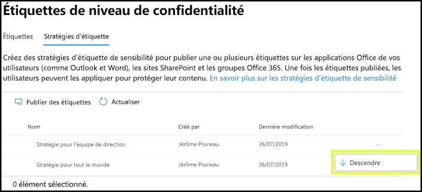

# Vue d’ensemble des étiquettes de niveau de confidentialité

Pour mener à bien leur travail, les membres de votre organisation collaborent avec d’autres personnes au sein de l’organisation et en dehors de celle-ci. Cela signifie que le contenu n’est plus protégé par un pare-feu : il peut se déplacer partout, sur les appareils, applications et services. Dans ce cas, vous devez sécuriser et protéger l’itinérance, tout en respectant les stratégies métier et de conformité de votre organisation.

Avec les étiquettes de sensibilité, vous pouvez classer et protéger le contenu sensible, sans entraver la productivité et la capacité des membres de votre organisation à collaborer.

> [!NOTE]
> Les étiquettes de confidentialité ne sont pas disponibles dans les organisations de la communauté du secteur public américain (GCC).

Exemple présentant des étiquettes de confidentialité :

Les étiquettes de confidentialité sont prises en charge pour les clients du cloud global (public) seulement. Les étiquettes de confidentialité ne sont actuellement pas prises en charge pour les clients des autres clouds, tels que les [clouds nationaux](https://docs.microsoft.com/azure/active-directory/develop/authentication-national-cloud).

Pour appliquer des étiquettes de confidentialité, les utilisateurs doivent être connectés à Office avec leur compte professionnel ou scolaire.

Vous pouvez utiliser les étiquettes de niveau de confidentialité aux fins suivantes :
  
- **Appliquer des paramètres de protection tels que le chiffrement ou des filigranes sur le contenu étiqueté.** Par exemple, vos utilisateurs peuvent appliquer une étiquette Confidentiel à un document ou un message électronique, et cette étiquette peut chiffrer le contenu et appliquer un filigrane Confidentiel.

- **Protéger le contenu dans les applications Office sur différents appareils et plateformes.** Pour obtenir la liste des applications prises en charge, voir [étiquettes de confidentialité dans les applications Office](sensitivity-labels-office-apps.md).

- **Empêcher le contenu sensible de sortir de votre organisation sur des appareils exécutant Windows**, à l’aide de la protection de point de terminaison (Endpoint Protection) dans Microsoft Intune. Après l’application d’une étiquette de niveau de confidentialité à du contenu qui se trouve sur un appareil Windows, Endpoint Protection peut empêcher de copier le contenu vers une application tierce, comme Twitter ou Gmail, ou de le copier sur un périphérique de stockage amovible, comme un lecteur USB.

- **Protéger le contenu dans les services tiers et les applications tierces** à l’aide de Microsoft Cloud App Security. Avec Cloud App Security (CAS), vous pouvez détecter, classer, étiqueter et protéger le contenu dans les services tiers et applications tierces, comme SalesForce, Box ou Dropbox, même si l’application tierce ou le service tiers ne lit pas ou ne prend pas en charge les étiquettes de niveau de confidentialité.

- **Étendre les étiquettes de confidentialité à des applications et services tiers.** Avec le kit de développement logiciel (SDK) Microsoft Information Protection, les applications tierces sur [ces plateformes](https://docs.microsoft.com/information-protection/develop/overview#microsoft-information-protection-sdk) peuvent lire les étiquettes de confidentialité et appliquer les paramètres de protection.

- **Classifier du contenu sans utiliser les paramètres de protection.** Vous pouvez également simplement affecter une classification au contenu (comme un autocollant physique) qui continue de s’afficher et se déplace avec le contenu quand il utilisé et partagé. Vous pouvez utiliser cette classification pour générer des rapports d’utilisation et consultez les données d’activité pour votre contenu sensible. En se basant sur ces informations, vous pouvez toujours choisir d’appliquer les paramètres de protection plus tard.

Dans tous ces cas, les étiquettes de confidentialité dans Office 365 peuvent vous aider à effectuer les actions adéquates sur le contenu approprié. Ces dernières vous permettent de classifier des données dans toute votre organisation et d’appliquer des paramètres de protection basés sur cette classification.
  
Créez des étiquettes de sensibilité dans le Centre de conformité Microsoft 365, le Centre de sécurité Microsoft 365 ou le Centre de sécurité et conformité Office 365 sous **Classification** > **Étiquettes de sensibilité**. Ces étiquettes de confidentialité peuvent être utilisées par Azure Information Protection, les applications Office et les services 365 d’Office.

Si vous êtes client d’Azure Information Protection, vous pouvez utiliser vos étiquettes Azure Information Protection dans les autres centres d’administration. Celles-ci seront synchronisées avec le portail Azure si vous choisissez d’effectuer une configuration supplémentaire ou avancée. Les étiquettes Azure Information Protection et les étiquettes de confidentialité Office 365 sont compatibles entre elles. Cela signifie que, si vous disposez par exemple d'un contenu étiqueté par Azure Information Protection, la reclassification ou le réétiquetage de votre contenu n'est pas nécessaire.

## Qu’est-ce qu’une étiquette de confidentialité ?

Lorsque vous attribuez une étiquette de confidentialité à un document ou à un message électronique, elle ressemble à un cachet appliqué à un contenu qui est :

- **Personnalisable.** Vous pouvez créer des catégories pour les différents niveaux de sensibilité du contenu dans votre organisation, comme Personnel, Public, Général, Confidentiel ou Hautement confidentiel.

- **Texte en clair.** L’étiquette étant stockée sous forme de texte clair dans les métadonnées du contenu, les applications et services tiers peuvent la lire, puis appliquer leurs propres actions de protection, le cas échéant.

- **Permanentes.** Après avoir appliqué une étiquette de confidentialité à du contenu, celle-ci est persistante dans les métadonnées du courrier électronique ou du document. L’étiquette se déplace par conséquent avec le contenu, y compris les paramètres de protection, et que ces données constituent la base de l’application et de l’exécution des stratégies.

Dans les applications Office, une étiquette de confidentialité s'affiche pour les utilisateurs comme une balise sur un message électronique ou un document.

Une seule étiquette de niveau de confidentialité peut être affectée à chaque élément de contenu. Un élément peut disposer à la fois d’une étiquette de niveau de confidentialité et d’une [étiquette de rétention](labels.md).

## Fonction des étiquettes de niveau de confidentialité

Outre les messages électroniques et les documents, des étiquettes de confidentialité sont disponibles dans plusieurs préversions publiques. Pour plus d’informations sur l’utilisation d’étiquettes de confidentialité pour des fichiers, des équipes, des groupes et des sites, voir les articles suivants :

- [Activer les étiquettes de confidentialité pour les fichiers Office dans SharePoint et OneDrive (préversion publique)](sensitivity-labels-sharepoint-onedrive-files.md)

- [Utiliser des étiquettes de confidentialité avec Microsoft Teams, les groupes Office 365 et les sites SharePoint (préversion publique)](sensitivity-labels-teams-groups-sites.md)

Une fois qu’une étiquette de confidentialité est appliquée à un e-mail ou un document, tout paramètre de protection relatif à cette étiquette sont appliqués au contenu. Vous pouvez utiliser une étiquette de confidentialité aux fins suivantes :

- **Chiffrer** les e-mails uniquement ou les e-mails et les documents. Vous pouvez choisir les utilisateurs ou le groupe autorisés à effectuer telle ou telle action et la durée de l’autorisation. Par exemple, vous pouvez choisir d’autoriser les utilisateurs d’un domaine spécifique extérieur à votre organisation à passer en revue le contenu pendant 7 jours seulement après l’étiquetage du contenu. Par ailleurs, au lieu d’attribuer des autorisations vous-même, vous pouvez autoriser vos utilisateurs à attribuer des autorisations au contenu lorsqu’ils appliquent l’étiquette. Pour plus d’informations, voir [Restriction de l’accès au contenu à l’aide du chiffrement dans les étiquettes de sensibilité](encryption-sensitivity-labels.md).

- **Marquer le contenu** en ajoutant des pieds de page, en-têtes ou filigranes personnalisés à des e-mails ou des documents portant l’étiquette. Vous appliquez uniquement des filigranes aux documents, et non aux courriers électroniques, et ceux-ci sont limités à 255 caractères. De plus, les en-têtes et les pieds de page sont limités à 1024 caractères (sauf dans Excel, où ils sont limités à 255 caractères ou moins, selon que le document contient d’autres en-têtes ou pieds de page et d’autres facteurs).

    

- **Évitez les pertes de données** en activant la protection des points de terminaison dans Intune. Si du contenu sensible est téléchargé, vous pouvez éviter la perte de données sur les appareils Windows. Par exemple, vous ne pouvez pas copier du contenu étiqueté sur Dropbox, Gmail ou un lecteur USB. Avant que vos étiquettes de confidentialité puissent utiliser la Protection des informations Windows (WIP), vous devez d’abord créer une stratégie de protection des applications dans le Portail Microsoft Azure. Pour plus d’informations, voir [Comment la Protection des informations Windows protège les fichiers à l’aide d’une étiquette de confidentialité](https://docs.microsoft.com/windows/security/information-protection/windows-information-protection/how-wip-works-with-labels?branch=vsts17546553).

- **Appliquer automatiquement l’étiquette au contenu qui contient des informations sensibles.** Vous pouvez choisir quels types d’informations sensibles vous souhaitez étiqueter et pouvez appliquer l’étiquette automatiquement, ou vous pouvez inviter les utilisateurs à appliquer l’étiquette que vous recommandez. si vous  recommandez une étiquette, l’invitation affiche le texte souhaité. Pour plus d’informations, voir[Appliquer automatiquement une étiquette sensibilité au contenu](apply-sensitivity-label-automatically.md).

    

Toutes ces options sont disponibles lorsque vous créez une étiquette de confidentialité :

### Priorité des étiquettes (l’ordre est important)

Lorsque vous créez vos étiquettes de confidentialité dans votre centre d’administration, elles apparaissent dans une liste située sous l’onglet **Sensibilité** de la page **Étiquettes**. Dans cette liste, l’ordre des étiquettes est important car il reflète leur priorité. Vous souhaitez que votre étiquette de sensibilité la plus restrictive, comme l’étiquette Hautement confidentiel, apparaisse en **bas** de la liste, et que la moins restrictive, telle que l’étiquette Public, apparaisse en **haut**.

Vous pouvez appliquer une seule étiquette de confidentialité dans un document ou un message électronique. Si vous définissez une option obligeant vos utilisateurs à fournir une justification pour la modification d'une étiquette vers une classification plus faible, l’ordre de cette liste identifie les classifications les moins élevées. Cette option ne s’applique toutefois pas aux sous-étiquettes.

Cependant, l’ordre des sous-étiquettes est utilisé avec l'[étiquetage automatique](apply-sensitivity-label-automatically.md). Lorsque vous configurez les étiquettes pour les appliquer automatiquement ou en tant que recommandation, plusieurs correspondances peuvent se produire pour plus d'une étiquette. Pour déterminer l’étiquette à appliquer ou à recommander, l’ordre d’étiquettes est utilisé : la dernière étiquette de confidentialité est sélectionnée, puis, le cas échéant, la dernière sous-étiquette.

### Sous-étiquettes (regroupement d’étiquettes)

Avec les sous-étiquettes, vous pouvez regrouper une ou plusieurs étiquettes sous une étiquette parent que les utilisateurs pourront voir dans une application Office. Par exemple, sous Confidentiel, votre organisation peut utiliser plusieurs étiquettes différentes pour certains types de cette classification. Dans cet exemple, l’étiquette parent Confidentiel est tout simplement une étiquette de texte sans aucun paramètre de protection. Comme elle comporte des sous-étiquettes, elle ne peut pas être appliquée au contenu. Les utilisateurs doivent d’abord choisir Confidentiel pour afficher les sous-étiquettes, puis choisir une sous-étiquette à appliquer au contenu.

Les sous-étiquettes sont simplement un moyen de présenter des étiquettes à des utilisateurs dans des groupes logiques. Les sous-étiquettes n’héritent pas des paramètres de leur étiquette parent. Lorsque vous publiez une sous-étiquette pour un utilisateur, celui-ci peut ensuite l’appliquer au contenu, mais il ne peut pas uniquement employer l’étiquette parente.

Ne choisissez pas une étiquette parente comme étiquette par défaut, ne configurez pas non plus une étiquette parent pour l’appliquer automatiquement ou la recommander, car elle ne sera pas appliquée au contenu des applications Office qui utilisent le client d’étiquetage unifié Azure Information Protection.

Exemple d’affichage de sous-étiquettes pour les utilisateurs :

### Modification ou suppression d’une étiquette de niveau de confidentialité

Si vous supprimez une étiquette de sensibilité, celle-ci n’est pas supprimée du contenu et les paramètres de protection restent appliqués au contenu.

Si vous modifiez une étiquette de sensibilité, la version de celle-ci qui était appliquée au contenu reste appliquée.

## Fonction des stratégies d’étiquette

Après avoir créé des étiquettes de niveau de confidentialité, vous devez les publier afin de les rendre disponibles auprès des membres de votre organisation, qui peuvent ensuite les appliquer au contenu. Contrairement aux étiquettes de rétention, qui sont publiées à des emplacements comme des boîtes aux lettres Exchange, les étiquettes de niveau de confidentialité sont publiées pour des utilisateurs ou des groupes. Les étiquettes de niveau de confidentialité apparaissent ensuite dans les applications Office pour ces utilisateurs et groupes.

Avec une stratégie d’étiquette, vous pouvez effectuer les actions suivantes :

- **Sélectionner les utilisateurs et les groupes qui voient les étiquettes.** Les étiquettes peuvent être publiées dans n’importe quel groupe de sécurité à extension messagerie, groupe de distribution, groupe Office 365 ou groupe de distribution dynamique.

- **Appliquer une étiquette par défaut** à tous les nouveaux documents et e-mails créés par les utilisateurs et les groupes inclus dans la stratégie d’étiquette. Cette étiquette par défaut définit un niveau de base des paramètres de protection à appliquer à l’ensemble de votre contenu.

- **Demander une justification pour changer une étiquette.** Si le contenu est marqué comme confidentiel et qu’un utilisateur souhaite supprimer cette étiquette ou la remplacer par une classification plus faible, par exemple par une étiquette nommée public, vous pouvez demander à l’utilisateur de fournir une justification lors de l’exécution de cette action. Le motif de justification n’est pour le moment pas adressé à l’[analyse des étiquettes](label-analytics.md)pour examen par l’administrateur. Le [client d’étiquetage unifié Azure information Protection](https://docs.microsoft.com/azure/information-protection/rms-client/aip-clientv2) envoie toutefois ces informations à l’[analyse d’Azure information Protection](https://docs.microsoft.com/azure/information-protection/reports-aip).

    

- **Exiger que les utilisateurs d’appliquer une étiquette à leur messagerie et leurs documents. ** Si vous souhaitez tout contenu d’un utilisateur reste étiqueté, vous pouvez exiger qu’une étiquette soit appliquée à tous leurs documents enregistrés et envoyer des messages électroniques. L’étiquette peut être affectée manuellement par l’utilisateur, automatiquement suite à une condition ou affectée par défaut (l’option étiquette par défaut décrite ci-dessus). Voici l’invite qui apparaît dans Outlook, lorsqu’un utilisateur est requis pour attribuer une étiquette.

    > [!NOTE]
    > L’étiquetage obligatoire requiert un abonnement Azure information protection. Pour utiliser cette fonctionnalité, vous devez télécharger et installer soit le [client Azure Information Protection](https://www.microsoft.com/download/details.aspx?id=53018), soit la version ultérieure [client de marquage unifié de Azure Information Protection](https://docs.microsoft.com/azure/information-protection/rms-client/install-unifiedlabelingclient-app). Par ailleurs, le client ne s’exécute que sur Windows. Cette fonctionnalité n’est pas encore prise en charge sur Mac, iOS et Android.

    

- **Fournir un lien d’aide vers une page d’aide personnalisée.** Si vos utilisateurs ne sont pas sûrs de savoir ce que signifient vos étiquettes de confidentialité ou comment elles doivent être utilisées, vous pouvez fournir une URL de type En savoir plus, qui apparaît en bas du menu **Etiquettes de confidentialité** dans les applications Office.

    

Après avoir créé une stratégie d’étiquette et affecté des étiquettes de niveau de confidentialité aux utilisateurs et aux groupes, ces personnes peuvent voir ces étiquettes disponibles dans les applications Office au bout d’une heure, voire moins.

Vous pouvez créer et publier autant d’étiquettes de confidentialité que vous le souhaitez, à une exception près : si l’étiquette applique le chiffrement, un maximum de 500 étiquettes est disponible. Toutefois, dans le but de diminuer les frais généraux de l’administration et de réduire la complexité pour vos utilisateurs, tentez d’utiliser un nombre minimal d’étiquettes. Les déploiements en temps réel ont démontré l’efficacité notable d’une réduction lorsque les utilisateurs ont plus de cinq étiquettes principales ou plus de cinq sous-étiquettes par étiquette principale.

### Stratégie de priorité des étiquettes (l’ordre est important)

Pour rendre vos étiquettes de confidentialité accessibles aux utilisateurs, vous devez les publier dans une stratégie de confidentialité d’étiquette qui apparaît dans une liste sous l’onglet **Stratégies de confidentialité** sur la page **Stratégies d’étiquettes**. À l’instar des étiquettes de confidentialité (voir la section [Priorité des étiquettes (l’ordre est important)](#label-priority-order-matters)), l’ordre des stratégies d’étiquette de confidentialité est important, car il reflète leur priorité. La stratégie d’étiquette dont la priorité est la plus faible est affichée **en haut**, et celle dont la priorité est la plus haute est affichée **en bas**.

Une stratégie d’étiquette comprend les éléments suivants :

- Un groupe d’étiquettes.
- L’étendue de la stratégie d’étiquette, c’est-à-dire les utilisateurs et les groupes inclus dans la stratégie.
- Les paramètres de la stratégie d’étiquette décrite ci-dessus (étiquette par défaut, justification, étiquette obligatoire et lien d’aide).

Vous pouvez inclure un utilisateur dans différentes stratégies d’étiquette, et l’utilisateur pourra voir toutes les étiquettes de confidentialité de ces stratégies. Toutefois, un utilisateur ne verra les paramètres de stratégie que de la stratégie d’étiquette dont la priorité est la plus élevée.

Si un utilisateur ou un groupe de votre organisation ne voit pas une option dans la stratégie d’étiquette que vous avez prévue (par exemple, une étiquette par défaut ou une étiquette obligatoire), vérifiez l’ordre des stratégies d’étiquette de confidentialité. Pour réorganiser les stratégies d’étiquette, sélectionnez une stratégie d’étiquette de confidentialité > sélectionnez les points de suspension sur la droite > **Descendre** ou **Monter**.

Bien que la priorité importe pour les stratégies d’étiquette de confidentialité, elle n’importe **pas** pour les stratégies d’étiquette de rétention. Comme expliqué dans [Les principes de rétention, ou qui a priorité ?](labels.md#the-principles-of-retention-or-what-takes-precedence), le contenu peut être soumis à plusieurs stratégies de rétention.

## Prise en main des étiquettes de confidentialité

Prise en main des étiquettes de sécurité en procédant comme suit :

1. **Définissez les étiquettes.** Vous devez tout d’abord établir votre taxonomie pour définir différents niveaux de confidentialité du contenu. Utilisez des noms ou termes courants qui ont du sens pour vos utilisateurs. Par exemple, vous pouvez commencer par utiliser des étiquettes telles que Personnel, Public, Général, Confidentiel et Hautement confidentiel. Vous pouvez employer des sous-étiquettes pour regrouper des étiquettes similaires par catégorie. De plus, lorsque vous créez une étiquette, une info-bulle est nécessaire et elle apparaît dans les applications Office lorsque l’utilisateur passe au-dessus de l’option d’étiquette dans le ruban.

2. **Définissez l’incidence possible de chaque étiquette.** Configurez ensuite les paramètres de protection que vous voulez associer à chaque étiquette. Par exemple, le contenu ayant un niveau de confidentialité inférieur (tel qu’une étiquette « Général ») peut comporter simplement un en-tête ou un pied de page, tandis que le contenu d’un niveau de confidentialité supérieur (tel qu’une étiquette « Confidentiel ») peut contenir un filigrane, un chiffrement ou la protection des informations Windows, pour s’assurer que seuls les utilisateurs disposant des privilèges requis peuvent y accéder.

3. **Définir qui peut accéder aux étiquettes.** Une fois que vous avez défini les étiquettes de votre organisation, publiez-les dans une stratégie d’étiquette contrôlant quels utilisateurs et quels groupes voient ces étiquettes. Une même étiquette est réutilisable : vous la définissez une seule fois, puis vous pouvez l’inclure dans plusieurs stratégies d’étiquette affectées à différents utilisateurs. Toutefois, pour affecter une étiquette au contenu, vous devez d’abord la publier afin qu’elle soit disponible dans les applications Office et dans d’autres services. Si vous commencez tout juste à les utiliser, vous pouvez tester vos étiquettes de niveau de confidentialité pilotes en les affectant seulement à quelques personnes.

Voici le flux de base des actions de l’administrateur, de l’utilisateur et de l’application Office lié au fonctionnement des étiquettes de niveau de confidentialité.

Pour consulter des informations procédurales, voir [Créer et configurer des étiquettes de confidentialité et leurs stratégies](create-sensitivity-labels.md).

## Où apparaissent les étiquettes de niveau de confidentialité

Les étiquettes de confidentialité apparaissent dans les IU des applications Office et peuvent être sélectionnées à partir du bouton **Confidentialité** dans l’onglet Accueil du ruban. Pour afficher la disponibilité actuelle d’un étiquetage prédéfini pour des applications et plateformes spécifiques, consultez la [Prise en charge des fonctionnalités des étiquettes de confidentialité dans les applications](sensitivity-labels-office-apps.md#support-for-sensitivity-label-capabilities-in-apps).

Si vous utilisez le client d’étiquetage unifié Azure information Protection pour vos ordinateurs Windows, des fonctionnalités supplémentaires sont disponibles pour les étiquettes de confidentialité. Pour plus d’informations, consulter [Comparer les clients d’étiquetage pour les ordinateurs Windows](https://docs.microsoft.com/azure/information-protection/rms-client/use-client#compare-the-labeling-clients-for-windows-computers).

### Applications Office sur Windows

Dans les applications Office sur des appareils exécutant Windows, les étiquettes de confidentialité apparaissent sur le bouton **Confidentialité** dans l’onglet **Accueil** du ruban. 

Lorsque vous utilisez l’étiquetage prédéfini, l’étiquette appliquée apparaît également dans la barre d’état en bas de la fenêtre :

### Applications Office sur le Web

Pour plus d’informations sur l’utilisation des étiquettes de confidentialité avec les applications Office sur le web, voir [Appliquer des étiquettes de confidentialité à vos documents et courriers électroniques dans Office-Web](https://support.office.com/article/2f96e7cd-d5a4-403b-8bd7-4cc636bae0f9).

### Applications Office sur Mac

Dans les applications Office sur des appareils Mac, les étiquettes de confidentialité apparaissent sur le bouton **Confidentialité** dans l’onglet **Accueil** du ruban. L’étiquette appliquée apparaît également dans la barre d’état en bas de la fenêtre :

### Applications Office sur iOS

Dans les applications Office sur des appareils iOS, les étiquettes de confidentialité apparaissent sur le bouton **Confidentialité** dans l’onglet **Accueil** du ruban. L’étiquette appliquée apparaît également dans la barre d’état en bas de la fenêtre :

### Applications Office sur Android

Dans les applications Office sur des appareils Android, les étiquettes de confidentialité apparaissent sur le bouton **Confidentialité** dans l’onglet **Accueil** du ruban. L’étiquette appliquée apparaît également dans la barre d’état en bas de la fenêtre :

### Plus d’informations sur les étiquettes de niveau de confidentialité dans les applications Office

- [Appliquer des étiquettes de niveau de confidentialité à vos documents et vos e-mails dans Office](https://support.office.com/article/apply-sensitivity-labels-to-your-documents-and-email-within-office-2f96e7cd-d5a4-403b-8bd7-4cc636bae0f9)
- [Problèmes connus lorsque vous appliquez des étiquettes de niveau de confidentialité à vos fichiers Office](https://support.office.com/article/known-issues-when-you-apply-sensitivity-labels-to-your-office-files-b169d687-2bbd-4e21-a440-7da1b2743edc)
- [Étiquettes de confidentialité dans les applications Office](sensitivity-labels-office-apps.md)

## Fonctionnement des étiquettes de niveau de confidentialité avec les étiquettes Azure Information Protection existantes

Les utilisateurs Azure Information Protection peuvent classer et étiqueter du contenu sur Windows à l’aide du client d’étiquetage unifié Azure Information Protection. Les étiquettes de confidentialité Azure Information Protection existantes fonctionnent parfaitement avec les nouvelles étiquettes de confidentialité, également connues sous le nom d’étiquettes unifiées. Cela signifie que vous pouvez :

- Conserver vos étiquettes Azure Information Protection existantes sur les documents et les e-mails.
- Conserver la configuration d’étiquettes Azure Information Protection existante.

Si vous utilisez des étiquettes Azure Information Protection car votre client n’est pas encore sur la [plateforme d’étiquetage unifié](https://docs.microsoft.com/azure/information-protection/faqs#how-can-i-determine-if-my-tenant-is-on-the-unified-labeling-platform), nous vous recommandons d’éviter la création de nouvelles étiquettes dans d’autres centres d’administration tant que l’étiquetage unifié n’est pas activé. Pour plus d’informations sur ce processus, voir [Migration des étiquettes Azure Information Protection vers des étiquettes de confidentialité unifiées](https://docs.microsoft.com/azure/information-protection/configure-policy-migrate-labels).

## Les étiquettes de confidentialité et le client Azure Information Protection

Les applications Office 365 ProPlus désactivent automatiquement l’étiquetage intégré pour les étiquettes de confidentialité dans les applications Windows Office lorsque le client Azure Information Protection est installé.
Pour modifier ce comportement par défaut pour utiliser l’étiquetage intégré, voir [À propos du client d’étiquetage intégré Office](sensitivity-labels-office-apps.md#about-the-office-built-in-labeling-client).

## Protéger le contenu des appareils Windows à l’aide de la protection de point de terminaison dans Microsoft Intune

Lorsque vous créez une étiquette de confidentialité, vous avez l’option d’indiquer à Windows que les fichiers comportant cette étiquette doivent être protégés contre la fuite de données quand le contenu est stocké sur des appareils Windows. Cette option permet de s’assurer que le contenu associé à cette étiquette peut uniquement être partagé ou copié vers des emplacements approuvés, même s’il est stocké sur un point de terminaison. Pour l’essentiel, l’activation de cette option pour une étiquette de confidentialité indique à Windows qu’il s’agit de données très critiques qui méritent d’autres contraintes d’utilisation.

Lorsque vous activez cette option, Windows peut lire, comprendre et agir sur les étiquettes de niveau de confidentialité dans les documents, et appliquer automatiquement la protection des informations Windows sur le contenu, quelle que soit la manière dont il atteint un appareil Windows géré. Cela permet de protéger les fichiers étiquetés contre les fuites de données accidentelles, avec ou sans chiffrement.

Par exemple, Windows peut comprendre qu’un document Word qui se trouve sur l’ordinateur d’un utilisateur possède une étiquette Confidentiel, et que la protection des informations Windows peut appliquer une stratégie de protection des applications pour empêcher la copie ou le partage des données dans tout emplacement hors travail à partir de cet appareil (par exemple, un compte OneDrive personnel, des comptes de messagerie personnelle, des réseaux sociaux ou des lecteurs USB).

Si un utilisateur tente de charger du contenu étiqueté vers un compte Gmail personnel, il voit le message suivant.

Si un utilisateur tente d’enregistrer du contenu étiqueté sur un lecteur USB, il voit le message suivant :

### Conditions préalables importantes pour utiliser la Protection des Informations Windows

Avant que les étiquettes de niveau de confidentialité puissent utiliser la protection des informations Windows, vous devez d’abord remplir les conditions préalables décrites ici : [La protection des informations Windows protège les fichiers avec une étiquette de niveau de confidentialité](https://docs.microsoft.com/windows/security/information-protection/windows-information-protection/how-wip-works-with-labels?branch=vsts17546553). Cette rubrique décrit les conditions préalables suivantes :

- Vérifiez que vous exécutez Windows 10, version 1809 ou version ultérieure.
- [Configurez Microsoft Defender – Protection avancée contre les menaces (Microsoft Defender ATP)](https://docs.microsoft.com/windows/security/threat-protection/) qui analyse le contenu pour rechercher une étiquette et applique la protection des travaux des informations Windows correspondante. ATP effectue certaines opérations indépendamment de Protection des informations Windows (WIP), comme signaler des anomalies.
- Créez une stratégie de Protection des informations Windows (WIP) qui s’applique aux appareils de point de terminaison. Vous pouvez effectuer cette opération à partir de l’un des emplacements suivants :

  - [Créer une stratégie de Protection des informations Windows (WIP) avec GPM à l’aide du portail Azure pour Microsoft Intune](https://docs.microsoft.com/windows/security/information-protection/windows-information-protection/create-wip-policy-using-intune-azure)
  - [Créer et déployer une stratégie de Protection des informations Windows (WIP) à l’aide de System Center Configuration Manager](https://docs.microsoft.com/windows/security/information-protection/windows-information-protection/create-wip-policy-using-sccm)

## Protéger le contenu dans les services tiers et les applications tierces à l’aide de Microsoft Cloud App Security

Protéger le contenu dans les services tiers et les applications tierces à l’aide de Cloud App Security (CAS). Avec CAS, vous pouvez détecter, classer, étiqueter et protéger le contenu dans des services tiers et applications tierces, telles que SalesForce, Box ou Dropbox. Par exemple, Dropbox peut-être ne pas comprendre une étiquette de critère de diffusion, mais CAS peut adresser et protéger le contenu étiqueté dans cet emplacement.

Pour plus d’informations, reportez-vous à l’article [Appliquer automatiquement des étiquettes de classification Azure Information Protection](https://docs.microsoft.com/cloud-app-security/use-case-information-protection).

### Conditions préalables importantes pour utiliser le CAS

Avant que vos étiquettes de niveau de confidentialité puissent utiliser CAS, vous devez d’abord remplir les conditions préalables décrites ici : [Appliquer automatiquement des étiquettes de classification Azure Information Protection](https://docs.microsoft.com/cloud-app-security/use-case-information-protection). Cette rubrique décrit les conditions préalables suivantes :

- [Activez Cloud App Security et Azure Information Protection](https://docs.microsoft.com/cloud-app-security/azip-integration) pour votre client.
- [Connectez l’application](https://docs.microsoft.com/cloud-app-security/enable-instant-visibility-protection-and-governance-actions-for-your-apps) à Cloud App Security.

## Étendre les étiquettes de niveau de confidentialité à des services tiers et applications tierces à l’aide du SDK Microsoft Information Protection

Étant donné qu’une étiquette de niveau de confidentialité est conservée sous forme de texte en clair dans les métadonnées d’un document, les services tiers et applications tierces peuvent choisir de prendre en charge l’identification et la protection du contenu comprenant une étiquette de ce type. La prise en charge dans les autres applications et services est toujours en développement.

Le [Kit de développement logiciel (SDK) Microsoft Information Protection](https://docs.microsoft.com/information-protection/develop/) permet aux applications et services tiers de lire et d’appliquer des étiquettes de sensibilité et une protection au documents. Le kit SDK prend en charge les applications sur [ces plateformes](https://docs.microsoft.com/information-protection/develop/overview#microsoft-information-protection-sdk).

À l’aide du SDK, vous pouvez étiqueter et protéger le contenu d’une manière qui fonctionne avec les autres services et applications Microsoft Information Protection, comme les applications Office, les services Office 365, le scanneur Azure Information Protection, Microsoft Cloud App Security et plusieurs autres solutions de partenaire. Par exemple, informez-vous sur la [prise en charge des étiquettes de niveau de confidentialité dans Adobe Acrobat](https://techcommunity.microsoft.com/t5/Azure-Information-Protection/Starting-October-use-Adobe-Acrobat-Reader-for-PDFs-protected-by/ba-p/262738).

Pour en savoir plus sur le SDK Microsoft Information Protection, consultez l’[annonce sur le blog Tech Community](https://techcommunity.microsoft.com/t5/Microsoft-Information-Protection/Microsoft-Information-Protection-SDK-Now-Generally-Available/ba-p/263144). Vous pouvez également en savoir plus sur les [solutions de partenaires intégrées avec Microsoft Information Protection](https://techcommunity.microsoft.com/t5/Azure-Information-Protection/Microsoft-Information-Protection-showcases-integrated-partner/ba-p/262657).

## Autorisations requises pour créer des étiquettes de confidentialité

Les membres de votre équipe de conformité qui créeront des étiquettes de confidentialité ont besoin d’autorisations dans le Centre de conformité Microsoft 365, le Centre de sécurité Microsoft 365 ou le Centre de sécurité et conformité Office 365. Par défaut, votre administrateur de clients a accès à ces centres d’administration et pourra accorder l’accès aux responsables de la mise en conformité et à d’autres personnes sans leur octroyer toutes les autorisations d’un administrateur de clients. Pour accorder cet accès administrateur délégué limité, allez à la page **Autorisations** de l’un de ces centres d’administration, puis d’ajouter des membres au groupe de rôles **Administrateur de conformité** ou **Administrateur de la sécurité**.

Pour plus d’informations, voir [Autoriser des utilisateurs à accéder au Centre de sécurité et conformité Office 365](https://docs.microsoft.com/microsoft-365/security/office-365-security/grant-access-to-the-security-and-compliance-center).

Ces autorisations sont requises uniquement pour créer et appliquer des étiquettes et une stratégie d’étiquette. L’application d’une stratégie ne nécessite pas d’accès au contenu.