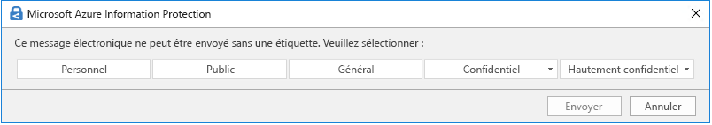

# En savoir plus sur les étiquettes de niveau de confidentialité

Pour mener à bien leur travail, les membres de votre organisation collaborent avec d’autres personnes au sein de l’organisation et en dehors de celle-ci. Cela signifie que le contenu n’est plus protégé par un pare-feu : il peut se déplacer partout, sur les appareils, applications et services. Dans ce cas, vous devez sécuriser et protéger l’itinérance, tout en respectant les stratégies métier et de conformité de votre organisation.

Avec les étiquettes de confidentialité, vous pouvez classer et protéger les données de votre organisation, sans compromettre la productivité des membres et leur capacité à travailler ensemble.

Exemple montrant les étiquettes de confidentialité disponibles dans Excel à partir de l’onglet **Accueil** du ruban. Dans cet exemple, l’étiquette appliquée affiche dans la barre d’état :

Les étiquettes de confidentialité sont prises en charge pour les clients du cloud global (public) seulement. Les étiquettes de confidentialité ne sont actuellement pas prises en charge pour les clients des autres clouds, tels que les [clouds nationaux](https://docs.microsoft.com/azure/active-directory/develop/authentication-national-cloud).

> [!NOTE]
> Les étiquettes de confidentialité ne sont pas encore disponibles au sein des organisations de la communauté du secteur public américain (GCC).

Pour appliquer des étiquettes de confidentialité, les utilisateurs doivent être connectés à Office avec leur compte professionnel ou scolaire.

Vous pouvez utiliser les étiquettes de niveau de confidentialité aux fins suivantes :
  
- **Appliquer des paramètres de protection tels que le chiffrement ou des filigranes sur le contenu étiqueté.** Par exemple, vos utilisateurs peuvent appliquer une étiquette Confidentiel à un document ou un message électronique, et cette étiquette peut chiffrer le contenu et appliquer un filigrane Confidentiel.

- **Protéger le contenu dans les applications Office sur différents appareils et plateformes.** Pour obtenir la liste des applications prises en charge, consultez [Utiliser les étiquettes de confidentialité dans les applications Office](sensitivity-labels-office-apps.md).

- **Empêcher aux contenus sensibles de s'échapper de votre organisation sur des appareils exécutant Windows**, à l’aide de la protection de point de terminaison dans Microsoft Intune. Après l’application d’une étiquette de confidentialité à du contenu qui se trouve sur un appareil Windows, Endpoint Protection peut empêcher de copier le contenu vers une application tierce, comme Twitter ou Gmail. Ou d'être copié vers un stockage amovible, tel qu’un lecteur USB.

- **Protéger le contenu dans les services et les applications tiers** à l’aide de Microsoft Cloud App Security. Avec Cloud App Security (CAS), vous pouvez détecter, classer, étiqueter et protéger le contenu dans les services tiers et applications tierces, comme SalesForce, Box ou Dropbox, même si l’application tierce ou le service tiers ne lit pas ou ne prend pas en charge les étiquettes de niveau de confidentialité.

- **Étendre les étiquettes de confidentialité à des applications et services tiers.** Grâce à l'utilisation du SDK Microsoft informations Protection, des applications tierces peuvent lire des étiquettes de confidentialité et appliquer des paramètres de protection.

- **Classifier du contenu sans utiliser les paramètres de protection.** Vous pouvez également simplement affecter une classification au contenu (comme un autocollant physique) qui continue de s’afficher et se déplace avec le contenu quand il utilisé et partagé. Vous pouvez utiliser cette classification pour générer des rapports d’utilisation et consultez les données d’activité pour votre contenu sensible. En se basant sur ces informations, vous pouvez toujours choisir d’appliquer les paramètres de protection plus tard.

Dans tous ces cas, les étiquettes de confidentialité dans Microsoft 365 peuvent vous aider à effectuer les actions adéquates sur le contenu approprié. Ces dernières vous permettent de classifier des données dans toute votre organisation et d’appliquer des paramètres de protection basés sur cette classification.

## Qu’est-ce qu’une étiquette de confidentialité ?

Lorsque vous attribuez une étiquette de confidentialité à un document ou à un message électronique, elle ressemble à un cachet appliqué à un contenu qui est :

- **Personnalisable.** Vous pouvez créer des catégories pour les différents niveaux de sensibilité du contenu dans votre organisation, comme Personnel, Public, Général, Confidentiel ou Hautement confidentiel.

- **Texte en clair.** L’étiquette étant stockée sous forme de texte clair dans les métadonnées du contenu, les applications et services tiers peuvent la lire, puis appliquer leurs propres actions de protection, le cas échéant.

- **Permanentes.** Après avoir appliqué une étiquette de confidentialité à du contenu, celle-ci est stockée dans les métadonnées du courrier électronique ou du document. L’étiquette se déplace par conséquent avec le contenu, y compris les paramètres de protection, et que ces données constituent la base de l’application et de l’exécution des stratégies.

Dans les applications Office, une étiquette de confidentialité s'affiche pour les utilisateurs comme une balise sur un message électronique ou un document.

Une seule étiquette de niveau de confidentialité peut être affectée à chaque élément de contenu. Un élément peut disposer à la fois d’une étiquette de niveau de confidentialité et d’une [étiquette de rétention](labels.md).

> [!div class="mx-imgBorder"]
> 

## Fonction des étiquettes de niveau de confidentialité

> [!NOTE]
> Outre l'application d'étiquettes aux courriers électroniques et documents dans des applications Office, les étiquettes de confidentialité sont également désormais disponibles dans les versions publiques en préversion suivantes :
> 
> - [Activer les étiquettes de confidentialité pour les fichiers Office dans SharePoint et OneDrive (préversion publique)](sensitivity-labels-sharepoint-onedrive-files.md)
> - [Utiliser des étiquettes de confidentialité avec Microsoft Teams, les groupes Office 365 et les sites SharePoint (préversion publique)](sensitivity-labels-teams-groups-sites.md)

Une fois qu’une étiquette de confidentialité est appliquée à un e-mail ou un document, tout paramètre de protection relatif à cette étiquette sont appliqués au contenu. Vous pouvez utiliser une étiquette de confidentialité aux fins suivantes :

- **Chiffrer** les e-mails uniquement ou les e-mails et les documents. Vous pouvez choisir les utilisateurs ou le groupe autorisés à effectuer telle ou telle action et la durée de l’autorisation. Par exemple, vous pouvez choisir d’autoriser les utilisateurs d’un groupe spécifique d'une autre organisation à vérifier le contenu pendant 7 jours seulement après l’étiquetage du contenu. Par ailleurs, au lieu d’autorisations définies par l'administrateur, vous pouvez autoriser vos utilisateurs à attribuer des autorisations au contenu lorsqu’ils appliquent l’étiquette. 
    
    Pour plus d’informations sur les paramètres de **Chiffrement** lorsque vous créez ou modifiez une étiquette de confidentialité, voir [Restreindre l’accès au contenu en utilisant le chiffrement dans les étiquettes de confidentialité](encryption-sensitivity-labels.md).

- **Marquer le contenu** lorsque vous utilisez des applications Office, en ajoutant filigranes, pieds de page ou en-têtes à des e-mails ou des documents comportant l’étiquette. Des filigranes peuvent être appliqués aux documents, et non aux courriers électroniques. Exemple d’en-tête et filigrane :
    
    
    
    Avez-vous besoin de vérifier la date de l’application des marques de contenu ? Consultez [Quand Office 365 applique le marquage de contenu et le chiffrement de contenu](sensitivity-labels-office-apps.md#when-office-365-applies-content-marking-and-encryption).
    
    Longueurs de chaînes : les filigranes sont limités à 255 caractères. Les en-têtes et les pieds de page sont limités à 1 024 caractères, sauf dans Excel. Excel présente une limite totale de 255 caractères pour les en-têtes et les pieds de page, mais cette limite inclut des caractères qui ne sont pas visibles, tels que des codes de mise en forme. Si cette limite est atteinte, la chaîne entrée n’apparaît pas dans Excel.

- **Évitez les pertes de données** en activant la protection des points de terminaison dans Intune. Si du contenu sensible est téléchargé, vous pouvez éviter la perte de données sur les appareils Windows. Par exemple, vous ne pouvez pas copier du contenu étiqueté sur Dropbox, Gmail ou un lecteur USB. Avant que vos étiquettes de confidentialité puissent utiliser la Protection des informations Windows (WIP), vous devez d’abord créer une stratégie de protection des applications dans le Portail Microsoft Azure. 
    
    Pour plus d’informations sur les paramètres de **Prévention contre la perte de données du point de terminaison** lorsque vous créez ou modifiez une étiquette de confidentialité, y compris les conditions préalables importantes, voir [Comment la Protection des informations Windows protège des fichiers à l’aide d’une étiquette de confidentialité](https://docs.microsoft.com/windows/security/information-protection/windows-information-protection/how-wip-works-with-labels?branch=vsts17546553).

- **Appliquer automatiquement l’étiquette au contenu qui contient des informations sensibles.** Vous pouvez choisir quels types d’informations sensibles vous souhaitez étiqueter et pouvez appliquer l’étiquette automatiquement, ou vous pouvez inviter les utilisateurs à appliquer l’étiquette que vous recommandez. Si vous recommandez une étiquette, l’invite affiche le texte souhaité. Par exemple :
    
    
    
    Pour plus d’informations sur les paramètres d' **Étiquetage automatique pour les applications Office** lorsque vous créez ou modifiez une étiquette de confidentialité, voir [Appliquer automatiquement une étiquette de confidentialité à du contenu](apply-sensitivity-label-automatically.md).

### Priorité des étiquettes (l’ordre est important)

Lorsque vous créez vos étiquettes de confidentialité dans votre centre d’administration, elles apparaissent dans une liste située sous l’onglet **Sensibilité** de la page **Étiquettes**. Dans cette liste, l’ordre des étiquettes est important car il reflète leur priorité. Vous souhaitez que votre étiquette de sensibilité la plus restrictive, comme l’étiquette Hautement confidentiel, apparaisse en **bas** de la liste, et que la moins restrictive, telle que l’étiquette Public, apparaisse en **haut**.

Vous pouvez appliquer une seule étiquette de confidentialité dans un document ou un message électronique. Si vous définissez une option obligeant vos utilisateurs à fournir une justification pour la modification d'une étiquette vers une classification plus faible, l’ordre de cette liste identifie les classifications les moins élevées. Cette option ne s’applique toutefois pas aux sous-étiquettes.

Cependant, l’ordre des sous-étiquettes est utilisé avec l'[étiquetage automatique](apply-sensitivity-label-automatically.md). Lorsque vous configurez les étiquettes pour les appliquer automatiquement ou en tant que recommandation, plusieurs correspondances peuvent se produire pour plus d'une étiquette. Pour déterminer l’étiquette à appliquer ou à recommander, l’ordre d’étiquettes est utilisé : la dernière étiquette de confidentialité est sélectionnée, puis, le cas échéant, la dernière sous-étiquette.

### Sous-étiquettes (regroupement d’étiquettes)

Avec les sous-étiquettes, vous pouvez regrouper une ou plusieurs étiquettes sous une étiquette parent que les utilisateurs pourront voir dans une application Office. Par exemple, sous Confidentiel, votre organisation peut utiliser plusieurs étiquettes différentes pour certains types de cette classification. Dans cet exemple, l’étiquette parent Confidentiel est tout simplement une étiquette de texte sans aucun paramètre de protection. Comme elle comporte des sous-étiquettes, elle ne peut pas être appliquée au contenu. Les utilisateurs doivent d’abord choisir Confidentiel pour afficher les sous-étiquettes, puis choisir une sous-étiquette à appliquer au contenu.

Les sous-étiquettes sont simplement un moyen de présenter des étiquettes à des utilisateurs dans des groupes logiques. Les sous-étiquettes n’héritent pas des paramètres de leur étiquette parent. Lorsque vous publiez une sous-étiquette pour un utilisateur, celui-ci peut ensuite l’appliquer au contenu, mais il ne peut pas uniquement employer l’étiquette parente.

Ne choisissez pas une étiquette parente comme étiquette par défaut, ne configurez pas non plus une étiquette parent pour l’appliquer automatiquement ou la recommander, car elle ne sera pas appliquée au contenu des applications Office qui utilisent le client d’étiquetage unifié Azure Information Protection.

Exemple d’affichage de sous-étiquettes pour les utilisateurs :

### Modification ou suppression d’une étiquette de niveau de confidentialité

Si vous supprimez une étiquette de confidentialité à partir de votre Centre d'administration, celle-ci n’est pas automatiquement supprimée du contenu et les paramètres de protection restent appliqués au contenu sur lequel l'étiquette a été appliquée.

Si vous modifiez une étiquette de sensibilité, la version de celle-ci qui était appliquée au contenu reste appliquée.

## Fonction des stratégies d’étiquette

Après avoir créé vos étiquettes de confidentialité, vous devez les publier pour les rendre disponibles pour les personnes et les services de votre organisation. Les étiquettes de confidentialité peuvent ensuite être appliquées aux documents et courriers électroniques. Contrairement aux étiquettes de rétention qui sont publiées dans des emplacements tels que toutes les boîtes aux lettres Exchange, les étiquettes de confidentialité sont publiées pour les utilisateurs ou les groupes. Les étiquettes de confidentialité s’affichent ensuite dans les applications Office de ces utilisateurs et de ces groupes.

Avec une stratégie d’étiquette, vous pouvez effectuer les actions suivantes :

- **Sélectionnez les utilisateurs et les groupes pouvant voir les étiquettes.** Les étiquettes peuvent être publiées vers n'importe quel groupe de sécurité à extension messagerie, groupe Office 365 ou groupe de distribution dynamique.

- **Appliquer une étiquette par défaut** à tous les nouveaux documents et e-mails créés par les utilisateurs et groupes inclus dans la stratégie d’étiquette. Utilisez une étiquette par défaut pour définir des paramètres de protection de base à appliquer à votre contenu. Il faut noter que, sans formation des utilisateurs ou autres contrôles, ce paramètre peut également entraîner un étiquetage incorrect. 

- **Demander une justification pour une modification d'étiquette.** Si le contenu est marqué comme Confidentiel et qu’un utilisateur tende de supprimer cette étiquette ou de la remplacer par une classification plus faible, par exemple par une étiquette nommée Publique, vous pouvez demander à l’utilisateur de fournir une justification pour exécuter cette action. Le motif de justification n’est pour le moment pas adressé à l’[analyse des étiquettes](label-analytics.md)pour examen par l’administrateur. Le [client d’étiquetage unifié Azure information Protection](https://docs.microsoft.com/azure/information-protection/rms-client/aip-clientv2) envoie toutefois ces informations à l’[analyse d’Azure information Protection](https://docs.microsoft.com/azure/information-protection/reports-aip).

    

- **Demander aux utilisateurs d'appliquer une étiquette à leurs e-mails et documents.** Également connu sous le nom d'étiquetage obligatoire, vous pouvez exiger qu’une étiquette soit appliquée avant que les utilisateurs puissent enregistrer des documents et envoyer des courriers électroniques. Utilisez cette option pour vous permettre d'augmenter la couverture d’étiquetage. L’étiquette peut être attribuée manuellement par l’utilisateur, automatiquement suite à une condition que vous configurez, ou être attribuée par défaut (l'option d’étiquette par défaut décrite ci-dessus). Message d’invite présenté dans Outlook lorsqu’un utilisateur doit attribuer une étiquette :

    
    
    > [!NOTE]
    > L’étiquetage obligatoire requiert un abonnement Azure information Protection. Pour utiliser cette fonctionnalité, vous devez installer le [Client d’étiquetage unifié Microsoft Azure Information Protection](https://docs.microsoft.com/azure/information-protection/rms-client/install-unifiedlabelingclient-app). This client ne s’exécute que sur Windows. Cette fonctionnalité n’est pas encore prise en charge sur Mac, iOS et Android.

- **Fournir un lien d’aide vers une page d’aide personnalisée.** Si vos utilisateurs ne sont pas sûrs de comprendre la signification ou l'utilisation de vos étiquettes de confidentialité, vous pouvez fournir une URL de type En savoir plus, qui apparaît en bas du menu **Etiquettes de confidentialité** dans les applications Office :

    

Après avoir créé une stratégie d’étiquette qui attribue des étiquettes de confidentialité à des utilisateurs et des groupes, veuillez patienter 24 heures pour que ces utilisateurs visualisent les étiquettes dans leurs applications Office.

Vous pouvez créer et publier autant d’étiquettes de confidentialité que vous le souhaitez, à une exception près : si l’étiquette applique le chiffrement, un maximum de 500 étiquettes est disponible. Toutefois, dans le but de diminuer les frais généraux de l’administration et de réduire la complexité pour vos utilisateurs, tentez d’utiliser un nombre minimal d’étiquettes. Les déploiements en temps réel ont démontré l’efficacité notable d’une réduction lorsque les utilisateurs ont plus de cinq étiquettes principales ou plus de cinq sous-étiquettes par étiquette principale.

### Stratégie de priorité des étiquettes (l’ordre est important)

Pour rendre vos étiquettes de confidentialité accessibles aux utilisateurs, vous devez les publier dans une stratégie de confidentialité d’étiquette qui apparaît dans une liste sous l’onglet **Stratégies de confidentialité** sur la page **Stratégies d’étiquettes**. À l’instar des étiquettes de confidentialité (voir la section [Priorité des étiquettes (l’ordre est important)](#label-priority-order-matters)), l’ordre des stratégies d’étiquette de confidentialité est important, car il reflète leur priorité. La stratégie d’étiquette dont la priorité est la plus faible est affichée **en haut**, et celle dont la priorité est la plus haute est affichée **en bas**.

Une stratégie d’étiquette comprend les éléments suivants :

- Un groupe d’étiquettes.
- L’étendue de la stratégie d’étiquette, c’est-à-dire les utilisateurs et les groupes inclus dans la stratégie.
- Les paramètres de la stratégie d’étiquette décrite ci-dessus (étiquette par défaut, justification, étiquette obligatoire et lien d’aide).

Vous pouvez inclure un utilisateur dans différentes stratégies d’étiquette, et l’utilisateur pourra voir toutes les étiquettes de confidentialité de ces stratégies. Toutefois, un utilisateur n'obtient les paramètres de stratégie qu'à partir de la stratégie d’étiquette dont la priorité est la plus élevée.

Si vous ne voyez pas l'étiquette ou le paramètre de stratégie d’étiquette attendu pour un utilisateur ou un groupe après avoir attendu 24 heures, vérifiez l’ordre des stratégies d’étiquette de confidentialité. Pour réorganiser les stratégies d’étiquette, sélectionnez une stratégie d’étiquette de confidentialité > sélectionnez les points de suspension sur la droite > **Descendre** ou **Monter**.

Si vous utilisez des étiquettes de rétention en plus des étiquettes de confidentialité, il est important de ne pas oublier l'aspect prioritaire des stratégies d’étiquette de confidentialité, mais pas pour [stratégies d’étiquette de rétention](labels.md#the-principles-of-retention-or-what-takes-precedence).

## Étiquettes de niveau de confidentialité et étiquettes Azure Information Protection

Si vous avez déployé des étiquettes à l’aide d’Azure Information Protection, consultez les sections suivantes pour obtenir de l'aide avant de commencer à utiliser les étiquettes de confidentialité.

### Étiquettes Azure Information Protection

Si vous utilisez des étiquettes Azure Information Protection car votre client n’est pas encore sur la [plateforme d’étiquetage unifié](https://docs.microsoft.com/azure/information-protection/faqs#how-can-i-determine-if-my-tenant-is-on-the-unified-labeling-platform), nous vous recommandons d’éviter la création d'étiquettes de confidentialité tant que l’étiquetage unifié n’est pas activé. Dans ce scénario, les étiquettes que vous voyez dans le portail Microsoft Azure sont les étiquettes Azure Information Protection au lieu des étiquettes de confidentialité. Ces étiquettes peuvent être utilisées par le client Azure Information Protection (classique) sur des ordinateurs Windows, mais ne peuvent pas être utilisées par des appareils exécutant macOS, iOS ou Android. Pour résoudre ce problème, [migrez ces étiquettes](/azure/information-protection/configure-policy-migrate-labels) vers les étiquettes de confidentialité. 

Les métadonnées appliquées par ces jeux d’étiquettes sont compatibles. Vous ne devez donc pas attribuer de nouveau libellé aux documents et courriers électroniques lorsque la migration est terminée.

### Clients Azure Information Protection

Lorsque vous utilisez des étiquettes de confidentialité dans les applications Office 365 ProPlus sur des ordinateurs Windows, vous avez le choix entre l'utilisation d'un client Azure Information Protection ou utiliser l'étiquetage intégré à Office.

L’étiquetage intégré est désactivé par défaut dans ces applications lorsque le client Azure Information Protection est installé. Pour plus d'informations, y compris sur la façon de modifier de comportement par défaut, voir [Client d’étiquetage intégré Office et client Azure Information Protection](sensitivity-labels-office-apps.md#office-built-in-labeling-client-and-the-azure-information-protection-client).

Même lorsque vous utilisez l'étiquetage intégré dans les applications Office, vous pouvez également utiliser le client d'étiquetage unifié Azure Information Protection avec des étiquettes de confidentialité pour les éléments suivants :

- Un scanneur pour découvrir les informations sensibles stockées localement, puis, éventuellement, étiqueter ce contenu

- Options de cliquer avec le bouton droit dans l’Explorateur de fichiers pour que les utilisateurs puissent appliquer des étiquettes à tous les types de fichiers

- Visionneuse pour afficher des fichiers chiffrés pour du texte, des images ou des documents PDF

- Module PowerShell pour découvrir des informations sensibles dans des fichiers locaux, et appliquer ou supprimer des étiquettes et un chiffrement à partir de ces fichiers.

Si vous débutez sur Azure Information Protection, ou si vous êtes un client Azure Information Protection existant et que vous venez de migrer vos étiquettes, voir [Choisir le client d’étiquetage à utiliser pour les ordinateurs Windows](https://docs.microsoft.com/azure/information-protection/rms-client/use-client#choose-which-labeling-client-to-use-for-windows-computers) dans la documentation Azure Information Protection.

## Étiquettes de confidentialité et Microsoft Cloud App Security

Grâce à l'utilisation de Cloud App Security (CAS), vous pouvez explorer, classifier, étiqueter et protéger le contenu dans des applications et services tiers, tels que SalesForce, Box ou Dropbox. 

Cloud App Security fonctionne avec les étiquettes de confidentialité et les étiquettes d’Azure Information Protection :

- Si les centres d’administration de l'étiquetage ont une ou plusieurs étiquettes de confidentialité [publiées](create-sensitivity-labels.md#publish-sensitivity-labels-by-creating-a-label-policy) vers au moins un utilisateur : les étiquettes de confidentialité sont utilisées.

- Si les étiquettes de confidentialité des centres d’administration de l'étiquetage ne sont pas publiées : les étiquettes Azure Information Protection sont utilisées.

Pour obtenir des instructions sur l’utilisation de Cloud App Security avec ces étiquettes, voir [Intégration d'Azure Information Protection](https://docs.microsoft.com/cloud-app-security/azip-integration).

## Les étiquettes de confidentialité et Microsoft Information Protection SDK

Une étiquette de confidentialité étant stockée sous forme de texte clair dans les métadonnées d’un document, les applications et services tiers peuvent lire et écrire dans ces métadonnées d'étiquetage pour compléter votre déploiement d’étiquetage. Par ailleurs, les développeurs de logiciels peuvent utiliser le kit de développement logiciel (SDK) [Microsoft Information Protection](https://docs.microsoft.com/information-protection/develop/overview#microsoft-information-protection-sdk) pour prendre en charge les fonctionnalités d’étiquetage et de chiffrement sur plusieurs plateformes. Pour en savoir plus, voir [l'annonce de la disponibilité générale sur le blog de la Communauté technique](https://techcommunity.microsoft.com/t5/Microsoft-Information-Protection/Microsoft-Information-Protection-SDK-Now-Generally-Available/ba-p/263144). 

Vous pouvez également en savoir plus sur les [solutions de partenaires intégrées à Microsoft Information Protection](https://techcommunity.microsoft.com/t5/Azure-Information-Protection/Microsoft-Information-Protection-showcases-integrated-partner/ba-p/262657).

## Instructions de déploiement

Consultez [Prise en main des étiquettes de confidentialité](get-started-with-sensitivity-labels.md).

