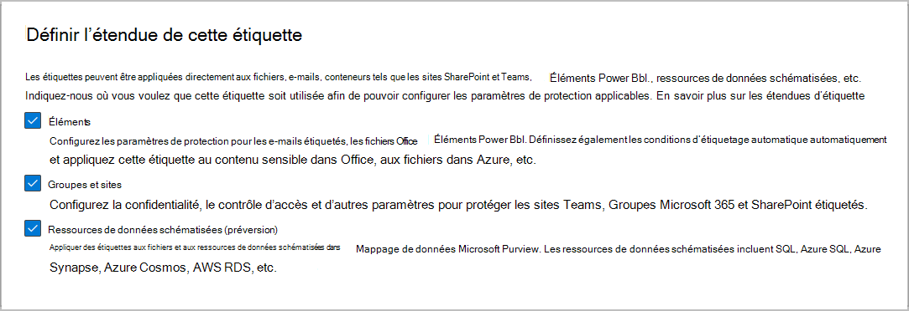

# En savoir plus sur les étiquettes de niveau de confidentialité

>*[Guide de sécurité et conformité pour les licences Microsoft 365](/office365/servicedescriptions/microsoft-365-service-descriptions/microsoft-365-tenantlevel-services-licensing-guidance/microsoft-365-security-compliance-licensing-guidance).*

> [!NOTE]
> Si vous recherchez des informations sur les étiquettes de niveau de confidentialité dans vos applications Office, consultez [Appliquer des étiquettes de confidentialité à vos fichiers et vos e-mails dans Office](https://support.microsoft.com/topic/apply-sensitivity-labels-to-your-files-and-email-in-office-2f96e7cd-d5a4-403b-8bd7-4cc636bae0f9).
>
> Les informations sur cette page sont destinées aux administrateurs informatiques qui peuvent créer et configurer ces étiquettes.

Pour mener à bien leur travail, les membres de votre organisation collaborent avec d’autres personnes internes ou externes à votre organisation. Cela signifie que le contenu n’est plus protégé par un pare-feu : il peut se déplacer partout, sur les appareils, applications et services. Dans ce cas, vous devez sécuriser et protéger l’itinérance, tout en respectant les stratégies métier et de conformité de votre organisation.

Les étiquettes de confidentialité de Protection des données Microsoft Purview vous permettent de classifier et protéger les données de votre organisation, tout en veillant à ce que la productivité des utilisateurs et leur aptitude à collaborer ne soient pas compromises.

Exemple illustrant les étiquettes de confidentialité disponibles dans Excel à partir de l’onglet **Accueil** du ruban. Dans cet exemple, l’étiquette appliquée affiche dans la barre d’état :

Pour appliquer des étiquettes de confidentialité, les utilisateurs doivent être connectés avec leur compte Microsoft 365 professionnel ou scolaire.

> [!NOTE]
> Pour les clients du gouvernement américain, les étiquettes de confidentialité sont prises en charge sur toutes les plateformes.
>
> Si vous utilisez le client d’étiquettes et le scanneur unifiés de Azure Information Protection, consultez la [Description du service public premium Azure Information Protection](/enterprise-mobility-security/solutions/ems-aip-premium-govt-service-description).

Vous pouvez utiliser les étiquettes de niveau de confidentialité aux fins suivantes :
  
- **Fournir des paramètres de protection qui incluent le chiffrement et les marquages de contenu.** Par exemple, appliquez une étiquette « Confidentiel » à un document ou un message électronique, et cette étiquette chiffre le contenu et applique un filigrane « Confidentiel ». Les marquages de contenu comprennent les en-têtes et les pieds de page, ainsi que les filigranes, et le chiffrement peut également limiter les mesures autorisées que les utilisateurs peuvent prendre sur le contenu.

- **Protéger le contenu dans les applications Office sur différents appareils et plateformes.** Pris en charge par Word, Excel, PowerPoint et Outlook sur les applications Office pour ordinateur de bureau et Office sur le web. Pris en charge sur Windows, macOS, iOS et Android.

- **Protéger le contenu dans des applications et des services tiers** à l’aide de Microsoft Defender pour les applications cloud. Avec Defender for Cloud Apps, vous pouvez détecter, classer, étiqueter et protéger du contenu dans des applications et services tiers, tels que SalesForce, Box ou DropBox, même si l’application ou le service tiers ne lit pas ou ne prend pas en charge les étiquettes de confidentialité.

- **Protégez les conteneurs** qui incluent Teams, les groupes Microsoft 365 et les sites SharePoint. Par exemple, définissez les paramètres de confidentialité, l’accès des utilisateurs externes et le partage externe, ainsi que l’accès à partir d’appareils non gérés.

- **Étendre les étiquettes de confidentialité à Power BI** : lorsque vous activez cette fonctionnalité, vous pouvez appliquer et afficher les étiquettes dans Power BI et protéger les données lorsqu’elles sont enregistrées en dehors du service.

- **Étendre les étiquettes de confidentialité aux ressources dans Mappage de données Microsoft Purview** : lorsque vous activez cette fonctionnalité, actuellement en préversion vous pouvez appliquer vos étiquettes de confidentialité aux fichiers et ressources de données schématisées dans Mappage de données Microsoft Purview. Les ressources de données schématisées incluent SQL, Azure SQL, Azure Synapse, Azure Cosmos et AWS RDS.

- **Étendre les étiquettes de confidentialité aux applications et services tiers.** À l’aide du kit de développement logiciel (SDK) Microsoft Information Protection, les applications tierces peuvent lire les étiquettes de confidentialité et appliquer des paramètres de protection.

- **Classifier du contenu sans utiliser les paramètres de protection.** Vous pouvez également simplement affecter une étiquette en tant que résultat d’une classification de contenu. Cette action fournit aux utilisateurs un mappage visuel de classification des noms d’étiquettes de votre organisation et ils peuvent utiliser les étiquettes pour générer des rapports d’usage et afficher les données d’activité pour votre contenu sensible. En se basant sur ces informations, vous pouvez toujours choisir d’appliquer les paramètres de protection plus tard.

Dans tous ces cas, les étiquettes de confidentialité dans Microsoft 365 peuvent vous permettre d’effectuer les bonnes actions sur le bon contenu. Avec les étiquettes de confidentialité, vous pouvez classifier les données dans votre organisation et appliquer les paramètres de protection en fonction de cette classification.

Pour plus d’informations sur ces actions et d’autres scénarios pris en charge par les étiquettes de confidentialité, consultez [Scénarios courants pour les étiquettes de confidentialité](get-started-with-sensitivity-labels.md#common-scenarios-for-sensitivity-labels). De nouvelles fonctionnalités sont constamment développées qui prennent en charge les étiquettes de confidentialité. Vous trouverez donc peut-être utile de faire référence à la [Feuille de route Microsoft 365](https://aka.ms/MIPC/Roadmap).

## Qu’est-ce qu’une étiquette de confidentialité ?

Lorsque vous attribuez une étiquette de confidentialité à du contenu, elle ressemble à un cachet appliqué et est :

- **Personnalisables.** Propres aux besoins de votre organisation et de votre activité, vous pouvez créer des catégories pour différents niveaux de contenu sensible dans votre organisation. Par exemple, vous pouvez commencer par utiliser des étiquettes telles que Personnel, Public, Général, Confidentiel et Hautement confidentiel.

- **Texte clair.** Une étiquette étant stockée sous forme de texte clair dans les métadonnées pour les fichiers et les courriers, les applications et services tiers peuvent la lire, puis appliquer leurs propres actions de protection, le cas échéant.

- **Permanentes.** Une étiquette étant stockée dans des métadonnées pour des fichiers et des courriers, l’étiquette circule avec le contenu, peu importe l’emplacement d’enregistrement ou de stockage. L’identification d’étiquette unique devient la base pour l’application et le respect des stratégies que vous configurez.

Lorsqu’elle est affichée par les utilisateurs, l’étiquette de confidentialité ressemble à une balise sur les applications qu’ils utilisent et elle peut facilement être intégrée à son flux de travail existant.

Chaque élément qui prend en charge les étiquettes de confidentialité peut se voir appliquer une étiquette de confidentialité unique. Les documents et les e-mails peuvent se voir appliquer à la fois une étiquette de confidentialité et une [étiquette de rétention](retention.md#retention-labels).

> [!div class="mx-imgBorder"]
> 

## Fonction des étiquettes de niveau de confidentialité

Une fois qu’une étiquette de confidentialité est appliquée à un e-mail ou à un document, tous les paramètres de protection configurés pour cette étiquette sont appliqués au contenu. Vous pouvez configurer une étiquette de confidentialité pour :

- **Chiffrer** des courriers électroniques et des documents pour empêcher l’accès à ces données par des personnes non autorisées. Vous pouvez en outre choisir les utilisateurs ou le groupe autorisés à effectuer telle ou telle action et la durée de l’autorisation. Par exemple, vous pouvez décider d’autoriser tous les utilisateurs de votre organisation à modifier un document tandis qu’un groupe spécifique d’une autre organisation peut uniquement l’afficher. Par ailleurs, au lieu d’autorisations définies par l'administrateur, vous pouvez autoriser vos utilisateurs à attribuer des autorisations au contenu lorsqu’ils appliquent l’étiquette. 
    
    Pour plus d’informations sur les paramètres de **Chiffrement** lorsque vous créez ou modifiez une étiquette de confidentialité, voir [Restreindre l’accès au contenu en utilisant le chiffrement dans les étiquettes de confidentialité](encryption-sensitivity-labels.md).

- **Marquer le contenu** lorsque vous utilisez des applications Office, en ajoutant filigranes, pieds de page ou en-têtes à des e-mails ou des documents comportant l’étiquette. Vous pouvez appliquer des filigranes aux documents, mais pas aux e-mails. Exemple d’en-tête et de filigrane :
    
    
    
    Les marquages dynamiques sont également pris en charge à l’aide de variables. Par exemple, vous pouvez insérer le nom d’étiquette ou le nom du document dans l’en-tête, le pied de page ou le filigrane. Pour plus d’informations, consultez[Marquages dynamiques avec des variables](sensitivity-labels-office-apps.md#dynamic-markings-with-variables).
    
    Avez-vous besoin de vérifier la date de l’application des marques de contenu ? Veuillez consulter la section [Délai de marquage et de chiffrage de contenus par les applications Office](sensitivity-labels-office-apps.md#when-office-apps-apply-content-marking-and-encryption).
    
    Si vous avez des modèles ou des flux de travail basés sur des documents spécifiques, testez ces documents avec les marquages de contenu que vous avez choisis avant de rendre l’étiquette disponible pour les utilisateurs. Certaines restrictions de longueur de chaîne à connaître :
    
    Les filigranes sont limités à 255 caractères. Les en-têtes et les pieds de page sont limités à 1 024 caractères, sauf dans Excel. Excel présente une limite totale de 255 caractères pour les en-têtes et les pieds de page, mais cette limite inclut des caractères qui ne sont pas visibles, tels que des codes de mise en forme. Si cette limite est atteinte, la chaîne entrée n’apparaît pas dans Excel.

- **Protégez du contenu dans des conteneurs tels que des sites et des groupes** lorsque vous activez la fonctionnalité à [utiliser des étiquettes de confidentialité avec Microsoft Teams, les Groupes Microsoft 365 et les sites SharePoint](sensitivity-labels-teams-groups-sites.md).
    
    Vous ne pouvez pas configurer les paramètres de protection pour les groupes et les sites tant que vous n’activez pas cette fonctionnalité. Cette configuration d’étiquettes ne permet pas aux documents ni aux e-mails d’être automatiquement étiquetés. En lieu et place, les paramètres d’étiquette protègent le contenu en contrôlant l’accès au conteneur dans lequel le contenu est stocké. Ces paramètres incluent les paramètres de confidentialité, l’accès des utilisateurs externes et le partage externe, ainsi que l’accès à partir d’appareils non gérés.

- **Appliquer automatiquement l’étiquette aux fichiers et e-mails, ou recommandez une étiquette.** Choisissez comment identifier les informations sensibles vous souhaitez étiqueter et vous pouvez appliquer l’étiquette automatiquement, ou vous pouvez inviter les utilisateurs à appliquer l’étiquette que vous recommandez. Si vous recommandez une étiquette, l’invite affiche le texte souhaité. Par exemple :
    
    
    
    Pour plus d’informations sur les paramètres d’**Étiquetage automatique des fichiers et des courriers** lorsque vous créez ou modifiez une étiquette de confidentialité, consultez [Appliquer automatiquement une étiquette de confidentialité à du contenu](apply-sensitivity-label-automatically.md) pour les applications Office et [Étiquetage dans Mappage de données Microsoft Purview](/azure/purview/create-sensitivity-label).

- **Définir le type de lien de partage par défaut** pour les sites SharePoint et les documents individuels. Pour éviter que les utilisateurs ne partagent trop de documents, définissez [l'étendue et les autorisations par défaut](sensitivity-labels-default-sharing-link.md) pour le partage de documents à partir de SharePoint et OneDrive.

### Étendues des étiquettes

Lorsque vous créez une étiquette de confidentialité, vous êtes invité à configurer son étendue qui détermine deux aspects :
- Les paramètres d’étiquette que vous pouvez configurer pour cette étiquette
- L’emplacement où l’étiquette sera visible par les utilisateurs

Cette configuration d’étendue vous permet d’utiliser des étiquettes de confidentialité qui s’appliquent uniquement aux documents et e-mails et qui ne peuvent pas être sélectionnées pour les conteneurs. Il en va de même pour les étiquettes de confidentialité qui sont uniquement destinées aux conteneurs et qui ne peuvent pas être sélectionnées pour les documents et les courriers électroniques. Vous pouvez également sélectionner l’étendue des ressources Mappage de données Microsoft Purview :

Par défaut, l’étendue **Fichiers et e-mails** est toujours sélectionnée. Les autres étendues sont sélectionnées par défaut lorsque les fonctionnalités sont activées pour votre client :

- **Groupes et sites** : [activer les étiquettes de confidentialité pour les conteneurs et synchroniser les étiquettes](sensitivity-labels-teams-groups-sites.md#how-to-enable-sensitivity-labels-for-containers-and-synchronize-labels)

- **Ressources de données schématisées** : [étiqueter automatiquement votre contenu dans Mappage de données Microsoft Purview](/azure/purview/create-sensitivity-label)

Si vous modifiez les valeurs par défaut pour que toutes les étendues ne soient pas sélectionnées, vous verrez la première page des paramètres de configuration des étendues que vous n’avez pas sélectionnées, mais vous ne pourrez pas configurer les paramètres. Par exemple, si l’étendue des fichiers et e-mails n’est pas sélectionnée, vous ne pouvez pas sélectionner les options de la page suivante :

Pour ces pages dont les options ne sont pas disponibles, sélectionnez **Suivant** pour continuer. Vous pouvez également sélectionner **Retour** pour modifier l’étendue de l’étiquette.

### Priorité des étiquettes (l’ordre est important)

Lorsque vous créez des étiquettes de niveau de confidentialité dans votre centre d'administration, elles apparaissent sous forme de liste sur l’onglet **Niveau de confidentialité** de la page **Étiquettes**. Dans cette liste, l’ordre des étiquettes est important, car il reflète leur priorité. Il est préférable que l’étiquette de niveau de confidentialité la plus restrictive, telle que Hautement confidentiel, s’affiche en **bas** de la liste, et la moins restrictive, par exemple Public, s’affiche en **haut**.

Vous pouvez appliquer une seule étiquette de confidentialité à un élément tel qu’un document, un e-mail ou un conteneur. Si vous définissez une option obligeant vos utilisateurs à fournir une justification pour la modification d'une étiquette vers une classification plus faible, l’ordre de cette liste identifie les classifications les moins élevées. Toutefois, cette option ne s’applique pas aux sous-étiquettes qui partagent la priorité de leur étiquette parente.

Cependant, l’ordre des sous-étiquettes est utilisé avec l'[étiquetage automatique](apply-sensitivity-label-automatically.md). Lorsque vous configurez les étiquettes pour les appliquer automatiquement ou en tant que recommandation, plusieurs correspondances peuvent se produire pour plus d'une étiquette. Pour déterminer l’étiquette à appliquer ou à recommander, l’ordre d’étiquettes est utilisé : la dernière étiquette de confidentialité est sélectionnée, puis, le cas échéant, la dernière sous-étiquette.

### Sous-étiquettes (regroupement d’étiquettes)

Avec les sous-étiquettes, vous pouvez regrouper plusieurs étiquettes sous une étiquette parente visible par l’utilisateur dans une application Office. Par exemple, sous Confidentiel, votre organisation peut utiliser différentes étiquettes pour des types spécifiques de cette classification. Dans cet exemple, comme l’étiquette Confidentiel parente est simplement une étiquette de texte sans paramètre de protection et comme elle a des sous-étiquettes, elle ne peut pas être appliquée au contenu. Dans ce cas, les utilisateurs doivent sélectionner Confidentiel pour afficher les sous-étiquettes, puis choisir une sous-étiquette à appliquer au contenu.

Les sous-étiquettes sont simplement un moyen de présenter des étiquettes à des utilisateurs dans des groupes logiques. Les sous-étiquettes n’héritent pas des paramètres de leur étiquette parent. Lorsque vous publiez une sous-étiquette pour un utilisateur, celui-ci peut ensuite l’appliquer au contenu, mais il ne peut pas uniquement employer l’étiquette parente.

Ne choisissez pas une étiquette parent en tant qu’étiquette par défaut ou configurez une étiquette parent pour qu’elle soit automatiquement appliquée (ou recommandée). Dans le cas contraire, l’étiquette parent ne sera pas appliquée au contenu.

Exemple d’affichage de sous-étiquettes pour les utilisateurs :

### Modification ou suppression d’une étiquette de niveau de confidentialité

Si vous supprimez une étiquette de confidentialité à partir de votre Centre d'administration, celle-ci n’est pas automatiquement supprimée du contenu et les paramètres de protection restent appliqués au contenu sur lequel l'étiquette a été appliquée.

Si vous modifiez une étiquette de sensibilité, la version de celle-ci qui était appliquée au contenu reste appliquée.

## Fonction des stratégies d’étiquette

Après avoir créé vos étiquettes de confidentialité, vous devez les publier pour les mettre à disposition des personnes et des services de votre organisation. Les étiquettes de confidentialité peuvent ensuite être appliquées aux documents et aux e-mails Office, ainsi qu’à d’autres éléments qui prennent en charge les étiquettes de confidentialité. 

Contrairement aux étiquettes de rétention qui sont publiées dans des emplacements comme les boîtes aux lettres Exchange, les étiquettes de confidentialité sont publiées pour les utilisateurs ou les groupes. Les applications qui prennent en charge les étiquettes de confidentialité peuvent ensuite les afficher à ces utilisateurs et groupes sous forme d’étiquettes appliquées ou d’étiquettes qu’ils peuvent appliquer.

Lorsque vous configurez une stratégie d’étiquette, vous pouvez :

- **Choisissez les utilisateurs et les groupes pouvant voir les étiquettes.** Les étiquettes peuvent être publiées vers un utilisateur ou un groupe de sécurité à extension de courrier, à un groupe de distribution ou à un groupe Microsoft 365 (pouvant avoir [l’appartenance dynamique](/azure/active-directory/users-groups-roles/groups-create-rule)) dans Azure AD.

- **Spécifiez une étiquette** par défaut pour les documents et les e-mails non étiquetés, les nouveaux conteneurs (lorsque vous avez [activé les étiquettes de sensibilité pour Microsoft Teams, les groupes Microsoft 365 et les sites SharePoint](sensitivity-labels-teams-groups-sites.md)), ainsi qu'une étiquette par défaut pour le [contenu Power BI](/power-bi/admin/service-security-sensitivity-label-default-label-policy). Vous pouvez spécifier la même étiquette pour les quatre types d’éléments ou des étiquettes différentes. Les utilisateurs peuvent modifier l’étiquette de sensibilité par défaut appliquée pour mieux correspondre à la sensibilité de leur contenu ou conteneur.
    
    > [!NOTE]
    > En préversion pour les applications Office qui utilisent des étiquettes intégrées : ce paramètre prend désormais en charge les documents existants lorsqu’ils sont ouverts par les utilisateurs, ainsi que les nouveaux documents. Ce changement de comportement assure la parité avec le client d’étiquetage unifié Azure Information Protection. Pour plus d’informations sur le déploiement par application et les versions minimales, consultez le [tableau des fonctionnalités](sensitivity-labels-office-apps.md#sensitivity-label-capabilities-in-word-excel-and-powerpoint) pour Word, Excel et PowerPoint.
    
    Utilisez une étiquette par défaut pour définir des paramètres de protection de base à appliquer à votre contenu. Il faut noter que, sans formation des utilisateurs ou autres contrôles, ce paramètre peut également entraîner un étiquetage incorrect. Il est déconseillé de sélectionner une étiquette qui applique un chiffrement comme étiquette par défaut pour les documents. Par exemple, de nombreuses organisations doivent envoyer et partager des documents avec des utilisateurs externes qui ne possèdent peut-être pas des applications qui prennent en charge le chiffrement ou qui n’utilisent pas un compte pouvant être autorisé. Pour plus d’informations sur ce scénario, consultez [Partage de documents chiffrés avec des utilisateurs externes](sensitivity-labels-office-apps.md#sharing-encrypted-documents-with-external-users).
    
    > [!IMPORTANT]
    > Lorsque vous avez des [sous-étiquettes](#sublabels-grouping-labels), veillez à ne pas configurer l’étiquette parente comme étiquette par défaut.

- **Demander une justification pour une modification d'étiquette.** Si un utilisateur tente de supprimer une étiquette ou de la remplacer par une étiquette ayant un rang inférieur, vous pouvez exiger que l'utilisateur justifie cette action. Par exemple, un utilisateur ouvre un document étiqueté Confidentiel (rang 3) et remplace cette étiquette par avec une autre nommée Public (rang 1). Pour les applications Office, cette invite de justification est déclenchée une fois par session d’application lorsque vous utilisez l’étiquetage intégré et par fichier lorsque vous utilisez le client d’étiquetage unifié Azure Information Protection. Les administrateurs peuvent lire le motif de justification ainsi que le changement d’étiquette dans [explorateur des activités](data-classification-activity-explorer.md).

    

- **Demandez aux utilisateurs d’appliquer une étiquette** aux documents et aux e-mails, uniquement aux documents, pour les conteneurs et le contenu Power BI. Également connues sous le nom d'étiquetage obligatoire, ces options permettent d’assurer qu’une étiquette soit appliquée avant que les utilisateurs puissent enregistrer des documents, envoyer des e-mails, créer des groupes ou des sites et lorsqu’ils utilisent du contenu non étiqueté pour Power BI.
    
    Pour les documents et les e-mails, une étiquette peut être attribuée manuellement par l’utilisateur, automatiquement suite à une condition que vous configurez, ou être attribuée par défaut (l’option d’étiquette par défaut précédemment décrite). Un exemple d’invite présenté dans Outlook lorsqu’un utilisateur doit attribuer une étiquette :

    
    
    Pour plus d’informations sur l’étiquetage obligatoire des documents et des e-mails, consultez [Demander aux utilisateurs d’appliquer une étiquette à leurs e-mails et documents](sensitivity-labels-office-apps.md#require-users-to-apply-a-label-to-their-email-and-documents).
    
    Pour les conteneurs, une étiquette doit être attribuée au moment de la création du groupe ou du site.
    
    Pour plus d’informations sur l’étiquetage obligatoire pour Power BI, consultez [Stratégie d’étiquette obligatoire pour Power BI](/power-bi/admin/service-security-sensitivity-label-mandatory-label-policy).
    
    Envisagez d’utiliser cette option pour vous permettre d'augmenter la couverture d’étiquetage. Il faut noter que, sans formation des utilisateurs, ces paramètres peuvent entraîner un étiquetage incorrect. De plus, sauf si vous avez également défini une étiquette correspondante par défaut, l’étiquetage obligatoire risque de contrarier vos utilisateurs qui reçoivent de fréquentes invites.

- **Fournir un lien d’aide vers une page d’aide personnalisée.** Si vos utilisateurs ne sont pas sûrs de savoir ce que signifient vos étiquettes de confidentialité ou comment elles doivent être utilisées, vous pouvez fournir une URL de type En savoir plus, qui apparaît en bas du menu **Étiquette de confidentialité** dans les applications Office :

    

Les nouvelles étiquettes de confidentialité s’affichent dans les applications Office des utilisateurs, après la création d’une stratégie d’étiquettes les attribuant aux utilisateurs et aux groupes. Veuillez patienter jusqu’à 24 heures pour que les modifications s’appliquent dans votre organisation.

Vous pouvez créer et publier autant d’étiquettes de confidentialité que vous le souhaitez, à une exception près : si l’étiquette applique le chiffrement qui spécifie les utilisateurs et les autorisations, un maximum de 500 étiquettes est pris en charge avec cette configuration. Toutefois, dans le but de diminuer les frais généraux de l’administration et de réduire la complexité pour vos utilisateurs, tentez d’utiliser un nombre minimal d’étiquettes. Les déploiements en temps réel ont démontré l’efficacité notable d’une réduction lorsque les utilisateurs ont plus de cinq étiquettes principales ou plus de cinq sous-étiquettes par étiquette principale.

### Stratégie de priorité des étiquettes (l’ordre est important)

Pour rendre vos étiquettes de confidentialité accessibles aux utilisateurs, vous devez les publier dans une stratégie de confidentialité d’étiquette qui apparaît dans une liste sous l’onglet **Stratégies de confidentialité** sur la page **Stratégies d’étiquettes**. À l’instar des étiquettes de confidentialité (voir la section [Priorité des étiquettes (l’ordre est important)](#label-priority-order-matters)), l’ordre des stratégies d’étiquette de confidentialité est important, car il reflète leur priorité. La stratégie d’étiquette dont la priorité est la plus faible est affichée **en haut**, et celle dont la priorité est la plus haute est affichée **en bas**.

Une stratégie d’étiquette comprend les éléments suivants :

- un groupe d’étiquettes.
- les utilisateurs et les groupes auxquels la stratégie sera attribuée avec des étiquettes.
- l’étendue de la stratégie et des paramètres de stratégie pour cette étendue (comme l’étiquette par défaut pour les fichiers et les e-mails).

Vous pouvez inclure un utilisateur dans plusieurs stratégies d’étiquette, et celui-ci pourra voir toutes les étiquettes de confidentialité et paramètres de ces stratégies. En cas de conflit dans les paramètres de plusieurs stratégies, les paramètres de la stratégie ayant la priorité la plus élevée (position la plus forte) sont appliqués. En d’autres termes, la priorité la plus élevée l’emporte pour chaque paramètre.

Si vous ne voyez pas l’étiquette ou le paramètre de stratégie d’étiquette attendu pour un utilisateur ou un groupe, vérifiez l’ordre des stratégies d’étiquette de confidentialité. Vous devrez peut-être déplacer la stratégie vers le bas. Pour réorganiser les stratégies d’étiquette, sélectionnez une stratégie d’étiquette de confidentialité > sélectionnez les points de suspension sur la droite > **Descendre** ou **Monter**.

> [!NOTE]
> N’oubliez pas : en cas de conflit de paramètres pour un utilisateur à qui plusieurs stratégies ont été affectées, le paramètre de la stratégie ayant la priorité la plus élevée (position la plus faible) est appliqué.

## Étiquettes de niveau de confidentialité et étiquettes Azure Information Protection

Les étiquettes de confidentialité intégrées à Microsoft 365 Apps sur Windows, macOS, iOS et Android s’affichent et se comportent très de la même façon sur ces appareils pour offrir aux utilisateurs une expérience d’étiquetage cohérente. Toutefois, sur les ordinateurs Windows, vous pouvez également utiliser le client [Azure Information Protection (AIP)](/azure/information-protection/rms-client/aip-clientv2). Ce client est désormais en [mode maintenance](https://techcommunity.microsoft.com/t5/security-compliance-and-identity/announcing-aip-unified-labeling-client-maintenance-mode-and/ba-p/3043613).

Si vous utilisez le client AIP, consultez [Pourquoi choisir l’étiquetage intégré AIP sur le complément AIP pour les applications Office](sensitivity-labels-aip.md) pour comprendre et gérer vos choix d’étiquetage pour les ordinateurs Windows.

### Étiquettes Azure Information Protection

> [!NOTE]
> La gestion d’étiquetage pour les étiquettes Azure Information Protection dans le Portail Azure a été retirée le **31 mars 2021**. En savoir plus dans l’[Avis de désapprobation](https://techcommunity.microsoft.com/t5/azure-information-protection/announcing-timelines-for-sunsetting-label-management-in-the/ba-p/1226179) officiel.

Si votre client n’est pas encore sur la [plateforme d’étiquetage unifié](/azure/information-protection/faqs#how-can-i-determine-if-my-tenant-is-on-the-unified-labeling-platform), vous devez d’abord activer l’étiquette unifiée avant d’utiliser des étiquettes de confidentialité. Pour voir les instructions, consultez [Migration des étiquettes Azure Information Protection vers des étiquettes de confidentialité unifiées](/azure/information-protection/configure-policy-migrate-labels).

## Les étiquettes de confidentialité et SDK Microsoft Information Protection

Une étiquette de confidentialité étant stockée dans les métadonnées d’un document, les applications et services tiers peuvent lire et écrire dans ces métadonnées d'étiquetage pour compléter votre déploiement d’étiquetage. Par ailleurs, les développeurs de logiciels peuvent utiliser le kit de développement logiciel (SDK) [Microsoft Information Protection](/information-protection/develop/overview#microsoft-information-protection-sdk) pour prendre en charge les fonctionnalités d’étiquetage et de chiffrement sur plusieurs plateformes. Pour en savoir plus, voir [l'annonce de la disponibilité générale sur le blog de la Communauté technique](https://techcommunity.microsoft.com/t5/Microsoft-Information-Protection/Microsoft-Information-Protection-SDK-Now-Generally-Available/ba-p/263144). 

Vous pouvez également en savoir plus sur les [solutions de partenaires intégrées à Protection des données Microsoft Purview](https://techcommunity.microsoft.com/t5/Azure-Information-Protection/Microsoft-Information-Protection-showcases-integrated-partner/ba-p/262657).

## Instructions de déploiement

Pour la planification et les instructions relatives au déploiement, notamment les informations relatives aux licences, les autorisations, la stratégie de déploiement, une liste de scénarios pris en charge et la documentation de l’utilisateur final, consultez [Prise en main des étiquettes de confidentialité](get-started-with-sensitivity-labels.md).

Pour découvrir comment utiliser des étiquettes de confidentialité afin de respecter les réglementations en matière de confidentialité des données, voir [Déployer la protection des informations pour les réglementations en matière de confidentialité des données avec Microsoft 365](../solutions/information-protection-deploy.md)  (aka.ms/m365dataprivacy).
