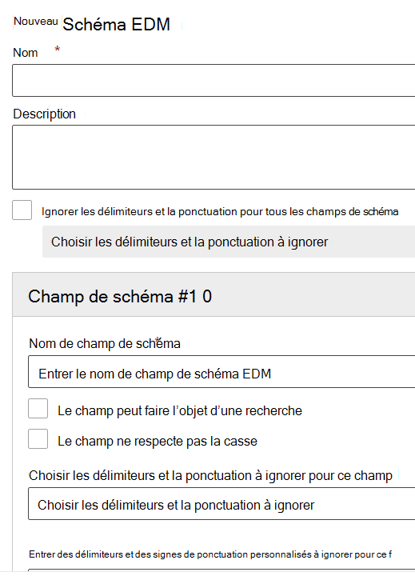

# Utiliser l’Assistant de schéma de correspondance exacte des données et de type d’informations sensibles

La [Création d’un type d’informations sensibles personnalisé à l’aide d’une classification de correspondance exacte des données (EDM)](create-custom-sensitive-information-types-with-exact-data-match-based-classification.md) implique de nombreuses étapes.  Vous pouvez utiliser cet Assistant pour créer votre schéma et vos fichiers de modèle de type d’informations sensibles (SIT) (package de règles) pour simplifier le processus.

> [!NOTE]
> L’Assistant de schéma de correspondance exacte des données et de type d’informations sensibles est disponible uniquement pour les nuages mondiaux et GCC.

Cet Assistant peut être utilisé à la place des étapes suivantes :

- [Définir le schéma de votre base de données d’informations sensibles](create-custom-sensitive-information-types-with-exact-data-match-based-classification.md#define-the-schema-for-your-database-of-sensitive-information)
- [Configurer un modèle (package de règles)](create-custom-sensitive-information-types-with-exact-data-match-based-classification.md#set-up-a-rule-package)

dans [Partie 1 : configurer la classification EDM](create-custom-sensitive-information-types-with-exact-data-match-based-classification.md#part-1-set-up-edm-based-classification).

## Conditions préalables

1. Familiarisez-vous avec les étapes de création d’un type d’informations sensibles personnalisées avec le [flux de travail EDM en un clin d’œil](create-custom-sensitive-information-types-with-exact-data-match-based-classification.md#the-work-flow-at-a-glance).

2. Effectuez les étapes de [l’étape Enregistrer les données sensibles .csv au format .tsv](create-custom-sensitive-information-types-with-exact-data-match-based-classification.md#save-sensitive-data-in-csv-or-tsv-format).

## Utiliser l’Assistant de schéma de correspondance exacte des données et de type d’informations sensibles

1. Dans le Centre de conformité Microsoft 365 pour votre client, accédez à **Classification des données** > **Correspondances exactes des données**.

2. Choisissez **Créer un schéma EDM** pour ouvrir le menu volant de configuration de l’Assistant de schéma.

3. Indiquez un nom **approprié** et **Description**.

4. Choisissez **Ignorer les délimiteur et la ponctuation pour tous** les champs de schéma si vous souhaitez ce comportement. Pour en savoir plus sur la configuration d’EDM pour ignorer les cas ou les délimiteur, voir Création d’un type d’informations sensibles personnalisé avec la [classification EDM (Exact Data Match).](create-custom-sensitive-information-types-with-exact-data-match-based-classification.md)

5. Renseignez les valeurs souhaitées pour votre **Champ de schéma n° 1** et ajoutez des champs si nécessaire. 

> [!IMPORTANT]
> Au moins un champ, mais pas plus de cinq, doivent être désignés comme pouvant faire l’objet d’une recherche.

6. Cliquez sur Enregistrer. Votre schéma figure désormais dans la liste.

7. Choisissez **Types d’informations sensibles EDM** et **Créer un type d’informations sensibles EDM** pour ouvrir l’Assistant de configuration des types d’informations sensibles.

8. Choisissez **Choisir un schéma EDM existant** puis sélectionnez le schéma que vous avez créé dans les étapes 2-6 dans la liste.

9. Choisissez **Suivant**, puis **Créer un modèle**.

10. Choisissez le **Niveau de confiance** et l’**Élément principal**.  Pour en savoir plus sur la configuration d’un modèle, voir [Créer un type d’informations sensibles personnalisé dans le Centre de conformité](create-a-custom-sensitive-information-type.md).

11.  Choisissez le **Type d’informations sensibles de l’élément principal** à associer. Voir [Définitions des entités de types d’informations sensibles](sensitive-information-type-entity-definitions.md) pour en savoir plus sur les types d’informations sensibles disponibles.

12. Choisissez **Terminé**.

13. Choisissez vos **Niveau de confiance et proximité des caractères** souhaités.  Il s’agit de la valeur par défaut pour l’ensemble du type d’informations sensibles EDM.

13. Choisissez **Créer un modèle** si vous souhaitez créer des modèles supplémentaires pour votre type d’informations sensibles EDM.

14. Choisissez **Suivant**, puis entrez un **Nom** et une **Description pour les administrateurs**.

15. Passez en revue vos paramètres, puis sélectionnez **Envoyer**.

Vous pouvez supprimer ou modifier le modèle de type d’informations sensibles en le sélectionnant. Cela permet d’afficher les contrôles de modification et de suppression.

> [!IMPORTANT]
> Si vous voulez supprimer un schéma et que celui-ci est déjà associé à un type d’informations sensibles EDM, vous devez commencer par supprimer le type d’informations sensibles EDM. Vous pouvez ensuite supprimer le schéma.

## Étapes de publication de la création

Une fois que vous avez utilisé cet Assistant pour créer vos fichiers de schéma et modèle EDM (package de règles), vous devez continuer à effectuer les étapes décrites dans [Partie 2 : hacher et charger les données sensibles](create-custom-sensitive-information-types-with-exact-data-match-based-classification.md#part-2-hash-and-upload-the-sensitive-data) avant de pouvoir utiliser le type d’informations sensibles personnalisé EDM.

Après avoir vérifié que votre table d’informations sensibles a été correctement téléchargée, vous pouvez vérifier qu’elle fonctionne correctement.

1. Ouvrez **le Centre de conformité** Types  >  **d’informations**  >  **sensibles de classification des données.**
2. Sélectionnez votre sit EDM dans la liste, puis **sélectionnez Tester** dans le volet volant. 
3. Télécharger un élément qui contient des données que vous souhaitez détecter, par exemple, créez un élément qui contient certaines des données de votre table d’informations sensibles. Si vous avez utilisé la fonctionnalité de correspondance configurable dans votre schéma pour définir des délimiteur ignorés, assurez-vous que l’élément inclut des exemples avec et sans ces délimiteur.
4. Une fois le fichier téléchargé et analysé, recherchez les correspondances avec votre sit EDM.
5. Si la **fonction Test** dans la fonction SIT détecte une correspondance, vérifiez qu’elle ne le coupe pas ou ne l’extrait pas de manière incorrecte. Par exemple, en extrayant uniquement une sous-chaîne de la chaîne complète qu’elle est supposée détecter, ou en sélectionnant uniquement le premier mot d’une chaîne de plusieurs mots, ou en incluant des symboles ou des caractères supplémentaires dans l’extraction. Voir [Langage des expressions régulières - Référence rapide pour](/dotnet/standard/base-types/regular-expression-language-quick-reference) la référence du langage d’expression régulière. 

### Résolution des problèmes

Si vous ne trouvez aucune correspondance, essayez ce qui suit :
- Confirmez que vos données sensibles ont été téléchargées correctement à l’aide des commandes expliquées dans les instructions de téléchargement de vos données sensibles à l’aide de [l’outil EDM](create-custom-sensitive-information-types-with-exact-data-match-based-classification.md).
- Vérifiez que les exemples que vous avez entrés dans l’élément sont présents dans votre table d’informations sensibles et que les délimiteur ignorés sont corrects.
- **Testez** la fonction SIT que vous avez utilisée lorsque vous avez configuré l’élément principal dans chacun de vos modèles. Cela permettra de confirmer que la sit est en mesure de correspondre aux exemples de l’élément. 
  -  Si le sit que vous avez sélectionné pour un élément principal dans le type EDM ne trouve pas de correspondance dans l’élément ou trouve moins de correspondances que prévu, vérifiez qu’il prend en charge les séparateurs et les délimiteurs qui existent dans le contenu. N’oubliez pas d’inclure les délimiteur ignorés définis dans votre schéma. 
  -  Si la **fonction Test** ne détecte aucun contenu, vérifiez si la fonction SIT que vous avez sélectionnée inclut des exigences pour des mots clés supplémentaires ou d’autres validations. Pour les sits intégrées, voir définitions d’entité des types d’informations [sensibles](sensitive-information-type-entity-definitions.md) pour vérifier les conditions minimales requises pour la correspondance de chaque type.
