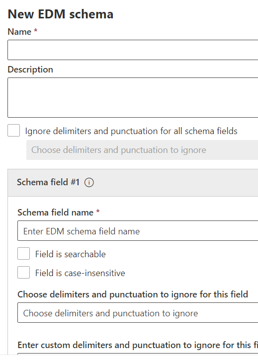

# <a name="create-the-schema-for-exact-data-match-based-sensitive-information-types"></a>Créer le schéma pour les types d’informations sensibles basés sur des correspondances de données exactes

Vous pouvez créer le schéma et EDM SIT à l’aide de l’Assistant Utilisation manuelle du schéma de correspondance de données exactes et du [modèle de type d’informations](#use-the-exact-data-match-schema-and-sensitive-information-type-pattern-wizard) [sensibles](#create-exact-data-match-schema-manually-and-upload). Vous pouvez également combiner les deux à l’aide d’une méthode pour créer le schéma et le modifier ultérieurement à l’aide de l’autre méthode.

Si vous n’êtes pas familiarisé avec la fonction SITS basée sur EDM ou leur implémentation, vous devez vous familiariser avec :

- [En savoir plus sur les types d’informations confidentielles](sensitive-information-type-learn-about.md#learn-about-sensitive-information-types).
- [En savoir plus sur les types d’informations sensibles exacts basés sur la correspondance de données](sit-learn-about-exact-data-match-based-sits.md#learn-about-exact-data-match-based-sensitive-information-types)
- [Démarrage avec des types d’informations sensibles basés sur des correspondances de données exactes](sit-get-started-exact-data-match-based-sits-overview.md#get-started-with-exact-data-match-based-sensitive-information-types)

Un schéma EDM unique peut être utilisé dans plusieurs types d’informations sensibles qui utilisent la même table de données sensibles. Vous pouvez créer jusqu’à 10 schémas EDM différents dans un Microsoft 365 client.

## <a name="working-with-specific-types-of-data"></a>Utilisation de types de données spécifiques

Pour des raisons de performances, il est essentiel d’utiliser des modèles qui réduisent le nombre de correspondances inutiles. Par exemple, vous pouvez utiliser un type d’informations sensibles basé sur l’expression régulière.

`\b\w*\b`

Cela correspond à chaque mot ou numéro dans un document ou un e-mail. Ainsi, le service est surchargé de correspondances et ne détecte pas les correspondances vraies. L’utilisation de modèles plus précis permet d’éviter cette situation. Voici quelques recommandations pour identifier la bonne configuration pour certains types de données courants.

**Adresses e-mail** : les adresses de messagerie peuvent être faciles à identifier, mais comme elles sont si courantes dans le contenu, elles peuvent entraîner une charge importante dans le système si elles sont utilisées comme champ principal. Utilisez-les uniquement comme preuves secondaires. S’ils doivent être utilisés comme preuve principale, essayez de définir un type `From` `To` d’informations sensibles personnalisé qui utilise une logique pour exclure leur utilisation en tant que ou champs dans les e-mails, et pour exclure ceux avec l’adresse de messagerie de votre entreprise afin de réduire le nombre de chaînes inutiles qui doivent être respectées.

**Téléphone :** les Téléphone peuvent être disponibles dans différents formats, y compris ou excluant les préfixes de pays, les indicatifs régionaux et les séparateurs. Pour réduire les faux négatifs tout en conservant la charge minimale, utilisez-les uniquement comme éléments secondaires, excluez tous les séparateurs probables, tels que les parenthèses et les tirets, et incluez uniquement dans votre table de données sensibles la partie qui sera toujours présente dans le numéro de téléphone.

Noms de personnes : n’utilisez pas les noms des personnes comme éléments principaux si vous utilisez un type **d’informations** sensibles basé sur une expression régulière comme élément de classification pour ce type EDM, car ils sont difficiles à distinguer des mots courants.

Si vous devez utiliser un élément principal difficile à identifier avec un modèle spécifique, comme un nom de code de projet qui peut générer de nombreuses correspondances à traiter, veillez à inclure des mots clés dans le type d’informations sensibles que vous utilisez comme élément de classification pour votre type EDM. Par exemple, si vous utilisez des noms de code de projet qui peuvent être des mots ordinaires, `project` vous pouvez utiliser le mot comme preuve supplémentaire à proximité du modèle basé sur les expressions régulières du nom de projet dans le type sensible utilisé comme élément de classification pour votre type EDM. Vous pouvez également envisager d’utiliser un type sensible basé sur un dictionnaire normal comme élément de classification pour votre EDM SIT.

Lorsque vous essayez de faire correspondre des chaînes numériques, spécifiez les plages de nombres autorisées, telles que le nombre de chiffres ou les chiffres de début, si elles sont connues. Si vous devez faire correspondre une plage de nombres relativement flexible, vous pouvez utiliser des mots clés dans la sit de base pour réduire le nombre de correspondances. Par exemple, si vous essayez de faire correspondre des numéros de compte composés de 7 à 11 chiffres, `account`ajoutez les mots , `customer``acct.` au sit comme preuve supplémentaire requise. Cela réduit la probabilité de correspondances inutiles qui peuvent entraîner le dépassement des limites de correspondances à traiter par EDM.

Si un champ que vous devez utiliser comme élément principal suit un modèle simple qui peut provoquer un grand nombre de correspondances et que vous ne pouvez pas ajouter la présence de mots clés comme preuve supplémentaire dans le type d’informations sensibles, vous pouvez également exiger un nombre minimal d’occurrences de ce modèle. Par exemple, vous pouvez utiliser un type d’informations sensibles personnalisé défini de la manière suivante pour détecter au moins 29 autres nombres à cinq chiffres entourant un nombre à cinq chiffres potentiel à mettre en correspondance avec EDM :

```xml
 <Entity id="98703510-18b3-43d4-961f-15317594beb7"
                  patternsProximity="300"
                  recommendedConfidence="85"
                  relaxProximity="false">
                  <Pattern confidenceLevel="85"
                              proximity="300">
                              <IdMatch idRef="MRN"/>
                              <Match idRef="30 AccountNrs"
                                    minCount="30"
                                    proximity="3000"
                                    uniqueResults="true"/>
                  </Pattern>
      </Entity>
      <Regex id="30 AccountNrs">\d{5}</Regex>
```

Dans certains cas, vous pouvez être tenu d’identifier certains numéros d’identification de compte ou d’enregistrement qui, pour des raisons historiques, ne suivent pas un modèle standardisé. Par exemple, peut `Medical Record Numbers` être composée de nombreuses permutations différentes de lettres et de chiffres au sein de la même organisation. Même s’il peut être difficile au départ d’identifier un modèle, une inspection plus approfondie vous permet souvent de affiner un modèle qui décrit toutes les valeurs valides sans provoquer un nombre excessif de correspondances non valides. Par exemple, il peut être détecté que « tous les MRN ont au moins sept caractères, qu’ils ont au moins deux chiffres et que s’ils ont des lettres, ils commencent par un ». La création d’une expression régulière basée sur ces critères doit vous permettre de minimiser les correspondances inutiles tout en capturant toutes les valeurs souhaitées, et une analyse plus approfondie peut permettre une meilleure précision en définissant des modèles distincts qui décrivent différents formats.

## <a name="use-the-exact-data-match-schema-and-sensitive-information-type-wizard"></a>Utiliser l’Assistant de schéma de correspondance exacte des données et de type d’informations sensibles

Vous pouvez utiliser cet Assistant pour simplifier le processus de création de fichier de schéma.

## <a name="pre-requisites"></a>Conditions préalables

- Effectuez les étapes de [l’exportation des données sources pour le type d’informations sensibles de correspondance exacte.](sit-get-started-exact-data-match-export-data.md#export-source-data-for-exact-data-match-based-sensitive-information-type)

## <a name="use-the-exact-data-match-schema-and-sensitive-information-type-pattern-wizard"></a>Utiliser l’Assistant de schéma de correspondance exacte des données et de type d’informations sensibles

1. Dans le centre Microsoft 365 conformité de votre client, allez à La **classification** >  des **donnéesExact correspond aux** **schémasEDM** > .

2. Choisissez **Créer un schéma EDM** pour ouvrir le menu volant de configuration de l’Assistant de schéma.

   

3. Indiquez un nom **approprié** et **Description**.

4. **Sélectionnez Ignorer les délimiteur et la ponctuation** pour tous les champs de schéma si vous souhaitez ce comportement pour l’ensemble du schéma. Pour en savoir plus sur la configuration d’EDM pour ignorer la case ou les délimiteurs, voir Utilisation des champs [caseInsensitive et ignoredDelimiters](#using-the-caseinsensitive-and-ignoreddelimiters-fields) pour plus d’informations sur cette fonctionnalité.

5. Renseignez les valeurs souhaitées pour votre **Champ de schéma n° 1** et ajoutez des champs si nécessaire. Chaque champ de schéma doit être identique aux en-têtes de colonne dans votre fichier de source d’informations sensibles.

6. Si vous le souhaitez, définissez les valeurs par champ pour :
    1. **Le champ est utilisable dans une recherche**
    1. **Le champ ne doit pas être sensible à la cas**
    1. **Choisissez des délimiteur et des signes de ponctuation à ignorer pour ce champ**
    1. **Entrez des délimiteur et des signes de ponctuation personnalisés pour ce champ**

   > [!IMPORTANT]
   > Au moins un champ, mais pas plus de cinq, doivent être désignés comme pouvant faire l’objet d’une recherche.

7. Cliquez sur **Enregistrer**. Votre schéma sera désormais répertorié et disponible pour utilisation.

   > [!IMPORTANT]
   > Si vous voulez supprimer un schéma et que celui-ci est déjà associé à un type d’informations sensibles EDM, vous devez commencer par supprimer le type d’informations sensibles EDM. Vous pouvez ensuite supprimer le schéma. La suppression d’un schéma associé à un magasin de données supprime également le magasin de données dans les 24 heures.

## <a name="export-of-the-edm-schema-file-in-xml-format"></a>Exportation du fichier de schéma EDM au format XML

Si vous avez créé le schéma EDM dans l’Assistant Schéma EDM, vous devez exporter le fichier de schéma EDM au format XML. Vous en aurez besoin dans le hachage et téléchargez la table des sources d’informations sensibles pour la phase de [correspondance exacte des types d’informations sensibles](sit-get-started-exact-data-match-hash-upload.md#hash-and-upload-the-sensitive-information-source-table-for-exact-data-match-sensitive-information-types) .

1. [Se connecter à l’interface PowerShell du Centre de sécurité et conformité](/powershell/exchange/connect-to-scc-powershell).

2. Pour exporter le fichier de schéma EDM, utilisez la syntaxe suivante :

   ```powershell
   $Schema = Get-DlpEdmSchema -Identity "[your EDM Schema name]"
   Set-Content -Path ".\Schemafile.xml" -Value $Schema.EdmSchemaXML
   ```

3. Enregistrez ce fichier pour une utilisation ultérieure.

## <a name="create-exact-data-match-schema-manually-and-upload"></a>Créer manuellement un schéma de correspondance de données exact et télécharger

Dans le fichier de schéma, configurez une entrée pour chaque colonne de la table des sources d’informations sensibles à l’aide de la syntaxe :

```xml
<Field name="FieldName" searchable="true/false" caseInsensitive="true/false" ignoredDelimiters="delimiter characters" />
```

### <a name="using-the-caseinsensitive-and-ignoreddelimiters-fields"></a>Utilisation des champs caseInsensitive et ignoredDelimiters

L’exemple de schéma XML suivant utilise les champs *caseInsensitive* et *ignoredDelimiters* .

Lorsque vous incluez le *champ caseInsensitive* `true` sur la valeur de votre définition de schéma, EDM n’exclut pas un élément en fonction des différences de cas. Par exemple, EDM verra les valeurs **FOO-1234** et **fOo-1234** comme étant identiques pour le `PatientID` champ.

Lorsque vous incluez *le champ ignoredDelimiters avec les caractères* pris en charge, EDM ignore ces caractères. Par exemple, EDM verra les valeurs **FOO-1234** et **FOO#1234** comme étant identiques pour le `PatienID` champ.

Dans cet exemple, `caseInsensitive` `ignoredDelimiters` où les deux et sont utilisés, EDM considère **foO-1234** et **fOo#1234** comme identiques et classifie l’élément en tant que type d’informations sensibles d’enregistrement patient.

Ces deux paramètres sont utilisés par champ.

> [!IMPORTANT]
> Si vous configurez  des espaces à ignorer, cela ne sera efficace que pour les colonnes de champ principal et pour lesquelles un type d’informations sensibles qui peut détecter les chaînes multi-mots est défini. Sinon, la comparaison sera réalisée par rapport à chaque mot individuel du contenu analysé.

*L’indicateur ignoredDelimiters prend* en charge tout caractère non alphanumérique, voici quelques exemples :

- \.
- \-
- \/
- \_
- \*
- \^
- \#
- \!
- \?
- \[
- \]
- \{
- \}
- \\
- \~
- \;

L’indicateur `ignoredDelimiters` ne prend pas en charge :

- Les caractères 0 à 9
- A-Z
- a-z
- \"
- \,

> [!IMPORTANT]
> Lors de la définition de votre type d’informations sensibles EDM, *ignoreDelimiters* n’affecte pas la façon dont le type d’informations sensibles Classification associé à l’élément principal dans un modèle EDM identifie le contenu d’un élément. Ainsi, si vous configurez *ignoreDelimiters* pour un champ utilisable dans une recherche, vous devez vous assurer que le type d’informations sensibles utilisé pour un élément principal basé sur ce champ sélectionnera les chaînes avec et sans ces caractères présents.
>
> Le nombre de colonnes dans votre table de sources d’informations sensibles et le nombre de champs de votre schéma doivent correspondre, l’ordre n’a pas d’importance.

1. Définissez le schéma au format XML (comme dans notre exemple ci-dessous). Nommez ce fichier de **edm.xml** et configurez-le de telle façon que pour chaque colonne de la table des sources d’informations sensibles, une ligne utilise la syntaxe :

      `\<Field name="" searchable=""/\>`.

      - Utilisez les noms de colonne pour les valeurs de *nom de champ*.
      - Utilisez *searchable="true »* pour les champs que vous souhaitez rechercher et les champs principaux jusqu’à un maximum de 5 champs. Au moins un champ doit pouvoir faire l’objet d’une recherche.

      Par exemple, le fichier XML suivant définit le schéma d’une base de données de dossiers de patients, avec cinq champs pouvant faire l’objet d’une recherche : *PatientID*, *MRN*, *SSN*, *Phone*, and *DOB*.

      (vous pouvez copier, modifier et utiliser notre exemple).

      ```xml
      <EdmSchema xmlns="http://schemas.microsoft.com/office/2018/edm">
            <DataStore name="PatientRecords" description="Schema for patient records" version="1">
                  <Field name="PatientID" searchable="true" caseInsensitive="true" ignoredDelimiters="-,/,*,#,^" />
                  <Field name="MRN" searchable="true" />
                  <Field name="FirstName" />
                  <Field name="LastName" />
                  <Field name="SSN" searchable="true" />
                  <Field name="Phone" searchable="true" />
                  <Field name="DOB" searchable="true" />
                  <Field name="Gender" />
                  <Field name="Address" />
            </DataStore>
      </EdmSchema>
      ```

   Une fois que vous avez créé le fichier de schéma EDM au format XML, vous devez le télécharger vers le service cloud.

2. [Se connecter à l’interface PowerShell du Centre de sécurité et conformité](/powershell/exchange/connect-to-scc-powershell).

3. Pour télécharger le schéma de base de données, exécutez la commande suivante :

      ```powershell
      New-DlpEdmSchema -FileData ([System.IO.File]::ReadAllBytes('.\\edm.xml')) -Confirm:$true
      ```

      Vous êtes invité à confirmer comme suit :

      > Confirmer
      >
      > Êtes-vous sûr de vouloir effectuer cette action ?
      >
      > Un nouveau schéma EDM pour le magasin de données « patientrecords » va être importé.
      >
      > \[Y\] Oui \[A\] Oui pour tout \[N\] Non \[L\] Non pour tout \[?\] Aide (par défaut « Y ») :

   > [!TIP]
   > Si vous souhaitez que vos modifications se produisent sans confirmation, ne l’utilisez pas à `-Confirm:$true` l’étape 3.

> [!NOTE]
> La mise à jour du schéma EDMS avec les ajouts peut prendre de 10 à 60 minutes. Vous devez l’effectuer avant d’exécuter les étapes qui utilisent les ajouts.

## <a name="next-step"></a>Étape suivante

- [Hacher et charger la table de source d’informations sensibles pour les données exactes correspondant aux types d’informations sensibles](sit-get-started-exact-data-match-hash-upload.md#hash-and-upload-the-sensitive-information-source-table-for-exact-data-match-sensitive-information-types)