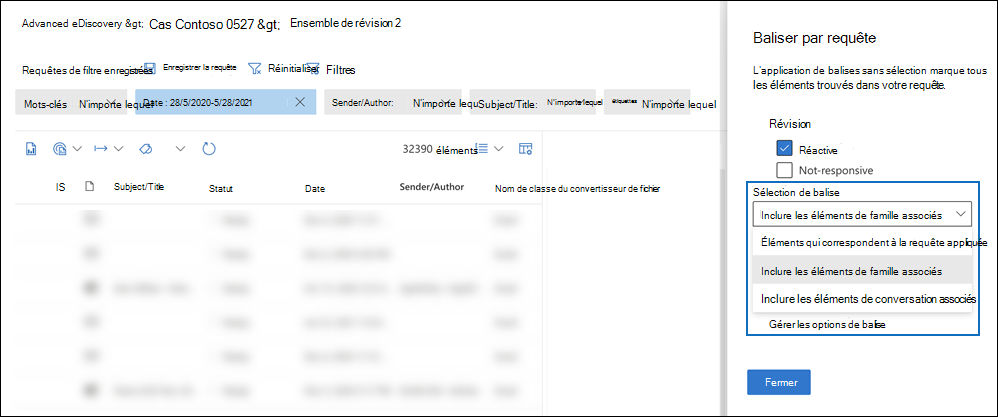

# Baliser des documents dans un jeu à réviser dans Advanced eDiscovery

L’organisation du contenu dans un ensemble de révision est importante pour effectuer différents flux de travail dans le processus eDiscovery. Cela inclut les opérations suivantes :

- Élimination de contenu inutile

- Identification du contenu pertinent

- Identification du contenu qui doit être examiné par un expert ou un avocat

Lorsque des experts, des avocats ou d’autres utilisateurs examinent le contenu d’un groupe de révision, leurs opinions relatives au contenu peuvent être capturées à l’aide de balises. Par exemple, si l’objectif est d’annuler le contenu inutile, un utilisateur peut baliser des documents avec une balise telle que « non réactif ». Une fois que le contenu a été révisé et balisé, une recherche de jeu à réviser peut être créée pour exclure tout contenu marqué comme « non réactif ». Ce processus élimine le contenu non réactif des étapes suivantes du flux de travail eDiscovery. Le panneau de marquage d’un jeu à réviser peut être personnalisé pour chaque cas afin que les balises de prise en charge du flux de travail de révision prévu pour le cas.

> [!NOTE]
> L’étendue des balises est Advanced eDiscovery cas. Cela signifie qu’un cas ne peut avoir qu’un seul ensemble de balises que les réviseurs peuvent utiliser pour baliser des documents de jeu de révision. Vous ne pouvez pas configurer un ensemble différent de balises pour une utilisation dans différents jeux de révision dans le même cas.

## Types de balises

Advanced eDiscovery fournit deux types de balises :

- **Balises à choix unique**: limite les relecteurs à la sélection d’une seule balise au sein d’un groupe. Ces types de balises peuvent être utiles pour s’assurer que les réviseurs ne sélectionnent pas les balises conflictuelles telles que « réactive » et « non réactive ». Les balises à choix unique s’affichent sous la mesure des boutons d’option.

- **Balises de choix multiples**: autoriser les avis à sélectionner plusieurs balises au sein d’un groupe. Ces types de balises apparaissent sous forme de case à cocher.

## Structure des balises

Outre les types de balises, la structure de l’organisation des balises dans le panneau de balises peut être utilisée pour rendre les documents de marquage plus intuitifs. Les balises sont regroupées par sections. La recherche de jeu à réviser prend en charge la possibilité de rechercher par balise et par section de balise. Cela signifie que vous pouvez créer une recherche de jeu à réviser pour récupérer les documents marqués avec n’importe quelle balise dans une section.

Vous pouvez organiser davantage les balises en les imbriquer dans une section. Par exemple, si l’objectif est d’identifier et de baliser le contenu privilégié, l’imbrmbrage peut être utilisé pour indiquer clairement qu’un réviseur peut marquer un document comme « privilégié » et sélectionner le type de privilège en vérifiant la balise imbrmbrée appropriée.

## Créer des balises

Avant d’appliquer des balises aux documents du jeu à réviser, vous devez créer une structure de balises.

1. Ouvrez un jeu à réviser, accédez à la barre de commandes et sélectionnez **Baliser par requête.**

2. Dans le panneau de marquage, sélectionnez **Gérer les options de balise**

3. Sélectionnez **Ajouter une section de balise.**

4. Tapez un titre de groupe de balises et une description facultative, puis cliquez sur **Enregistrer.**

5. Sélectionnez le menu déroulant à trois points en regard du titre du groupe de balises, puis cliquez sur Ajouter une case à **cocher** ou sur la case **d’option Ajouter.**

6. Tapez un nom et une description pour la case à cocher ou la case d’option.

7. Répétez ce processus pour créer des sections de balise, des options de balise et des case à cocher.

   

## Application de balises

Une fois la structure de balises en place, les réviseurs peuvent appliquer des balises aux documents d’un jeu à réviser. Il existe deux façons d’appliquer des balises :

- Fichiers de balise

- Baliser par requête

### Fichiers de balise

Que vous sélectionniez un ou plusieurs éléments dans un jeu à  réviser, vous pouvez appliquer des balises à leur sélection en cliquant sur Les fichiers de balises dans la barre de commandes. Dans le panneau de marquage, vous pouvez sélectionner une balise et elle est automatiquement appliquée aux documents sélectionnés.

> [!NOTE]
> Les balises sont appliquées uniquement aux éléments sélectionnés dans la liste des éléments.

### Baliser par requête

Le marquage par requête vous permet d’appliquer des balises à tous les éléments affichés par une requête de filtre actuellement appliquée dans le jeu à réviser.

1. Désélectionne tous les éléments du jeu à réviser et allez dans la barre de commandes et sélectionnez **Baliser par requête.**

2. Dans le panneau de marquage, sélectionnez la balise à appliquer.

3. Sous la dropdown **de sélection** de balise, trois options déterminent les éléments à appliquer à la balise.

   - **Éléments qui correspondent à la requête appliquée :** applique des balises à des éléments spécifiques qui correspondent aux conditions de requête de filtre.

   - **Inclure les éléments de famille associés**: applique des balises à des éléments spécifiques qui correspondent aux conditions de requête de filtre et à leurs éléments de famille associés. *Les éléments de famille* sont des éléments qui partagent la même valeur de métadonnées FamilyId.  

   - **Inclure les éléments de conversation associés**: applique des balises aux éléments qui correspondent aux conditions de requête de filtre et à leurs éléments de conversation associés. *Les éléments de conversation* sont des éléments qui partagent les mêmes valeurs de métadonnées ConversationId.

   

4. Cliquez **sur Démarrer le travail de marquage** pour déclencher le travail de marquage.

## Filtre de balise

Utilisez le filtre de balise dans le jeu à réviser pour rechercher ou exclure rapidement des éléments des résultats de la requête en fonction de la façon dont un élément est balisé. 

1. Sélectionnez **Filtres** pour développer le panneau de filtrage.

2. Sélectionnez et développez **les propriétés de l’élément.**

3. Faites défiler vers le bas pour trouver le filtre **nommé Balise,** cochez la case, puis cliquez sur **Terminé**.

4. Pour inclure ou exclure des éléments avec une balise spécifique d’une requête, faites l’une des choses suivantes :

   - **Inclure des éléments**: sélectionnez la valeur de la balise et sélectionnez **Égal à l’un** des éléments dans le menu déroulant.

      Ou

   - **Exclure des** éléments : sélectionnez la valeur de la balise et **sélectionnez** Égal à aucun des éléments du menu déroulant.

     

> [!NOTE]
> Veillez à actualiser la page pour vous assurer que le filtre de balises affiche les dernières modifications apportées à la structure des balises.
