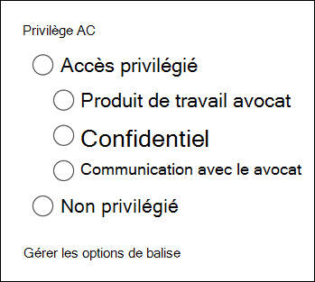

# Baliser des documents dans un jeu à réviser dans Advanced eDiscovery

L’organisation du contenu dans un ensemble de révision est importante pour effectuer différents flux de travail dans le processus eDiscovery. Cela inclut les opérations suivantes :

- Élimination de contenu inutile

- Identification du contenu pertinent
 
- Identification du contenu qui doit être examiné par un expert ou un avocat

Lorsque des experts, des avocats ou d’autres utilisateurs examinent le contenu d’un groupe de révision, leurs opinions relatives au contenu peuvent être capturées à l’aide de balises. Par exemple, si l’objectif est d’annuler le contenu inutile, un utilisateur peut baliser des documents avec une balise telle que « non réactif ». Une fois que le contenu a été révisé et balisé, une recherche de jeu à réviser peut être créée pour exclure tout contenu marqué comme « non réactif », ce qui élimine ce contenu des étapes suivantes du flux de travail eDiscovery. Le panneau de balises peut être personnalisé pour chaque cas afin que les balises peuvent prendre en charge le flux de travail de révision prévu.

## Types de balises

Advanced eDiscovery fournit deux types de balises :

- **Balises à choix unique** : limite la sélection d’une seule balise au sein d’un groupe. Cela peut être utile pour s’assurer que les utilisateurs ne sélectionnent pas de balises conflictuelles telles que « réactive » et « non réactive ». Celles-ci s’affichent sous la mesure des boutons d’radio.

- **Balises de choix multiples** : autoriser les utilisateurs à sélectionner plusieurs balises au sein d’un groupe. Celles-ci s’affichent sous la mesure des case à cocher.

## Structure des balises

Outre les types de balises, la structure de l’organisation des balises dans le panneau de balises peut être utilisée pour rendre les documents de marquage plus intuitifs. Les balises sont regroupées par sections. La recherche de jeu à réviser prend en charge la possibilité de rechercher par balise et par section de balise. Cela signifie que vous pouvez créer une recherche de jeu à réviser pour récupérer les documents marqués avec n’importe quelle balise dans une section.

Les balises peuvent être davantage organisées en les imbriquent dans une section. Par exemple, si l’objectif est d’identifier et de baliser le contenu privilégié, l’imbrmbrage peut être utilisé pour indiquer clairement qu’un utilisateur peut marquer un document comme « privilégié » et sélectionner le type de privilège en vérifiant la balise imbrmbrée appropriée.

## Application de balises

Il existe plusieurs façons d’appliquer une balise au contenu.

### Marquage d’un document unique

Lorsque vous affichez un document dans un jeu à réviser, vous pouvez afficher les balises qu’un avis peut utiliser en cliquant sur **le panneau de marquage.**

Cela vous permet d’appliquer des balises au document affiché dans la visionneuse.

### Marquage en bloc

Le marquage en bloc peut être effectué en sélectionnant plusieurs fichiers  dans la grille des résultats, puis en utilisant les balises du panneau de marquage similaires au marquage de documents simples. L’un-marquage en bloc peut être effectué en sélectionnant deux fois des balises . Le premier clic applique la balise, et la deuxième sélection garantit que la balise est effacée pour tous les fichiers sélectionnés.

> [!NOTE]
> Lors du marquage en bloc, le panneau de marquage affiche le nombre de fichiers marqués pour chaque balise du panneau.

### Marquage dans d’autres panneaux d’avis

Lorsque vous examinez des documents, vous pouvez utiliser les autres panneaux de révision pour examiner d’autres caractéristiques des documents dans la grille des résultats. Cela inclut la révision d’autres documents connexes, threads de messagerie, quasi-doublons et hachages. Par exemple, lorsque vous examinez des documents  connexes (à l’aide du Panneau de révision de la famille de documents), vous pouvez réduire considérablement le temps de révision en balisé en bloc les documents associés. Par exemple, si un message électronique a plusieurs pièces jointes et que vous souhaitez vous assurer que toute la famille est marquée de façon cohérente.

Par exemple, voici comment afficher  le panneau marquage lors de l’utilisation du panneau de révision de la famille **de** documents :

1. Avec le panneau de révision ouvert pour un document sélectionné (par  exemple, affichage de la liste du contenu connexe dans le panneau révision de la famille de documents), cliquez sur **Baliser** les documents sous le panneau de révision de la famille de documents.

   Le panneau de marquage s’affiche en tant que fenêtre indépendant.

2. Choisissez une ou plusieurs balises pour appliquer le document sélectionné. 

3. Pour baliser tous les documents, sélectionnez tous les documents dans le panneau Famille de documents, cliquez sur Baliser les **documents,** puis choisissez les balises à appliquer à toute la famille de documents. 

