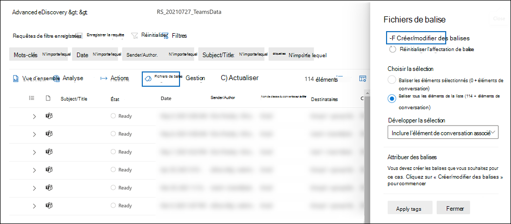
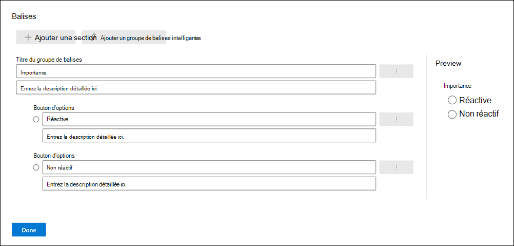
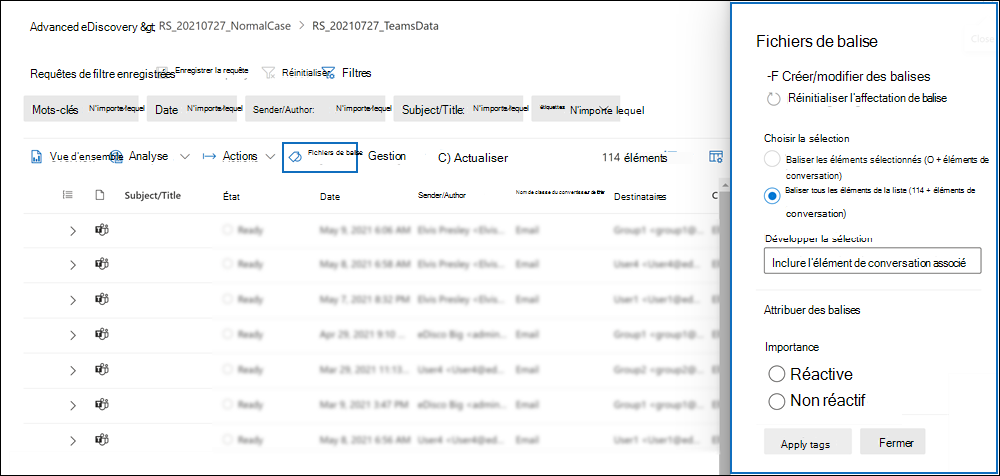

# Baliser des documents dans un jeu à réviser dans Advanced eDiscovery

L’organisation du contenu dans un ensemble de révision est importante pour effectuer différents flux de travail dans le processus eDiscovery. Cela inclut les opérations suivantes :

- Élimination de contenu inutile

- Identification du contenu pertinent

- Identification du contenu qui doit être examiné par un expert ou un avocat

Lorsque des experts, des avocats ou d’autres utilisateurs examinent le contenu d’un groupe de révision, leurs opinions relatives au contenu peuvent être capturées à l’aide de balises. Par exemple, si l’objectif est d’annuler le contenu inutile, un utilisateur peut baliser des documents avec une balise telle que « non réactif ». Une fois que le contenu a été révisé et balisé, une recherche de jeu à réviser peut être créée pour exclure tout contenu marqué comme « non réactif ». Ce processus élimine le contenu non réactif des étapes suivantes du flux de travail eDiscovery. Le panneau de marquage d’un jeu à réviser peut être personnalisé pour chaque cas afin que les balises de prise en charge du flux de travail de révision prévu pour le cas.

> [!NOTE]
> L’étendue des balises est Advanced eDiscovery cas. Cela signifie qu’un cas ne peut avoir qu’un seul ensemble de balises que les réviseurs peuvent utiliser pour baliser des documents de jeu de révision. Vous ne pouvez pas configurer un ensemble différent de balises pour une utilisation dans différents jeux de révision dans le même cas.

## Types de balises

Advanced eDiscovery fournit deux types de balises :

- **Balises à choix unique**: limite les relecteurs à la sélection d’une seule balise au sein d’un groupe. Ces types de balises peuvent être utiles pour s’assurer que les réviseurs ne sélectionnent pas les balises conflictuelles telles que « réactive » et « non réactive ». Les balises à choix unique s’affichent sous la mesure des boutons d’option.

- **Balises de choix multiples**: autoriser les avis à sélectionner plusieurs balises au sein d’un groupe. Ces types de balises apparaissent sous forme de case à cocher.

## Structure des balises

Outre les types de balises, la structure de l’organisation des balises dans le panneau de balises peut être utilisée pour rendre les documents de marquage plus intuitifs. Les balises sont regroupées par sections. La recherche de jeu à réviser prend en charge la possibilité de rechercher par balise et par section de balise. Cela signifie que vous pouvez créer une recherche de jeu à réviser pour récupérer les documents marqués avec n’importe quelle balise dans une section.

Vous pouvez organiser davantage les balises en les imbriquer dans une section. Par exemple, si l’objectif est d’identifier et de baliser le contenu privilégié, l’imbrmbrage peut être utilisé pour indiquer clairement qu’un réviseur peut marquer un document comme « privilégié » et sélectionner le type de privilège en vérifiant la balise imbrmbrée appropriée.

## Création et application de balises

Le marquage des éléments dans les ensembles de révision est un processus en deux étapes. La première étape consiste à créer les balises qui sont ensuite appliquées aux éléments de jeu de révision. Après avoir créé des balises, vous et d’autres réviseurs pouvez les appliquer aux éléments d’un jeu à réviser. Comme indiqué précédemment, un cas Advanced eDiscovery ne peut avoir qu’un seul ensemble de balises que les réviseurs peuvent utiliser pour baliser les éléments de jeu de révision.

### Créer des balises

Avant d’appliquer des balises à des éléments d’un jeu à réviser, vous devez créer une structure de balises.

1. Ouvrez un jeu à réviser, allez dans la barre de commandes, puis sélectionnez **Fichiers de balises.**

2. Dans la page **volant des fichiers de** balises, cliquez sur **Créer/modifier des balises.**

   

3. Dans la page **Balises,** sélectionnez **Ajouter une section.**

4. Tapez un titre de groupe de balises et une description facultative, puis cliquez sur **Enregistrer.**

5. Sélectionnez le menu déroulant à trois points en regard du titre du groupe de balises, puis cliquez sur Ajouter une case à **cocher** ou sur **la case d’option Ajouter.**

6. Tapez un nom et une description pour la case à cocher ou la case d’option.

7. Répétez ce processus pour créer des sections de balise, des options de balise et des case à cocher. Par exemple, la capture d’écran suivante montre  un  groupe de balises nommé **Review,** qui se compose de case à cocher Réactive et Non réactive.

   

### Apply tags

Une fois la structure de balises en place, les réviseurs peuvent appliquer des balises aux éléments d’un jeu à réviser en configurant les paramètres de marquage.

1. Dans la barre de commandes du jeu  à réviser, sélectionnez **Fichiers** de balises pour afficher la page de présentation des fichiers de balises (également appelée panneau *de marquage).*

   

2. Dans la page **de présentation** des fichiers de balise, vous pouvez définir les options suivantes pour configurer la balise des éléments affichés dans le jeu à réviser. Les filtres ou requêtes de filtre actuellement appliqués au jeu à réviser déterminent les éléments qui sont affichés et, par conséquent, les éléments à lesquels vous pouvez appliquer des balises. Pour plus d’informations, voir [Requête et filtrage du contenu dans un jeu à réviser.](review-set-search.md)

   - **Choisissez la sélection.** Choisissez l’une des options suivantes pour déterminer l’étendue des éléments à appliquer aux balises.

      - **Baliser les éléments sélectionnés**: cette option applique des balises aux éléments que vous sélectionnez. Vous pouvez sélectionner des éléments avant ou après le lancement du panneau de marquage. Cette option affiche (en temps réel) le nombre d’éléments sélectionnés qui seront marqués.

      - **Baliser tous les éléments de la liste**: cette option applique des balises à tous les éléments affichés dans le jeu à réviser. Cette option affiche le nombre total d’éléments qui seront marqués.

   - **Développer la sélection**: utilisez les options suivantes pour baliser les éléments supplémentaires liés aux éléments marqués dans le jeu à réviser.

      - **Inclure les éléments de famille associés**: cette option applique la même balise aux éléments de la famille d’éléments associés qui sont marqués.  *Les éléments de famille* sont des éléments qui partagent la même valeur de propriété de métadonnées **FamilyId.** Par exemple, un document joint à un message électronique partage le **même FamilyId** que le message électronique. Ainsi, si cette option est sélectionnée pour cet exemple, le message électronique et le document sont marqués, même si le document n’est peut-être pas inclus dans la liste des éléments du jeu à réviser.

      - **Inclure les éléments** de conversation associés : cette option applique la même balise à tous les éléments qui se trouve dans la même conversation Teams ou Yammer que les éléments marqués. *Les éléments de conversation* sont des éléments qui partagent la même valeur de propriété de métadonnées **ConversationId.** Tous les messages, billets et fichier de transcription correspondant d’une conversation partagent le même **ConversationId**. Si cette option est sélectionnée, tous les éléments de la même conversation (et fichier de transcription) sont marqués, même si certains de ces éléments de conversation peuvent ne pas être inclus dans la liste des éléments de jeu à réviser. Pour plus d’informations sur les éléments de conversation, voir la section « Regroupement » dans Advanced eDiscovery flux de travail [pour le contenu dans Microsoft Teams](teams-workflow-in-advanced-ediscovery.md#grouping).

      - **Aucun**: cette option n’applique pas de balises aux éléments de famille ou aux éléments de conversation. Elle applique uniquement les balises aux éléments sélectionnés ou à tous les éléments de la liste de révision.

   > [!NOTE]
   > Le fait d’inclure des éléments de conversation  ou de famille associés ne modifie pas le nombre d’éléments affichés dans la balise éléments sélectionnés ou marque tous les éléments dans les options **de liste.** En d’autres termes, le nombre d’éléments associés qui seront marqués n’est pas affiché.

   - **Attribuer des balises**: cette section affiche les balises (organisées par groupes de balises) que vous pouvez appliquer aux documents. Vous ne pouvez appliquer qu’une seule balise à choix unique (identifiée par une option) par groupe de balises. Toutefois, vous pouvez appliquer plusieurs balises à choix multiples (identifiées par une case à cocher).

3. Cliquez **sur Appliquer des balises** pour appliquer les balises en fonction de vos paramètres.

   Le **message d’état Des** balises d’application s’affiche pour chaque groupe de balises dans le panneau de marquage pour indiquer qu’un travail de marquage a été démarré. Les balises de chaque groupe de balises dans **la** section Affecter des balises sont grisées jusqu’à ce que le travail soit terminé.

> [!TIP]
> Si vous êtes en train de configurer les paramètres du panneau de marquage, mais que vous souhaitez recommencer, cliquez sur Réinitialiser l’affectation de balise pour effacer le paramètre actuel.  Ce contrôle ne s’applique pas aux éléments qui sont déjà marqués et ne modifie pas ou ne supprime pas les balises des éléments précédemment marqués.  

#### Surveiller les travaux de marquage

Lorsque vous balisez un grand nombre d’éléments (ou sélectionnez l’option Baliser tous les éléments de la **liste),** un travail de **marquage des documents** est créé. Vous affichez l’état de ce travail sous l’onglet **Travaux** dans le cas. Cela vous permet de suivre les travaux de marquage de grande taille qui peuvent prendre beaucoup de temps. Dans certains cas, un travail de marquage  peut être terminé, mais le message d’état des balises d’application dans le panneau de marquage s’affiche toujours. Pour mettre à jour l’état des travaux de marquage, cliquez sur **Actualiser** dans la barre de commandes du jeu à réviser.

## Suppression de balises

Vous pouvez supprimer des balises d’éléments d’un jeu à réviser. Toutefois, vous ne pouvez pas supprimer une balise à choix unique qui a été appliquée à un élément de jeu à réviser. Vous pouvez uniquement modifier une balise à choix unique en une autre balise à choix unique dans le même groupe de balises.

Pour supprimer une balise :

1. Sélectionnez les éléments dont vous souhaitez supprimer la balise.

2. Cliquez **sur Fichiers de balise** pour afficher le panneau de marquage.

3. Sous **Attribuer des balises,** désélectionnez la balise, puis cliquez sur Appliquer **des balises.**

Vous pouvez également utiliser la procédure précédente pour modifier la balise appliquée aux éléments sélectionnés. Après avoir désélectionnés la balise actuelle, vous pouvez en sélectionner une autre.
