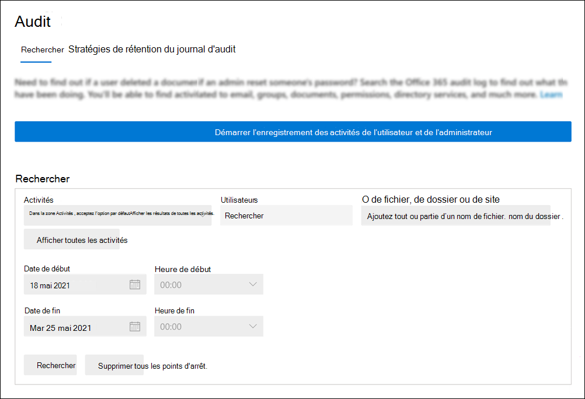

# <a name="turn-auditing-on-or-off"></a>Activer ou désactiver la fonctionnalité d’audit

La journalisation d’audit est activée par défaut pour Microsoft 365 et les organisations d’entreprise Office 365. Toutefois, lors de la configuration d’une nouvelle organisation Microsoft 365 ou Office 365, vous devez vérifier l’état d’audit de votre organisation. Pour obtenir des instructions, consultez la section [Vérifier l’état d’audit de votre organisation](#verify-the-auditing-status-for-your-organization) dans cet article. 

Lors de l’audit dans le portail de conformité Microsoft Purview est activé, l’activité utilisateur et administrateur de votre organisation est enregistrée dans le journal d’audit et conservée pendant 90 jours, et jusqu’à un an en fonction de la licence attribuée aux utilisateurs. Toutefois, votre organisation peut avoir des raisons de ne pas vouloir enregistrer et conserver les données du journal d’audit. Dans ce cas, un administrateur général peut décider de désactiver l’audit dans Microsoft 365.

> [!IMPORTANT]
> Si vous désactivez l’audit dans Microsoft 365, vous ne pouvez pas utiliser l’API d’activité de gestion Office 365 ou Microsoft Sentinel pour accéder aux données d’audit de votre organisation. La désactivation de l’audit en suivant les étapes décrites dans cet article signifie qu’aucun résultat n’est retourné lorsque vous effectuez une recherche dans le journal d’audit à l’aide du portail de conformité ou lorsque vous exécutez l’applet de commande **Search-UnifiedAuditLog** dans Exchange Online PowerShell. Cela signifie également que les journaux d’audit ne seront pas disponibles via l’API d’activité de gestion Office 365 ou Microsoft Sentinel.
  
## <a name="before-you-turn-auditing-on-or-off"></a>Avant d’activer ou de désactiver l’audit

- Vous devez disposer du rôle Journaux d’audit dans Exchange Online pour activer ou désactiver l’audit dans votre organisation Microsoft 365. Par défaut, ce rôle est attribué aux groupes de rôles Gestion de la conformité et Gestion de l’organisation sur la page **Autorisations** du Centre d’administration Exchange. Les administrateurs généraux de Microsoft 365 sont membres du groupe de rôles Gestion de l’organisation dans Exchange Online.

    > [!NOTE]
    > Des autorisations doivent être attribuées aux utilisateurs dans Exchange Online pour activer ou désactiver l’audit. Si vous attribuez aux utilisateurs le rôle Journaux d’audit sur la page **Autorisations** dans le portail de conformité, ils ne pourront pas activer ou désactiver l’audit. Cela est dû au fait que l’applet de commande sous-jacente est une applet de commande PowerShell Exchange Online.

- Pour obtenir des instructions pas à pas sur la recherche dans le journal d’audit, consultez [Rechercher dans le journal d’audit](search-the-audit-log-in-security-and-compliance.md). Pour plus d’informations sur l’API Activité de gestion Microsoft 365, consultez [Prise en main des API de gestion Microsoft 365](/office/office-365-management-api/get-started-with-office-365-management-apis).

## <a name="verify-the-auditing-status-for-your-organization"></a>Vérifier l’état d’audit de votre organisation

Pour vérifier que l’audit est activé pour votre organisation, vous pouvez exécuter la commande suivante dans [Exchange Online PowerShell](/powershell/exchange/connect-to-exchange-online-powershell) :

```powershell
Get-AdminAuditLogConfig | FL UnifiedAuditLogIngestionEnabled
```

La valeur de `True` la propriété  _UnifiedAuditLogIngestionEnabled_ indique que l’audit est activé. La valeur indique `False` que l’audit n’est pas activé.

> [!NOTE]
> Veillez à exécuter la commande précédente dans Exchange Online PowerShell. Vous ne pouvez pas utiliser Security & Compliance PowerShell pour exécuter cette commande.

## <a name="turn-on-auditing"></a>Activer l’audit

Si l’audit n’est pas activé pour votre organisation, vous pouvez l’activer dans le portail de conformité ou à l’aide de Exchange Online PowerShell. L’activation de l’audit peut prendre plusieurs heures avant de pouvoir retourner les résultats lorsque vous effectuez une recherche dans le journal d’audit.
  
### <a name="use-the-compliance-center-to-turn-on-auditing"></a>Utiliser le centre de conformité pour activer l’audit

1. Accédez à <https://compliance.microsoft.com> et connectez-vous.

2. Dans le volet de navigation gauche du portail de conformité, cliquez sur **Audit**.

   Si l’audit n’est pas activé pour votre organisation, une bannière s’affiche pour vous inviter à commencer à enregistrer l’activité de l’utilisateur et de l’administrateur.

   

3. Cliquez sur la bannière **Démarrer l’enregistrement de l’utilisateur et de l’activité administrateur** .

   L’application de la modification peut prendre jusqu’à 60 minutes.

### <a name="use-powershell-to-turn-on-auditing"></a>Utiliser PowerShell pour activer l’audit

1. [Connectez-vous à Exchange Online PowerShell](/powershell/exchange/connect-to-exchange-online-powershell).

2. Exécutez la commande PowerShell suivante pour activer l’audit.

    ```powershell
    Set-AdminAuditLogConfig -UnifiedAuditLogIngestionEnabled $true
    ```

    Un message s’affiche indiquant qu’il peut prendre jusqu’à 60 minutes pour que la modification prenne effet.
  
## <a name="turn-off-auditing"></a>Désactiver l’audit

Vous devez utiliser Exchange Online PowerShell pour désactiver l’audit.
  
1. [Connectez-vous à Exchange Online PowerShell](/powershell/exchange/connect-to-exchange-online-powershell).

2. Exécutez la commande PowerShell suivante pour désactiver l’audit.

    ```powershell
    Set-AdminAuditLogConfig -UnifiedAuditLogIngestionEnabled $false
    ```

3. Après un certain temps, vérifiez que l’audit est désactivé (désactivé). Il existe deux méthodes pour y parvenir :

    - Dans Exchange Online PowerShell, exécutez la commande suivante :

      ```powershell
      Get-AdminAuditLogConfig | FL UnifiedAuditLogIngestionEnabled
      ```

      La valeur de  `False` la propriété  _UnifiedAuditLogIngestionEnabled_ indique que l’audit est désactivé.

    - Accédez à la page **Audit** dans le portail de conformité.

      Si l’audit n’est pas activé pour votre organisation, une bannière s’affiche pour vous inviter à commencer à enregistrer l’activité de l’utilisateur et de l’administrateur.

## <a name="audit-records-when-auditing-status-is-changed"></a>Enregistrements d’audit lors de la modification de l’état de l’audit

Les modifications apportées à l’état d’audit dans votre organisation sont elles-mêmes auditées. Cela signifie que les enregistrements d’audit sont enregistrés lorsque l’audit est activé ou désactivé. Vous pouvez rechercher ces enregistrements d’audit dans le journal d’audit de l’administrateur Exchange.

Pour rechercher dans le journal d’audit de l’administrateur Exchange les enregistrements d’audit générés lors de l’activation ou de la désactivation de l’audit, exécutez la commande suivante dans [Exchange Online PowerShell](/powershell/exchange/connect-to-exchange-online-powershell) :

```powershell
Search-AdminAuditLog -Cmdlets Set-AdminAuditLogConfig -Parameters UnifiedAuditLogIngestionEnabled
```

Les enregistrements d’audit de ces événements contiennent des informations sur le moment où l’état d’audit a été modifié, l’administrateur qui l’a modifié et l’adresse IP de l’ordinateur qui a été utilisé pour apporter la modification. Les captures d’écran suivantes montrent les enregistrements d’audit qui correspondent à la modification de l’état d’audit dans votre organisation.

### <a name="audit-record-for-turning-on-auditing"></a>Enregistrement d’audit pour activer l’audit


La valeur de `Confirm` la propriété *CmdletParameters* indique que la journalisation d’audit unifiée a été activée dans le centre de conformité ou en exécutant l’applet de commande **Set-AdminAuditLogConfig -UnifiedAuditLogIngestionEnabled $true** .

### <a name="audit-record-for-turning-off-auditing"></a>Enregistrement d’audit pour désactiver l’audit


La valeur n’est `Confirm` pas incluse dans la propriété *CmdletParameters* . Cela indique que la journalisation d’audit unifiée a été désactivée en exécutant la commande **Set-AdminAuditLogConfig -UnifiedAuditLogIngestionEnabled $false** .

Pour plus d’informations sur la recherche dans le journal d’audit de l’administrateur Exchange, consultez [Search-AdminAuditLog](/powershell/module/exchange/search-adminauditlog).
