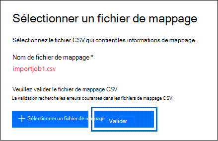

# <a name="use-drive-shipping-to-import-your-organizations-pst-files"></a>Utiliser l’expédition de lecteur pour importer les fichiers PST de votre organisation

[!include[Purview banner](../includes/purview-rebrand-banner.md)]

**Cet article s’applique aux administrateurs. Essayez-vous d’importer des fichiers PST dans votre propre boîte aux lettres ? Voir [Importer le courrier électronique, les contacts et le calendrier à partir d’un fichier .pst Outlook](https://go.microsoft.com/fwlink/p/?LinkID=785075)**
   
Utilisez le service d’importation Office 365 et l’expédition de lecteurs pour importer en bloc des fichiers PST dans des boîtes aux lettres utilisateur. L’expédition de disque consiste à copier les fichiers PST sur un lecteur de disque dur et à expédier physiquement le lecteur à Microsoft. Lorsque Microsoft reçoit votre disque dur, le personnel du centre de données copie les données du disque dur vers une zone de stockage dans le cloud Microsoft. Vous avez ensuite la possibilité de supprimer les données PST importées dans les boîtes aux lettres cibles en définissant des filtres qui contrôlent les données importées. Après avoir démarré le travail d’importation, le service d’importation importe les données PST de la zone de stockage vers les boîtes aux lettres utilisateur. L’utilisation de l’expédition de lecteur pour importer des fichiers PST dans des boîtes aux lettres utilisateur est un moyen de migrer le courrier électronique de votre organisation vers Office 365.
  
Voici les étapes requises pour utiliser l’expédition de lecteurs pour importer des fichiers PST dans Microsoft 365 boîtes aux lettres :
  
[Étape 1 : Télécharger l’outil d’importation PST](#step-1-download-the-pst-import-tool)

[Étape 2 : Copier les fichiers PST sur le disque dur](#step-2-copy-the-pst-files-to-the-hard-drive)

[Étape 3 : Créer le fichier de mappage d’importation PST](#step-3-create-the-pst-import-mapping-file)

[Étape 4 : Créer une tâche d’importation PST dans Office 365](#step-4-create-a-pst-import-job-in-office-365)

[Étape 5 : Expédier le disque dur à Microsoft](#step-5-ship-the-hard-drive-to-microsoft)

[Étape 6 : Filtrer les données et démarrer la tâche d’importation PST](#step-6-filter-data-and-start-the-pst-import-job)
  
> [!IMPORTANT]
> Vous devez effectuer l’étape 1 une fois pour télécharger l’outil d’importation. Après avoir effectué ces étapes, suivez les étapes 2 à 6 chaque fois que vous souhaitez envoyer un disque dur à Microsoft. 
  
Pour obtenir des questions fréquentes sur l’utilisation de l’expédition de lecteurs pour importer des fichiers PST dans Office 365, consultez [faq sur l’utilisation de l’expédition de lecteurs pour importer des fichiers PST](./faqimporting-pst-files-to-office-365.yml#using-drive-shipping-to-import-pst-files). 
  
## <a name="before-you-import-pst-files"></a>Avant d’importer des fichiers PST

- Vous devez disposer du rôle Importation et exportation de boîte aux lettres dans Exchange Online pour créer des travaux d’importation dans le portail de conformité Microsoft Purview et importer des fichiers PST dans des boîtes aux lettres utilisateur. Par défaut, ce rôle n’est attribué à aucun groupe de rôles dans Exchange Online. Vous pouvez ajouter le rôle Importation et exportation de boîte aux lettres au groupe de rôles Gestion de l’organisation. Vous pouvez également créer un groupe de rôles, attribuer le rôle Importation et exportation de boîte aux lettres, puis vous ajouter en tant que membre. Pour plus d’informations, consultez les sections « Ajouter un rôle à un groupe de rôles » ou « Créer un groupe de rôles » dans [Gérer les groupes de rôles](/Exchange/permissions-exo/role-groups).

    En plus du rôle Importation/Exportation de boîte aux lettres, vous devez également avoir le rôle Destinataires de messagerie dans Exchange Online. Par défaut, ce rôle est attribué aux groupes de rôles Gestion de l’organisation et Gestion des destinataires dans Exchange Online.

    > [!TIP]
    > Envisagez de créer un nouveau groupe de rôles dans Exchange Online spécialement conçu pour importer les fichiers PST vers Office 365. Pour obtenir le niveau minimum de privilèges requis pour importer des fichiers PST, affectez les rôles d’importation/exportation de boîte aux lettres et de destinataire de courrier au nouveau groupe de rôles et ajoutez ensuite les membres.
  
- Vous devez stocker les fichiers PST que vous souhaitez copier vers un disque dur sur un serveur de fichiers ou un dossier partagé dans votre organisation. À l’étape 2, vous exécutez l’outil Azure Import Export (WAImportExport.exe) qui copie les fichiers PST stockés sur ce serveur de fichiers ou le dossier partagé sur le disque dur.

- Les fichiers PST volumineux peuvent avoir un impact sur les performances du processus d’importation PST. Nous recommandons donc que chaque fichier PST que vous copiez sur le disque dur à l’étape 2 ne dépasse pas 20 Go.

- Seuls les disques SSD de 2,5 pouces ou les disques durs internes SATA II/III de 2,5 pouces ou 3,5 pouces sont pris en charge pour une utilisation avec le service d’importation Office 365. Vous pouvez utiliser des disques durs jusqu'à 10 To. Pour les tâches d’importation, uniquement le premier volume de données sur le disque dur est traité. Le volume de données doit être au format NTFS. Lors de la copie de données sur un disque dur, vous pouvez l’attacher directement à l’aide d’un connecteur SSD de 2,5 pouces ou 2,5 pouces ou 3,5 pouces SATA II/III, ou vous pouvez l’attacher en externe à l’aide d’un SSD externe de 2,5 pouces ou d’un adaptateur USB SATA II/III de 2,5 pouces ou 3,5 pouces.
    
    > [!IMPORTANT]
    > Les disques durs externes fournis avec une carte USB intégrée ne sont pas pris en charge par le service d’importation Office 365. En outre, le disque à l’intérieur du boîtier d’un disque dur externe ne peut pas être utilisé. Please don't ship external hard drives. 
  
- Le disque dur sur lequel vous copiez les fichiers PST doit être chiffré avec BitLocker. L’outil WAImportExport.exe exécuté à l’étape 2 vous permet de configurer BitLocker. Il génère également une clé de chiffrement BitLocker que le personnel du centre de données Microsoft utilise pour accéder au lecteur afin de charger les fichiers PST dans la zone stockage Azure dans le cloud Microsoft.
    
- L’expédition de lecteur est disponible par le biais d’une Accord Entreprise Microsoft (EA). L’expédition de disque n’est pas disponible dans le cadre d’un Contrat de Fourniture de Produits et de Services Microsoft (MPSA).
    
- Le tarif pour importer des fichiers PST dans les boîtes aux lettres Microsoft 365 via l’expédition de disque s’élève à 2 $ USD par Go de données. Par exemple, si vous expédiez un disque dur qui contient 1 000 Go (1 To) de fichiers PST, cela revient à 2 000 dollars. Vous pouvez travailler en collaboration avec un partenaire qui se chargera de payer les frais d’importation. Pour plus d’informations sur la recherche d’un partenaire, consultez la page [Trouver votre partenaire ou revendeur](../admin/manage/find-your-partner-or-reseller.md).
    
- Vous, ou votre organisation, devez également disposer d’un compte auprès de FedEx ou DHL. 
    
  - Les organisations du États-Unis, du Brésil et de l’Europe doivent avoir des comptes FedEx.
    
  - Les organisations en Asie de l’Est, Asie Sud-Est, Japon, République de Corée et Australie doivent avoir des comptes DHL.
    
    Microsoft utilise (et facture) ce compte pour vous renvoyer le disque dur.
    
- Le disque dur que vous expédiez à Microsoft peut traverser les frontières internationales. Dans ce cas, vous devez vous assurer que le disque dur et les données qu’il contient sont importés et/ou exportés conformément aux lois applicables. Avant d’envoyer un disque dur, vérifiez auprès de vos conseillers juridiques que votre disque et vos données peuvent être légalement expédiés au centre de données Microsoft concerné. Cela permet de s’assurer qu’il atteint Microsoft en temps opportun.
    
- Cette procédure implique la copie et l’enregistrement d’une clé de chiffrement BitLocker. Veillez à prendre toutes les précautions nécessaires pour protéger ces clés, comme vous le feriez avec vos mots de passe ou d’autres informations de sécurité. Par exemple, vous pouvez les enregistrer dans un document Microsoft Word protégé par mot de passe ou dans un lecteur USB chiffré. Pour obtenir un exemple de ces clés, consultez la section [Plus d’informations](#more-information) . 
    
- Une fois les fichiers PST importés dans une boîte aux lettres Microsoft 365, le paramètre de conservation de la boîte aux lettres est activé pour une durée indéfinie. Cela signifie que la stratégie de rétention attribuée à la boîte aux lettres ne sera pas traitée tant que vous n’aurez pas désactivé la conservation de rétention ou défini une date pour désactiver la conservation. Quel est le but de cette action ? Si les messages importés dans une boîte aux lettres sont anciens, ils peuvent être supprimés définitivement (purgés) parce que leur période de conservation a expiré selon les paramètres de conservation configurés pour cette boîte aux lettres. La mise de la boîte aux lettres en attente de conservation donne au propriétaire de la boîte aux lettres le temps de gérer ces nouveaux messages importés ou de modifier les paramètres de conservation de la boîte aux lettres. Consultez la section [Plus d’informations](#more-information) pour obtenir des suggestions sur la gestion de la conservation. 
    
- Par défaut, la taille maximale d’un message pouvant être reçu par une boîte aux lettres Microsoft 365 est de 35 Mo. En effet, la valeur par défaut de la propriété *MaxReceiveSize* pour une boîte aux lettres est définie sur 35 Mo. Toutefois, la limite de la taille maximale de réception d’un message dans Microsoft 365 est de 150 Mo. Par conséquent, si vous importez un fichier PST qui contient un élément d’une taille supérieure à 35 Mo, le service d’importation d’Office 365 modifie automatiquement la valeur de la propriété *MaxReceiveSize* sur la boîte aux lettres cible à 150 Mo. Ainsi, les messages allant jusqu’à 150 Mo sont importés dans les boîtes aux lettres d’utilisateur. 
    
    > [!TIP]
    > Pour identifier la taille de réception des messages pour une boîte aux lettres, vous pouvez exécuter la commande suivante dans Exchange Online PowerShell :  `Get-Mailbox <user mailbox> | FL MaxReceiveSize` 
  
- Vous pouvez importer des fichiers PST dans une boîte aux lettres inactive dans Office 365. Pour ce faire, vous devez spécifier le GUID de la boîte aux lettres inactive dans le paramètre `Mailbox` du fichier de mappage d’importation PST. Pour plus d’informations, consultez [l’étape 3 : créer le fichier de mappage d’importation PST](#step-3-create-the-pst-import-mapping-file) . 
    
- Dans un déploiement hybride Exchange, vous pouvez importer des fichiers PST dans une boîte aux lettres d'archivage basé sur le cloud pour un utilisateur dont la boîte aux lettres principale est locale. Pour ce faire, procédez comme suit dans le fichier de mappage d’importation PST :
    
  - Indiquez l’adresse électronique de la boîte aux lettres locale de l'utilisateur dans le paramètre `Mailbox`. 
    
  - Spécifiez la valeur **TRUE** dans le paramètre `IsArchive`. 
    
    Pour plus d’informations, consultez [l’étape 3 : créer le fichier de mappage d’importation PST](#step-3-create-the-pst-import-mapping-file) . 

## <a name="step-1-download-the-pst-import-tool"></a>Étape 1 : Télécharger l’outil d’importation PST

La première étape consiste à télécharger l’outil et à l’utiliser à l’étape 2 pour copier des fichiers PST sur le disque dur.
  
> [!IMPORTANT]
> Vous devez utiliser l’outil Azure Import/Export version 1 (WAimportExportV1) pour importer correctement des fichiers PST à l’aide de la méthode d’expédition de lecteur. La version 2 de l’outil Azure Import/Export n’est pas prise en charge et son utilisation entraîne une préparation incorrecte du disque dur pour le travail d’importation. Veillez à télécharger l’outil Azure Import/Export à partir du portail de conformité Microsoft Purview en suivant les procédures décrites dans cette étape. 
  
1. Accédez à <https://compliance.microsoft.com> et connectez-vous à l'aide des informations d'identification d'un compte administrateur dans votre organisation.

2. Dans le volet de navigation gauche du portail de conformité, cliquez sur **Importation** de **gestion du cycle de** \> vie des données.
    
    > [!NOTE]
    > Comme indiqué précédemment, vous devez disposer des autorisations appropriées pour accéder à la page **Importer** dans le portail de conformité.
  
3. Sous l’onglet **Importer**, cliquez sur l’**nouvelle tâche d’importation**.
    
4. Dans l’Assistant Importation, tapez un nom pour le travail d’importation PST, puis cliquez sur **Suivant**. Utilisez des lettres minuscules, des nombres, des traits d’union et des traits bas. Vous ne pouvez pas utiliser de lettres majuscules ou inclure des espaces dans le nom.
    
5. Dans la page **Choisir le type de travail d’importation** , cliquez sur **Expédier des disques durs vers l’un de nos emplacements physiques** , puis sur **Suivant**.
    
    
  
6. Dans la page **Importer des données** , procédez comme suit :     
    
    **Téléchargez l’outil Azure Import/Export** pour télécharger et installer l’outil Azure Import/Export (version 1).
    
    - Dans la fenêtre contextuelle, cliquez sur **Enregistrer** \> **sous** pour enregistrer le fichier WaImportExportV1.zip dans un dossier de votre ordinateur local.
    
    - Extrayez le fichier WaImportExportV1.zip.
    
7. Cliquez sur **Annuler** pour fermer l’Assistant.
    
    Vous revenez à la page **Importer** dans le portail de conformité lorsque vous créez le travail d’importation à l’étape 4.

## <a name="step-2-copy-the-pst-files-to-the-hard-drive"></a>Étape 2 : Copier les fichiers PST sur le disque dur

Pour réaliser cette étape, vous devez utiliser l’outil WAImportExport.exe pour copier les fichiers PST sur le disque dur. Cet outil chiffre le disque dur avec BitLocker, copie les fichiers PST sur le disque dur et crée un fichier journal qui stocke des informations sur le processus de copie. Pour cela, les fichiers PST doivent se trouver sur un dossier partagé ou un serveur de fichiers dans votre organisation. Il s’agit du répertoire source mentionné dans la procédure suivante.

 Comme indiqué précédemment, chaque fichier PST que vous copiez sur le disque dur ne doit pas dépasser 20 Go. Les fichiers PST d’une taille supérieure à 20 Go peuvent avoir un impact sur les performances du processus d’importation PST démarré à l’étape 6.
  
> [!IMPORTANT]
> Après avoir exécuté l’outil WAImportExport.exe pour la première fois pour un disque dur, vous devez utiliser une syntaxe différente les fois suivantes. Cette syntaxe est expliquée à l’étape 4 de cette procédure pour copier des fichiers PST sur le disque dur.
  
1. Ouvrez une invite de commandes sur votre ordinateur local.
    
    > [!TIP]
    > Si vous exécutez l’invite de commandes en tant qu’administrateur (en sélectionnant « Exécuter en tant qu’administrateur » quand vous l’ouvrez), la fenêtre d’invite de commandes affiche des messages d’erreur. Cela peut vous aider à résoudre les problèmes d’exécution de l’outil WAImportExport.exe.
  
2. Accédez au répertoire où vous avez installé l’outil WAImportExport.exe à l’étape 1.
3. Exécutez la commande suivante lorsque vous utilisez l’outil WAImportExport.exe pour la première fois pour copier les fichiers PST sur un disque dur.

    ```powershell
    WAImportExport.exe PrepImport /j:<Name of journal file> /t:<Drive letter> /id:<Name of session> /srcdir:<Location of PST files> /dstdir:<PST file path> /blobtype:BlockBlob /encrypt /logdir:<Log file location>
    ```

    Le tableau suivant décrit les paramètres et leurs valeurs requises. 
    
    |**Paramètre**|**Description**|**Exemple**|
    |:-----|:-----|:-----|
    | `/j:` <br/> |Indique le nom du fichier journal. Ce fichier est enregistré dans le dossier où se trouve l’outil WAImportExport.exe. Un fichier journal doit être créé sur chaque disque dur envoyé à Microsoft. Chaque fois que vous exécutez l’outil WAImportTool.exe pour copier des fichiers PST sur un disque dur, des informations sont ajoutées au fichier journal de ce disque. 
  <br/> Le personnel du centre de données Microsoft utilise les informations contenues dans le fichier journal pour associer le disque dur au travail d’importation que vous créez à l’étape 4 et pour charger les fichiers PST dans la zone stockage Azure dans le cloud Microsoft.  <br/> | `/j:PSTHDD1.jrn` <br/> |
    | `/t:` <br/> |Indique la lettre de lecteur du disque dur quand celui-ci est connecté à votre ordinateur local.  <br/> | `/t:h` <br/> |
    | `/id:` <br/> |Indique le nom de la session de copie. Une session est définie dès que vous exécutez l’outil WAImportExport.exe pour copier des fichiers sur le disque dur. Les fichiers PST sont copiés dans un dossier portant le même nom que la session spécifiée par ce paramètre.   <br/> | `/id:driveship1` <br/> |
    | `/srcdir:` <br/> |Indique le répertoire source de votre organisation contenant les fichiers PST qui seront copiés pendant la session. N’oubliez pas de placer la valeur de ce paramètre entre guillemets doubles (" ").  <br/> | `/srcdir:"\\FILESERVER01\PSTs"` <br/> |
    | `/dstdir:` <br/> |Spécifie le répertoire de destination dans la zone stockage Azure dans le cloud Microsoft où les fichiers PST seront chargés. Vous devez utiliser la valeur  `ingestiondata/`. N’oubliez pas de placer la valeur de ce paramètre entre guillemets doubles (" ").  <br/> Si vous le souhaitez, vous pouvez également ajouter un chemin d’accès de fichier supplémentaire à la valeur de ce paramètre. Par exemple, vous pouvez utiliser le chemin d’accès au fichier du répertoire source sur le disque dur (converti en format URL), qui est spécifié dans le  `/srcdir:` paramètre. Par exemple,  `\\FILESERVER01\PSTs` est remplacé par  `FILESERVER01/PSTs`. Dans ce cas, vous devez toujours inclure  `ingestiondata` dans le chemin d’accès du fichier. Ainsi, dans cet exemple, la valeur du  `/dstdir:` paramètre serait  `"ingestiondata/FILESERVER01/PSTs"`.  <br/> Ajouter un chemin d’accès supplémentaire peut être utile si plusieurs fichiers PST portent le même nom.  <br/> > [!NOTE]> Si vous incluez le chemin d’accès facultatif, l’espace de noms d’un fichier PST après son chargement dans la zone stockage Azure inclut le nom du chemin d’accès et le nom du fichier PST ; par exemple, `FILESERVER01/PSTs/annb.pst`. Si vous n’incluez pas de nom de chemin d’accès, l’espace de noms est uniquement le nom de fichier PST ; par exemple  `annb.pst`.           | `/dstdir:"ingestiondata/"` <br/> Ou  <br/>  `/dstdir:"ingestiondata/FILESERVER01/PSTs"` <br/> |
    | `/blobtype:` <br/> |Spécifie le type d’objets blob dans la zone stockage Azure dans laquelle importer les fichiers PST. Pour importer des fichiers PST, utilisez la valeur **BlockBlob**. Ce paramètre est obligatoire.   <br/> | `/blobtype:BlockBlob` <br/> |
    | `/encrypt` <br/> |Ce commutateur active BitLocker pour le disque dur. Ce paramètre est obligatoire la première fois que vous exécutez l’outil WAImportExport.exe.  <br/> La clé de chiffrement BitLocker est copiée dans le fichier journal et le fichier journal créé si vous utilisez le  `/logfile:` paramètre. Comme indiqué précédemment, le fichier journal est enregistré dans le dossier où se trouve l’outil WAImportExport.exe.  <br/> | `/encrypt` <br/> |
    | `/logdir:` <br/> |Ce paramètre facultatif indique le dossier dans lequel les fichiers journaux seront enregistrés. S’il n’est pas spécifié, les fichiers journaux sont enregistrés dans le dossier où se trouve l’outil WAImportExport.exe. N’oubliez pas de placer la valeur de ce paramètre entre guillemets doubles (" ").  <br/> | `/logdir:"c:\users\admin\desktop\PstImportLogs"` <br/> |
   
    Voici un exemple de la syntaxe de l’outil WAImportExport.exe qui reprend les valeurs réelles de chaque paramètre :
    
    ```powershell
    WAImportExport.exe PrepImport /j:PSTHDD1.jrn /t:f /id:driveship1 /srcdir:"\\FILESERVER01\PSTs" /dstdir:"ingestiondata/" blobtype:BlockBlob /encrypt /logdir:"c:\users\admin\desktop\PstImportLogs"
    ```

    Une fois la commande exécutée, les messages d’état affichent la progression du processus de copie des fichiers PST sur le disque dur. Un message d’état final affiche le nombre total de fichiers qui ont été copiés. 
    
4. Exécutez cette commande chaque fois que vous exécutez l’outil WAImportExport.ext pour copier des fichiers PST sur le même disque dur.

    ```powershell
    WAImportExport.exe PrepImport /j:<Name of journal file> /id:<Name of new session> /srcdir:<Location of PST files> /dstdir:<PST file path> /blobtype:BlockBlob 
    ```

    Voici un exemple de la syntaxe pour copier ultérieurement des fichiers PST sur le même disque dur.  

    ```powershell
    WAImportExport.exe PrepImport /j:PSTHDD1.jrn /id:driveship2 /srcdir:"\\FILESERVER01\PSTs\SecondBatch" /dstdir:"ingestiondata/" /blobtype:BlockBlob
    ```

## <a name="step-3-create-the-pst-import-mapping-file"></a>Étape 3 : Créer le fichier de mappage d’importation PST

Une fois que le personnel du centre de données Microsoft a chargé les fichiers PST à partir du disque dur vers la zone stockage Azure, le service d’importation utilise les informations contenues dans le fichier de mappage PST Import, qui est un fichier de valeurs séparées par des virgules (CSV), qui spécifie les boîtes aux lettres utilisateur vers lesquelles les fichiers PST sont importés. Ce fichier PST est envoyé à l’étape suivante lors de la création d’une tâche d’importation PST.
  
1. [Téléchargez une copie du fichier de mappage d’importation PST](https://go.microsoft.com/fwlink/p/?LinkId=544717).
    
2. Ouvrez ou enregistrez le fichier CSV sur votre ordinateur local. L’exemple suivant montre le contenu d’un fichier de mappage d’importation PST (ouvert dans le Bloc-notes). Utilisez plutôt Microsoft Excel pour modifier le fichier CSV.

    ```text
    Workload,FilePath,Name,Mailbox,IsArchive,TargetRootFolder,ContentCodePage,SPFileContainer,SPManifestContainer,SPSiteUrl
    Exchange,FILESERVER01/PSTs,annb.pst,annb@contoso.onmicrosoft.com,FALSE,/,,,,
    Exchange,FILESERVER01/PSTs,annb_archive.pst,annb@contoso.onmicrosoft.com,TRUE,/ImportedPst,,,,
    Exchange,FILESERVER01/PSTs,donh.pst,donh@contoso.onmicrosoft.com,FALSE,/,,,,
    Exchange,FILESERVER01/PSTs,donh_archive.pst,donh@contoso.onmicrosoft.com,TRUE,/ImportedPst,,,,
    Exchange,FILESERVER01/PSTs,pilarp.pst,pilarp@contoso.onmicrosoft.com,FALSE,/,,,,
    Exchange,FILESERVER01/PSTs,pilarp_archive.pst,pilarp@contoso.onmicrosoft.com,TRUE,/ImportedPst,,,,
    Exchange,,tonyk.pst,tonyk@contoso.onmicrosoft.com,FALSE,/,,,,
    Exchange,,tonyk_archive.pst,tonyk@contoso.onmicrosoft.com,TRUE,,,,,
    Exchange,,zrinkam.pst,zrinkam@contoso.onmicrosoft.com,FALSE,/,,,,
    Exchange,,zrinkam_archive.pst,zrinkam@contoso.onmicrosoft.com,TRUE,,,,,
    ```

    La première ligne ou ligne d’en-tête du fichier CSV répertorie les paramètres qui seront utilisés par le service d’importation pour importer les fichiers PST dans les boîtes aux lettres d’utilisateur. Les noms des paramètres sont séparés par des virgules. Chaque ligne sous la ligne d’en-tête représente les valeurs des paramètres pour l’importation d’un fichier PST dans une boîte aux lettres spécifique. Vous avez besoin d’une ligne pour chaque fichier PST copié sur le disque dur. N’oubliez pas de remplacer les données d’espace réservé dans le fichier de mappage par les données réelles.

    > [!NOTE]
    > Ne modifiez en aucun cas la ligne d’en-tête, ni les paramètres SharePoint ; ils seront ignorés pendant le processus d’importation des fichiers PST. 
  
3. Utilisez les informations du tableau suivant pour remplir le fichier CSV avec les informations requises.
    
    |**Parameter**|**Description**|**Exemple**|
    |:-----|:-----|:-----|
    | `Workload` <br/> |Indique le service où les données seront importées. Pour importer des fichiers PST dans les boîtes aux lettres d’utilisateur, utilisez `Exchange`.  <br/> | `Exchange` <br/> |
    | `FilePath` <br/> | Spécifie l’emplacement du dossier dans la zone stockage Azure dans laquelle les fichiers PST seront copiés lorsque le disque dur sera expédié à Microsoft.  <br/>  Ce que vous ajoutez dans cette colonne dans le fichier CSV dépend de ce que vous avez spécifié pour le  `/dstdir:` paramètre à l’étape précédente. Si vous avez des sous-dossiers sur l’emplacement source, la valeur dans le `FilePath` paramètre doit contenir le chemin relatif du sous-dossier , par exemple , /folder1/user1/.  <br/>  Si vous l’avez utilisé  `/dstdir:"ingestiondata/"`, laissez ce paramètre vide dans le fichier CSV.  <br/>  Si vous avez inclus un chemin d’accès facultatif pour la valeur du  `/dstdir:` paramètre (par exemple,  `/dstdir:"ingestiondata/FILESERVER01/PSTs"`, utilisez ce nom de chemin d’accès (sans inclure « ingestiondata ») pour ce paramètre dans le fichier CSV. La valeur de ce paramètre est sensible à la casse.  <br/>  Dans tous les cas, n'incluez *pas* « ingestiondata » dans la valeur du paramètre `FilePath`. Laissez ce paramètre vide ou spécifiez uniquement le chemin d’accès facultatif.  <br/> > [!IMPORTANT]> Le cas du nom du chemin d’accès au fichier doit être le même que celui que vous avez spécifié dans le  `/dstdir:` paramètre de l’étape précédente. Par exemple, si vous avez utilisé  `"ingestiondata/FILESERVER01/PSTs"` le nom du sous-dossier à l’étape précédente, puis que vous l’avez utilisé  `fileserver01/psts` dans le paramètre dans le  `FilePath` fichier CSV, l’importation du fichier PST échoue. Veillez à utiliser la même casse dans les deux instances.           |(Laisser vide)  <br/> Ou  <br/>  `FILESERVER01/PSTs` <br/> |
    | `Name` <br/> |Indique le nom du fichier PST qui sera importé dans la boîte aux lettres d’utilisateur. La valeur de ce paramètre est sensible à la casse.  <br/> > [!IMPORTANT]> Le cas du nom de fichier PST dans le fichier CSV doit être identique au fichier PST chargé à l’emplacement stockage Azure à l’étape 2. Par exemple, si vous utilisez  `annb.pst` dans le paramètre `Name` du fichier CSV, mais que le nom du fichier PST réel est  `AnnB.pst`, l’importation de ce fichier PST échouera. Assurez-vous que le nom du fichier PST dans le fichier CSV utilise la même casse que le fichier PST réel.           | `annb.pst` <br/> |
    | `Mailbox` <br/> |Indique l’adresse électronique de la boîte aux lettres dans laquelle le fichier PST est importé. Vous ne pouvez pas spécifier un dossier public, car le service d’importation PST ne prend pas en charge l’importation de fichiers PST dans les dossiers publics.  <br/> Pour importer un fichier PST dans une boîte aux lettres inactive, vous devez indiquer le GUID de la boîte aux lettres pour ce paramètre. Pour obtenir ce GUID, exécutez la commande PowerShell suivante dans Exchange Online :  `Get-Mailbox <identity of inactive mailbox> -InactiveMailboxOnly | FL Guid` <br/> > [!NOTE]> Parfois, vous pouvez avoir plusieurs boîtes aux lettres avec la même adresse e-mail, où une boîte aux lettres est une boîte aux lettres active et l’autre est dans un état supprimé de manière réversible (ou inactive). Dans ce cas, vous devez spécifier le GUID de boîte aux lettres pour identifier de façon unique la boîte aux lettres dans laquelle importer le fichier PST. Pour obtenir ce GUID des boîtes aux lettres actives, exécutez la commande PowerShell suivante :  `Get-Mailbox <identity of active mailbox> | FL Guid` Pour obtenir le GUID pour les boîtes aux lettres supprimées de manière réversible (ou inactives), exécutez la commande suivante :  `Get-Mailbox <identity of soft-deleted or inactive mailbox> -SoftDeletedMailbox | FL Guid`.           | `annb@contoso.onmicrosoft.com` <br/> Ou  <br/>  `2d7a87fe-d6a2-40cc-8aff-1ebea80d4ae7` <br/> |
    | `IsArchive` <br/> | Indique si vous importez le fichier PST dans la boîte aux lettres d’archivage de l’utilisateur. Il existe deux options :<br/> **FAUX** Importe le fichier PST dans la boîte aux lettres principale de l’utilisateur.  <br/> **VRAI** Importe le fichier PST dans la boîte aux lettres d’archivage de l’utilisateur. Cela implique l’[activation de la boîte aux lettres d’archivage de l’utilisateur](enable-archive-mailboxes.md). Si vous définissez ce paramètre sur `TRUE` et que la boîte aux lettres d’archivage de l’utilisateur n’est pas activée, l’importation échouera pour cet utilisateur. Si une importation échoue pour un utilisateur (car son archive n’est pas activée et que cette propriété est définie sur `TRUE`), les autres utilisateurs dans la tâche d’importation ne seront pas affectés.  <br/>  Si vous ne renseignez pas ce paramètre, le fichier PST est importé dans la boîte aux lettres principale de l’utilisateur.  <br/> **Remarque :** Pour importer un fichier PST dans une boîte aux lettres d’archivage dans le cloud pour un utilisateur dont la boîte aux lettres principale est accessible localement, indiquez `TRUE` pour ce paramètre et indiquez l’adresse de courrier de la boîte aux lettres locale de l’utilisateur pour le paramètre `Mailbox`.  <br/> | `FALSE` <br/> Ou  <br/>  `TRUE` <br/> |
    | `TargetRootFolder` <br/> | Indique le dossier de la boîte aux lettres dans lequel le fichier PST est importé.  <br/>  Si vous laissez ce paramètre vide, le PST est importé dans un nouveau dossier nommé **Importé** situé au niveau racine de la boîte aux lettres (le même niveau que le dossier boîte aux lettres et les autres dossiers de boîte aux lettres par défaut).  <br/>  Si vous spécifiez  `/`, les éléments du fichier PST sont importés directement dans le dossier boîte de réception de l’utilisateur.  <br/>  Si vous spécifiez  `/<foldername>`, les éléments du fichier PST seront importés dans un dossier nommé  *\<foldername\>*. Par exemple, si vous utilisez  `/ImportedPst`, les éléments sont importés dans un dossier nommé **ImportedPst**. Ce dossier se trouve dans la boîte aux lettres de l’utilisateur au même niveau que le dossier boîte de réception.  <br/> |(Laisser vide)  <br/> Ou  <br/>  `/` <br/> Ou  <br/>  `/ImportedPst` <br/> |
    | `ContentCodePage` <br/> |Ce paramètre facultatif indique une valeur numérique que la page de codes doit utiliser pour importer des fichiers PST au format de fichier ANSI. Ce paramètre permet d’importer des fichiers PST à partir d’organisations chinoises, japonaises et coréennes, car ces langues utilisent généralement un jeux de caractères à deux octets (DBCS) pour le codage de caractères. Si ce paramètre n’est pas utilisé pour importer des fichiers PST pour les langues qui utilisent des caractères DBCS pour les noms des dossiers de boîte aux lettres, les noms des dossiers sont souvent déformés une fois qu’ils sont importés.  <br/> Pour obtenir la liste des valeurs prises en charge à utiliser pour ce paramètre, consultez [Identificateurs de page de codes](/windows/win32/intl/code-page-identifiers).  <br/> > [!NOTE]> Comme indiqué précédemment, il s’agit d’un paramètre facultatif et vous n’avez pas à l’inclure dans le fichier CSV. Ou vous pouvez également l’inclure et conserver la valeur vide pour une ou plusieurs lignes.           |(Laisser vide)  <br/> Ou  <br/>  `932` (il s’agit de l’identificateur de page de codes pour le japonais ANSI/OEM)  <br/> |
    | `SPFileContainer` <br/> |Pour l’importation PST, laissez ce paramètre vide.  <br/> |Non applicable  <br/> |
    | `SPManifestContainer` <br/> |Pour l’importation PST, laissez ce paramètre vide.  <br/> |Non applicable  <br/> |
    | `SPSiteUrl` <br/> |Pour l’importation PST, laissez ce paramètre vide.  <br/> |Non applicable  <br/> |

## <a name="step-4-create-a-pst-import-job-in-office-365"></a>Étape 4 : Créer une tâche d’importation PST dans Office 365

L'étape suivante consiste à créer la tâche d'importation PST dans le service d'importation dans Office 365. Comme expliqué précédemment, vous envoyez le fichier de mappage d’importation PST que vous avez créé à l’étape 3. Après avoir créé le travail, le service d’importation utilise les informations du fichier de mappage pour importer les fichiers PST dans la boîte aux lettres utilisateur spécifiée une fois que les fichiers PST sont copiés du disque dur vers la zone stockage Azure et que vous créez et démarrez le travail d’importation.
  
1. Accédez à <https://compliance.microsoft.com> et connectez-vous à l'aide des informations d'identification d'un compte administrateur dans votre organisation.

2. Dans le volet de navigation gauche du portail de conformité, cliquez sur **Importation** de **gestion du cycle de** \> vie des données.

3. Sous l’onglet **Importer**, cliquez sur l’**nouvelle tâche d’importation**.

    > [!NOTE]
    > Comme indiqué précédemment, vous devez disposer des autorisations appropriées pour accéder à la page **Importer** dans le portail de conformité.
  
4. Entrez le nom de la tâche d’importation PST, puis cliquez sur **Suivant**. Utilisez des lettres minuscules, des nombres, des traits d’union et des traits bas. Vous ne pouvez pas utiliser de lettres majuscules ou inclure des espaces dans le nom.

5. Dans la page **Choisir le type de travail d’importation** , cliquez sur **Expédier des disques durs vers l’un de nos emplacements physiques** , puis sur **Suivant**.
  
6. À l’étape 6, cliquez sur les **disques durs que j’ai préparés et j’ai accès aux fichiers journaux de lecteur nécessaires** et **j’ai accès aux cases à cocher du fichier de mappage** , puis cliquez sur **Suivant**.

    
  
7. Dans la page **Sélectionner le fichier de lecteur** , cliquez sur **Sélectionner le fichier de lecteur**, puis accédez au dossier où se trouve l’outil WAImportExport.exe. Le fichier journal créé à l’étape 2 a été copié dans ce dossier.

    
  
8. Sélectionnez le fichier journal; par exemple, `PSTHDD1.jrn`.

    > [!TIP]
    > Lorsque vous avez exécuté l’outil WAImportExport.exe à l’étape 2, le nom du fichier journal a été spécifié par le  `/j:` paramètre.
  
9. Une fois que le nom du fichier de lecteur s’affiche sous **le nom du fichier lecteur**, cliquez sur **Valider** pour rechercher des erreurs dans votre fichier de lecteur.

    
  
    Le fichier de lecteur doit être validé avec succès pour créer un travail d’importation PST. Le nom du fichier passe à la couleur verte une fois qu'il a été validé avec succès. Si la validation échoue, cliquez sur le lien **Afficher le journal**. Un rapport d’erreur de validation est ouvert, avec un message d’erreur avec des informations sur la raison de l’échec du fichier. 

    > [!NOTE]
    > Vous devez ajouter et valider un fichier journal pour chaque disque dur que vous expédiez à Microsoft. 
  
10. Après avoir ajouté et validé un fichier journal pour chaque disque dur que vous expédiez à Microsoft, cliquez sur **Suivant**.
    
11. Cliquez sur  **Sélectionnez le fichier de mappage** pour envoyer le fichier de mappage PST Import que vous avez créé à l’étape 3. 

    
  
12. Lorsque le nom du fichier CSV apparaît dans la liste, **Nom de fichier de mappage**, cliquez sur **Valider** pour vérifier que votre fichier CSV ne contient pas d’erreurs. 

    
  
    Le fichier CSV doit être validé avec succès pour créer une tâche d'importation PST. Le nom du fichier passe à la couleur verte une fois qu'il a été validé avec succès. Si la validation échoue, cliquez sur le lien **Afficher le journal**. Un rapport d'erreur de validation est ouvert, avec un message d'erreur pour chaque ligne du fichier qui a échoué. 

13. Une fois le fichier de mappage PST validé, cliquez sur **Suivant**.

14. Dans la page **Fournir des informations de contact** , tapez vos coordonnées dans les zones applicables. 

    L’adresse de l’emplacement Microsoft vers lequel vous expédiez vos disques durs s’affiche. Cette adresse est générée automatiquement en fonction de l’emplacement de votre centre de données Microsoft. Copiez cette adresse dans un fichier ou effectuez une capture d’écran.

15. Lisez le document sur les conditions générales, cochez la case, puis cliquez sur **Enregistrer** pour envoyer le travail d’importation. 

    Une fois le travail d’importation créé, une page d’état s’affiche qui explique les étapes suivantes du processus d’expédition du lecteur.

16. Sous l’onglet **Importer** , cliquez sur  **Actualisez** pour afficher le nouveau travail d’importation d’expédition de lecteur dans la liste des travaux d’importation. L’état est défini sur **En attente du numéro de suivi**. Vous pouvez également cliquer sur le travail d’importation pour afficher la page de menu volant d’état, qui contient des informations plus détaillées sur le travail d’importation.

## <a name="step-5-ship-the-hard-drive-to-microsoft"></a>Étape 5 : Expédier le disque dur à Microsoft

L’étape suivante consiste à expédier le disque dur à Microsoft, puis à fournir le numéro de suivi pour l’expédition et retourner les informations d’expédition pour le travail d’expédition du lecteur. Une fois le lecteur reçu par Microsoft, il faudra entre 7 et 10 jours ouvrables pour que le personnel du centre de données charge vos fichiers PST dans la zone stockage Azure de votre organisation.
  
> [!NOTE]
> Si vous ne fournissez pas le numéro de suivi et retournez les informations d’expédition dans les 14 jours suivant la création du travail d’importation, le travail d’importation expirera. Dans ce cas, vous devrez créer un travail d’importation d’expédition de lecteur (voir [l’étape 4 : créer un travail d’importation PST dans Office 365](#step-4-create-a-pst-import-job-in-office-365)) et soumettre à nouveau le fichier de lecteur et le fichier de mappage d’importation PST.
  
### <a name="ship-the-hard-drive"></a>Envoyer le disque dur

Gardez ces informations à l’esprit quand vous envoyez des disques durs à Microsoft :
  
- N’expédiez pas l’adaptateur SATA-USB ; vous n’avez qu’à expédier le disque dur.

- Emballez le disque dur correctement (par exemple, utilisez un sac anti-statique ou du papier bulle).

- Prenez le transporteur de votre choix pour envoyer le disque dur à Microsoft.

- Envoyez le disque dur à l’adresse du site Microsoft affichée lors de la création de la tâche d’importation à l’étape 4. N’oubliez pas d’indiquer « Service d’importation Office 365 » dans l’adresse d’expédition.

- Une fois votre disque dur envoyé, pensez à noter le nom du transporteur et le numéro de suivi. Vous devrez les indiquer à l’étape suivante.
    
### <a name="enter-the-tracking-number-and-other-shipping-information"></a>Entrer le numéro de suivi et d’autres informations d’expédition

Une fois le disque dur envoyé à Microsoft, effectuez les étapes suivantes sur la page du service d’importation.
  
1. Accédez à <https://compliance.microsoft.com> et connectez-vous à l'aide des informations d'identification d'un compte administrateur dans votre organisation.

2. Dans le volet de navigation gauche du portail de conformité, cliquez sur **Data lifecycle** **managementImport** > .

3. Sous l’onglet **Importer** , cliquez sur le travail de l’expédition de lecteur pour laquelle vous souhaitez entrer le numéro de suivi.

4. Dans la page du menu volant d’état, cliquez sur **Entrer le numéro de suivi**.

5. Fournissez les informations suivantes :

   1. **Transporteur de remise** Tapez le nom du transporteur que vous avez utilisé pour expédier le disque dur à Microsoft. 

   2. **Numéro de suivi** Tapez le numéro de suivi pour l’expédition du disque dur. 

   3. **Renvoyer le numéro de compte du transporteur** Tapez le numéro de compte de votre organisation pour l’opérateur répertorié sous **Opérateur de retour**. Microsoft utilise (et facture) ce compte pour vous renvoyer votre disque dur. Les organisations aux États-Unis et en Europe doivent avoir un compte avec FedEx. Les organisations en Asie et dans le reste du monde doivent posséder un compte DHL.

6. Cliquez sur **Enregistrer** pour enregistrer ces informations pour la tâche d’importation. 

    Sous l’onglet **Importer** , cliquez sur  **Actualisez** pour mettre à jour les informations de votre travail d’importation d’expédition de lecteur. Notez que le statut est désormais défini sur **Disques en transit**.

## <a name="step-6-filter-data-and-start-the-pst-import-job"></a>Étape 6 : Filtrer les données et démarrer la tâche d’importation PST

Une fois votre disque dur reçu par Microsoft, l’état du travail d’importation sur la page **Importer des fichiers PST** passe à **Lecteurs reçus**. Le personnel du centre de données utilise les informations contenues dans le fichier journal pour charger vos fichiers PST dans la zone stockage Azure de votre organisation. À ce stade, l’état passe à **Importer en cours**. Comme indiqué précédemment, le chargement des fichiers PST prend entre 7 et 10 jours ouvrables après la réception de votre disque dur.
  
Une fois les fichiers PST chargés sur Azure, l’état est remplacé par **Analyse en cours**. Cela indique que Microsoft 365 analyse les données dans les fichiers PST (de manière sécurisée et sécurisée) pour identifier l’âge des éléments et les différents types de messages inclus dans les fichiers PST. Une fois l’analyse terminée et que les données sont prêtes à être importées, l’état du travail d’importation est **remplacé par Analyse terminée**. À ce stade, vous avez la possibilité d’importer toutes les données contenues dans les fichiers PST ou vous pouvez supprimer les données importées en définissant des filtres qui contrôlent les données importées.
  
1. Accédez à <https://compliance.microsoft.com> et connectez-vous à l'aide des informations d'identification d'un compte administrateur dans votre organisation.

2. Dans le volet de navigation gauche du portail de conformité, cliquez sur Gestion \> du **cycle de vie des données** **Importer****.

3. Sous l’onglet **Importer**, sélectionnez le travail d’importation que vous avez créé à l’étape 4, puis cliquez sur **Importer pour Office 365**.
  
    Une page volante s’affiche avec des informations sur les fichiers PST et d’autres informations sur la tâche d’importation.

4. Cliquez sur **Importer pour Office 365**.

5. La page **Filtrez vos données** s’affiche. Elle contient les aperçus des données résultant de l'analyse des fichiers PST effectuée par Office 365, y compris des informations sur l'âge des données. À ce stade, vous avez la possibilité de filtrer les données qui seront importées ou d’importer toutes les données telles quelles. 

    
  
6. Effectuez l'une des opérations suivantes :

   1. Pour découper les données que vous importez, cliquez sur **Oui, je souhaite les filtrer avant l’importation**.

      Pour obtenir des instructions détaillées sur le filtrage des données dans les fichiers PST et le démarrage de la tâche d’importation, consultez la rubrique [Filtrer les données lors de l’importation de fichiers PST dans Office 365](filter-data-when-importing-pst-files.md).

      Ou

   1. Pour importer toutes les données des fichiers PST, cliquez sur **Non, je souhaite tout importer,** puis cliquez sur **Suivant**.

7. Si vous avez choisi d’importer toutes les données, cliquez sur **Importer les données** pour démarrer la tâche d’importation. 

    L’état du travail d’importation s’affiche dans la page **Importer des fichiers PST** . Cliquez sur l’ **Actualiser** pour mettre à jour les informations d’état affichées dans la colonne **Status**. Cliquez sur la tâche d’importation pour afficher la page de menu volant d’état qui affiche des informations sur l’état de chaque fichier PST importé. Une fois l’importation terminée et les fichiers PST importés dans les boîtes aux lettres d’utilisateur, l’état devient **Terminé**.

## <a name="view-a-list-of-the-pst-files-uploaded-to-microsoft-365"></a>Afficher la liste des fichiers PST chargés dans Microsoft 365

Vous pouvez installer et utiliser le Explorateur Stockage Microsoft Azure (qui est un outil open source gratuit) pour afficher la liste des fichiers PST que nous sommes chargés (par le personnel du centre de données Microsoft) dans la zone stockage Azure de votre organisation. Vous pouvez le faire pour vérifier que les fichiers PST des disques durs que vous avez envoyés à Microsoft ont été correctement chargés dans la zone stockage Azure.
  
> [!IMPORTANT]
> Vous ne pouvez pas utiliser l’Explorateur de stockage Azure pour charger ou modifier des fichiers PST. La seule méthode prise en charge pour importer des fichiers PST dans Microsoft 365 consiste à utiliser AzCopy. Il est également impossible de supprimer les fichiers PST que vous avez chargés vers l’objet Blob Azure. Si vous essayez de supprimer un fichier PST, vous recevez une erreur indiquant que vous n’avez pas les autorisations requises. Tous les fichiers PST sont automatiquement supprimés de votre zone stockage Azure. Si aucun travail d’importation n’est en cours, tous les fichiers PST du conteneur ** ingestiondata ** sont supprimés 30 jours après la création du travail d’importation le plus récent.
  
Effectuez les étapes suivantes pour obtenir l’URL de signature d’accès partagé (SAP) pour votre organisation. Cette URL est une combinaison de l’URL réseau de l’emplacement stockage Azure dans le cloud Microsoft pour votre organisation et d’une clé SAS. Cette clé vous fournit les autorisations nécessaires pour accéder à l’emplacement stockage Azure de votre organisation.

Pour installer l’Explorateur Stockage Microsoft Azure et vous connecter à votre zone de stockage Azure, procédez comme suit :

1. Accédez à <https://compliance.microsoft.com> et connectez-vous à l'aide des informations d'identification d'un compte administrateur dans votre organisation.

2. Dans le volet gauche du portail de conformité, cliquez sur **Data lifecycle** **managementImport** > .

3. Sous l’onglet **Importer**, cliquez sur l’**nouvelle tâche d’importation**.

4. Dans l’Assistant Importation, tapez un nom pour le travail d’importation PST, puis cliquez sur **Suivant**. Utilisez des lettres minuscules, des nombres, des traits d’union et des traits bas. Vous ne pouvez pas utiliser de lettres majuscules ou inclure des espaces dans le nom.

5. Dans la page **Choisir le type de travail d’importation**, cliquez Télécharger **vos données**, puis cliquez sur **Suivant**.

6. À l’étape 2, cliquez sur **Afficher l’URL de la SAS de chargement réseau**.

7. Une fois l’URL affichée, copiez-la et enregistrez-la dans un fichier. Veillez à copier la totalité de l’URL.

    > [!IMPORTANT]
    > Veillez à prendre des précautions pour protéger l’URL de SAS. Cela peut être utilisé par n’importe qui pour accéder à la zone de stockage Azure de votre organisation.
  
8. Cliquez sur **Annuler** pour fermer l’Assistant Importation du travail.

9. Téléchargez et installez [l’outil Explorateur Stockage Microsoft Azure](https://go.microsoft.com/fwlink/p/?LinkId=544842).

10. Démarrez l’Explorateur Stockage Microsoft Azure, cliquez avec le bouton droit sur **Comptes de stockage** dans le volet de gauche, puis cliquez sur **Se connecter au stockage Azure**.

    
  
11. Cliquez sur **Utiliser une URI de la signature d’accès partagé (SAS) ou une chaîne de connexion** puis cliquez sur **Suivant**.

12. Cliquez sur **Utiliser un URI SAS**, collez l’URL SAS que vous avez obtenue à l’étape 1 dans la zone sous **URI**, puis cliquez sur **Suivant**.

13. Sur la page **Résumé de connexion**, vous pouvez passer en revue les informations de connexion, puis cliquez sur **Se connecter**.

    Le conteneur **ingestiondata** est ouvert. Il contient les fichiers PST de votre disque dur. Le conteneur **ingestiondata** se trouve sous **Compte de stockage** \> **(Services connectés SAS)** \> **Les conteneurs Blob**.

    
  
14. Lorsque vous avez terminé d’utiliser l’Explorateur Stockage Azure, cliquez avec le bouton droit sur **ingestiondata**, puis sur **Détacher** pour vous déconnecter de votre espace de stockage Azure. Dans le cas contraire, vous recevrez une erreur la prochaine fois que vous tenterez de joindre un élément. 

    

## <a name="troubleshooting-tips"></a>Conseils de dépannage

- **Que se passe-t-il si le travail d’importation échoue en raison d’erreurs dans le fichier de mappage PST Import CSV ?** Si un travail d’importation échoue en raison d’erreurs dans le fichier de mappage, vous n’avez pas besoin de réatporter le disque dur vers Microsoft pour créer un travail d’importation. Cela est dû au fait que les fichiers PST du disque dur que vous avez soumis pour le travail d’importation d’expédition de lecteur ont déjà été chargés dans la zone stockage Azure de votre organisation. Dans ce cas, vous devez uniquement corriger les erreurs dans le fichier de mappage CSV d’importation PST, puis créer un travail d’importation « chargement réseau » et envoyer le fichier de mappage CSV révisé. Pour créer et démarrer un travail d’importation de chargement réseau, consultez [l’étape 5 : Créer un travail d’importation PST dans Microsoft 365](use-network-upload-to-import-pst-files.md#step-5-create-a-pst-import-job) et [l’étape 6 : Filtrer les données et démarrer le travail d’importation PST](use-network-upload-to-import-pst-files.md#step-6-filter-data-and-start-the-pst-import-job) dans la rubrique « Utiliser le chargement réseau pour importer des fichiers PST dans Office 365 ». 
    
    > [!NOTE]
    > Pour vous aider à résoudre les problèmes liés au fichier de mappage CSV d’importation PST, utilisez l’outil [Explorateur Stockage Azure](#view-a-list-of-the-pst-files-uploaded-to-microsoft-365) pour afficher la structure des dossiers dans le conteneur **ingestiondata** pour les fichiers PST de votre disque dur chargés dans la zone de stockage Azure. Les erreurs de fichier de mappage sont généralement provoquées par une valeur incorrecte dans le paramètre FilePath. Ce paramètre spécifie l’emplacement d’un fichier PST dans la zone de stockage Azure. Consultez la description du paramètre FilePath dans le tableau de [l’étape 3](#step-3-create-the-pst-import-mapping-file). Comme expliqué précédemment, l’emplacement des fichiers PST dans la zone de stockage Azure a été spécifié par le  `/dstdir:` paramètre lorsque vous avez exécuté l’outil WAImportExport.exe à [l’étape 2](#step-2-copy-the-pst-files-to-the-hard-drive). 
  
## <a name="more-information"></a>Plus d’informations

- L’expédition de lecteurs est un moyen efficace d’importer de grandes quantités de données de messagerie d’archivage dans Microsoft 365 afin de tirer parti des fonctionnalités de conformité disponibles pour votre organisation. Une fois les données d’archivage importées dans les boîtes aux lettres utilisateur, vous pouvez :

  - Activez [les boîtes aux lettres d’archivage](enable-archive-mailboxes.md) et [l’archivage à extension automatique](enable-autoexpanding-archiving.md) pour donner aux utilisateurs plus d’espace de stockage de boîte aux lettres pour les données. 

  - Placez les boîtes aux lettres en [attente de litige](./create-a-litigation-hold.md) pour conserver les données. 

  - Utilisez les [outils Microsoft eDiscovery](search-for-content.md) pour rechercher les données. 

  - Appliquez [Microsoft 365 stratégies de rétention](retention.md) pour contrôler la durée de conservation des données et l’action à entreprendre après l’expiration de la période de rétention. 

  - Recherchez dans le [journal d’audit](search-the-audit-log-in-security-and-compliance.md) les événements liés à ces données. 

  - Importez des données dans [des boîtes aux lettres inactives](inactive-mailboxes-in-office-365.md) pour archiver des données à des fins de conformité. 

  - Protégez votre organisation contre la [perte de données](dlp-learn-about-dlp.md) d’informations sensibles. 

- Voici un exemple de la clé de compte de stockage sécurisé et d’une clé de chiffrement BitLocker. Cet exemple contient également la syntaxe de la commande WAImportExport.exe qui permet de copier les fichiers PST sur un disque dur. Veillez à prendre toutes les précautions nécessaires pour protéger ces clés, tout comme vous le feriez avec vos mots de passe ou d’autres informations de sécurité.

    ```text
    Secure storage account key: 

    yaNIIs9Uy5g25Yoak+LlSHfqVBGOeNwjqtBEBGqRMoidq6/e5k/VPkjOXdDIXJHxHvNoNoFH5NcVUJXHwu9ZxQ==

    BitLocker encryption key:

    397386-221353-718905-535249-156728-127017-683716-083391

  COMMAND SYNTAX

  First time:

  WAImportExport.exe PrepImport /j:<Name of journal file> /t:<Drive letter> /id:<Name of session> /srcdir:<Location of PST files> /dstdir:<PST file path> /blobtype:BlockBlob /encrypt /logdir:<Log file location>

  Subsequent times:

  WAImportExport.exe PrepImport /j:<Name of journal file> /id:<Name of new session> /srcdir:<Location of PST files> /dstdir:<PST file path> /blobtype:BlockBlob 

  EXAMPLES

  First time:

  WAImportExport.exe PrepImport /j:PSTHDD1.jrn /t:f /id:driveship1 /srcdir:"\\FILESERVER1\PSTs" /dstdir:"ingestiondata/"
  /blobtype:BlockBlob /encrypt /logdir:"c:\users\admin\desktop\PstImportLogs"

  Subsequent times:

  WAImportExport.exe PrepImport /j:PSTHDD1.jrn /id:driveship2 /srcdir:"\\FILESERVER1\PSTs\SecondBatch" /dstdir:"ingestiondata/" /blobtype:BlockBlob
    ```

- Comme indiqué auparavant, le service importation pour Office 365 active le paramètre de blocage de rétention (pour une durée indéterminée) après l’importation de fichiers PST dans une boîte aux lettres. Cela signifie que la propriété  *RentionHoldEnabled*  est définie sur  `True` de sorte que la stratégie de rétention affectée à la boîte aux lettres ne soit pas traitée. Le propriétaire de la boîte aux lettres a ainsi le temps de gérer les messages nouvellement importés en empêchant une stratégie de suppression ou d’archivage de supprimer ou d’archiver des messages plus anciens. Voici quelques étapes à suivre pour gérer ce blocage de rétention : 

  - Après un certain laps de temps, vous pouvez désactiver la conservation en exécutant la  `Set-Mailbox -RetentionHoldEnabled $false` commande. Pour plus d'instructions, consultez [Activer le blocage de rétention d’une boîte aux lettres](/exchange/security-and-compliance/messaging-records-management/mailbox-retention-hold).

  - Vous pouvez configurer le blocage de rétention pour qu’il se désactive à une date ultérieure. Pour ce faire, exécutez la  `Set-Mailbox -EndDateForRetentionHold <date>` commande. Par exemple, en supposant que la date d’aujourd’hui est le 1er juin 2016 et que vous souhaitez que la conservation soit désactivée dans 30 jours, vous exécutez la commande suivante :  `Set-Mailbox -EndDateForRetentionHold 7/1/2016`. Dans ce scénario, vous laisseriez la propriété  *RentionHoldEnabled*  définie sur  *True*. Pour plus d’informations, consultez [Set-Mailbox](/powershell/module/exchange/set-mailbox).

  - Vous pouvez modifier les paramètres de stratégie de rétention attribuée à la boîte aux lettres pour que les anciens éléments qui ont été importés ne soient ni supprimés immédiatement, ni déplacés vers la boîte aux lettres d’archivage de l’utilisateur. Par exemple, vous pouvez allonger l’âge de rétention d’une stratégie de suppression ou d’archivage associée à la boîte aux lettres. Dans ce scénario, vous devez désactiver le blocage de rétention sur la boîte aux lettres après la modification des paramètres de la stratégie de rétention. Pour plus d’informations, voir [Configurer une stratégie d’archivage et de suppression pour les boîtes aux lettres de votre organisation](set-up-an-archive-and-deletion-policy-for-mailboxes.md).
