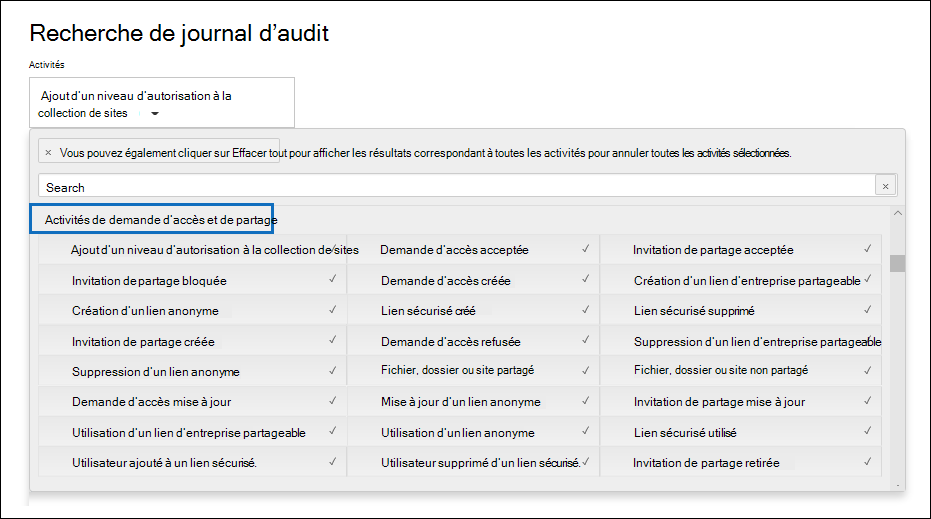

# Utiliser le partage d’audit dans le journal d’audit

Le partage est une activité clé dans SharePoint Online et OneDrive Entreprise, et est largement utilisé dans les organisations. Les administrateurs peuvent utiliser l’audit de partage dans le journal d’audit pour déterminer comment le partage est utilisé dans leur organisation. 
  
## Schéma SharePoint partage de données

Les événements de partage (sans les événements liés à la stratégie de partage et aux liens de partage) sont différents des événements liés aux fichiers et aux dossiers d’une manière principale : un utilisateur effectue une action qui a un effet sur un autre utilisateur. Par exemple, lorsqu’un utilisateur de ressource A donne à l’utilisateur B un accès à un fichier. Dans cet exemple, l’utilisateur A est *l’utilisateur agissant* et l’utilisateur B *l’utilisateur cible.* Dans le schéma SharePoint fichier, l’action de l’utilisateur agissant affecte uniquement le fichier lui-même. Lorsque l’utilisateur A ouvre un fichier, les seules informations nécessaires dans **l’événement FileAccessed** sont l’utilisateur agissant. Pour résoudre cette différence, il existe un schéma distinct, appelé schéma de partage *SharePoint,* qui capture plus d’informations sur les événements de partage. Cela garantit que les administrateurs ont une visibilité sur les personnes qui ont partagé une ressource et sur l’utilisateur avec qui la ressource a été partagée. 
  
Le schéma de partage fournit deux champs supplémentaires dans un enregistrement d’audit relatif au partage d’événements : 
  
- **TargetUserOrGroupType :** Indique si l’utilisateur ou le groupe cible est membre, invité, sharepointgroup, groupe de sécurité ou partenaire.

- **TargetUserOrGroupName :** Stocke l’UPN ou le nom de l’utilisateur ou du groupe cible avec qui une ressource a été partagée (utilisateur B dans l’exemple précédent). 

Ces deux champs, en plus des autres propriétés du schéma du journal d’audit, telles que  User, Operation et Date, peuvent indiquer l’utilisateur qui a partagé la ressource avec qui et quand *.*   
  
Il existe une autre propriété de schéma qui est importante pour l’article de partage. Lorsque vous exportez les résultats de recherche du journal d’audit, la colonne **AuditData** dans le fichier CSV exporté stocke des informations sur les événements de partage. Par exemple, lorsqu’un utilisateur partage un site avec un autre utilisateur, cette action est réalisée en ajoutant l’utilisateur cible à un SharePoint groupe. La **colonne AuditData** capture ces informations pour fournir du contexte aux administrateurs. Consultez [l’étape 2](#step-2-use-the-powerquery-editor-to-format-the-exported-audit-log) pour obtenir des instructions sur l’examen des informations dans la **colonne AuditData.**

## SharePoint événements de partage

Le partage est défini par lorsqu’un utilisateur (l’utilisateur *agissant)* souhaite partager une ressource avec un autre utilisateur *(l’utilisateur* cible). Les enregistrements d’audit liés au partage d’une ressource avec un utilisateur externe (un utilisateur qui est en dehors de votre organisation et qui n’a pas de compte invité dans le Azure Active Directory de votre organisation) sont identifiés par les événements suivants, qui sont enregistrés dans le journal d’audit :

- **SharingInvitationCreated :** Un utilisateur de votre organisation a tenté de partager une ressource (probablement un site) avec un utilisateur externe. Cela entraîne l’envoi d’une invitation de partage externe à l’utilisateur cible. Aucun accès à la ressource n’est accordé à ce stade.

- **SharingInvitationAccepted :** L’utilisateur externe a accepté l’invitation de partage envoyée par l’utilisateur en action et a désormais accès à la ressource.

- **AnonymousLinkCreated :** Un lien anonyme (également appelé lien « Tout le monde » ) est créé pour une ressource. Étant donné qu’un lien anonyme peut être créé, puis copié, il est raisonnable de supposer que tout document ayant un lien anonyme a été partagé avec un utilisateur cible.

- **AnonymousLinkUsed :** Comme son nom l’indique, cet événement est journalisé lorsqu’un lien anonyme est utilisé pour accéder à une ressource. 

- **SecureLinkCreated :** Un utilisateur a créé un « lien de personnes spécifique » pour partager une ressource avec une personne spécifique. Cet utilisateur cible peut être une personne externe à votre organisation. La personne avec qui la ressource est partagée est identifiée dans l’enregistrement d’audit pour **l’événement AddedToSecureLink.** Les horodatés de ces deux événements sont presque identiques.

- **AddedToSecureLink :** Un utilisateur a été ajouté à un lien de personnes spécifique. Utilisez le **champ TargetUserOrGroupName** dans cet événement pour identifier l’utilisateur ajouté au lien de personnes spécifique correspondant. Cet utilisateur cible peut être une personne externe à votre organisation.

## Partage du flux de travail d’audit
  
Lorsqu’un utilisateur (l’utilisateur agissant) souhaite partager une ressource avec un autre utilisateur (l’utilisateur cible), SharePoint (ou OneDrive Entreprise) vérifie d’abord si l’adresse e-mail de l’utilisateur cible est déjà associée à un compte d’utilisateur dans l’annuaire de l’organisation. Si l’utilisateur cible se trouve dans l’annuaire (et possède un compte d’utilisateur invité correspondant), SharePoint les choses suivantes :
  
-  Attribue immédiatement à l’utilisateur cible les autorisations d’accès à la ressource en ajoutant l’utilisateur cible au groupe SharePoint approprié et enregistre un **événement AddedToGroup.** 
    
- Envoie une notification de partage à l’adresse e-mail de l’utilisateur cible.
    
- Enregistre un **événement SharingSet.** Cet événement a un nom convivial « Fichier partagé, dossier ou site » sous Activités de demande de partage et d’accès dans le s sélectionneur d’activités de l’outil de recherche du journal d’audit.  Consultez la capture [d’écran de l’étape 1.](#step-1-search-for-sharing-events-and-export-the-results-to-a-csv-file) 
    
Si un compte d’utilisateur de l’utilisateur cible n’est pas dans l’annuaire, SharePoint :: 
    
   - Enregistre l’un des événements suivants, en fonction de la façon dont la ressource est partagée :
   
      - **AnonymousLinkCreated**
   
      - **SecureLinkCreated**
   
      - **AddedToSecureLink** 

      - **SharingInvitationCreated** (cet événement est enregistré uniquement lorsque la ressource partagée est un site)
    
   - Lorsque l’utilisateur cible accepte l’invitation de partage qui lui est envoyée (en cliquant sur le lien dans l’invitation), SharePoint enregistre un événement **SharingInvitationAccepted** et attribue à l’utilisateur cible les autorisations d’accès à la ressource. Si un lien anonyme est envoyé à l’utilisateur cible, **l’événement AnonymousLinkUsed** est enregistré une fois que l’utilisateur cible a utilisé le lien pour accéder à la ressource. Pour les liens sécurisés, un **événement FileAccessed** est enregistré lorsqu’un utilisateur externe utilise le lien pour accéder à la ressource.

Des informations supplémentaires sur l’utilisateur cible sont également enregistrées, telles que l’identité de l’utilisateur à qui l’invitation est envoyée et l’utilisateur qui accepte l’invitation. Dans certains cas, ces utilisateurs (ou adresses de messagerie) peuvent être différents. 

## Comment identifier les ressources partagées avec des utilisateurs externes

Une exigence courante pour les administrateurs est la création d’une liste de toutes les ressources qui ont été partagées avec des utilisateurs en dehors de l’organisation. En utilisant le partage d’audit Office 365, les administrateurs peuvent générer cette liste. Voici comment procéder.
  
### Étape 1 : Rechercher des événements de partage et exporter les résultats dans un fichier CSV

La première étape consiste à rechercher des événements de partage dans le journal d’audit. Pour plus d’informations (y compris les autorisations requises) sur la recherche dans le journal d’audit, voir [Rechercher dans le journal d’audit.](search-the-audit-log-in-security-and-compliance.md)
  
1. Accédez à <https://compliance.microsoft.com>.

2. Connectez-vous à l’aide de votre compte scolaire ou professionnel.

3. Dans le volet de navigation gauche du centre de conformité Microsoft 365, cliquez sur **Audit**.

    La page **Audit** s’affiche.

4. Sous **Activités,** cliquez sur **Activités de partage** et d’accès aux activités de demande pour rechercher des événements liés au partage. 

    
  
5. Sélectionnez une plage de dates et d’heures pour rechercher les événements de partage qui se sont produits au cours de cette période. 

6. Cliquez **sur Rechercher** pour exécuter la recherche. 

7. Lorsque la recherche est terminée et que les résultats sont affichés, cliquez sur **Exporter les** résultats Télécharger tous \> **les résultats.**

    Après avoir sélectionné l’option d’exportation, un message en bas de la fenêtre vous invite à ouvrir ou à enregistrer le fichier CSV.

8. Cliquez **sur** Enregistrer \> **sous** et enregistrez le fichier CSV dans un dossier de votre ordinateur local. 

### Étape 2 : Utiliser l’éditeur PowerQuery pour mettre en forme le journal d’audit exporté

L’étape suivante consiste à utiliser la fonctionnalité de transformation JSON dans Power Query Editor dans Excel pour fractionner chaque propriété dans la colonne **AuditData** (qui se compose d’un objet JSON à plusieurs propriétés) dans sa propre colonne. Cela vous permet de filtrer les colonnes pour afficher les enregistrements liés au partage

Pour obtenir des instructions détaillées, consultez « Étape 2 : mise en forme du journal d’audit exporté à l’aide de l’Éditeur Power Query » dans [Exporter, configurer et afficher des enregistrements du journal d’audit](export-view-audit-log-records.md#step-2-format-the-exported-audit-log-using-the-power-query-editor).

### Étape 3 : Filtrer le fichier CSV pour les ressources partagées avec des utilisateurs externes

L’étape suivante consiste à filtrer le CSV pour les différents événements liés au partage qui ont été précédemment décrits dans la section SharePoint [événements de partage.](#sharepoint-sharing-events) Vous pouvez également filtrer la colonne **TargetUserOrGroupType** pour afficher tous les enregistrements dont la valeur de cette propriété est **Invité**. 

Après avoir suivi les instructions de l’étape précédente pour préparer le fichier CSV à l’aide de l’éditeur PowerQuery, faites ce qui suit :
    
1. Ouvrez le Excel que vous avez créé à l’étape 2. 

2. Sous **l’onglet** Accueil, cliquez **sur Trier & filtre,** puis cliquez sur **Filtrer.**
    
3. Dans la **liste** & liste & filtre dans la colonne **Opérations,** effacer toutes les sélections, puis sélectionner un ou plusieurs événements liés au partage suivants, puis cliquer sur **OK**.
 
   - **SharingInvitationCreated**
   
   - **AnonymousLinkCreated**
   
   - **SecureLinkCreated**
   
   - **AddedToSecureLink** 
    
    Excel affiche les lignes pour les événements que vous avez sélectionnés.
    
4. Go to the column named **TargetUserOrGroupType** and select it. 
    
5. Dans la **liste &** liste & filtre, effacer toutes les sélections, puis **sélectionner TargetUserOrGroupType:Guest,** puis cliquez sur **OK**.
    
    Maintenant Excel affiche les lignes pour le partage d’événements ET où l’utilisateur cible se trouve en dehors de votre organisation, car les utilisateurs externes sont identifiés par la valeur **TargetUserOrGroupType:Guest**. 
  
> [!TIP]
> Pour les enregistrements d’audit qui sont affichés, la **colonne ObjectId** identifie la ressource qui a été partagée avec l’utilisateur cible ; par  `ObjectId:https:\/\/contoso-my.sharepoint.com\/personal\/sarad_contoso_com\/Documents\/Southwater Proposal.docx` exemple.
