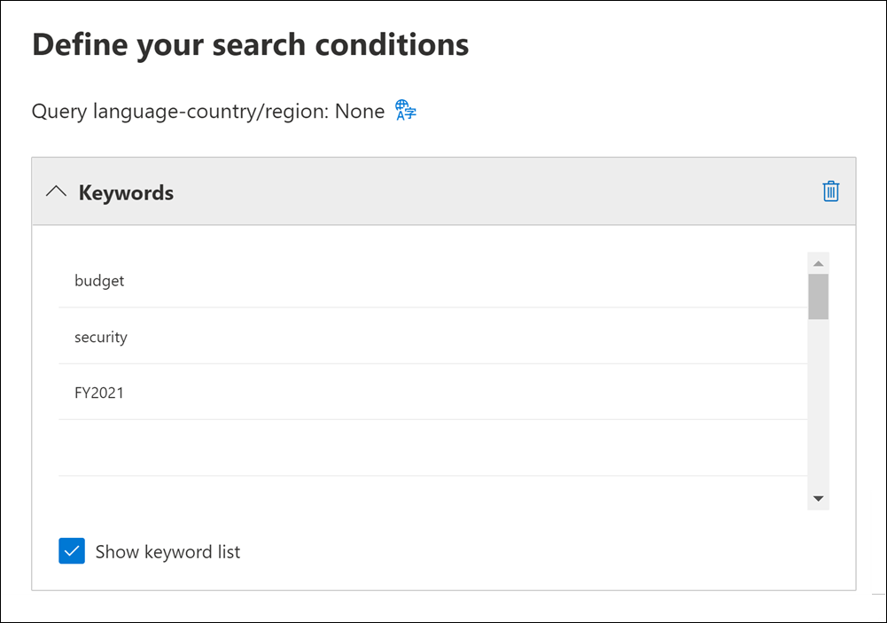
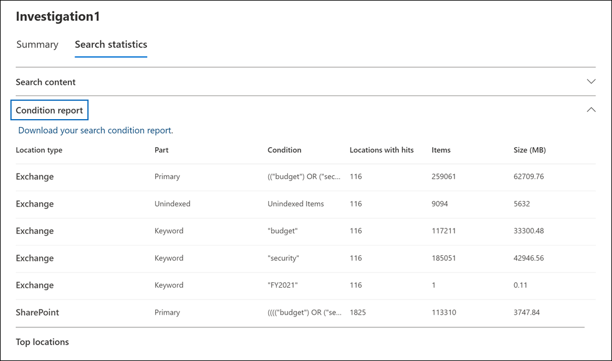

# Afficher des statistiques pour les résultats de recherche eDiscovery

Après avoir créé et exécuté une recherche de contenu ou une recherche associée à un cas core eDiscovery, vous pouvez afficher des statistiques sur les résultats de recherche estimés. Cela inclut un résumé des résultats de la recherche (semblable au résumé des résultats de recherche estimés affichés sur la page volante de recherche), les statistiques de requête telles que le nombre d’emplacements de contenu avec des éléments qui correspondent à la requête de recherche et l’identité des emplacements de contenu qui ont le plus d’éléments correspondants.
  
En outre, vous pouvez utiliser la liste de mots clés pour configurer une recherche afin de renvoyer des statistiques pour chaque mot clé dans une requête de recherche. Cela vous permet de comparer le nombre de résultats renvoyés par chaque mot clé dans une requête.
  
Vous pouvez également télécharger des statistiques de recherche dans un fichier CSV. Cela vous permet d’utiliser les fonctionnalités de filtrage et de tri dans Excel pour comparer les résultats et préparer des rapports pour vos résultats de recherche.
  
## Obtenir des statistiques pour les recherches

Pour afficher des statistiques pour une recherche de contenu ou une recherche associée à un cas de découverte électronique principale :
  
1. Dans la Centre de conformité Microsoft 365, cliquez sur **Afficher tout,** puis faites l’une des choses suivantes :

   - Cliquez **sur Recherche de** contenu, puis sélectionnez une recherche pour afficher la page volante.

     OU

   - Cliquez **sur eDiscovery** Core, sélectionnez un cas, puis sélectionnez une recherche sous l’onglet Recherches pour afficher  >  la page volante. 

2. Dans la page volante de la recherche sélectionnée, cliquez sur l’onglet **Statistiques de** recherche.
  
   

**L’onglet Statistiques** de recherche contient les sections suivantes qui contiennent différents types de statistiques sur la recherche.

### Rechercher du contenu

Cette section affiche un résumé graphique des éléments estimés renvoyés par la recherche. Cela indique le nombre d’éléments qui correspondent aux critères de recherche. Ces informations vous donnent une idée du nombre estimé d’éléments renvoyés par la recherche.

- **Éléments estimés par emplacement**: nombre total d’éléments estimés renvoyés par la recherche. Le nombre spécifique d’éléments situés dans des boîtes aux lettres et dans des sites est également affiché.

- **Emplacements estimés avec occurrences**: nombre total d’emplacements de contenu qui contiennent des éléments renvoyés par la recherche. Le nombre spécifique d’emplacements de boîtes aux lettres et de sites est également affiché.

- **Volume de données par emplacement (en Mo)**: taille totale de tous les éléments estimés renvoyés par la recherche. La taille spécifique des éléments de boîte aux lettres et des éléments de site est également affichée.

### Rapport de condition

Cette section affiche des statistiques sur la requête de recherche et le nombre d’éléments estimés qui correspondent à différentes parties de la requête de recherche. Vous pouvez utiliser ces statistiques pour analyser le nombre d’éléments qui correspondent à chaque composant de la requête de recherche. Cela peut vous aider à affiner les critères de recherche et, si nécessaire, à affiner l’étendue de l’étendue. Vous pouvez également télécharger une copie de ce rapport au format CSV.

- **Type d’emplacement**: type d’emplacement de contenu applicable aux statistiques de requête. La valeur **de** Exchange indique un emplacement de boîte aux lettres ; une valeur de **SharePoint** indique un emplacement de site.

- **Partie**: partie de la requête de recherche à qui les statistiques s’appliquent. **Primary** indique l’intégralité de la requête de recherche. **Le** mot clé indique que les statistiques de la ligne sont pour un mot clé spécifique. Si vous utilisez une liste de mots clés pour la requête de recherche, les statistiques de chaque composant de la requête sont incluses dans ce tableau. Pour plus d’informations, voir [Obtenir des statistiques sur les mots clés pour les recherches.](#get-keyword-statistics-for-searches)

- **Condition**: composant réel (mot clé ou condition) de la requête de recherche qui a renvoyé les statistiques affichées dans la ligne correspondante.

- **Emplacements** avec accès : nombre d’emplacements  de contenu (spécifiés par la colonne Type d’emplacement) qui contiennent des éléments qui correspondent à la requête principale ou de mot clé répertoriée dans la colonne **Condition.**

- **Éléments**: nombre d’éléments (à partir de l’emplacement de contenu spécifié) qui correspondent à la requête répertoriée dans la **colonne Condition.** Comme indiqué précédemment, si un élément contient plusieurs instances d’un mot clé recherché, il n’est compté qu’une seule fois dans cette colonne.

- **Taille (Mo)**: taille totale de tous les éléments trouvés (à l’emplacement de contenu spécifié) qui correspondent à la requête de recherche dans la colonne **Condition.**

### Emplacements principaux

Cette section affiche des statistiques sur les emplacements de contenu spécifiques avec le plus d’éléments renvoyés par la recherche. Les 1 000 principaux emplacements sont affichés. Vous pouvez également télécharger une copie de ce rapport au format CSV.

- Nom du nom de l’emplacement (adresse de messagerie des boîtes aux lettres et URL des sites).

- Type d’emplacement (boîte aux lettres ou site).

- Nombre estimé d’éléments dans l’emplacement de contenu renvoyé par la recherche.

- Taille totale des éléments estimés dans chaque emplacement de contenu.

## Obtenir des statistiques sur les mots clés pour les recherches

Comme expliqué précédemment, la section **Rapport de condition** affiche la requête de recherche et le nombre (et la taille) d’éléments qui correspondent à la requête. Si vous utilisez une liste de mots clés lorsque vous créez ou modifiez une requête de recherche, vous pouvez obtenir des statistiques améliorées qui indiquent le nombre d’éléments qui correspondent à chaque mot clé ou expression de mot clé. Cela peut vous aider à identifier rapidement les parties de la requête qui sont les plus (et les moins) efficaces. Par exemple, si un mot clé renvoie un grand nombre d’éléments, vous pouvez choisir d’affiner la requête de mot clé pour affiner les résultats de la recherche.

Pour créer une liste de mots clés et afficher des statistiques de mots clés pour une recherche :
  
1. Dans la Centre de conformité Microsoft 365, créez une recherche de contenu ou une recherche associée à un cas core eDiscovery.

2. Dans la page **Conditions** de l’Assistant Recherche. cochez la **case Afficher la liste des** mots clés.

   

3. Tapez une phase de mot clé ou de mot clé dans une ligne du tableau des mots clés. Par exemple, tapez **budget** sur la première ligne, **tapez** sécurité dans la deuxième ligne et tapez **FY2021** dans la troisième ligne.

   

   > [!NOTE]
   > Pour réduire les problèmes causés par les grandes listes de mots clés, vous êtes limité à 20 lignes au maximum dans la liste de mots clés d’une requête de recherche.

4. Après avoir ajouté les mots clés à la liste dont vous souhaitez rechercher et obtenir des statistiques, exécutez la recherche.

5. Lorsque la recherche est terminée, sélectionnez-la pour afficher la page volante.

6. Sous **l’onglet Statistiques de** recherche, cliquez sur le rapport **de condition** pour afficher les statistiques de mot clé pour la recherche.

    
  
    Comme indiqué dans la capture d’écran précédente, les statistiques de chaque mot clé sont affichées . Cela inclut :

    - Statistiques de mots clés pour chaque type d’emplacement de contenu inclus dans la recherche.

    - Nombre d’éléments de boîte aux lettres nonndex.

    - Requête et résultats de recherche réels  pour chaque mot clé (identifié comme mot clé dans la colonne **Part),** qui inclut toutes les conditions de la requête de recherche.

    - Requête de recherche complète  (identifiée comme principale dans la colonne **Part)** et statistiques de la requête complète pour chaque type d’emplacement. Notez que ces statistiques sont les mêmes que celles affichées sous **l’onglet** Résumé.
