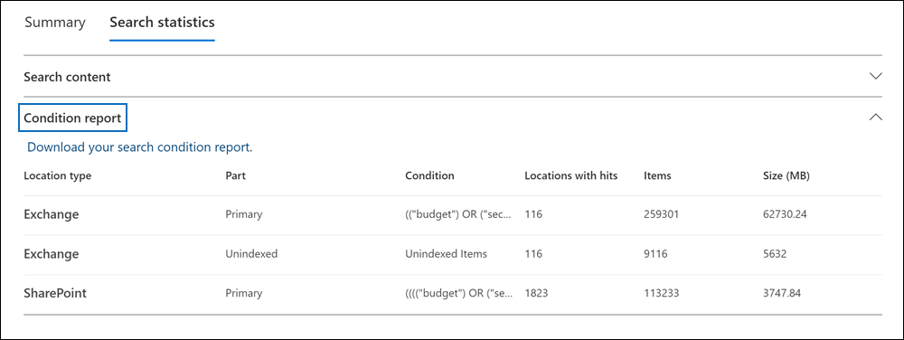

# Afficher les statistiques des résultats de la recherche eDiscovery

Après avoir créé et exécuté une recherche de contenu ou une recherche associée à un cas Microsoft Purview eDiscovery (Standard), vous pouvez afficher des statistiques sur les résultats de recherche estimés. Cela inclut un résumé des résultats de la recherche (similaire au résumé des résultats de recherche estimés affichés sur la page volante de recherche), les statistiques de requête telles que le nombre d’emplacements de contenu avec des éléments qui correspondent à la requête de recherche et l’identité des emplacements de contenu qui ont le plus d’éléments correspondants.
  
En outre, vous pouvez utiliser la liste de mots clés pour configurer une recherche afin de retourner des statistiques pour chaque mot clé dans une requête de recherche. Cela vous permet de comparer le nombre de résultats retournés par chaque mot clé dans une requête.
  
Vous pouvez également télécharger les statistiques de recherche dans un fichier de valeurs séparées par des virgules (CSV). Cela vous permet d’utiliser les fonctionnalités de filtrage et de tri dans Excel pour comparer les résultats et préparer des rapports pour vos résultats de recherche.
  
[!INCLUDE [purview-preview](../includes/purview-preview.md)]

## Obtenir des statistiques pour les recherches

Pour afficher les statistiques d’une recherche de contenu ou d’une recherche associée à un cas eDiscovery (Standard) :
  
1. Dans la portail de conformité Microsoft Purview, sélectionnez **Afficher tout**, puis effectuez l’une des opérations suivantes :

   - Sélectionnez **Recherche de contenu** , puis sélectionnez une recherche pour afficher la page de menu volant.

     OR

   - Sélectionnez **eDiscovery****eDiscovery** >  (Standard), sélectionnez un cas, puis sélectionnez une recherche sous l’onglet **Recherches** pour afficher la page de menu volant.

2. Dans la page volante de la recherche sélectionnée, sélectionnez l’onglet **Statistiques de** recherche.
  
   

**L’onglet Statistiques de** recherche contient pour les sections suivantes qui contiennent différents types de statistiques sur la recherche.

### Contenu de la recherche

Cette section affiche un résumé graphique des éléments estimés retournés par la recherche. Cela indique le nombre d’éléments qui correspondent aux critères de recherche. Ces informations vous donnent une idée du nombre estimé d’éléments retournés par la recherche.

- **Éléments estimés par emplacements** : nombre total d’éléments estimés retournés par la recherche. Le nombre spécifique d’éléments situés dans des boîtes aux lettres et situés dans des sites s’affiche également.
- **Emplacements estimés avec accès** : nombre total d’emplacements de contenu qui contiennent des éléments retournés par la recherche. Le nombre spécifique d’emplacements de boîte aux lettres et de sites s’affiche également.
- **Volume de données par emplacement (en Mo)** : taille totale de tous les éléments estimés retournés par la recherche. La taille spécifique des éléments de boîte aux lettres et des éléments de site s’affiche également.

### Rapport de condition

Cette section affiche des statistiques sur la requête de recherche et le nombre d’éléments estimés correspondant à différentes parties de la requête de recherche. Vous pouvez utiliser ces statistiques pour analyser le nombre d’éléments qui correspondent à chaque composant de la requête de recherche. Cela peut vous aider à affiner les critères de recherche et, si nécessaire, à limiter l’étendue de l’étendue. Vous pouvez également télécharger une copie de ce rapport au format CSV.

- **Type d’emplacement** : type d’emplacement de contenu auquel les statistiques de requête s’appliquent. La valeur **d’Exchange** indique l’emplacement d’une boîte aux lettres ; Une valeur de **SharePoint** indique l’emplacement d’un site.
- **Partie** : partie de la requête de recherche à laquelle les statistiques s’appliquent. **Primary** indique l’intégralité de la requête de recherche. **Le mot clé** indique que les statistiques de la ligne concernent un mot clé spécifique. Si vous utilisez une liste de mots clés pour la requête de recherche, les statistiques de chaque composant de la requête sont incluses dans cette table. Pour plus d’informations, consultez [Obtenir des statistiques de mot clé pour les recherches](#get-keyword-statistics-for-searches).
- **Condition** : composant réel (mot clé ou condition) de la requête de recherche qui a retourné les statistiques affichées dans la ligne correspondante.
- **Emplacements avec accès** : nombre d’emplacements de contenu (spécifiés par la colonne **Type d’emplacement** ) qui contiennent des éléments qui correspondent à la requête principale ou au mot clé répertorié dans la colonne **Condition** .
- **Éléments** : nombre d’éléments (à partir de l’emplacement de contenu spécifié) qui correspondent à la requête répertoriée dans la colonne **Condition** . Comme expliqué précédemment, si un élément contient plusieurs instances d’un mot clé recherché, il n’est compté qu’une seule fois dans cette colonne.
- **Taille (Mo)** : taille totale de tous les éléments trouvés (à l’emplacement de contenu spécifié) qui correspondent à la requête de recherche dans la colonne **Condition** .

### Principaux emplacements

Cette section affiche des statistiques sur les emplacements de contenu spécifiques avec le plus d’éléments retournés par la recherche. Les 1 000 principaux emplacements sont affichés. Vous pouvez également télécharger une copie de ce rapport au format CSV.

- Nom de l’emplacement (adresse e-mail des boîtes aux lettres et URL des sites).
- Type d’emplacement (une boîte aux lettres ou un site).
- Nombre estimé d’éléments dans l’emplacement de contenu retourné par la recherche.
- Taille totale des éléments estimés dans chaque emplacement de contenu.

## Obtenir des statistiques de mot clé pour les recherches

La section **Rapport de condition** affiche la requête de recherche et le nombre (et la taille) des éléments qui correspondent à la requête. Si vous utilisez une liste de mots clés lorsque vous créez ou modifiez une requête de recherche, vous pouvez obtenir des statistiques améliorées qui indiquent le nombre d’éléments correspondant à chaque mot clé ou expression de mot clé. Cela peut vous aider à identifier rapidement les parties de la requête qui sont les plus (et les moins) efficaces. Par exemple, si un mot clé retourne un grand nombre d’éléments, vous pouvez choisir d’affiner la requête de mot clé pour affiner les résultats de la recherche.

Pour créer une liste de mots clés et afficher les statistiques de mots clés pour une recherche :
  
1. Dans le [portail de conformité Microsoft Purview](https://compliance.microsoft.com), créez une recherche de contenu ou une recherche associée à un cas eDiscovery (Standard).

2. Dans la page **Conditions** de l’Assistant recherche. Cochez la case **Afficher la liste des mots clés** .

   

3. Tapez un mot clé ou une phase de mot clé dans une ligne de la table des mots clés. Par exemple, tapez **budget** dans la première ligne, tapez **security** dans la deuxième ligne et tapez **FY2021** dans la troisième ligne.

   

   > [!NOTE]
   > Pour réduire les problèmes causés par les listes de mots clés volumineuses, vous êtes limité à un maximum de 20 lignes dans la liste de mots clés d’une requête de recherche.

4. Après avoir ajouté les mots clés à la liste pour laquelle vous souhaitez rechercher et obtenir des statistiques, exécutez la recherche.

5. Une fois la recherche terminée, sélectionnez-la pour afficher la page de menu volant.

6. Sous l’onglet **Statistiques de** recherche, sélectionnez le **rapport Condition** pour afficher les statistiques de mot clé pour la recherche.

    
  
    Comme indiqué dans la capture d’écran précédente, les statistiques pour chaque mot clé sont affichées ; cela inclut les éléments suivants :

    - Statistiques de mot clé pour chaque type d’emplacement de contenu inclus dans la recherche.
    - Nombre d’éléments de boîte aux lettres non indexés.
    - Requête de recherche et résultats réels pour chaque mot clé (identifié comme **mot clé** dans la colonne **Part** ), qui inclut toutes les conditions de la requête de recherche.
    - La requête de recherche complète (identifiée comme **principale** dans la colonne **Part** ) et les statistiques de la requête complète pour chaque type d’emplacement. Notez qu’il s’agit des mêmes statistiques que celles affichées sous l’onglet **Résumé** .
