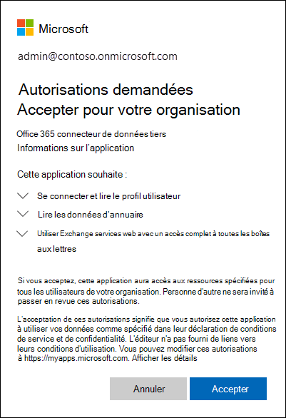

# <a name="work-with-a-partner-to-archive-third-party-data"></a>Collaborer avec un partenaire pour archiver des données tierces

Vous pouvez travailler avec un partenaire Microsoft pour importer et archiver des données à partir d’une source de données tierce vers Microsoft 365. Un partenaire peut vous fournir un connecteur personnalisé qui est configuré pour extraire des éléments de la source de données tierce (régulièrement), puis importer ces éléments. Le connecteur partenaire convertit le contenu d’un élément de la source de données au format de message électronique, puis stocke les éléments dans les boîtes aux lettres. Une fois les données tierces importées, vous pouvez appliquer des fonctionnalités de conformité Microsoft 365 telles que la conservation pour litige, la découverte électronique, l’archivage In-Place, l’audit et les stratégies de rétention Microsoft 365 à ces données.

>[!IMPORTANT]
>La [solution de conformité des](communication-compliance.md) communications Microsoft 365 ne peut pas être appliquée aux données tierces importées par les connecteurs partenaires mentionnés dans cet article. 

Voici une vue d’ensemble du processus et des étapes nécessaires pour travailler avec un partenaire Microsoft afin d’importer des données tierces.

[Step 1: Find a third-party data partner](#step-1-find-a-third-party-data-partner)

[Étape 2 : Créer et configurer une boîte aux lettres de données tierce](#step-2-create-and-configure-a-third-party-data-mailbox-in-microsoft-365)

[Step 3: Configure user mailboxes for third-party data](#step-3-configure-user-mailboxes-for-third-party-data)

[Étape 4 : fournir des informations au partenaire](#step-4-provide-your-partner-with-information)

[Étape 5 : inscrire le connecteur de données tiers dans Azure Active Directory](#step-5-register-the-third-party-data-connector-in-azure-active-directory)

## <a name="how-the-third-party-data-import-process-works"></a>Fonctionnement du processus d’importation de données tierces

L’illustration et la description suivantes expliquent le fonctionnement du processus d’importation de données tiers lorsque vous travaillez avec un partenaire.
  

  
1. Le client travaille avec son partenaire de choix pour configurer un connecteur qui extraira des éléments de la source de données tierce, puis les importera dans Microsoft 365.
    
2. Le connecteur partenaire se connecte à des sources de données tierces via une API tierce (sur une base programmée ou configurée) et extrait des éléments de la source de données. Le connecteur partenaire convertit le contenu d’un élément dans un format de message électronique. Consultez la section [Plus d’informations](#more-information) pour obtenir une description du schéma de format de message. 
    
3. Le connecteur partenaire se connecte au service Azure dans Microsoft 365 en utilisant Exchange Web Service (EWS) via un point de fin connu.
    
4. Les éléments sont importés dans la boîte aux lettres d’un utilisateur spécifique ou dans une boîte aux lettres « fourre-tout » destinée aux données tierces. L’importation d’un élément dans la boîte aux lettres d’un utilisateur spécifique ou dans la boîte aux lettres de données tierces repose sur les critères suivants :
    
   1. **Éléments dont l’ID d’utilisateur correspond à un compte d’utilisateur :** Si le connecteur partenaire peut ma cartographier l’ID utilisateur de l’élément de la source de données tierce sur un ID utilisateur spécifique dans Microsoft 365, l’élément est copié dans le dossier **Purges** du dossier Éléments récupérables de l’utilisateur. Les utilisateurs ne peuvent pas accéder aux éléments du dossier Purges. Toutefois, vous pouvez utiliser les outils eDiscovery pour rechercher des éléments dans le dossier Purges.
    
   1. **Éléments qui n’ont pas d’ID d’utilisateur correspondant à un compte d’utilisateur :** Si le connecteur partenaire ne peut pas macher l’ID d’utilisateur d’un  élément sur un ID d’utilisateur spécifique, l’élément est copié dans le dossier Boîte de réception de la boîte aux lettres de données tierce. L’importation d’éléments dans la boîte de réception permet à un membre de votre organisation ou à vous-même de vous connecter à la boîte aux lettres tierce pour visualiser et gérer ces éléments, et de voir si des ajustements doivent être effectués dans la configuration du connecteur partenaire.
 
## <a name="step-1-find-a-third-party-data-partner"></a>Étape 1 : trouver un partenaire de données tierces

Un composant clé pour l’archivage des données tierces dans Microsoft 365 est la recherche et l’collaboration avec un partenaire Microsoft spécialisé dans la capture de données à partir d’une source de données tierce et son importation dans Microsoft 365. Une fois les données importées, elles peuvent être archivées et conservées avec les autres données Microsoft de votre organisation, telles que le courrier électronique provenant de Exchange et les documents de SharePoint et OneDrive Entreprise. Un partenaire crée un connecteur qui extrait les données des sources de données tierces de votre organisation (telles que BlackBerry, Facebook, Google+, Thomson Reuters, Twitter et YouTube) et transmet ces données à une API Microsoft 365 qui importe des éléments dans des boîtes aux lettres Exchange sous forme de messages électroniques.
  
Les sections suivantes indiquent les partenaires Microsoft (et les sources de données tierces qu’ils supportent) qui participent au programme d’archivage des données tierces dans Microsoft 365.

[17a-4 LLC](#17a-4-llc)
  
[ArchiveSocial](#archivesocial)
  
[Veritas](#veritas)
  
[OpenText](#opentext)
  
[Smarsh](#smarsh)

[Verba](#verba)
  
### <a name="17a-4-llc"></a>17a-4 LLC

[17a-4 LLC](https://www.17a-4.com) prend en charge les sources de données tierces suivantes :
  
- BlackBerry
    
- Flux de données Bloomberg
    
- Cisco Jabber
    
- FactSet
    
- HipChat
    
- InvestEdge
    
- LivePerson
    
- Flux de données MessageLabs
    
- OpenText
    
- Aide en direct « cliquer pour appeler » Oracle/ATG
    
- Pivot IMTRADER
    
- Microsoft SharePoint
    
- MindAlign
    
- Sitrion One (Newsgator)
    
- Skype Entreprise (Lync/OCS)
    
- Skype Entreprise Online (Lync Online)
    
- Bases de données SQL
    
- Squawker
    
- Thomson Reuters Eikon Messenger
  

  
### <a name="archivesocial"></a>ArchiveSocial

[ArchiveSocial prend ](https://www.archivesocial.com) en charge les sources de données tierces suivantes : 
  
- Facebook
    
- Flickr
    
- Twitter
    
- LinkedIn
    
- Pinterest
    
- Twitter
    
- YouTube
    
- Vimeo
  
### <a name="veritas"></a>Veritas

[Veritas prend](https://www.globanet.com) en charge les sources de données tierces suivantes : 
  
- AOL avec client Pivot  
    
- BlackBerry Call Logs (version 5, version 10, version 12)
    
- BlackBerry Messenger (version 5, version 10, version 12)
    
- BlackBerry PIN (version 5, version 10, version 12)
    
- BlackBerry SMS (version 5, version 10, version 12)
    
- Bloomberg Chat
    
- Bloomberg Mail
    
- Box
    
- CipherCloud for Salesforce Chatter
    
- Cisco IM &amp; Presence Server (v10, v10.5.1 SU1, v11.0, v11.5 SU2)

- Cisco Webex Teams

- Citrix Workspace &amp; ShareFile

- CrowdCompass

- Fichiers texte délimités par des personnalisés
    
- Fichiers XML personnalisés
    
- Facebook (Pages)
    
- Factset
    
- FXConnect
    
- ICE Chat/YellowJacket
    
- Jive
    
- Macgregor XIP

- Microsoft Exchange Server
    
- Microsoft OneDrive Entreprise

- Microsoft Teams
       
- Microsoft Yammer
    
- Mobile Guard
    
- Pivot
    
- Salesforce Chatter

- Skype Entreprise Online
    
- Skype Entreprise, versions 2007 R2-2016 (sur site)
    
- Slack Enterprise Grid
    
- Symphony
    
- Thomson Reuters Eikon
    
- Thomson Reuters Messenger
    
- Thomson Reuters Dealings 3000/FX Trading
    
- Twitter
    
- UBS Chat
    
- YouTube
  
### <a name="opentext"></a>OpenText

[OpenText prend](https://www.opentext.com/what-we-do/products/opentext-product-offerings-catalog/rebranded-products/daegis) en charge les sources de données tierces suivantes : 
  
- Axs Encrypted
    
- Axs Exchange
    
- Axs Local Archive
    
- Axs PlaceHolder
    
- Axs Signed
    
- Bloomberg
    
- Thomson Reuters
  
### <a name="smarsh"></a>Smarsh

[Smarsh prend](https://www.smarsh.com) en charge les sources de données tierces suivantes : 
  
- AIM
    
- American Idol
    
- Apple Juice
    
- AOL avec client Pivot
    
- Ares
    
- Bazaar Voice
    
- Bear Share
    
- Bit Torrent
    
- BlackBerry Call Logs (version 5, version 10, version 12)
    
- BlackBerry Messenger (version 5, version 10, version 12)
    
- BlackBerry PIN (version 5, version 10, version 12)
    
- BlackBerry SMS (version 5, version 10, version 12)
    
- Bloomberg Mail
    
- CellTrust
    
- Chat Import
    
- Chat Real Time Logging and Policy
    
- Chatter
    
- Cisco IM &amp; Presence Server (v9.0.1, v9.1, v9.1.1 SU1, v10, v10.5.1 SU1)
    
- Cisco Unified Presence Server (v8.6.3, v8.6.4, v8.6.5)
    
- Collaboration Import
    
- Collaboration Real Time Logging
    
- Direct Connect
    
- Facebook
    
- FactSet
    
- FastTrack
    
- Gnutella
    
- Google+
    
- GoToMyPC
    
- Hopster
    
- HubConnex
    
- IBM Connections (version 3.0.1, version 4.0, version 4.5, version 4.5 CR3, version 5)
    
- IBM Connections Chat Cloud
    
- IBM Connections Social Cloud
    
- IBM SameTime Advanced 8.5.2 IFR1
    
- IBM SameTime Communicate 9.0
    
- IBM SameTime Community (version 8.0.2, version 8.5.1 IFR2, version 8.5.2 IFR1, version 9.1)
    
- IBM SameTime Complete 9.0
    
- IBM SameTime Conference 9.0
    
- IBM SameTime Meeting 8.5.2 IFR1
    
- ICE/YellowJacket
    
- IM Import
    
- IM Real Time Logging and Policy
    
- Indii Messenger
    
- Instant Bloomberg
    
- LASER
    
- Jive
    
- Jive 6 Real Time Logging (version 6, version 7)
    
- Jive Import
    
- JXTA
    
- LinkedIn
    
- Microsoft Lync (2010, 2013)
    
- MFTP
    
- Microsoft Lync 2013 Voix
    
- Microsoft SharePoint (2010, 2013)
    
- Microsoft SharePoint Online
    
- Microsoft UC (Unified Communications)
    
- MindAlign
    
- Mobile Guard
    
- MSN
    
- My Space
    
- NEONetwork
    
- Microsoft 365 Lync Dédié
    
- Microsoft 365 Messagerie instantanée partagée
    
- Pinterest
    
- Pivot
    
- QQ
    
- Skype Entreprise 2015
    
- SoftEther
    
- Symphony
    
- Thomson Reuters Eikon
    
- Thomson Reuters Messenger
    
- Tor
    
- TTT
    
- Twitter
    
- WinMX
    
- Winny
    
- Yahoo
    
- Yammer
    
- YouTube
    

### <a name="verba"></a>Verba

[Verba prend](https://www.verba.com) en charge les sources de données tierces suivantes : 
  
- Avaya Aura Video
    
- Avaya Aura Voice
    
- Avtec Radio
    
- Bosch/Telex Radio
    
- BroadSoft Video
    
- BroadSoft Voice
    
- Centile Voice
    
- Cisco Jabber IM
    
- Cisco UC Video
    
- Cisco UC Voice
    
- Cisco UCCX/UCCE Video
    
- Cisco UCCX/UCCE Voice
    
- ESChat Radio
    
- Geoman Contact Expert
    
- IP Trade Voice
    
- Luware LUCS Contact Center
    
- Microsoft UC (Unified Communications)
    
- Mitel MiContact Center for Lync (prairieFyre)
    
- Oracle / Acme Packet Session Border Controller Video
    
- Oracle / Acme Packet Session Border Controller Voice
    
- Singtel Mobile Voice
    
- SIPREC Video
    
-  SIPREC Voice 
    
- Skype Entreprise / MI Lync
    
- Skype Entreprise / Vidéo Lync
    
- Skype Entreprise / Voix Lync
    
- Speakerbus Voice
    
- Standard SIP/H.323 Video
    
- Standard SIP/H.323 Voice
    
- Truphone Voice
    
- TwistedPair Radio
    
- Écran d’ordinateur de bureau Windows
  
## <a name="step-2-create-and-configure-a-third-party-data-mailbox-in-microsoft-365"></a>Étape 2 : Créer et configurer une boîte aux lettres de données tierce dans Microsoft 365

Voici les étapes de création et de configuration d’une boîte aux lettres de données tierce pour l’importation de données dans Microsoft 365. Comme indiqué précédemment, les éléments sont importés dans cette boîte aux lettres si le connecteur partenaire ne peut pas maser l’ID utilisateur de l’élément sur un compte d’utilisateur.
  
 **Effectuer ces tâches dans le centre d’administration Microsoft 365 de gestion**
  
1. Créez un compte d’utilisateur et attribuez-lui une licence Exchange Online Plan 2 ; voir [Ajouter des utilisateurs à Microsoft 365](../admin/add-users/add-users.md). Une licence Plan 2 est nécessaire pour placer la boîte aux lettres en conservation pour litige ou activer une boîte aux lettres d’archivage avec un quota de stockage illimité.
    
2. Ajoutez le compte d’utilisateur pour la boîte aux lettres de données tierces au **rôle d’administrateur administrateur Exchange** dans Microsoft 365 ; voir [Attribuer des rôles d’administrateur dans Microsoft 365](../admin/add-users/assign-admin-roles.md).
    
    > [!TIP]
    > Notez les informations d’identification pour ce compte d’utilisateur. Vous devez les fournir à votre partenaire, comme décrit à l’étape 4. 
  
 **Effectuer ces tâches dans le centre d’administration Exchange de gestion**
  
1. Masquer la boîte aux lettres de données tierces dans le carnet d’adresses et les autres listes d’adresses de votre organisation ; voir [Gérer les boîtes aux lettres utilisateur.](/exchange/recipients-in-exchange-online/manage-user-mailboxes/manage-user-mailboxes) Vous pouvez également exécuter la commande PowerShell suivante :
    
    ```powershell
    Set-Mailbox -Identity <identity of third-party data mailbox> -HiddenFromAddressListsEnabled $true
    ```

2. Attribuez l’autorisation **FullAccess** à la boîte aux lettres de données tierce afin que les administrateurs ou les responsables de la mise en conformité peuvent ouvrir la boîte aux lettres de données tierces dans le client de bureau Outlook; voir [Gérer les autorisations pour les destinataires.](https://go.microsoft.com/fwlink/p/?LinkId=692104)
    
3. Activez les fonctionnalités de conformité suivantes pour la boîte aux lettres de données tierce :
    
    - Activer la boîte aux lettres d’archivage ; voir [Activer les boîtes aux lettres d’archivage](enable-archive-mailboxes.md) et Activer [l’archivage illimité.](enable-unlimited-archiving.md) Cela vous permet de libérer de l’espace de stockage dans la boîte aux lettres principale en mettant en place une stratégie d’archivage qui déplace des éléments de données tiers vers la boîte aux lettres d’archivage. Vous disposez ainsi d’un espace de stockage illimité pour les données tierces.
    
    - Placez la boîte aux lettres de données tierces en conservation pour litige. Vous pouvez également appliquer une stratégie Microsoft 365 rétention dans le centre de sécurité et conformité. Le placement de cette boîte aux lettres en attente conserve les éléments de données tiers (indéfiniment ou pour une durée spécifiée) et les empêche d’être purgés de la boîte aux lettres. Consultez l’une des rubriques suivantes :
    
      - [Placer une boîte aux lettres en conservation pour litige](./create-a-litigation-hold.md)
    
      - [En savoir plus sur les stratégies et les balises de rétention](retention.md)
    
    - Activer l’enregistrement d’audit de boîte aux lettres pour l’accès propriétaire, délégué et administrateur à la boîte aux lettres de données tierces ; voir [Activer l’audit de boîte aux lettres.](enable-mailbox-auditing.md) Cela vous permet d’auditer toutes les activités effectuées par tout utilisateur ayant accès à la boîte aux lettres de données tierces.

## <a name="step-3-configure-user-mailboxes-for-third-party-data"></a>Étape 3 : configurer des boîtes aux lettres d’utilisateurs pour les données tierces

L’étape suivante consiste à configurer les boîtes aux lettres des utilisateurs pour prendre en charge les données tierces. Effectuer ces tâches à l’aide Exchange centre d’administration ou à l’aide des cmdlets Windows PowerShell correspondantes.
  
1. Activer la boîte aux lettres d’archivage pour chaque utilisateur ; voir [Activer les boîtes aux lettres d’archivage](enable-archive-mailboxes.md) et Activer [l’archivage illimité.](enable-unlimited-archiving.md)
    
2. Placer les boîtes aux lettres des utilisateurs en conservation pour litige ou appliquer une stratégie Microsoft 365 rétention ; consultez l’une des rubriques suivantes : 
    
    - [Placer une boîte aux lettres en conservation pour litige](./create-a-litigation-hold.md)
    
    - [En savoir plus sur les stratégies et les balises de rétention](retention.md)
    
    Comme indiqué précédemment, lorsque vous placez des boîtes aux lettres en conservation, vous pouvez définir la durée de conservation des éléments de la source de données tierces ou vous pouvez choisir de les conserver indéfiniment.

## <a name="step-4-provide-your-partner-with-information"></a>Étape 4 : fournir des informations au partenaire

La dernière étape consiste à fournir à votre partenaire les informations suivantes afin qu’il puisse configurer le connecteur pour qu’il se connecte à votre organisation afin d’importer des données dans les boîtes aux lettres des utilisateurs et dans la boîte aux lettres de données tierces. 
  
- Point de terminaison utilisé pour se connecter au service Azure dans Microsoft 365 :

    ```http
    https://office365ingestionsvc.gble1.protection.outlook.com/service/ThirdPartyIngestionService.svc
    ```

- Informations d’identification de connexion (Microsoft 365'utilisateur et mot de passe) de la boîte aux lettres de données tierces que vous avez créée à l’étape 2. Ces informations d’identification sont requises pour que le connecteur partenaire puisse accéder aux éléments et les importer dans les boîtes aux lettres utilisateur et la boîte aux lettres de données tierces.
 
## <a name="step-5-register-the-third-party-data-connector-in-azure-active-directory"></a>Étape 5 : inscrire le connecteur de données tiers dans Azure Active Directory

À compter du 30 septembre 2018, le service Azure dans Microsoft 365 commence à utiliser l’authentification moderne dans Exchange Online pour authentifier les connecteurs de données tiers qui tentent de se connecter à votre organisation pour importer des données. La raison de ce changement est que l’authentification moderne offre plus de sécurité que la méthode actuelle, qui était basée sur une liste d’applications pour les connecteurs tiers qui utilisent le point de terminaison décrit précédemment pour se connecter au service Azure.

Pour permettre à un connecteur de données tiers de se connecter à Microsoft 365 à l’aide de la nouvelle méthode d’authentification moderne, un administrateur de votre organisation doit consentir à inscrire le connecteur en tant qu’application de service approuvé dans Azure Active Directory. Pour ce faire, acceptez une demande d’autorisation pour autoriser le connecteur à accéder aux données de votre organisation dans Azure Active Directory. Une fois cette demande acceptée, le connecteur de données tiers est ajouté en tant qu’application d’entreprise Azure Active Directory et représenté en tant que principal de service. Pour plus d’informations sur le processus de consentement, voir [Consentement de l’administrateur client.](/skype-sdk/trusted-application-api/docs/tenantadminconsent)

Voici les étapes à suivre pour accéder à la demande d’inscription du connecteur et l’accepter :

1. Go to [this page](https://login.microsoftonline.com/common/oauth2/authorize?client_id=8dfbc50b-2111-4d03-9b4d-dd0d00aae7a2&response_type=code&redirect_uri=https://portal.azure.com/&nonce=1234&prompt=admin_consent) and sign in using the credentials of a global administrator.

   La boîte de dialogue suivante s’affiche. Vous pouvez développer les conseils pour passer en revue les autorisations qui seront attribuées au connecteur.

   

2. Cliquez sur **Accept (Accepter)**.

Une fois la demande acceptée, le [portail Azure](https://portal.azure.com) s’affiche. Pour afficher la liste des applications de votre organisation, cliquez **sur Azure Active Directory**  >  **Enterprise applications.** Le Microsoft 365 de données tiers est répertorié dans le **Enterprise applications.**

> [!IMPORTANT]
> Après le 30 septembre 2018, les données tierces ne seront plus importées dans les boîtes aux lettres de votre organisation si vous n’inscrivez pas de connecteur de données tiers dans Azure Active Directory. Notez que les connecteurs de données tiers existants (ceux créés avant le 30 septembre 2018) doivent également être enregistrés dans Azure Active Directory en suivant la procédure de l’étape 5.

### <a name="revoking-consent-for-a-third-party-data-connector"></a>Révocation du consentement pour un connecteur de données tiers

Une fois que votre organisation a accepté la demande d’autorisations pour inscrire un connecteur de données tiers dans Azure Active Directory, votre organisation peut révoquer ce consentement à tout moment. Toutefois, la révocation du consentement pour un connecteur signifie que les données de la source de données tierces ne seront plus importées dans Microsoft 365.

Pour révoquer le consentement d’un connecteur de données tiers, vous pouvez supprimer l’application (en supprimant le principal de service correspondant) de Azure Active Directory à l’aide du portail **d’applications Enterprise** dans le portail Azure ou à l’aide de [Remove-MsolServicePrincipal](/powershell/module/msonline/remove-msolserviceprincipal) dans Microsoft 365 PowerShell. Vous pouvez également utiliser [l’cmdlet Remove-AzureADServicePrincipal](/powershell/module/azuread/remove-azureadserviceprincipal) dans Azure Active Directory PowerShell.
  
## <a name="more-information"></a>Plus d’informations

- Comme indiqué précédemment, les éléments des sources de données tierces sont importés vers les boîtes aux lettres Exchange en tant que messages électroniques. Le connecteur partenaire importe l’élément à l’aide d’un schéma requis par Microsoft 365 API. Le tableau suivant décrit les propriétés de message d’un élément d’une source de données tierces après son importation vers une boîte aux lettres Exchange en tant que message électronique. Le tableau indique également si la propriété de message est obligatoire. Les propriétés obligatoires doivent être renseignées. Si une propriété obligatoire est manquante dans un élément, il n’est pas importé dans Microsoft 365. Le processus d’importation renvoie un message d’erreur expliquant pourquoi un élément n’a pas été importé et quelle propriété est manquante.<br/><br/>
    
    |**Propriété de message**|**Obligatoire ?**|**Description**|**Exemple de valeur**|
    |:-----|:-----|:-----|:-----|
    |**FROM** <br/> |Oui  <br/> |Utilisateur qui a initialement créé ou envoyé l’élément dans la source de données tierces. Le connecteur partenaire tente de ma cartographier l’ID utilisateur de l’élément source (par exemple, un handle Twitter) à un compte d’utilisateur pour tous les participants (utilisateurs dans les champs FROM et TO). Une copie du message sera importée dans la boîte aux lettres de chaque participant. Si aucun des participants de l’élément ne peut être mappé à un compte d’utilisateur, l’élément est importé dans la boîte aux lettres d’archivage tierce dans Microsoft 365.  <br/> <br/> Le participant identifié comme expéditeur de l’élément doit avoir une boîte aux lettres active dans l’organisation dans qui l’élément est importé. Si l’expéditeur ne dispose pas d’une boîte aux lettres active, l’erreur suivante est renvoyée :<br/><br/>  `One or more messages in the Request failed to be delivered to either From or Sender email address. You will need to resend your entire Request. Error: The request failed. The remote server returned an error: (401) Unauthorized.`  | `bob@contoso.com` <br/> |
    |**TO** <br/> |Oui  <br/> |Utilisateur qui a reçu un élément, le cas échéant, pour un élément dans la source de données.  <br/> | `bob@contoso.com` <br/> |
    |**Objet** <br/> |Non  <br/> |Objet de l’élément source.  <br/> | `"Mega deals with Contoso coming your way! #ContosoHolidayDeals"` <br/> |
    |**DATE** <br/> |Oui  <br/> |Date à laquelle l’élément a été initialement créé ou publié dans la source de données client. Par exemple, date à laquelle un message Twitter a été tweeté.  <br/> | `01 NOV 2015` <br/> |
    |**BODY** <br/> |Non  <br/> |Contenu du message ou de la publication. Pour certaines sources de données, le contenu de cette propriété peut être identique au contenu de la propriété **SUBJECT**. Pendant le processus d’importation, le connecteur partenaire tente de maintenir une fidélité totale à partir de la source de contenu autant que possible. Si possible, les fichiers, les graphiques ou tout autre contenu du corps de l’élément source sont inclus dans cette propriété. Sinon, le contenu de l’élément source est inclus dans la propriété **ATTACHMENT**. Le contenu de cette propriété dépend du connecteur partenaire et de la fonctionnalité de la plateforme source.  <br/> | `Author: bob@contoso.com` <br/>  `Date: 10 DEC 2014` <br/>  `Tweet: "Mega deals with Contoso coming your way! #ContosoHolidayDeals"` <br/>  `Date: 01 NOV 2015` <br/> |
    |**PIÈCE JOINTE** <br/> |Non  <br/> |Si un élément de la source de données (tel qu’un tweet dans Twitter ou une conversation par messagerie instantanée) possède un fichier joint ou inclut des images, le partenaire de connexion tente d’abord d’inclure des pièces jointes dans la propriété **BODY.** Si ce n’est pas possible, il est ajouté à la propriété ** ATTACHMENT **. Voici d’autres exemples de pièces jointes : mentions J’aime sur Facebook, métadonnées de la source de contenu et réponses à un message ou une publication.  <br/> | `image.gif` <br/> |
    |**MESSAGECLASS** <br/> |Oui  <br/> | Il s’agit d’une propriété à valeurs multiples, qui est créée et remplie par le connecteur partenaire. Le format de cette propriété est  `IPM.NOTE.Source.Event` . (Cette propriété doit commencer par  `IPM.NOTE` . Ce format est similaire à celui de la classe  `IPM.NOTE.X` de message.) Cette propriété inclut les informations suivantes :  <br/><br/>`Source`: indique la source de données tierce ; par exemple, Twitter, Facebook ou BlackBerry.  <br/> <br/>  `Event`: indique le type d’activité effectuée dans la source de données tierce qui a produit les éléments ; par exemple, un tweet sur Twitter ou un billet sur Facebook. Les événements sont propres à la source de données.  <br/> <br/>  L’un des objectifs de cette propriété est de filtrer des éléments spécifiques en fonction de la source de données d’origine d’un élément ou en fonction du type d’événement. Par exemple, lors d’une recherche de découverte électronique, vous pouvez créer une requête de recherche afin de trouver tous les tweets qui ont été publiés par un utilisateur spécifique.  <br/> | `IPM.NOTE.Twitter.Tweet` <br/> |
   
- Lorsque des éléments sont correctement importés dans des boîtes aux lettres dans Microsoft 365, un identificateur unique est renvoyé à l’appelant dans le cadre de la réponse HTTP. Cet identificateur, appelé , peut être utilisé à des fins de dépannage ultérieure par les partenaires pour le suivi de bout en  `x-IngestionCorrelationID` bout des éléments. Nous recommandons que vos partenaires récupèrent ces informations et les conservent de leur côté. Voici un exemple d’une réponse HTTP avec cet identifiant :

    ```http
    HTTP/1.1 200 OK
    Content-Type: text/xml; charset=utf-8
    Server: Microsoft-IIS/8.5
    x-IngestionCorrelationID: 1ec7667d-f097-47fe-a9a2-bc7ab0a7552b
    X-AspNet-Version: 4.0.30319
    X-Powered-By: ASP.NET
    Date: Tue, 02 Feb 2016 22:55:33 GMT 
    ```

- Vous pouvez utiliser l’outil de recherche de contenu dans le centre de sécurité et conformité pour rechercher des éléments qui ont été importés dans des boîtes aux lettres à partir d’une source de données tierce. Pour rechercher spécifiquement ces éléments importés, vous pouvez utiliser les paires propriété-valeur de message suivantes dans la zone de mot clé pour une recherche de contenu.
    
  - **`kind:externaldata`**: Utilisez cette paire propriété-valeur pour rechercher tous les types de données tiers. Par exemple, pour rechercher des éléments qui ont été importés à partir d’une source de données tierce et qui contenaient le mot « contoso » dans la propriété Subject de l’élément importé, utilisez la requête de mot clé  `kind:externaldata AND subject:contoso` .
    
  - **`itemclass:ipm.externaldata.<third-party data type>`**: utilisez cette paire propriété-valeur pour rechercher uniquement un type de données tierces spécifié. Par exemple, pour rechercher uniquement des données Facebook contenant le mot « contoso » dans la propriété Subject, utilisez la requête de mot  `itemclass:ipm.externaldata.Facebook* AND subject:contoso` clé. 

  Pour obtenir la liste complète des valeurs à utiliser pour les types de données tiers pour la propriété, voir Utiliser la recherche de contenu pour rechercher des données tierces importées dans `itemclass` [Microsoft 365](use-content-search-to-search-third-party-data-that-was-imported.md).
    
   Pour plus d’informations sur l’utilisation de la recherche de contenu et la création de requêtes de recherche de mots clés, voir :
    
  - [Recherche de contenu](content-search.md)
    
  - [Requêtes par mots clés et conditions de recherche pour la recherche de contenu](keyword-queries-and-search-conditions.md)