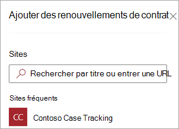
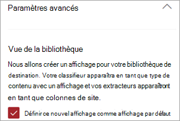
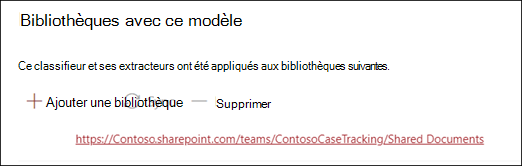
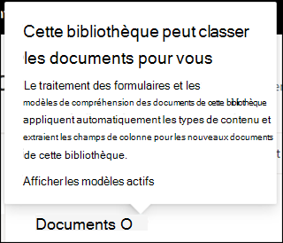

# Appliquer un modèle de présentation de document dans Microsoft SharePoint Syntex

 

> [!VIDEO https://www.microsoft.com/videoplayer/embed/RE4CSoL]

 

Une fois que vous avez publié votre modèle de présentation de document, vous pouvez l’appliquer à une ou plusieurs bibliothèques de documents SharePoint dans votre client Microsoft 365.

> [!NOTE]
> Vous pouvez uniquement appliquer le modèle aux bibliothèques de documents auxquelles vous avez accès.

## Appliquez votre modèle à une bibliothèque de documents.

Pour appliquer votre modèle à une bibliothèque de documents SharePoint :

1. Sur la page d’accueil du modèle, dans la vignette **Appliquer le modèle aux bibliothèques** , sélectionnez **Publier le modèle**. Vous pouvez également sélectionner **+ Ajouter une bibliothèque** dans la section **Bibliothèques avec ce modèle**.  

     

2. Vous pouvez ensuite sélectionner le site SharePoint contenant la bibliothèque de documents à laquelle vous voulez appliquer le modèle. Si le site n’apparaît pas dans la liste, utilisez la zone de recherche pour le trouver. 

     

    > [!NOTE]
    > Vous devez disposer d’autorisations *Gérer la liste* ou de droits *Modifier* sur la bibliothèque de documents à laquelle vous appliquez le modèle. 

3. Une fois le site sélectionné, sélectionnez la bibliothèque de documents à laquelle vous voulez appliquer le modèle. Dans l’exemple, sélectionnez la bibliothèque de documents *Documents* à partir du site de *Suivi de cas contoso*. 

     

4. Étant donné que le modèle est associé à un type de contenu, lorsque vous l’appliquez à la bibliothèque, le type de contenu et son affichage sont ajoutés aux étiquettes que vous avez extraites sous forme de colonnes. Cet affichage est l’affichage par défaut de la bibliothèque par défaut, mais vous pouvez choisir de ne pas l’utiliser par défaut en sélectionnant **Paramètres avancés** et en désactivant la case à cocher **Définir cette nouvelle vue comme par défaut**. 

     

5. Sélectionnez **Ajouter** pour appliquer le modèle à la bibliothèque. 
6. Dans la page d’accueil du modèle, dans la section **Bibliothèques avec ce modèle**, l’URL du site SharePoint doit apparaître. 

     

7. Accédez à votre bibliothèque de documents et vérifiez que vous êtes dans la vue bibliothèque de documents du modèle. Notez que si vous sélectionnez le bouton informations en regard du nom de la bibliothèque de documents, un message indique qu’un modèle est appliqué à la bibliothèque de documents.

      

    Vous pouvez sélectionner **Afficher les modèles actifs** pour afficher des détails sur les modèles appliqués à la bibliothèque de documents.

8. Dans le volet **Modèles actifs**, vous pouvez afficher les modèles appliqués à la bibliothèque de documents. Sélectionnez un modèle pour afficher plus d’informations le concernant, par exemple une description du modèle, qui a publié le modèle et si le modèle applique une étiquette de rétention aux fichiers qu’il classifie.

      

Une fois le modèle appliqué à la bibliothèque de documents, vous pouvez commencer à télécharger des documents sur le site et afficher les résultats.

Le modèle identifie les fichiers avec le type de contenu associé au modèle et les répertorie dans votre affichage. Si votre modèle inclut des extracteurs, l’affichage affiche les colonnes des données que vous extrayez à partir de chaque fichier.

### Appliquer le modèle aux fichiers figurant déjà dans la bibliothèque de documents

Lorsqu’un modèle appliqué traite tous les fichiers téléchargés vers la bibliothèque de documents une fois qu’il est appliqué, vous pouvez également effectuer les opérations suivantes pour exécuter le modèle sur des fichiers qui existent déjà dans la bibliothèque de documents avant l’application du modèle :

1. Dans votre bibliothèque de documents, sélectionnez les fichiers que vous voulez traiter par votre modèle.
2. Une fois que vous avez sélectionné vos fichiers, **Classer et extraire** s’affiche dans le ruban de la bibliothèque de documents. Sélectionnez **Classer et extraire**.
3. Les fichiers que vous avez sélectionnés sont ajoutés à la file d’attente à traiter.

        

> [!NOTE]
> Vous pouvez copier des fichiers individuels dans une bibliothèque et les appliquer à un modèle, mais pas des dossiers.

### Champ Date de classification

Lorsqu’un document SharePoint Syntex comprenant ou un modèle de traitement de formulaire est appliqué à une bibliothèque de documents, un champ <b>Date de classification</b> est inclus dans le schéma de bibliothèque. Par défaut, ce champ est vide, mais lorsque des documents sont traitées et classifiées par modèle, ce champ est mis à jour avec l’horodatage d’achèvement. 

     

Le champ Date de classification est utilisé par le déclencheur [<b>Lorsqu’un fichier est classifié par un modèle de contenu</b>'](/connectors/sharepointonline/#when-a-file-is-classified-by-a-content-understanding-model) pour exécuter un flux Power Automate après qu’un modèle de compréhension de contenu Syntex a terminé de traiter un fichier et mis à jour le champ « Date de classification ».

    

Le déclencheur <b>Lorsqu'un fichier est classifié selon un modèle de compréhension du contenu</b> peut ensuite être utilisé pour démarrer un autre flux de travail à l’aide d’informations extraites du fichier.

## Voir aussi
[Créer un classificateur](create-a-classifier.md)

[Créer un extracteur](create-an-extractor.md)

[Présentation de la compréhension de document](document-understanding-overview.md)
