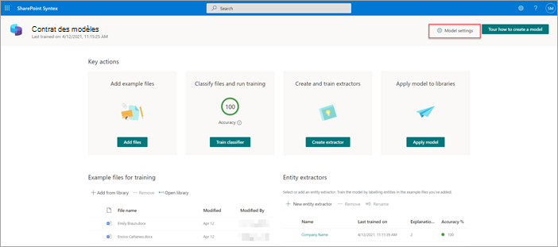
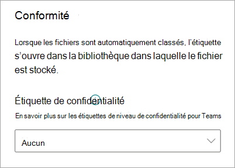

# Appliquer une étiquette de confidentialité à un modèle dans Microsoft SharePoint Syntex

Vous pouvez facilement appliquer une [étiquette de confidentialité](../compliance/sensitivity-labels.md) à un modèle de compréhension de document dans Microsoft SharePoint Syntex. Cette fonctionnalité n’est pas encore disponible pour les modèles de traitement de formulaire.

Les étiquettes de niveau de sensibilité vous permet d’appliquer le chiffrement aux documents identifiés par vos modèles. Par exemple, vous souhaitez que votre modèle identifie non seulement les documents financiers qui contiennent des numéros de compte bancaire ou de carte de crédit téléchargés vers votre bibliothèque de documents, mais également qu’il applique une étiquette de niveau de sensibilité configurée avec des paramètres de chiffrement afin de restreindre l’accès à ce contenu et la façon dont il peut être utilisé. Les modèles SharePoint Syntex respectent les règles [d'ordre des étiquettes](../compliance/apply-sensitivity-label-automatically.md#how-multiple-conditions-are-evaluated-when-they-apply-to-more-than-one-label) et n'écrasent pas non plus une étiquette existante qui a été appliquée manuellement par un utilisateur au fichier. 

Vous pouvez appliquer une étiquette de confidentialité préexistante à votre modèle via les paramètres du modèle sur la page d’accueil de celui-ci. L’étiquette doit déjà être publiée pour pouvoir être sélectionnée dans les paramètres du modèle.

> [!Important]
> Pour que les étiquettes de niveau de confidentialité soient disponibles et s’appliquent à votre modèle de compréhension de document, elles doivent être [créées et publiées dans le Centre de conformité Microsoft 365](../admin/security-and-compliance/set-up-compliance.md).

## Appliquer une étiquette de confidentialité à un modèle de compréhension de document

1. Sur la page d’accueil du modèle, sélectionnez **Paramètres du modèle**.

   

2. Dans le volet **Paramètres du modèle**, dans la section **Conformité**, sélectionnez le menu **Étiquette de confidentialité** pour afficher la liste des étiquettes de confidentialité que vous pouvez appliquer au modèle.

    

3. Sélectionnez l’étiquette de confidentialité que vous souhaitez appliquer au modèle, puis **Enregistrer**.

Après avoir appliqué l’étiquette de confidentialité à votre modèle, vous pouvez l’appliquer à une :

- nouvelle bibliothèque de documents
- bibliothèque de documents à laquelle le modèle est déjà appliqué
 
### Appliquer l’étiquette de confidentialité à une bibliothèque de documents à laquelle le modèle est déjà appliqué

Si votre modèle de compréhension de document a déjà été appliqué à une bibliothèque de documents, vous pouvez effectuer les opérations suivantes pour synchroniser la mise à jour de votre étiquette de confidentialité afin de l’appliquer à la bibliothèque de documents :

1. Sur la page d’accueil du modèle, dans la section **Bibliothèques avec ce modèle**, sélectionnez la bibliothèque de documents à laquelle vous souhaitez appliquer la mise à jour de l’étiquette de confidentialité.

2. Sélectionnez **Synchroniser**.

   

Après avoir appliqué la mise à jour et l'avoir synchronisée avec votre modèle, vous pouvez confirmer qu'elle a été appliquée en procédant comme suit :

1. Dans le centre de contenu, dans la section **Bibliothèques avec ce modèle**, sélectionnez la bibliothèque à laquelle votre modèle mis à jour a été appliqué. 

2. Dans l’affichage de votre bibliothèque de documents, sélectionnez l’icône Information pour vérifier les propriétés du modèle.

3. Dans la liste **Modèles actifs**, sélectionnez votre modèle mis à jour.

4. Dans la section **Étiquette de confidentialité**, vous verrez le nom de l’étiquette de confidentialité appliquée.

Sur la page d’affichage de votre modèle, dans votre bibliothèque de documents, une nouvelle colonne **Étiquette de confidentialité** s’affiche. Lorsque votre modèle classe les fichiers qu’il identifie comme appartenant à son type de contenu et les répertorie dans l’affichage de la bibliothèque, la colonne **Éiquette de confidentialité** affiche également le nom de l’étiquette de confidentialité qui lui a été appliquée via le modèle.

Par exemple, tous les documents financiers identifiés par votre modèle auront également l’étiquette de confidentialité *Chiffrement* appliquée, ce qui les empêchera d’être accessibles par des personnes non autorisées. Si une personne non autorisée tente d’accéder au fichier à partir de la bibliothèque de documents, une erreur s’affiche indiquant qu’il n’est pas autorisé en raison de l’étiquette de confidentialité appliquée.

<!---
## Add a sensitivity label to a form processing model

> [!Important]
> For sensitivity labels to be available to apply to your form processing model, they need to be [created and published in the Microsoft 365 Compliance Center](../admin/security-and-compliance/set-up-compliance.md).

You can either apply a sensitivity label to a form processing model when you are creating a model, or apply it to an existing model.

### Add a sensitivity label when you create a form processing model

1. When you [create a new form processing model](create-a-form-processing-model.md), select **Advanced settings**.

2. In **Advanced settings**, in the **Sensitivity label** section, select the menu and then select the sensitivity label you want to apply to the model.

3.  After you've completed your remaining model settings, select **Create** to build your model.

### Add a sensitivity label to an existing form processing model

You can add a sensitivity label to an existing form processing model in different ways:

- Through the **Automate** menu in the document library
- Through the **Active model** settings in the document library 

#### Add a sensitivity label to an existing form processing model through the Automate menu

You can add a sensitivity label to an existing form processing model that you own through the **Automate** menu in the document library in which the model is applied.

1. In your document library to which the form processing model is applied, select the **Automate** menu, select **AI Builder**, and then select **View form processing model details**.

2. On the **Model details** pane, in the **Sensitivity label** section, select the sensitivity label you want to apply. Then select **Save**.

#### Add a sensitivity label to an existing form processing model in the active model settings

You can add a sensitivity label to an existing form processing model that you own through the **Active model** settings in the document library in which the model is applied.

1. In the SharePoint document library in which the model is applied, select the **View active models** icon, and then select **View active models**.

2. In **Active models**, select the form processing model to which you want to apply the sensitivity label.

3. On the **Model details** pane, in the **Sensitivity label** section, select the sensitivity label you want to apply. Then select **Save**.

   > [!NOTE]
   > You must be the model owner for the **Model settings** pane to be editable. 
--->

## Voir aussi

[Appliquer une autre étiquette de rétention](apply-a-retention-label-to-a-model.md)

[Créer un classificateur](create-a-classifier.md)

[Créer un extracteur](create-an-extractor.md)

[Présentation de la compréhension de document](document-understanding-overview.md)
