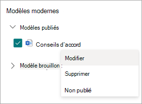

# Modifier un modèle moderne dans Microsoft Syntex

Si vous devez modifier un modèle existant ou supprimer ou annuler la publication d’un modèle, procédez comme suit.

1. Dans une bibliothèque de documents SharePoint, sélectionnez **Nouveau** > **menu Modifier nouveau**.

   

2. Dans le panneau **de menu Modifier nouveau** , dans la section **Modèles modernes** , sélectionnez le modèle publié ou brouillon que vous souhaitez modifier.

   

3. Pour modifier un modèle publié ou un brouillon de modèle :

   - Pour **Modèles publiés**, sélectionnez **Modifier** pour ouvrir le studio de modèles dans lequel vous pouvez modifier le modèle publié. Vous pouvez également choisir de supprimer ou d’annuler la publication du modèle.

      

   - Pour **Brouillons de modèles**, sélectionnez **Modifier** pour ouvrir le studio de modèles dans lequel vous pouvez modifier le modèle brouillon. Vous pouvez également choisir de supprimer ou de publier le modèle.

      

