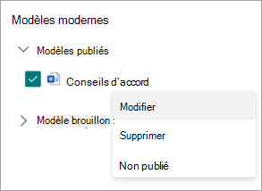

# Créer des documents à l’aide d’un assembly de contenu dans Microsoft SharePoint Syntex

Vous pouvez utiliser SharePoint Syntex pour vous aider à générer automatiquement des documents métier répétitifs standard, tels que des contrats, des déclarations de travail, des contrats de service, des lettres de consentement, des présentations commerciales et de la correspondance. Vous pouvez faire tout cela plus rapidement, de manière plus cohérente et moins sujette aux erreurs à l’aide de l’assembly de contenu dans SharePoint Syntex.

Avec l’assembly de contenu, vous pouvez utiliser un document existant pour créer un *modèle moderne*, puis utiliser ce modèle pour générer automatiquement du contenu à l’aide de listes SharePoint ou d’entrées utilisateur en tant que source de données.

> [!NOTE]
> Vous devez disposer d’une licence SharePoint Syntex utilisateur pour accéder aux fonctionnalités d’assembly de contenu et les utiliser. Vous devez également disposer des autorisations nécessaires pour gérer SharePoint listes.

## Créer un modèle moderne

Suivez ces étapes pour créer un modèle moderne.

1. Dans une bibliothèque de documents Sharepoint, sélectionnez le **modèle moderne NewCreate** > .

   

2. Choisissez un document Word existant que vous souhaitez utiliser comme base pour créer un modèle moderne, puis sélectionnez **Ouvrir**.

   

   > [!NOTE]
   > Actuellement, vous pouvez charger uniquement des documents Word (.docx extension) pour créer des modèles. Télécharger documents Word à partir de votre stockage local ou de votre bureau.

3. Après avoir chargé le document, le document s’affiche dans le studio de modèles où vous pouvez convertir le document en modèle.

   

4. Dans le coin supérieur gauche du studio de modèles, sélectionnez le nom du modèle. Le nom par défaut est le nom du document utilisé pour créer le modèle. Si vous souhaitez renommer le modèle, sélectionnez le nom par défaut ou l’icône de crayon en regard du nom, tapez le nouveau nom, puis **sélectionnez Entrée**.

   

5. Créez des espaces réservés pour tout le texte dynamique du document que les utilisateurs peuvent souhaiter modifier d’un document à un autre. Par exemple, vous pouvez créer un espace réservé pour les entrées telles que le nom de la société, le nom du client, l’adresse, le numéro de téléphone ou la date.

    Pour créer un espace réservé, sélectionnez le texte (par exemple, la date). Le panneau **Tous les espaces réservés** s’ouvre, où vous donnerez à l’espace réservé un nom pertinent et choisirez le type d’entrée que vous souhaitez associer à l’espace réservé.

   

   Actuellement, il existe deux façons pour les utilisateurs de remplir un espace réservé :

   - [Entrer du texte ou sélectionner une date](#associate-a-placeholder-by-entering-text-or-selecting-a-date)
   - [Sélectionner parmi les choix d’une colonne d’une liste ou d’une bibliothèque](#associate-a-placeholder-by-selecting-from-choices-in-a-column-of-a-list-or-library)

   > [!NOTE]
   > Vous pouvez créer des espaces réservés pour le texte uniquement. Actuellement, les images, l’art intelligent, les tableaux et les listes à puces ne sont pas pris en charge.

### Associer un espace réservé en entrant du texte ou en sélectionnant une date

Dans le panneau **Tous les espaces réservés** :

1. Dans le champ **Nom** , entrez un nom approprié pour l’espace réservé.

   

2. Dans la **section Comment les auteurs remplissent cette section d’espace réservé** , **sélectionnez Entrée de texte ou sélectionnez une date**.

3. Dans le champ **Type d’informations** , sélectionnez le type de données que vous souhaitez associer à l’espace réservé. Actuellement, six options sont disponibles : **une seule ligne de texte**, **plusieurs lignes de texte**, **nombre**, **date et heure**, **e-mail** et **lien hypertexte**.

4. Sélectionnez **Ajouter**.

### Associer un espace réservé en sélectionnant parmi les choix dans une colonne d’une liste ou d’une bibliothèque

Dans le panneau **Tous les espaces réservés** :

1. Dans le champ **Nom** , entrez un nom approprié pour l’espace réservé.

   

2. Dans la section **Comment les auteurs remplissent cette section d’espace réservé** , **choisissez Sélectionner parmi les choix dans une colonne d’une liste ou d’une bibliothèque**, puis **sélectionnez Sélectionner**.

3. Dans la **liste Sélectionner une liste pour ajouter une page de colonne source** , sélectionnez la liste que vous souhaitez utiliser, puis sélectionnez **Suivant**.

   

4. Dans la **page Sélectionner une colonne source à partir de la page de liste existante** , sélectionnez le nom de colonne que vous souhaitez associer à l’espace réservé, puis **sélectionnez Enregistrer**.

   

    Si vous souhaitez voir à nouveau la page d’origine des listes, sélectionnez **Le lien Atteindre (nom de la liste)** en bas de la liste.

5. Lorsque vous avez terminé, vous verrez que le champ de liste a été associé à l’espace réservé.

   

6. Si vous souhaitez que les utilisateurs puissent ajouter des entrées manuellement, en plus de choisir dans une liste, sélectionnez **Autoriser les auteurs à ajouter de nouveaux choix**. Dans ce cas, la valeur par défaut du type de données d’entrée manuelle est *Une seule ligne de texte*. En outre, les valeurs entrées par les auteurs seront utilisées uniquement pour générer le document. Ils ne seront pas ajoutés à la liste SharePoint.

   Vous pouvez créer autant d’espaces réservés que vous le pensez nécessaire. Lorsque vous avez terminé, vous pouvez choisir d’enregistrer le modèle sous forme de brouillon ou de publier le modèle.

   - **Enregistrer le brouillon** : enregistre le modèle en tant que brouillon et vous pouvez y accéder ultérieurement. Vous pouvez afficher, modifier ou publier des brouillons enregistrés à partir de la section **Modèles modernes** en sélectionnant **le** **menu NewEdit** >  New dans la bibliothèque de documents.
   - **Publier** : publie le modèle à utiliser par d’autres utilisateurs de l’organisation pour créer des documents. Vous pouvez afficher, modifier ou annuler la *publication* des modèles publiés dans la section **Modèles modernes** en sélectionnant **le** **menu NewEdit** >  New dans la bibliothèque de documents.

## Modifier un modèle moderne

Si vous devez modifier un modèle existant ou supprimer ou annuler la publication d’un modèle, procédez comme suit.

1. Dans une bibliothèque de documents Sharepoint, sélectionnez **nouveau** **menu NewEdit** > .

   

2. Dans le panneau **Modifier un nouveau menu** , dans la section **Modèles modernes** , sélectionnez le modèle publié ou brouillon que vous souhaitez modifier.

   

3. Pour modifier un modèle publié ou un brouillon de modèle :

   - Pour **les modèles publiés**, **sélectionnez Modifier** pour ouvrir le studio de modèles dans lequel vous pouvez modifier le modèle publié. Vous pouvez également choisir de supprimer ou d’annuler la publication du modèle.

      

   - Pour **les modèles Brouillon,** **sélectionnez Modifier** pour ouvrir le studio de modèles dans lequel vous pouvez modifier le modèle brouillon. Vous pouvez également choisir de supprimer ou de publier le modèle.

      

## Créer un document à partir d’un modèle moderne

Vous pouvez utiliser un modèle moderne *publié* pour créer rapidement des documents similaires sans avoir à partir de zéro. Pour créer un document à l’aide d’un modèle publié, procédez comme suit :

1. Dans une bibliothèque de documents Sharepoint, sélectionnez **Nouveau**, puis sélectionnez le modèle moderne que vous souhaitez utiliser.

   

2. Le modèle s’ouvre dans le studio de modèles.

3. Dans le volet **Créer un document à partir d’un** modèle, entrez les informations, puis sélectionnez **Créer un document**.

   

   Pour réduire le temps et les efforts nécessaires pour remplir les valeurs des espaces réservés, SharePoint Syntex fournit :

      - Suggestions pour vous aider à sélectionner facilement des valeurs lors de la sélection de valeurs dans une liste.
      - Remplissage automatique des valeurs d’espace réservé s’ils sont en mesure d’identifier de manière unique un enregistrement pour les espaces réservés associés à la même liste.

> [!NOTE]
>
> - Actuellement, seuls Microsoft Word documents (.docx extension) sont pris en charge pour la création d’un modèle. Avant de charger le document, assurez-vous que les **modifications** du suivi ne sont pas activées ou que les commentaires ne sont pas activés dans le document Word. Si votre document contient des espaces réservés de texte pour les images, assurez-vous qu’elles ne sont pas encapsulées de texte. Nous ne prenons pas en charge **les contrôles de contenu** dans Word pour le moment. Si vous souhaitez créer un modèle à partir d’un document Word avec des contrôles de contenu, supprimez-le avant de créer un modèle moderne.
> - Le modèle et le document sont associés à une bibliothèque de documents. Pour utiliser le modèle dans une autre bibliothèque de documents, vous devez recréer le modèle dans cette bibliothèque de documents.
> - Le document chargé utilisé pour créer le modèle moderne est enregistré sous forme de copie distincte et placé dans le répertoire /forms de la bibliothèque de documents. Le fichier d’origine sur le disque ne sera pas affecté.
> - Vous pouvez créer des espaces réservés pour le texte uniquement. Actuellement, les images, l’art intelligent, les tableaux et les listes à puces ne sont pas pris en charge.
> - Une fois qu’un document est créé à partir d’un modèle, il n’est pas associé au modèle.
