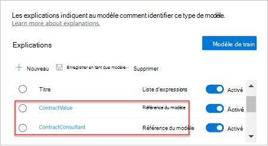

# Créer un classifieur dans Microsoft SharePoint Syntex

 

> [!VIDEO https://www.microsoft.com/videoplayer/embed/RE4CL0R]  

 

Un classifieur est un type de modèle permettant d’automatiser l’identification et la classification d’un type de document. Par exemple, vous devez parfois identifier tous les documents *Renouvellement de contrat* ajoutés à votre bibliothèque de documents, comme indiqué dans l’illustration suivante.

La création d’un classifieur vous permet de créer un [type de contenu SharePoint](/sharepoint/governance/content-type-and-workflow-planning#content-type-overview) qui sera associé au modèle.

Lors de la création du classifieur, vous devez créer des *explications* pour définir le modèle. Cela vous permet de noter les données courantes nécessaires pour trouver systématiquement ce type de document. 

Utilisez des exemples de type de document (« exemples de fichiers ») pour « entraîner » votre modèle à identifier les fichiers qui ont le même type de contenu.

Pour créer un classifieur, vous devez :
1. Nommer votre modèle.
2. Ajouter vos exemples de fichiers.
3. Étiqueter vos exemples de fichiers.
4. Créer une explication.
5. Tester votre modèle.

> [!NOTE]
> Bien que votre modèle utilise un classifieur pour identifier et classifier des types de documents, vous pouvez également choisir d’extraire des informations spécifiques de chaque fichier identifié par le modèle. Pour ce faire, créez un **extracteur** à ajouter à votre modèle. Si vous souhaitez en savoir plus, veuillez consulter la rubrique [Créer un extracteur](create-an-extractor.md).

## Nommer votre modèle

La première étape de création de votre modèle consiste à lui attribuer un nom :

1. Dans le centre de contenu, sélectionnez **Nouveau**, puis **Créer un modèle**.
2. Dans le volet **Nouveau modèle de compréhension de document**, renseignez le champ **Nom** avec le nom du modèle. Par exemple, si vous souhaitez identifier les documents de renouvellement de contrat, vous pouvez nommer le modèle *Renouvellement de contrat*.
3. Sélectionnez **Créer**. Cette opération permet de créer une page d’accueil pour le modèle. 

    

La création d’un modèle entraîne également celle d’un type de contenu de site. Un type de contenu représente une catégorie de documents qui ont des caractéristiques communes et qui partagent une collection de colonnes ou de propriétés de métadonnées pour ce contenu spécifique. Les types de contenu SharePoint sont gérés via la [galerie des types de contenu](https://support.microsoft.com/office/create-or-customize-a-site-content-type-27eb6551-9867-4201-a819-620c5658a60f). Pour cet exemple, la création du modèle entraîne celle d’un type de contenu *Renouvellement de contrat*.

**Sélectionnez Paramètres** avancés si vous souhaitez mammiser ce modèle à un type de contenu d’entreprise existant dans la galerie de <a href="https://go.microsoft.com/fwlink/?linkid=2185074" target="_blank">types</a> de contenu SharePoint pour utiliser son schéma. Les types de contenu d’entreprise sont stockés dans le hub Type de contenu au sein du Centre d’administration SharePoint. Ils sont syndiqués sur tous les sites du client. Note : vous pouvez certes utiliser un type de contenu existant pour tirer parti de son schéma et faciliter l’identification et la classification. Néanmoins, vous devez entraîner votre modèle à extraire des informations des fichiers qu’il identifie. 

## Ajouter vos exemples de fichiers

Sur la page d’accueil du modèle, ajoutez vos exemples de fichiers dont vous aurez besoin pour entraîner le modèle à identifier votre type de document.  
 

> [!VIDEO https://www.microsoft.com/videoplayer/embed/RE4D0iX] 

 

> [!NOTE]
> Vous devez utiliser les mêmes fichiers pour le classifieur et l’[entraînement de l’extracteur](create-an-extractor.md). Vous pouvez toujours ajouter d’autres fichiers ultérieurement, mais l’ensemble déjà ajouté d’exemples de fichiers est en général complet. Étiquetez certains d’entre eux pour entraîner votre modèle, puis testez les autres non étiquetés pour évaluer l’adéquation du modèle. 

Pour votre ensemble d’apprentissage, vous devez utiliser des exemples positifs et négatifs :
- Exemple positif : documents représentant le type de document. Ces documents contiennent des chaînes et des informations qui doivent toujours figurer dans ce type de document.
- Exemple négatif : tout autre document ne représentant pas le document à classer. 

Veillez à utiliser au moins cinq exemples positifs et au moins un exemple négatif pour entraîner votre modèle.  Vous devez créer d’autres exemples pour tester votre modèle après le processus d’entraînement.

Pour ajouter des exemples de fichiers :

1. Sur la page d’accueil du modèle, dans la mosaïque **Ajouter des exemples de fichiers**, cliquez sur **Ajouter des fichiers**.
2. À la page **Sélectionner des exemples de fichiers pour votre modèle**, sélectionnez vos exemples de fichiers dans la bibliothèque Fichiers d’entraînement du centre de contenu. Si vous ne l’avez pas déjà fait, choisissez de les charger maintenant en cliquant sur **Charger** pour les copier dans la bibliothèque Fichiers d’entraînement.
3. Après avoir sélectionné vos exemples de fichiers à utiliser pour entraîner le modèle, cliquez sur **Ajouter**.

     

## Étiqueter vos exemples de fichiers

Une fois que vous avez ajouté vos exemples de fichiers, vous devez les étiqueter comme positifs ou négatifs.

1. Depuis la page d’accueil du modèle, dans la mosaïque **Classer des fichiers et exécuter l’entraînement**, cliquez sur **Entraîner le classifieur**.
   La page d’étiquettes affiche alors une liste de vos exemples de fichiers, le premier fichier étant visible dans la visionneuse.
2. Dans la visionneuse située en haut du premier exemple de fichier, un texte doit vous demander si le fichier est un exemple du modèle que vous venez de créer. Si cet exemple est positif, sélectionnez **Oui**. Si cet exemple est négatif, sélectionnez **Non**.
3. Dans la liste **Exemples étiquetés** à gauche, sélectionnez, puis étiquetez les fichiers supplémentaires à utiliser comme exemples. 

     

> [!NOTE]
> Étiquetez au moins cinq exemples positifs. Vous devez également étiqueter au moins un exemple négatif. 

## Créer une explication

L’étape suivante consiste à créer une explication à la page Entraîner. Une explication permet au modèle de comprendre comment reconnaître le document. Par exemple, les documents Renouvellement de contrat contiennent toujours une chaîne de caractères *Demande de divulgation supplémentaire*.

> [!Note]
> Utilisées avec des extracteurs, les explications identifient la chaîne à extraire du document. 

Pour créer une explication :

1. Depuis la page d’accueil du modèle, sélectionnez l’onglet **Entraîner** pour accéder à la page correspondante.
2. À la page Entraîner, la section **Fichiers entraînés** contient normalement une liste des exemples de fichiers précédemment étiquetés. Sélectionnez un des fichiers positifs de la liste pour l’afficher dans la visionneuse.
3. Dans la section Explication, sélectionnez **Nouveau**, puis **Espace**.
4. À la page **Créer une explication** : 
    a. Tapez le **nom** (par exemple, « bloc de divulgation »). 
    b. Sélectionnez le **type**. Pour l’échantillon, sélectionnez **Liste d’expressions**, puisque vous ajoutez une chaîne de caractères. 
    c. Dans la zone **Tapez ici**, tapez la chaîne. Pour l’échantillon, ajoutez « Demande de divulgation supplémentaire ». Vous pouvez sélectionner **Respecter la casse** si la chaîne doit respecter la casse. 
    d. Cliquez sur **Enregistrer**.

     
    
5. Le centre de contenu vérifie à présent si l’explication que vous avez créée suffisamment complète pour identifier correctement comme positifs et négatifs les autres exemples de fichiers étiquetés. Dans la section **Fichiers entraînés**, consultez la colonne **Évaluation** après la fin de l’apprentissage pour afficher les résultats. Les fichiers affichent la valeur **Correspondance** si les explications que vous avez créées sont suffisantes pour correspondre aux éléments étiquetés comme positifs ou négatifs.

     

    Si une **incompatibilité** apparaît sur les fichiers étiquetés, vous devrez sans doute créer une explication supplémentaire pour fournir au modèle des informations supplémentaires permettant d’identifier le type de document. Dans ce cas, cliquez sur le fichier pour obtenir plus d’informations sur la raison de l’incompatibilité.

Une fois que vous avez entraîné un extracteur, cet extracteur entraîné peut être utilisé comme explication. Dans la section **Explications**, il s’agit d’une **Référence de modèle**.

## Tester votre modèle

Si vous avez reçu une correspondance sur vos fichiers échantillons étiquetés, vous pouvez à présent tester votre modèle sur les autres exemples de fichiers non étiquetés pour vérifier que ce modèle est inconnu. Cette étape est facultative mais utile, car elle permet d’évaluer la « pertinence » ou le degré de préparation du modèle avant utilisation, en le testant sur des fichiers pour l’instant inconnus de ce dernier.

1. Dans la page d’accueil du modèle, sélectionnez l’onglet **Test**. Le modèle est alors exécuté sur vos fichiers échantillons non étiquetés.
2. Dans la liste **Fichiers de test**, vos exemples de fichiers indiquent s’ils sont positifs ou négatifs d’après les prévisions du modèle. Utilisez ces informations pour déterminer plus facilement l’efficacité de votre classifieur lors de l’identification de vos documents.

     

## Voir aussi
[Créer un extracteur](create-an-extractor.md)

[Présentation de la compréhension de document](document-understanding-overview.md)

[Types d’explications](explanation-types-overview.md)

[Appliquer un modèle](apply-a-model.md) 

[Mode d’accessibilité Syntex de SharePoint](accessibility-mode.md)