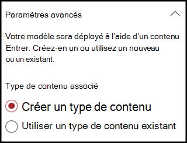
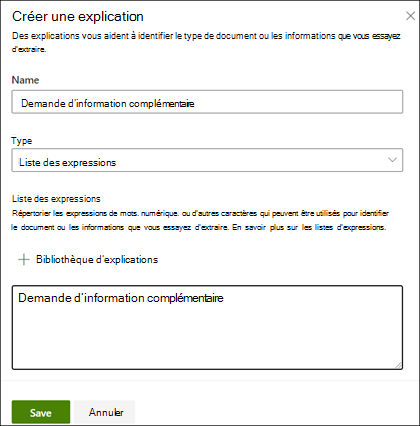

# Créer un classifieur (aperçu)

> [!Note] 
> Le contenu de cet article est destiné à Project cortex privé preview. Pour [plus d’informations sur le projet cortex](https://aka.ms/projectcortex).

 

> [!VIDEO https://www.microsoft.com/videoplayer/embed/RE4CL0R]  

 

Un classifieur est un type de modèle qui automatise l’identification et la classification d’un type de document. Par exemple, vous pouvez identifier tous les documents de *renouvellement de contrat* ajoutés à votre bibliothèque de documents, tels que les suivants.

La création d’un classifieur crée un nouveau [type de contenu SharePoint](https://docs.microsoft.com/sharepoint/governance/content-type-and-workflow-planning#content-type-overview) qui sera associé au modèle.

Lors de la création du classifieur, vous devez créer des *explications* qui permettent de définir le modèle en notant les données courantes que vous prévoyez de trouver de manière cohérente pour ce type de document. 

Vous utilisez des exemples de type de document (« exemples de fichiers ») pour aider à « former » votre modèle afin d’identifier les fichiers qui ont le même type de contenu.

Pour créer un classifieur, vous devez :
1. Nommer votre modèle
2. Ajouter vos exemples de fichiers
3. Étiqueter vos exemples de fichiers
4. Créer une explication
5. Tester votre modèle 

> [!Note]
> Alors qu’un classifieur est utilisé par votre modèle pour identifier et classer les types de documents, vous pouvez également choisir d’extraire des informations spécifiques de chaque fichier identifié par le modèle. Pour ce faire, vous devez créer un **extracteur** à ajouter à votre modèle, ce qui est décrit dans [Create an Extractor](create-an-extractor.md).

## Nommer votre modèle

La première étape consiste à créer votre modèle dans votre centre de contenu en lui attribuant un nom :

1. Dans votre centre de contenu, cliquez sur **nouveau**, puis sur **créer un modèle**.
2. Dans le volet **nouveau modèle de présentation des documents** , dans le champ **nom** , tapez le nom du modèle. Pour notre exemple, si nous voulons identifier les documents de renouvellement de contrat, nous pouvons nommer ce modèle *renouvellement de contrat*.
3. Cliquez sur **Créer**. Cette opération crée une page d’accueil pour le modèle. 

    

Lorsque vous créez un modèle, vous créez un nouveau type de contenu SharePoint. Un type de contenu SharePoint représente une catégorie de documents qui ont des caractéristiques communes et qui partagent une collection de colonnes ou de propriétés de métadonnées pour ce contenu particulier. Les types de contenu SharePoint sont gérés via la [Galerie de types de contenu](). Pour notre exemple, lorsque nous créons le modèle, nous allons créer un nouveau type de contenu de *renouvellement de contrat* .

Sélectionnez **Paramètres avancés** si vous souhaitez mapper ce modèle à un type de contenu existant dans la Galerie de types de contenu SharePoint pour utiliser son schéma. Notez que même si vous pouvez utiliser un type de contenu existant pour tirer parti de son schéma afin de faciliter l’identification et la classification, vous devrez tout de même former votre modèle pour extraire des informations des fichiers qu’il identifie. 

## Ajouter vos exemples de fichiers

Sur la page d’accueil du modèle, vous pouvez ajouter vos exemples de fichiers dont vous aurez besoin pour former le modèle afin d’identifier votre type de document.  
 

> [!VIDEO https://www.microsoft.com/videoplayer/embed/RE4D0iX] 

 

> [!Note]
> Les mêmes fichiers doivent être utilisés pour la formation des classifieurs et de l' [extracteur](create-an-extractor.md). Vous avez toujours la possibilité d’ajouter plus tard, mais vous devez généralement ajouter un ensemble complet de fichiers d’exemple. Vous allez étiqueter certaines pour former votre modèle et tester les autres non libellés afin d’évaluer la pertinence du modèle. 

Pour votre jeu de formation, vous pouvez utiliser des exemples positifs et des exemples négatifs :
- Exemple positif : documents qui représentent le type de document. Elles contiennent des chaînes et des informations qui seraient toujours dans ce type de document.
- Exemple négatif : documents qui ne représentent pas le type de document.  Il manque des chaînes et des informations qui doivent être présentes dans ce type de document.

Vous pouvez utiliser au moins cinq exemples positifs et un exemple négatif pour former votre modèle.  Vous aurez besoin d’autres pour tester votre modèle après la formation.

Pour ajouter des fichiers d’exemple :

1. Sur la page d’accueil du modèle, dans la vignette **créer un exemple de bibliothèque** , cliquez sur Ajouter des **fichiers**.
2. Sur la page **Sélectionner des fichiers d’exemple pour votre modèle** , sélectionnez vos exemples de fichiers dans la bibliothèque fichiers d’exemple dans le centre de contenu. Si vous ne les avez pas déjà téléchargées à cet emplacement, vous pouvez choisir de les télécharger maintenant en cliquant sur **charger** pour les déplacer dans l’exemple de bibliothèque de fichiers.
3. Après avoir sélectionné vos exemples de fichiers à utiliser pour former le modèle, cliquez sur **Ajouter**.

     

## Étiqueter vos exemples de fichiers

Après avoir ajouté vos exemples de fichiers, vous devez les étiqueter en tant qu’exemples positifs ou en tant qu’exemples négatifs.

1. Sur la page d’accueil du modèle, dans la vignette **classer les fichiers et exécuter la formation** , cliquez sur organiser le **classificateur**.
   Cette opération affiche la page étiquette qui affiche la liste de vos exemples de fichiers, avec le premier fichier visible dans la visionneuse.
2. Dans la visionneuse, dans la partie supérieure du premier fichier, vous verrez si le fichier est un exemple de modèle que vous venez de créer. S’il s’agit d’un exemple positif, sélectionnez **Oui**. S’il s’agit d’un exemple négatif, sélectionnez **non**.
3. Dans la liste des **exemples étiquetés** à gauche, sélectionnez les fichiers supplémentaires que vous souhaitez utiliser comme exemples, et étiquetez-les également. 

     

> [!Note]
> Étiquetez au moins cinq exemples positifs et un exemple négatif. 

## Créer une explication

L’étape suivante consiste à créer une explication sur la page de formation.  Une explication est une indication ou un indice destiné à aider le modèle à comprendre comment reconnaître ce document. Par exemple, nos documents de renouvellement de contrat contiennent toujours une *demande pour une chaîne de texte de divulgation supplémentaire* .

> [!Note]
> Lorsqu’il est utilisé avec des extracteurs, une explication est utilisée pour identifier la chaîne que vous souhaitez extraire du document. 

Pour créer une explication :

1. Sur la page d’accueil du modèle, cliquez sur l’onglet **train** pour accéder à la page de formation.
2. Sur la page train, dans la section **fichiers formés** , vous verrez une liste des exemples de fichiers que vous avez étiquetés précédemment. Sélectionnez un de vos fichiers positifs dans la liste, qui s’affichera dans la visionneuse.
3. Dans la section explication, cliquez sur **nouveau**, puis sur **vide**.
4. Sur la page **créer une explication** : 
    a. Tapez le **nom** (par exemple, « bloc de divulgation »). 
    b. Sélectionnez le **type**. Pour notre exemple, nous allons sélectionner **expression List**, étant donné que nous ajoutons une chaîne de texte. 
    c. Dans la zone **Tapez ici** , tapez la chaîne.  Pour notre exemple, nous allons ajouter « demande d’informations supplémentaires ». Vous **pouvez sélectionner respecter la casse si** la chaîne doit respecter la casse. 
    d. Cliquez sur **Enregistrer**.

     
    
 
5.  Le modèle vérifie que l’explication que vous avez créée est suffisante pour identifier correctement les fichiers d’exemple étiquetés restants en tant qu’exemples positifs et négatifs. Dans la section fichiers formés, vérifiez la colonne **évaluation** une fois la formation terminée pour afficher les résultats.  Les fichiers affichent une valeur de **correspondance** si l’explication que vous avez créée est suffisante pour faire correspondre ce que vous avez étiqueté (positif ou négatif).

     

Si vous recevez une **incompatibilité** avec vos fichiers étiquetés, vous devrez peut-être créer une explication supplémentaire pour fournir au modèle plus d’informations afin d’identifier le type de document. Vous pouvez cliquer sur le fichier pour obtenir plus d’informations sur la raison de l’incompatibilité.

## Tester votre modèle

Si vous avez reçu une correspondance sur vos exemples de fichiers étiquetés, vous pouvez maintenant tester votre modèle sur vos fichiers d’exemple sans étiquette restants.

1. Sur la page d’accueil du modèle, cliquez sur l’onglet **test** .  Cette opération exécutera le modèle sur vos fichiers d’exemple sans étiquette.
2. Dans la liste des **fichiers de test** , vos exemples de fichiers s’afficheront et s’afficheront si le modèle prévoit des exemples positifs ou négatifs. Vous pouvez utiliser ces informations pour déterminer l’efficacité de votre classifieur lors de l’identification de vos documents.

     

## Voir aussi
[Créer un extracteur](create-an-extractor.md) 
[Présentation de l’explication des documents](document-understanding-overview.md) 
[Créer un modèle de traitement de formulaire](create-a-form-processing-model.md) 
[Appliquer un modèle](apply-a-model.md) 

