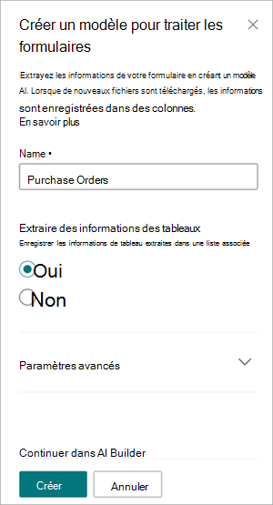
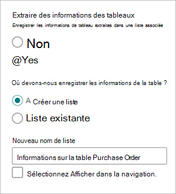
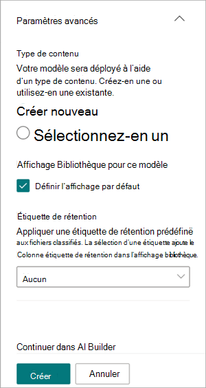
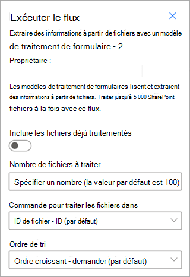

# Créer un modèle de traitement de formulaire dans Microsoft SharePoint Syntex

 

> [!VIDEO https://www.microsoft.com/videoplayer/embed/RE4GnhN]  

 

Grâce à [AI Builder](/ai-builder/overview), une fonctionnalité de Microsoft PowerApps, les utilisateurs de SharePoint Syntex peuvent créer un [modèle de traitement de formulaire](form-processing-overview.md) directement à partir d’une bibliothèque de documents SharePoint. 

Pour créer un modèle de traitement de formulaire, vous devez suivre les étapes suivantes :

 - [Étape 1 : créer un modèle de traitement de formulaire](create-a-form-processing-model.md#step-1-create-a-form-processing-model)
 - [Étape 2 : ajouter et analyser des documents](create-a-form-processing-model.md#step-2-add-and-analyze-documents)
 - [Étape 3 : Baliser les champs et les tables](create-a-form-processing-model.md#step-3-tag-fields-and-tables)
 - [Étape 4 : Entraîner et publier votre modèle](create-a-form-processing-model.md#step-4-train-and-publish-your-model)
 - [Étape 5 : Utiliser votre modèle](create-a-form-processing-model.md#step-5-use-your-model)

## Conditions requises

Vous pouvez créer un modèle de traitement de formulaire uniquement dans les bibliothèques de documents SharePoint pour lesquelles il est activé. Si le traitement des formulaires est activé, vous pouvez voir le menu **Automatiser** > **AI Builder** > **Créer un modèle pour traiter les formulaires** dans votre bibliothèque de documents. Si vous souhaitez que le traitement soit activé sur votre bibliothèque de documents, vous devez contacter votre administrateur SharePoint.

## Étape 1 : créer un modèle de traitement de formulaire

La première étape de la création d’un modèle de traitement de formulaire consiste à nommer le modèle, à définir le nouveau type de contenu et à créer une vue de bibliothèque de documents pour celui-ci.

1. Dans la bibliothèque de documents, sélectionnez le menu **Automatiser** , sélectionnez **AI Builder**, puis **Créer un modèle pour traiter les formulaires**.

    

2. Dans le panneau **Créer un modèle pour traiter les formulaires**, dans le champ **Nom**, tapez un nom pour votre modèle (par exemple, *Bons de commande*).

     

3. Vous pouvez désormais extraire et enregistrer automatiquement des informations à partir d’une *collection* de fichiers structurés qui partagent une disposition similaire (par exemple, des factures ou des documents fiscaux) qui se trouvent dans une bibliothèque de documents SharePoint. Cela vous permet de composer plusieurs modèles en un seul modèle et d’extraire des informations spécifiques sur les éléments de table.

   Le nom de la collection est enregistré dans une colonne dédiée dans la bibliothèque de documents où le modèle est appliqué, ce qui vous permet de distinguer différentes dispositions de fichiers traitées par le même modèle.

   En outre, les informations de table extraites sont enregistrées dans une liste spécifiée et associées au fichier chargé pour faciliter l’affichage ou pour une automatisation supplémentaire des processus métier.

   Pour extraire les informations de table dans une liste associée :  

     1. Dans la section **Extraire des informations à partir de tables ?**, sélectionnez **Oui**.

       

     2. Dans la section **Où devons-nous enregistrer les informations de table ?** :
 
        - Si vous sélectionnez **Une nouvelle liste** (paramètre par défaut), un nom suggéré est automatiquement fourni dans la zone **Nouveau nom de liste** . Vous pouvez modifier le nom si vous le souhaitez. Si vous souhaitez afficher la liste dans la navigation du site, cochez la case **Afficher dans la navigation de site** .

        - Si vous sélectionnez **Une liste existante**, dans la zone **Liste sélectionnée**, choisissez la liste que vous souhaitez utiliser.

4. Lorsque vous créez un modèle de traitement de formulaire, vous créez un nouveau type de contenu SharePoint. Un type de contenu SharePoint représente une catégorie de documents qui ont des caractéristiques communes et qui partagent une collection de colonnes ou de propriétés de métadonnées pour ce contenu spécifique. Les types de contenu SharePoint sont gérés via le <a href="https://go.microsoft.com/fwlink/?linkid=2185219" target="_blank">Centre d’administration SharePoint</a>.

   Pour mapper ce modèle à un type de contenu existant dans la galerie de types de contenu SharePoint, sélectionnez **Paramètres avancés**.

     

   1. Dans la <a href="https://go.microsoft.com/fwlink/?linkid=2185074" target="_blank">galerie de types de</a> contenu, choisissez de créer un nouveau type de contenu ou d’en utiliser un existant. 

   2. Pour utiliser un type de contenu existant, sélectionnez **Sélectionnez un**, puis choisissez un type de contenu dans la liste.

   3. Votre modèle crée une nouvelle vue dans votre bibliothèque de documents pour vos données extraites. Si vous ne souhaitez pas qu’il s’agit de l’affichage par défaut, dans la section **Bibliothèque de ce modèle** , désactivez la case à cocher **Définir l’affichage comme vue par défaut** .

   4. Pour appliquer une étiquette de rétention à vos fichiers, dans la section **Étiquette de rétention**, sélectionnez l’étiquette de rétention que vous souhaitez utiliser.

5. Sélectionnez **Créer**.

## Étape 2 : ajouter et analyser des documents

Après avoir créé votre nouveau modèle de traitement de formulaire, votre navigateur ouvre une nouvelle page de modèle de traitement de formulaires AI Builder dans Power Apps. Sur cette page, vous pouvez ajouter et analyser vos exemples de documents. 

> [!NOTE]
> Lorsque vous recherchez des exemples de fichiers à utiliser, consultez l’article [Configuration requise et limitations du modèle de traitement de formulaire](/ai-builder/form-processing-model-requirements). 
 
1. Vous définissez d’abord les champs et les tables que vous souhaitez enseigner à votre modèle à extraire sur la page **Choisir les informations à extraire**. Pour obtenir des instructions détaillées, consultez [Définir des champs et des tables pour extraire](/ai-builder/create-form-processing-model#define-fields-and-tables-to-extract). 

2.  Vous pouvez créer autant de collections de dispositions de documents que vous souhaitez que votre modèle traite. Pour obtenir des instructions détaillées, consultez [Grouper les documents par collections](/ai-builder/create-form-processing-model#group-documents-by-collections). 

3. Une fois que vous avez créé vos collections et ajouté les exemples de fichiers pour chacun, AI Builder examine les documents chargés pour détecter les champs et les tables. Cette opération prend généralement quelques minutes. Une fois l’analyse terminée, vous pouvez poursuivre l’étiquetage des documents.

## Étape 3 : Baliser les champs et les tables

Vous devez baliser les documents pour apprendre au modèle à comprendre les champs et les données de table que vous souhaitez extraire. Pour obtenir des instructions détaillées, consultez [Baliser les documents](/ai-builder/create-form-processing-model#tag-documents).

## Étape 4 : Entraîner et publier votre modèle

1. Après avoir créé et entraîné votre modèle, vous êtes prêt à le publier et à l’utiliser dans SharePoint. Pour obtenir des instructions détaillées, consultez [Entraîner et publier votre modèle de traitement de formulaire](/ai-builder/form-processing-train). 

2. Une fois le modèle publié, sélectionnez **Utiliser le modèle**, puis sélectionnez **Créer un flux**. Cela crée un flux de Power Automate qui peut s’exécuter dans votre bibliothèque de documents SharePoint et qui extrait les champs qui ont été identifiés dans le modèle.

    
 
3. Une fois terminé, vous verrez le message *Votre flux a été créé avec succès*.

4. Sélectionnez le bouton **Accéder à SharePoint** pour voir la bibliothèque de documents mise à jour avec votre modèle.

## Étape 5 : Utiliser votre modèle

1. Dans la vue du modèle de la bibliothèque de documents, notez que les champs que vous avez sélectionnés s’affichent désormais sous forme de colonnes.

    

2. Notez que le lien Informations en regard de **Documents** indique qu’un modèle de traitement de formulaire est appliqué à cette bibliothèque de documents.

      

3. Téléchargez des fichiers dans votre bibliothèque de documents. Tous les fichiers que le modèle identifie comme son type de contenu répertorient les fichiers dans votre vue et affichent les données extraites dans les colonnes.

     

> [!NOTE]
> Si un modèle de traitement de formulaire personnalisé et un modèle de compréhension de document sont appliqués à la même bibliothèque, le fichier est classé à l’aide du modèle de compréhension de document et des extracteurs formés pour ce modèle. S’il existe des colonnes vides qui correspondent au modèle de traitement de formulaire, les colonnes sont remplies à l’aide de ces valeurs extraites.

### Utiliser des flux pour extraire des informations

Deux flux sont disponibles pour traiter un fichier sélectionné ou un lot de fichiers dans une bibliothèque où un modèle de traitement de formulaire a été appliqué.

- **Extraire des informations d’une image ou d’un fichier PDF avec un modèle de traitement de formulaire** : permet d’extraire du texte d’une image sélectionnée ou d’un fichier PDF en exécutant un modèle de traitement de formulaire. Prend en charge un seul fichier sélectionné à la fois et prend en charge uniquement les fichiers PDF et les fichiers image (PNG, JPG et JPEG). Pour exécuter le flux, sélectionnez un fichier, puis sélectionnez **Automatiser** > **l’extraction d’informations**.

      

- **Extraire des informations à partir de fichiers avec un modèle de traitement de formulaire** : utiliser avec des modèles de traitement de formulaire pour lire et extraire des informations à partir d’un lot de fichiers. Traite jusqu’à 5 000 fichiers SharePoint à la fois. Lorsque vous exécutez ce flux, vous pouvez définir certains paramètres. Vous pouvez :

    - Indiquez s’il faut inclure des fichiers précédemment traités (la valeur par défaut est de ne pas inclure les fichiers précédemment traités).
    - Sélectionnez le nombre de fichiers à traiter (la valeur par défaut est 100 fichiers).
    - Spécifiez l’ordre dans lequel traiter les fichiers (les choix sont par ID de fichier, nom de fichier, heure de création du fichier ou heure de dernière modification).
    - Spécifiez la façon dont vous souhaitez trier l’ordre (ordre croissant ou décroissant).

      
    
> [!NOTE]
> Les **informations d’extraction d’une image ou d’un fichier PDF avec un flux de modèle de traitement de formulaire** sont automatiquement disponibles pour une bibliothèque avec un modèle de traitement de formulaire associé. **L’extraction d’informations à partir de fichiers avec un** flux de modèle de traitement de formulaire est un modèle qui doit être ajouté à la bibliothèque si nécessaire.

### Champ Date de classification

Lorsqu’un modèle de traitement de formulaire SharePoint Syntex (ou un modèle de compréhension de document) est appliqué à une bibliothèque de documents, le champ **Date de classification** est inclus dans le schéma de bibliothèque. Par défaut, ce champ est vide. Toutefois, lorsque les documents sont traités et classés par un modèle, ce champ est mis à jour avec un horodatage de date et heure de fin. 

Lorsqu’un modèle est marqué avec la **date de classification**, vous pouvez utiliser **l’option Envoyer un e-mail après SharePoint Syntex traite un** flux de fichiers pour informer les utilisateurs qu’un nouveau fichier a été traité et classifié par un modèle dans la bibliothèque de documents SharePoint.

Pour exécuter le flux :

1. Sélectionnez un fichier, puis **sélectionnez Intégrer** > **Power Automate** > **Créer un flux**.

2. Dans le panneau **Créer un flux**, sélectionnez **Envoyer un e-mail après SharePoint Syntex traite un fichier**.

     

## Voir aussi
  
[Documentation Power Automate](/power-automate/)

[Formation : Améliorer les performances de votre entreprise avec AI Builder](/learn/paths/improve-business-performance-ai-builder/?source=learn)
