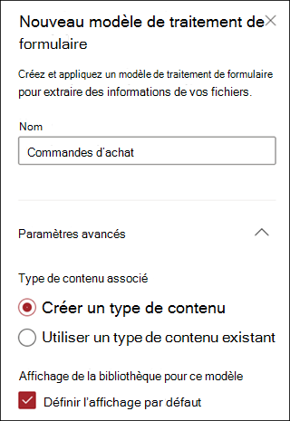
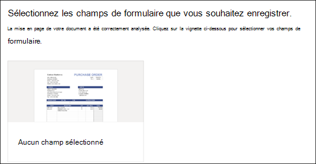
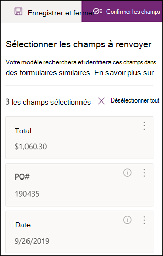

# Créer un modèle de traitement de formulaire dans Microsoft SharePoint Syntex

Le contenu de cet article est destiné à la préversion privée du projet cortex. Pour [plus d’informations sur le projet cortex](https://aka.ms/projectcortex).

Utilisation de l’outil [ai Builder](https://docs.microsoft.com/ai-builder/overview) -une fonctionnalité de Microsoft PowerApp-Project cortex les utilisateurs peuvent créer un [modèle de traitement de formulaire](form-processing-overview.md) directement à partir d’une bibliothèque de documents SharePoint. 

La création d’un modèle de traitement de formulaire implique les opérations suivantes :
 - Étape 1 : créer le modèle de traitement pour créer le type de contenu
 - Étape 2 : ajouter et analyser des exemples de fichiers
 - Étape 3 : sélection de vos champs de formulaire
 - Étape 4 : formation et test de votre modèle
 - Étape 5 : publier votre modèle
 - Étape 6 : utiliser votre modèle

## Configuration requise

Vous ne pouvez créer un modèle de traitement de formulaire que dans les bibliothèques de documents SharePoint pour lesquelles il est activé. Si le traitement de formulaire est activé, vous pouvez voir le **Générateur d’ai** **« créer un modèle de traitement de formulaire »** dans le menu **automatiser** de votre bibliothèque de documents.  Si vous avez besoin d’un traitement activé dans votre bibliothèque de documents, vous devez contacter votre administrateur SharePoint.

  

## Étape 1 : créer un modèle de traitement de formulaire

La première étape de la création d’un modèle de traitement de formulaire consiste à le nommer et à créer le nouveau type de contenu et à créer une nouvelle vue de bibliothèque de documents.

1. Dans la bibliothèque de documents, sélectionnez le menu **automatiser** , sélectionnez **générateur ai**, puis sélectionnez **créer un modèle de traitement de formulaire**.

     

2. Dans le volet **nouveau modèle de traitement de formulaire** , dans le champ  **nom** , tapez un nom pour votre modèle (par exemple, *bons de commande*).

      

3. Lorsque vous créez un modèle de traitement de formulaire, vous créez un type de contenu SharePoint. Un type de contenu SharePoint représente une catégorie de documents qui ont des caractéristiques communes et qui partagent une collection de colonnes ou de propriétés de métadonnées pour ce contenu particulier. Les types de contenu SharePoint sont gérés via la [Galerie de types de contenu]().

    Sélectionnez **Paramètres avancés** si vous souhaitez mapper ce modèle à un type de contenu existant dans la Galerie de types de contenu SharePoint pour utiliser son schéma. 

4. Votre modèle crée un nouvel affichage dans votre bibliothèque de documents pour vos données extraites. Si vous ne souhaitez pas que l’affichage par défaut s’affiche, désélectionnez **définir l’affichage comme mode par défaut**.

5. Sélectionnez **Créer**.

## Étape 2 : ajouter et analyser des documents

Une fois que vous avez créé votre nouveau modèle de traitement de formulaire, votre navigateur ouvre une nouvelle page de modèle de traitement des formulaires du générateur AI PowerApp. Sur cette page, vous pouvez ajouter et analyser vos exemples de documents.  

> [!NOTE]
> Lorsque vous recherchez des exemples de fichiers à utiliser, voir le [modèle de traitement de formulaire exigences en matière de document d’entrée et conseils d’optimisation](https://docs.microsoft.com/ai-builder/form-processing-model-requirements). 

     
 
1. Sélectionnez **Ajouter des documents** pour commencer à ajouter des exemples de documents analysés afin de déterminer les paires de valeurs nommées pouvant être extraites. Vous pouvez ensuite choisir **Télécharger à partir du stockage local**, **SharePoint**ou le **stockage BLOB Azure**. Vous devez utiliser au moins cinq fichiers pour la formation.

2. Après avoir ajouté des fichiers, sélectionnez **analyser** pour vérifier toutes les informations communes est tous les fichiers. Cette opération peut prendre plusieurs minutes.  
 
      

3. Une fois les fichiers analysés, dans la page **sélectionnez les champs de formulaire que vous souhaitez enregistrer** , sélectionnez le fichier pour afficher les champs détectés. 

      

## Étape 3 : sélection de vos champs de formulaire

Après avoir analysé les documents pour les champs, vous pouvez voir les champs trouvés et identifier ceux que vous souhaitez enregistrer. Les champs enregistrés s’affichent sous forme de colonnes dans la vue bibliothèque de documents de votre modèle et affichent les valeurs extraites de chaque document.

1. La page suivante affiche l’un de vos fichiers d’exemple et met en surbrillance tous les champs communs détectés automatiquement par le système.  

      

2. Sélectionnez les champs à enregistrer et activez la case à cocher pour confirmer votre sélection. Par exemple, dans le modèle bon de commande, sélectionnez les champs *Date*, *op*et *total* .  Notez que vous pouvez également choisir de renommer un champ si vous le souhaitez.  

      

3. Si un champ n’a pas été détecté par l’analyse, vous pouvez toujours choisir de l’ajouter. Mettez en surbrillance les informations que vous souhaitez extraire, et dans la zone Nom, tapez le nom de votre choix. Ensuite, activez la case à cocher. Notez que vous devez confirmer les champs non détectés dans vos fichiers d’exemple restants.

4. Cliquez sur **confirmer les champs** une fois que vous avez sélectionné les champs à enregistrer.  
 
      
 
5. Dans la page **sélectionnez les champs de formulaire que vous souhaitez enregistrer** , le nombre de champs que vous avez sélectionnés est affiché. Sélectionnez **Terminé**.

## Étape 4 : formation et test de votre modèle

Une fois que vous avez sélectionné les champs à enregistrer, la page de **Résumé du modèle** vous permet d’exercer et de tester votre modèle.

1. Sur la page **Résumé du modèle** , les champs enregistrés s’affichent dans la section **champs sélectionnés** . Sélectionnez **train** pour commencer la formation sur vos exemples de fichiers. Notez que cette opération peut prendre quelques minutes. 

       

2. Lorsque vous voyez la notification indiquant que la formation est terminée, sélectionnez **accéder à la page Détails**. 

3. Sur la page **Détails du modèle** , vous pouvez choisir de tester le fonctionnement de votre modèle en sélectionnant **test rapide**. Cela vous permet de glisser-déplacer des fichiers vers la page et de voir si les champs sont détectés.

      

2. Lorsque vous voyez la notification indiquant que la formation est terminée, sélectionnez **accéder à la page Détails**. 

3. Sur la page **Détails du modèle** , choisissez de tester le fonctionnement de votre modèle en sélectionnant **test rapide**. Cela vous permet de glisser-déplacer des fichiers vers la page et de voir si les champs sont détectés.

## Étape 5 : publier votre modèle

1. Si vous êtes satisfait des résultats de votre modèle, sélectionnez **publier** pour le mettre à disposition.

2. Une fois le modèle publié, sélectionnez **utiliser le modèle**. Cela crée un flux PowerAutomate pouvant s’exécuter dans votre bibliothèque de documents SharePoint et extrait les champs identifiés dans le modèle, puis sélectionnez **créer un flux**.
  
3. Une fois l’opération terminée, vous verrez le message que **votre flux a été créé avec succès**.
 
## Étape 6 : utiliser votre modèle

Après avoir publié votre modèle et créé son flux PowerAutomate, vous pouvez utiliser votre modèle dans votre bibliothèque de documents SharePoint.

1. Après avoir publié votre modèle, sélectionnez **accéder à SharePoint** pour accéder à votre bibliothèque de documents.

2. Dans l’affichage modèle de la bibliothèque de documents, Notez que les champs sélectionnés s’affichent désormais sous forme de colonnes. 

      

3. Notez que le lien d’informations en regard des **documents** indique qu’un modèle de traitement des formulaires est appliqué à cette bibliothèque de documents.

       

4. Charger des fichiers dans votre bibliothèque de documents. Tous les fichiers que le modèle identifie comme le type de contenu répertorient les fichiers dans votre affichage et affichent les données extraites dans les colonnes. 

       

## Voir aussi
  
[Mise à l’arrêt de la documentation](https://docs.microsoft.com/power-automate/) 
[Formation : améliorer les performances d’entreprise avec le générateur AI](https://docs.microsoft.com/learn/paths/improve-business-performance-ai-builder/?source=learn) 
