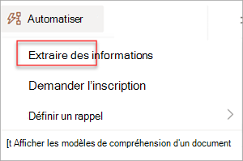

# Entraîner un modèle de traitement de document structuré dans Microsoft Syntex

<!---
 

> [!VIDEO https://www.microsoft.com/videoplayer/embed/RE4GnhN]  

 

Using [AI Builder](/ai-builder/overview)—a feature in Microsoft Power Apps—Syntex users can create a [structured document processing](form-processing-overview.md) model directly from a SharePoint document library. 
--->

Suivez les instructions fournies dans [Créer un modèle dans Syntex](create-syntex-model.md) pour créer un modèle de traitement de document structuré dans un centre de contenu. Vous pouvez également suivre les instructions fournies dans [Créer un modèle sur un site SharePoint local](create-local-model.md) pour créer le modèle sur un site local. Utilisez ensuite cet article pour effectuer l’apprentissage de votre modèle.

Pour entraîner un modèle de traitement de document structuré, procédez comme suit :

 - [Étape 1 : Ajouter et analyser des documents](#step-1-add-and-analyze-documents)
 - [Étape 2 : Étiqueter les champs et les tables](#step-2-tag-fields-and-tables)
 - [Étape 3 : Entraîner et publier votre modèle](#step-3-train-and-publish-your-model)
 - [Étape 4 : Utiliser votre modèle](#step-4-use-your-model)

## Étape 1 : Ajouter et analyser des documents

Une fois que vous avez créé votre modèle de traitement de document structuré, la page **Choisir les informations à extraire** s’ouvre. Ici, vous répertoriez toutes les informations que vous souhaitez que le modèle IA extrait de vos documents, telles que *le nom*, *l’adresse* ou *le montant*. 

> [!NOTE]
> Lorsque vous recherchez des exemples de fichiers à utiliser, consultez les [exigences de document d’entrée du modèle de traitement de document et les conseils d’optimisation](/ai-builder/form-processing-model-requirements). 
 
1. Vous définissez d’abord les champs et les tables que vous souhaitez enseigner à votre modèle à extraire sur la page **Choisir les informations à extraire**. Pour obtenir des instructions détaillées, consultez [Définir des champs et des tables pour extraire](/ai-builder/create-form-processing-model#define-fields-and-tables-to-extract). 

2.  Vous pouvez créer autant de collections de dispositions de documents que vous souhaitez que votre modèle traite. Pour obtenir des instructions détaillées, consultez [Grouper les documents par collections](/ai-builder/create-form-processing-model#group-documents-by-collections). 

3. Après avoir créé vos collections et ajouté au moins cinq exemples de fichiers pour chacun, AI Builder sur Syntex examine les documents chargés pour détecter les champs et les tables. Ce processus prend généralement quelques secondes. Une fois l’analyse terminée, vous pouvez poursuivre l’étiquetage des documents.

## Étape 2 : Étiqueter les champs et les tables

Vous devez baliser les documents pour apprendre au modèle à comprendre les champs et les données de table que vous souhaitez extraire. Pour obtenir des instructions détaillées, consultez [Baliser les documents](/ai-builder/create-form-processing-model#tag-documents).

## Étape 3 : Entraîner et publier votre modèle

1. Après avoir créé et entraîné votre modèle, vous êtes prêt à le publier et à l’utiliser dans SharePoint. Pour publier le modèle, sélectionnez **Publier**. Pour obtenir des instructions détaillées, consultez [Entraîner et publier votre modèle de traitement de document](/ai-builder/form-processing-train). 

    

2. Une fois le modèle publié, vous accédez à la page d’accueil du modèle. Vous aurez ensuite la possibilité d’appliquer le modèle à une bibliothèque de documents.

    

## Étape 4 : Utiliser votre modèle

1. Dans la vue du modèle de la bibliothèque de documents, notez que les champs que vous avez sélectionnés s’affichent désormais sous forme de colonnes.

    

2. Notez que le lien Informations en regard de **Documents** indique qu’un modèle de traitement de formulaire est appliqué à cette bibliothèque de documents.
<!---
      
--->
3. Upload files to your document library. Any files that the model identifies as its content type lists the files in your view and displays the extracted data in the columns.

     

> [!NOTE]
> Si un modèle de traitement de document de forme libre ou structurée et un modèle de traitement de document non structuré sont appliqués à la même bibliothèque, le fichier est classé à l’aide du modèle de traitement de document non structuré et de tous les extracteurs formés pour ce modèle. S’il existe des colonnes vides qui correspondent au modèle de traitement du document, les colonnes sont remplies à l’aide de ces valeurs extraites.

### Champ Date de classification

Lorsqu’un modèle personnalisé est appliqué à une bibliothèque de documents, le champ **Date de classification** est inclus dans le schéma de la bibliothèque. Par défaut, ce champ est vide. Toutefois, lorsque des documents sont traités et classés par un modèle, ce champ est mis à jour avec un horodatage d’achèvement. 

Lorsqu’un modèle est marqué avec la **Date de classification**, vous pouvez utiliser le flux **Envoyer un e-mail après que Syntex a traité un fichier** pour informer les utilisateurs qu’un nouveau fichier a été traité et classifié par un modèle dans la bibliothèque de documents SharePoint.

Pour exécuter le flux :

1. Sélectionnez un fichier, puis **Intégrer** > **Power Automate** > **Créer un flux**.

2. Dans le panneau **Créer un flux** , sélectionnez **Envoyer un e-mail après que Syntex a traité un fichier**.

     

### Utiliser des flux pour extraire des informations

> [!IMPORTANT]
> Les informations contenues dans cette section ne s’appliquent pas à la dernière version de Syntex. Il est laissé comme référence uniquement pour les modèles de traitement de formulaires qui ont été créés dans les versions précédentes. Dans la dernière version, vous n’avez plus besoin de configurer les flux pour traiter les fichiers existants.

Deux flux sont disponibles pour traiter un fichier sélectionné ou un lot de fichiers dans une bibliothèque où un modèle de traitement de document structuré a été appliqué.

- **Extraire des informations d’une image ou d’un fichier PDF avec un modèle de traitement de document** : permet d’extraire du texte d’une image ou d’un fichier PDF sélectionné en exécutant un modèle de traitement de document. Prend en charge un seul fichier sélectionné à la fois, et prend uniquement en charge les fichiers PDF et les fichiers image (.png, .jpg et .jpeg). Pour exécuter le flux, sélectionnez un fichier, puis **sélectionnez Automatiser l’extraction** > **des informations**.

      

- **Extraire des informations à partir de fichiers avec un modèle de traitement de document** : utilisez avec les modèles de traitement de document pour lire et extraire des informations d’un lot de fichiers. Traite jusqu’à 5 000 fichiers SharePoint à la fois. Lorsque vous exécutez ce flux, vous pouvez définir certains paramètres. Vous pouvez :

    - Indiquez s’il faut inclure les fichiers précédemment traités (la valeur par défaut n’inclut pas les fichiers précédemment traités).
    - Sélectionnez le nombre de fichiers à traiter (la valeur par défaut est 100 fichiers).
    - Spécifiez l’ordre dans lequel traiter les fichiers (les choix sont l’ID de fichier, le nom de fichier, l’heure de création du fichier ou l’heure de la dernière modification).
    - Spécifiez la façon dont vous souhaitez trier l’ordre (ordre croissant ou décroissant).

      
    
> [!NOTE]
> Le flux **Extraire des informations d’une image ou d’un fichier PDF avec un modèle de traitement de document** est automatiquement disponible pour une bibliothèque avec un modèle de traitement de document associé. Le flux **Extraire des informations à partir de fichiers avec un modèle de traitement de document** est un modèle qui doit être ajouté à la bibliothèque si nécessaire.

## Voir aussi

[Créer un modèle dans Microsoft Syntex](create-syntex-model.md)

[Documentation Power Automate](/power-automate/)

[Formation : Améliorer les performances de votre entreprise avec AI Builder](/training/paths/improve-business-performance-ai-builder/?source=learn)
