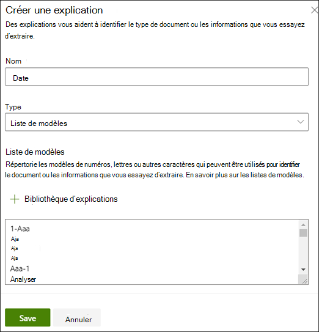
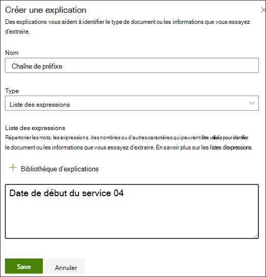

# Créer un extracteur dans Microsoft SharePoint Syntex

 

> [!VIDEO https://www.microsoft.com/videoplayer/embed/RE4CL2G]

  

La création d’un modèle de classifieur sert à automatiser l’identification et la classification de types de documents spécifiques. Avant ou après cette opération, vous pouvez, si vous le souhaitez, ajouter des extracteurs à votre modèle pour extraire des informations spécifiques de ces documents. Par exemple, vous souhaiterez peut-être que votre modèle identifie tous les documents *Renouvellement de contrat* ajoutés à votre bibliothèque de documents. Vous voudrez également qu’il affiche la *Date de démarrage du service* de chaque document sous la forme d’une valeur de colonne dans la bibliothèque de documents.

Vous devez créer un extracteur pour chaque entité dans le document à extraire. Dans notre exemple, nous devons extraire la  **date de démarrage du service**  de chaque ** document Renouvellement de contrat**  identifié par le modèle. Nous devons pouvoir consulter dans la bibliothèque de documents une vue de tous les documents  **Renouvellement de contrat** , avec une colonne qui affiche la date de **démarrage du service** de chaque document. 

> [!NOTE]
> Pour créer un extracteur, utilisez les fichiers déjà chargés pour entraîner le classifieur. 

## Nommer votre extracteur

1. Depuis la page d’accueil du modèle, dans la mosaïque **Créer et entraîner des extracteurs**, cliquez sur **Entraîner un extracteur**.

2. À l’écran **Nouvel extracteur d’entités**, tapez le nom de votre extracteur dans le champ **Nom du nouvel extracteur**. Par exemple, nommez-le **Date de démarrage du service** si vous souhaitez extraire la date de démarrage du service à partir de chaque document Renouvellement de contrat. Vous pouvez également choisir de réutiliser une colonne précédemment créée (par exemple, une colonne de métadonnées gérées).

    > [!NOTE]
    > Pour les extracteurs dont le type de colonne est Une **seule ligne de** texte, la limite de caractères maximale est de 255. Les caractères que vous tapez au-delà de la limite sont tronqués.

3. Une fois que vous avez terminé, cliquez sur **Créer**.

## Ajouter une étiquette

L’étape suivante consiste à étiqueter l’entité à extraire dans vos exemples de fichiers d’entraînement.

La création de l’extracteur ouvre la page de l’extracteur. Cette page affiche la liste des fichiers échantillons, le premier fichier de la liste étant affiché dans la visionneuse.

1. Dans la visionneuse, sélectionnez les données à extraire des fichiers. Par exemple, si vous souhaitez extraire la *date de démarrage du service*, mettez en évidence la valeur de date du premier fichier (*lundi 14 octobre 2019*). Ensuite, cliquez sur **Enregistrer**.  Normalement, la valeur sera affichée dans la liste d’exemples étiquetés du fichier, sous la colonne **Étiquette**.
2. Sélectionnez **Fichier suivant** pour enregistrer automatiquement et ouvrir le fichier suivant dans la liste de la visionneuse. Vous pouvez également sélectionner **Enregistrer**, puis sélectionner un autre fichier dans la liste **Exemples étiquetés**.
3. Dans la visionneuse, répétez les étapes 1 et 2, puis répétez l’opération jusqu’à enregistrer l’étiquette dans les cinq fichiers.

     

 
Après l’étiquetage de cinq fichiers, une bannière de notification vous dit de passer à la formation. Vous pouvez choisir d’étiqueter d’autres documents ou de passer à la formation. 

### Utiliser la recherche pour effectuer une recherche dans votre fichier

Vous pouvez utiliser la fonctionnalité **Rechercher** pour rechercher une entité dans votre document que vous voulez étiqueter.

    

La fonctionnalité Rechercher est utile si vous recherchez un document de grande taille ou si le document contient plusieurs instances de l’entité. Si vous trouvez plusieurs instances, vous pouvez sélectionner celle dont vous avez besoin dans les résultats de recherche pour y aller dans la visionneuse afin de l’étiqueter.

## Ajouter une explication

Dans notre exemple, nous allons créer une explication du format de l’entité proprement dit et des variations susceptibles d’apparaître dans les exemples de documents. Par exemple, une date peut être affichée dans plusieurs formats différents :
- 14/10/2019
- 14 octobre 2019
- Lundi 14 octobre 2019
 

Pour identifier plus facilement la *date de démarrage du service*, vous pouvez créer une explication de modèle.

1. Dans la section Explication, sélectionnez **Nouveau**, puis tapez un nom (par exemple, *Date*).
2. Type : sélectionnez **Liste de modèles**.
3. Valeur : indiquez la variation de la date telle qu’elle apparaît dans les fichiers échantillons. Par exemple, si certaines dates apparaissent au format 0/00/0000, vous devez entrer les variations qui apparaissent dans vos documents, par exemple :
    - 0/0/0000
    - 0/00/0000
    - 00/0/0000
    - 00/00/0000
4. Sélectionnez **Enregistrer**.

> [!NOTE]
> Si vous souhaitez en savoir plus sur les types d’explications, veuillez consulter la rubrique [Types d’explications](./explanation-types-overview.md).  

### Utiliser la bibliothèque d’explications

Pour créer des explications d’éléments tels que des dates, il est plus facile d’[utiliser la bibliothèque d’explications](./explanation-types-overview.md) que d’entrer manuellement toutes les variations. La bibliothèque d’explications est un ensemble d’explications de modèles et d’expressions prédéfinies. La bibliothèque tente d’offrir tous les formats de listes de modèles ou d’expressions courantes, comme des dates, des numéros de téléphone, des codes postaux, etc. 

Pour l’échantillon *Date de début du service*, nous vous recommandons d’utiliser l’explication prédéfinie de la *date* dans la bibliothèque d’explications :

1. Dans la section **Explication**, sélectionnez **Nouveau**, puis **Depuis la bibliothèque d’explications**.
2. Depuis la bibliothèque d’explications, sélectionnez **Date**. Vous pouvez afficher toutes les variations de date reconnues.
3. Sélectionnez **Ajouter**.

     

4. À la page **Créer une explication**, les champs sont automatiquement remplis avec la *date*. Sélectionnez **Enregistrer**.

     

## Entraîner le modèle 

L’enregistrement de vos explications démarre l’entraînement. Si votre modèle dispose d’informations suffisantes pour extraire les données de vos exemples de fichiers étiquetés, chacun d’entre eux comportera l’étiquette **Correspondance**.  

 

Si l’explication ne dispose pas d’informations suffisante pour rechercher les données à extraire, chaque fichier est labellisé comportera l’étiquette **Incompatibilité**. Si vous souhaitez en savoir plus sur l’incompatibilité en question, veuillez cliquer sur les fichiers **incompatibles**.

## Ajouter une autre explication

L’incompatibilité indique souvent que l’explication fournie ne comportait pas d’informations suffisantes pour extraire la valeur de la date de démarrage du service afin de faire correspondre les fichiers étiquetés. Vous voudrez peut-être la modifier ou ajouter une autre explication.

Dans notre exemple, vous remarquerez que la chaîne de texte *Date de démarrage du service du* précède toujours la valeur réelle. Pour identifier plus facilement la date de démarrage du service, vous devez créer une explication d’expression.

1. Dans la section Explication, sélectionnez **Nouveau**, puis tapez un nom (par exemple, *Chaîne de préfixe*).
2. Type : sélectionnez **Liste d’expressions**.
3. Utilisez la valeur *Date de démarrage du service du*.
4. Sélectionnez **Enregistrer**.

     

## Entraîner de nouveau le modèle

L’enregistrement de l’explication génère le redémarrage de l’entraînement, cette fois à l’aide des explications de l’exemple. Si votre modèle dispose d’informations suffisantes pour extraire les données des exemples de fichiers étiquetés, chacun d’entre eux comportera l’étiquette **Correspondance**. 

Si vous recevez de nouveau une **incompatibilité** sur vos fichiers étiquetés, vous devrez probablement créer une autre explication. Le modèle aura sans doute besoin d’informations supplémentaires sur le type de document. Sinon, vous devrez probablement envisager de modifier vos fichiers existants.

## Tester votre modèle

Si vous recevez une correspondance sur vos fichiers échantillons étiquetés, vous pouvez à présent tester votre modèle sur les autres exemples de fichiers non étiquetés. Cette étape est facultative mais utile, car elle permet d’évaluer la « pertinence » ou le degré de préparation du modèle avant utilisation, en le testant sur des fichiers pour l’instant inconnus de ce dernier.

1. Dans la page d’accueil du modèle, cliquez sur l’onglet **Test**. Le modèle s’exécute alors sur vos fichiers échantillons non étiquetés.
2. Dans la liste **Fichiers de test**, vos exemples de fichiers affichés indiquent si le modèle peut extraire les informations nécessaires. Utilisez ces informations pour déterminer plus facilement l’efficacité de votre classifieur lors de l’identification de vos documents.

     

## Voir aussi
[Créer un classifieur](create-a-classifier.md)

[Types d’explications](explanation-types-overview.md)

[Utiliser la taxonomie du magasin de termes lors de la création d’un extracteur](leverage-term-store-taxonomy.md)

[Présentation de la compréhension de document](document-understanding-overview.md)

[Appliquer un modèle](apply-a-model.md) 

[Mode d’accessibilité Syntex de SharePoint](accessibility-mode.md)
