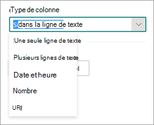

# Créer un extracteur dans Microsoft SharePoint Syntex

 

> [!VIDEO https://www.microsoft.com/videoplayer/embed/RE4CL2G]

 

La création d’un modèle de classifieur sert à automatiser l’identification et la classification de types de documents spécifiques. Avant ou après cette opération, vous pouvez, si vous le souhaitez, ajouter des extracteurs à votre modèle pour extraire des informations spécifiques de ces documents. Par exemple, vous souhaiterez peut-être que votre modèle identifie tous les documents *Renouvellement de contrat* ajoutés à votre bibliothèque de documents. Vous voudrez également qu’il affiche la *Date de démarrage du service* de chaque document sous la forme d’une valeur de colonne dans la bibliothèque de documents.

Vous devez créer un extracteur pour chaque entité dans le document à extraire. Dans notre exemple, nous voulons extraire la **date de début du service** pour chaque document **de renouvellement de contrat** identifié par le modèle. Nous voulons voir une vue dans la bibliothèque de documents de tous les documents **de renouvellement** de contrat, avec une colonne qui affiche la valeur de date de **début du service** de chaque document.

> [!NOTE]
> Pour créer un extracteur, utilisez les fichiers déjà chargés pour entraîner le classifieur.

## Nommer votre extracteur

1. Dans la page d’accueil du modèle, dans la vignette **Créer et entraîner des extracteurs** , sélectionnez **l’extracteur Train**.

2. À l’écran **Nouvel extracteur d’entités**, tapez le nom de votre extracteur dans le champ **Nom du nouvel extracteur**. Par exemple, nommez-le **Date de démarrage du service** si vous souhaitez extraire la date de démarrage du service à partir de chaque document Renouvellement de contrat. Vous pouvez également choisir de réutiliser une colonne précédemment créée (par exemple, une colonne de métadonnées gérées).

    Par défaut, le type de colonne est **une seule ligne de texte**. Si vous souhaitez modifier le type de colonne, sélectionnez **Le type Advanced settingsColumn** > , puis sélectionnez le type que vous souhaitez utiliser.

    

    > [!NOTE]
    > Pour les extracteurs avec le type **de colonne Ligne unique de texte**, la limite de caractères maximale est de 255. Les caractères que vous tapez au-delà de la limite sont tronqués.

3. Lorsque vous avez terminé, sélectionnez **Créer**.

## Ajouter une étiquette

L’étape suivante consiste à étiqueter l’entité à extraire dans vos exemples de fichiers d’entraînement.

La création de l’extracteur ouvre la page de l’extracteur. Cette page affiche la liste des fichiers échantillons, le premier fichier de la liste étant affiché dans la visionneuse.

1. Dans la visionneuse, sélectionnez les données à extraire des fichiers. Par exemple, si vous souhaitez extraire la *date de démarrage du service*, mettez en évidence la valeur de date du premier fichier (*lundi 14 octobre 2019*). puis **sélectionnez Enregistrer**. Normalement, la valeur sera affichée dans la liste d’exemples étiquetés du fichier, sous la colonne **Étiquette**.
2. Sélectionnez **Fichier suivant** pour l’enregistrement automatique et ouvrez le fichier suivant dans la liste de la visionneuse. Vous pouvez également sélectionner **Enregistrer**, puis sélectionner un autre fichier dans la liste **Exemples étiquetés**.
3. Dans la visionneuse, répétez les étapes 1 et 2, puis répétez l’opération jusqu’à enregistrer l’étiquette dans les cinq fichiers.

    

Après l’étiquetage de cinq fichiers, une bannière de notification vous dit de passer à la formation. Vous pouvez choisir d’étiqueter d’autres documents ou de passer à la formation.

### Utiliser la recherche pour effectuer une recherche dans votre fichier

Vous pouvez utiliser la fonctionnalité **Rechercher** pour rechercher une entité dans votre document que vous voulez étiqueter.

   

La fonctionnalité Rechercher est utile si vous effectuez une recherche dans un document volumineux ou s’il existe plusieurs instances de l’entité dans le document. Si vous trouvez plusieurs instances, vous pouvez sélectionner celle dont vous avez besoin dans les résultats de recherche pour y aller dans la visionneuse afin de l’étiqueter.

## Ajouter une explication

Pour notre exemple, nous allons créer une explication qui fournit un indicateur sur le format d’entité lui-même et les variantes qu’il peut avoir dans les exemples de documents. Par exemple, une date peut être affichée dans plusieurs formats différents :

- 14/10/2019
- 14 octobre 2019
- Lundi 14 octobre 2019

Pour identifier plus facilement la *date de démarrage du service*, vous pouvez créer une explication de modèle.

1. Dans la section Explication, sélectionnez **Nouveau**, puis tapez un nom (par exemple, *Date*).
2. Type : sélectionnez **Liste de modèles**.
3. Valeur : indiquez la variation de la date telle qu’elle apparaît dans les fichiers échantillons. Par exemple, si certaines dates apparaissent au format 0/00/0000, vous devez entrer les variations qui apparaissent dans vos documents, par exemple :
    - 0/0/0000
    - 0/00/0000
    - 00/0/0000
    - 00/00/0000
4. Sélectionnez **Enregistrer**.

> [!NOTE]
> Si vous souhaitez en savoir plus sur les types d’explications, veuillez consulter la rubrique [Types d’explications](./explanation-types-overview.md).

### Utiliser la bibliothèque d’explications

Pour créer des explications pour des éléments tels que des dates, il est plus facile [d’utiliser la bibliothèque d’explications](./explanation-types-overview.md) que d’entrer manuellement toutes les variantes. La bibliothèque d’explications est un ensemble d’explications de modèles et d’expressions prédéfinies. La bibliothèque tente de fournir tous les formats pour les listes d’expressions ou de modèles courants, telles que les dates, les numéros de téléphone, les codes postaux et bien d’autres.

Pour l’exemple *de date de début du service* , il est plus efficace d’utiliser l’explication prédéfinifiée de *Date* dans la bibliothèque d’explications :

1. Dans la section **Explication**, sélectionnez **Nouveau**, puis **Depuis la bibliothèque d’explications**.
2. Depuis la bibliothèque d’explications, sélectionnez **Date**. Vous pouvez afficher toutes les variations de date reconnues.
3. Sélectionnez **Ajouter**.

    

4. À la page **Créer une explication**, les champs sont automatiquement remplis avec la *date*. Sélectionnez **Enregistrer**.

    

## Entraîner le modèle

L’enregistrement de votre explication démarre l’entraînement. Si votre modèle a suffisamment d’informations pour extraire les données de vos exemples de fichiers étiquetés, vous verrez chaque fichier étiqueté avec **Match**.

Si l’explication ne contient pas suffisamment d’informations pour trouver les données que vous souhaitez extraire, chaque fichier est étiqueté avec **incompatibilité**. Vous pouvez sélectionner des fichiers **incompatibles** pour afficher plus d’informations sur la raison d’une incompatibilité.

## Ajouter une autre explication

Souvent, l’incompatibilité est une indication que l’explication que nous avons fournie n’a pas fourni suffisamment d’informations pour extraire la valeur de date de début du service pour correspondre à nos fichiers étiquetés. Vous devrez peut-être le modifier ou ajouter une autre explication.

Dans notre exemple, vous remarquerez que la chaîne de texte *Date de démarrage du service du* précède toujours la valeur réelle. Pour identifier plus facilement la date de démarrage du service, vous devez créer une explication d’expression.

1. Dans la section Explication, sélectionnez **Nouveau**, puis tapez un nom (par exemple, *Chaîne de préfixe*).
2. Type : sélectionnez **Liste d’expressions**.
3. Utilisez la valeur *Date de démarrage du service du*.
4. Sélectionnez **Enregistrer**.

    

## Entraîner de nouveau le modèle

L’enregistrement de l’explication génère le redémarrage de l’entraînement, cette fois à l’aide des explications de l’exemple. Si votre modèle dispose d’informations suffisantes pour extraire les données des exemples de fichiers étiquetés, chacun d’entre eux comportera l’étiquette **Correspondance**.

Si vous recevez de nouveau une **incompatibilité** sur vos fichiers étiquetés, vous devrez probablement créer une autre explication. Le modèle aura sans doute besoin d’informations supplémentaires sur le type de document. Sinon, vous devrez probablement envisager de modifier vos fichiers existants.

## Tester votre modèle

Si vous recevez une correspondance sur vos fichiers échantillons étiquetés, vous pouvez à présent tester votre modèle sur les autres exemples de fichiers non étiquetés. Cela est facultatif, mais il s’agit d’une étape utile pour évaluer la « condition physique » ou la préparation du modèle avant de l’utiliser, en le testant sur des fichiers que le modèle n’a pas vus auparavant.

1. Dans la page d’accueil du modèle, sélectionnez l’onglet **Test**. Le modèle est alors exécuté sur vos fichiers échantillons non étiquetés.

2. Dans la liste **Fichiers de test**, vos exemples de fichiers affichés indiquent si le modèle peut extraire les informations nécessaires. Utilisez ces informations pour déterminer plus facilement l’efficacité de votre classifieur lors de l’identification de vos documents.

    

### Affiner davantage un extracteur

Si vous avez des entités en double et que vous souhaitez extraire une seule valeur ou un certain nombre de valeurs, vous pouvez définir une règle pour spécifier la façon dont vous souhaitez qu’elle soit traitée. Pour ajouter une règle pour affiner les informations extraites, procédez comme suit :

1. Dans la page d’accueil du modèle, dans la section **Extracteurs d’entité** , sélectionnez l’extracteur que vous souhaitez affiner, puis **sélectionnez Affiner les informations extraites**.

    

2. Dans la page **Affiner les informations extraites** , sélectionnez l’une des règles suivantes :

    - Conserver une ou plusieurs des premières valeurs
    - Conserver une ou plusieurs des dernières valeurs
    - Supprimer les valeurs dupliquées
    - Conserver une ou plusieurs des premières lignes
    - Conserver une ou plusieurs des dernières lignes

    

3. Entrez le nombre de lignes ou de valeurs que vous souhaitez utiliser, puis sélectionnez **Affiner**.

4. Si vous souhaitez modifier une règle en modifiant le nombre de lignes ou de valeurs, sélectionnez l’extracteur à modifier, sélectionnez **Affiner les informations extraites**, modifiez le nombre, puis **sélectionnez Enregistrer**.

5. Lorsque vous testez l’extracteur, vous pouvez voir l’affinement dans la colonne des **résultats d’affinement** de la liste **Fichiers de test** .

    

6. Si vous souhaitez supprimer une règle d’affinement sur un extracteur, sélectionnez l’extracteur à partir duquel vous souhaitez supprimer la règle, **sélectionnez Affiner les informations extraites**, puis **sélectionnez Supprimer**.

## Voir aussi

[Créer un classifieur](create-a-classifier.md)

[Types d’explications](explanation-types-overview.md)

[Utiliser la taxonomie du magasin de termes lors de la création d’un extracteur](leverage-term-store-taxonomy.md)

[Présentation de la compréhension de document](document-understanding-overview.md)

[Appliquer un modèle](apply-a-model.md)

[Mode d’accessibilité Syntex de SharePoint](accessibility-mode.md)
