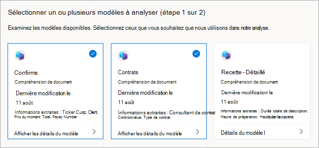

# Découvrir d’autres modèles entraînés dans Microsoft Syntex

**S’applique à :**  &ensp; &#10003; Tous les modèles &ensp; | &ensp; personnalisés &#10003; Tous les modèles prédéfinis

Avant de créer un modèle, vous pouvez envisager de réutiliser un modèle existant. Vous pouvez rechercher et évaluer des modèles entraînés qui ont été créés par d’autres membres de votre organisation. Cela peut inclure des modèles d’entreprise partagés entraînés dans un centre de contenu ou d’autres modèles locaux créés dans le même site. Sélectionnez le modèle le plus utile pour classer vos fichiers ou en extraire des informations spécifiques. 

## Découvrir d’autres modèles entraînés

Pour trouver des modèles entraînés qui peuvent convenir à votre contenu :

1. Dans la bibliothèque de documents de votre modèle, sélectionnez **Classifier et extraire**.

2. Dans la page Examiner les modèles et en appliquer de nouveaux, vous pouvez passer en revue les **modèles appliqués** et les modèles disponibles pour être appliqués à votre bibliothèque de documents.

    

   - Sous **l’onglet** Appliqué, consultez les modèles qui ont été appliqués à votre bibliothèque. Sélectionnez **Afficher les détails du modèle** pour afficher des informations sur le modèle, telles que la description, les extracteurs et d’autres paramètres.
   
   - Sous **l’onglet** Disponible, consultez les modèles entraînés qui peuvent être appliqués à votre bibliothèque.

## Appliquer un modèle entraîné à votre bibliothèque

Vous pouvez évaluer les modèles entraînés par rapport à votre contenu pour vous aider à trouver le modèle le plus approprié. Pour sélectionner un modèle à appliquer à votre bibliothèque :

1. Dans la page **Examiner les modèles** et en appliquer de nouveaux, **sélectionnez l’onglet** Disponible pour passer en revue les modèles de la liste.

    

2. Choisissez le modèle qui, selon vous, vous permettra d’obtenir les meilleurs résultats, sélectionnez Afficher les **détails** du modèle, puis sélectionnez Appliquer **à la bibliothèque.**

## Obtenir une recommandation pour un modèle entraîné

Si vous ne savez pas quel modèle convient le mieux à vos fichiers, vous pouvez demander une recommandation. Votre recommandation peut inclure jusqu’à 10 modèles.

1. Dans la page **Examiner les modèles et en** appliquer de nouveaux, sélectionnez **l’onglet** Disponible.

2. Sur la première vignette, sélectionnez **Obtenir une recommandation.**

    

3. Dans la page **Sélectionner un ou plusieurs** modèles d’analyse, sélectionnez les modèles qui, selon vous, sont les plus adaptés, puis sélectionnez **Suivant.**

    

4. Dans la page **Sélectionner un fichier à analyser,** sélectionnez un fichier du même type ou d’un type similaire qui sera stocké dans votre bibliothèque. Ensuite, choisissez **Sélectionner.**

    

5. Dans les **résultats de l’examen et sélectionnez une** page de modèle, sous Notre **recommandation,** vous verrez le fichier recommandé. Vous n’avez pas besoin d’appliquer le modèle recommandé. Vous pouvez choisir d’appliquer un autre modèle si vous pensez qu’il est plus adapté.

    

6. Pour le modèle que vous pensez obtenir les meilleurs résultats, sélectionnez Afficher les **détails** du modèle, puis sélectionnez Appliquer **à la bibliothèque.**

7. S’il n’existe aucun modèle recommandé basé sur le fichier sélectionné, vous pouvez revenir en arrière et sélectionner un autre fichier ou sélectionner différents modèles.

## Supprimer un modèle appliqué

> [!NOTE]
> Un modèle doit être supprimé de toutes les bibliothèques de documents SharePoint avant de pouvoir être [supprimé](delete-a-model.md) ou [renommé](rename-a-model.md).

Pour supprimer un modèle appliqué de votre bibliothèque de documents :

1. Dans la page Révision des modèles et application de nouveaux **modèles,** sous l’onglet **Appliqué, consultez les modèles qui ont été appliqués à votre bibliothèque**.

2. Sur le modèle que vous souhaitez supprimer, sélectionnez Afficher les **détails** du modèle, puis **sélectionnez Supprimer de la bibliothèque.**

<!---
## Change the view in a document library

[!INCLUDE [Change the view in a document library](../includes/change-library-view.md)]
--->

## Voir aussi

[Partager un modèle d’entreprise](model-discovery.md)

[Choisir l’affichage dans une bibliothèque de documents](choose-library-view.md)
