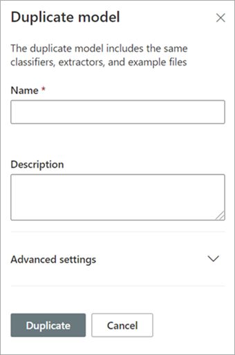

# Dupliquer un modèle dans Microsoft SharePoint Syntex

La duplication d'un modèle de compréhension de document peut vous faire gagner du temps et vous épargner des efforts si vous devez créer un nouveau modèle et si vous savez qu'un modèle existant est très similaire à ce dont vous avez besoin.

Par exemple, un modèle existant nommé « Contrats » classe les mêmes fichiers que ceux avec lesquels vous devez travailler. Votre nouveau modèle extraira certaines des données existantes, mais devra être mis à jour pour extraire des données supplémentaires. Au lieu de créer et de former un nouveau modèle à partir de zéro, vous pouvez utiliser la fonction de duplication de modèle pour faire une copie du modèle de contrats, qui copiera également tous les éléments de formation associés, tels que les fichiers d'exemple et les extracteurs d'entités.

Lorsque vous dupliquez le modèle, après l'avoir renommé (par exemple, en «Renouvellements de contrats»), vous pouvez ensuite le mettre à jour. Par exemple, vous pouvez choisir de supprimer certains des champs extraits existants dont vous n'avez pas besoin, puis entraîner le modèle à en extraire un nouveau (par exemple, «Date de renouvellement»).

## Dupliquer un modèle

Suivez ces étapes pour dupliquer un modèle de compréhension de document.

1. Dans le centre de contenu, sélectionnez **Modèles** pour afficher la liste de vos modèles.

2. Sur la page **Modèles**, sélectionnez le modèle que vous souhaitez dupliquer.

3. En utilisant le ruban ou le bouton **Afficher les actions** (à côté du nom du modèle), sélectionnez **Dupliquer**. 

      

4. Dans le panneau **Dupliquer le modèle** :

   a. Sous **Nom** , saisissez le nouveau nom du modèle que vous souhaitez dupliquer. 

      

   b. Sous **Description**, ajoutez une description de votre nouveau modèle.

   c. (Facultatif) Sous **Paramètres avancés** , sélectionnez si vous voulez associer un [type de contenu](/sharepoint/governance/content-type-and-workflow-planning#content-type-overview) existant .

5. Sélectionnez **Dupliquer**.

## Voir aussi
[Créer un classificateur](create-a-classifier.md)

[Renommer un modèle](rename-a-model.md)

[Créer un extracteur](create-an-extractor.md)

[Présentation de la compréhension de document](document-understanding-overview.md)

[Types d’explications](explanation-types-overview.md)

[Appliquer un modèle](apply-a-model.md) 

[Mode d’accessibilité Syntex de SharePoint](accessibility-mode.md)