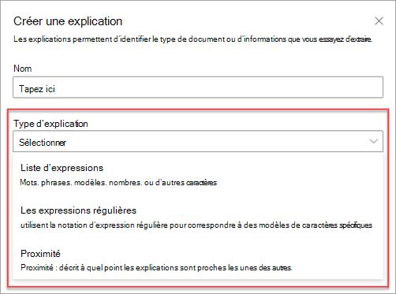
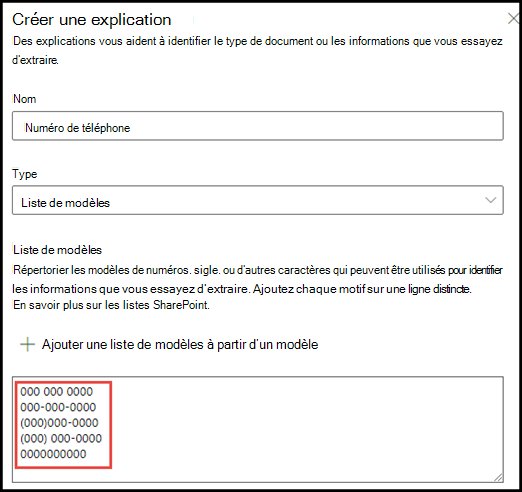
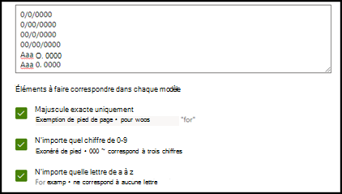

# Présentation des types d’explications

Utilisez des explications pour définir les informations que vous souhaitez étiqueter et extrayez dans votre document les modèles de présentation pour Microsoft SharePoint Syntex. Lorsque vous créez une explication, veillez à sélectionner un type d’explication. 

Cet article vous aide à comprendre les différents types d’explications et la façon dont ils sont utilisés.

    
   
Ces types d’explications sont disponibles :

- **Liste d’expressions**: liste de mots, d’expressions, de nombres ou d’autres caractères que vous pouvez utiliser dans le document ou des informations que vous extrayez. Par exemple, la chaîne de texte **faisant référence à médecin** se trouve dans tous les documents de référence médicale que vous identifiez. 

- **Liste de motifs**: modèles de liste de nombres, lettres ou autres caractères que vous pouvez utiliser pour identifier les informations que vous extrayez. Par exemple, vous pouvez extraire le **numéro de téléphone** du docteur de référence à partir de l’ensemble du document de référence médicale que vous identifiez. 

- **Proximité**: décrit le mode de fermeture des explications. Par exemple, une liste de modèles de *numéro de rue* se place juste avant la liste d’expressions de *nom de rue* , sans jeton entre les points (vous allez découvrir les jetons plus loin dans cet article). 
 
## Liste des expressions

Un type d’explication de liste d’expressions est généralement utilisé pour identifier et classer un document par le biais de votre modèle. Comme décrit dans l’exemple d’étiquette *Doctor de référence* , il s’agit d’une chaîne de mots, d’expressions, de chiffres ou de caractères qui est cohérente dans les documents que vous identifiez.

Bien que ce ne soit pas obligatoire, vous pouvez obtenir une meilleure réussite avec votre explication si l’expression que vous capturez se trouve à un emplacement cohérent dans votre document. Par exemple, l’étiquette *médecin de référence* peut se trouver régulièrement dans le premier paragraphe du document.

Si le respect de la casse est une condition requise pour l’identification de votre étiquette, l’utilisation du type de liste phrase vous permet de la spécifier dans votre explication en activant la seule case à cocher **majuscule exacte** .

    

## Listes de modèles

Un type de liste de motifs est particulièrement utile lorsque vous créez une explication qui identifie et extrait des informations d’un document. Il est généralement présenté sous différents formats, tels que des dates, des numéros de téléphone ou des numéros de carte de crédit. Par exemple, une date peut être affichée dans différents formats (1/1/2020, 1-1-2020, 01/01/20, 01/01/2020, Jan 1, 2020, etc.). La définition d’une liste de modèles rend votre explication plus efficace en capturant toutes les variantes possibles dans les données que vous tentez d’identifier et d’extraire. 

Pour l’exemple de **numéro de téléphone** , extrayez le numéro de téléphone de chaque docteur de référence de tous les documents de référence médicale que le modèle identifie. Lorsque vous créez l’explication, sélectionnez le type de liste motif pour autoriser les différents formats susceptibles d’être renvoyés.

   

Pour cet exemple, activez la case à cocher **tout chiffre de 0-9** . La sélection de cette option permet de reconnaître chaque valeur « 0 » utilisée dans votre liste de motifs comme un chiffre compris entre 0 et 9.

   

De même, si vous créez une liste de motifs qui inclut des caractères de texte, sélectionnez toutes les lettres de la case à cocher **a-z** . La sélection de cette option reconnaît tous les caractères « a » utilisés dans la liste motif comme n’importe quel caractère compris entre « a » et « z ».

Par exemple, si vous créez une liste de modèles de **Date** et que vous souhaitez vous assurer qu’un format de date, tel que le *1er janvier 2020* , est reconnu, vous devez effectuer les opérations suivantes :
- Ajoutez les *AAA 0, 0000* et *AAA 00, 0000* à votre liste de motifs.
- Assurez-vous que **toute lettre comprise entre a et z** est également sélectionnée.

   

En outre, si votre liste de motifs comporte des exigences de majuscules, vous avez la possibilité de sélectionner la seule case à cocher mise en **majuscules exacte** . Pour l’exemple de date, si vous avez besoin que la première lettre du mois soit capitalisée, vous devez :

- Ajoutez les *AAA 0, 0000* et *AAA 00, 0000* à votre liste de motifs.
- Assurez-vous que **seule la casse exacte** est également sélectionnée.

   

> [!NOTE]
> Au lieu de créer manuellement une explication de liste de motifs, utilisez la [bibliothèque d’explication]() pour utiliser des modèles de liste de modèles prédéfinis pour une liste de modèles commune, comme une *Date*, un *numéro de téléphone*, *un numéro de carte de crédit*, etc.. 

## Proximité 

Le type d’explication de proximité aide votre modèle à identifier les données par le biais de la définition de la fermeture d’un autre élément de données. Par exemple, dans votre modèle, vous avez défini deux explications qui étiquetent le *numéro d’adresse* et le *numéro de téléphone*du client. 

Vous pouvez également remarquer que les numéros de téléphone des clients apparaissent toujours avant le numéro d’adresse postale. 

Alex Wilburn 
555-555-5555 
One Microsoft Way 
Redmond, WA 98034 

Utilisez l’explication de proximité pour définir la distance de l’explication du numéro de téléphone afin de mieux identifier le numéro d’adresse postale dans vos documents.

    

#### Qu’est-ce qu’un jeton ?

Pour utiliser le type d’explication de proximité, vous pouvez comprendre ce qu’est un jeton, car le nombre de jetons mesure la distance d’une explication à une autre.  

Un jeton est une plage continue (sans espace ni ponctuation) de lettres et de chiffres. Un espace n’est pas un jeton. Chaque caractère de ponctuation est un jeton. Le tableau suivant montre quelques exemples illustrant comment déterminer le nombre de jetons dans une expression.

|Souhaitée|Nombre de jetons|Explication|
|--|--|--|
|`Dog`|1 |Un seul mot sans ponctuation ou espaces.|
|`RMT33W`|1 |Numéro de localisateur d’enregistrement. Il peut contenir des chiffres et des lettres, mais n’a pas de ponctuation.|
|`425-555-5555`|5 |Un numéro de téléphone. Chaque signe de ponctuation est un jeton unique de sorte qu’il s’agit de  `425-555-5555` 5 jetons : `425` `-` `555` `-` `5555` |
|`https://luis.ai`|7 |`https` `:` `/` `/` `luis` `.` `ai` |

#### Configurer le type d’explication de proximité

Pour l’exemple, configurez le paramètre de proximité de manière à pouvoir définir la plage du nombre de jetons dont le numéro de *téléphone* explique l’explication relative au *numéro d’adresse postale* .

Vous devriez voir que la plage minimale est « 0 », car il n’y a aucun jeton entre le numéro de téléphone et le numéro d’adresse postale.

Toutefois, certains numéros de téléphone dans les exemples de documents sont ajoutés avec *(mobile)*.

Nestor Wilke 
111-111-1111 (mobile) 
One Microsoft Way 
Redmond, WA 98034 

Il y a trois jetons dans *(mobile)*:

|Souhaitée|Nombre de jetons|
|--|--|
|(|1 |
|Mobile|2 |
|)|3 |

Configurez le paramètre de proximité sur une plage comprise entre 0 et 3.

    

## Utiliser la bibliothèque d’explication

Bien que vous puissiez ajouter manuellement différentes valeurs de liste de modèles pour votre explication, il est plus facile d’utiliser les modèles pré-créés fournis dans la bibliothèque d’explication.

Par exemple, au lieu d’ajouter manuellement toutes les variantes de *Date*, utilisez le modèle de liste de modèles pour *Date*, qui inclut déjà un certain nombre de valeurs de liste de modèles : 

    
 
La bibliothèque d’explications comprend un certain nombre d’explications de liste de modèles communément utilisées, notamment : 

- Date 
- Date (numérique) 
- Time 
- Nombre 
- Numéro de téléphone 
- Code postal 
- Premier mot de phrase 
- Carte de crédit 
- Numéro de sécurité sociale 

Notez que la bibliothèque d’explications inclut également des modèles pour les explications de la liste des phrases, notamment :
- Fin de la phrase
- Monétaire

#### Pour utiliser un modèle à partir de la bibliothèque d’explications

1. Dans la section **explications** de la page de **formation** de votre modèle, sélectionnez **nouveau**, puis sélectionnez **à partir d’un modèle**. 

    

2.  Sur la page **modèles d’explication** , sélectionnez l’explication que vous souhaitez utiliser, puis sélectionnez **Ajouter**. 

        

3. Les informations du modèle que vous avez sélectionné s’afficheront dans la page **créer une explication** . Si nécessaire, modifiez le nom de l’explication, puis ajoutez ou supprimez des éléments dans la liste motif.   

    

4. Lorsque vous avez terminé, sélectionnez **Enregistrer**.
