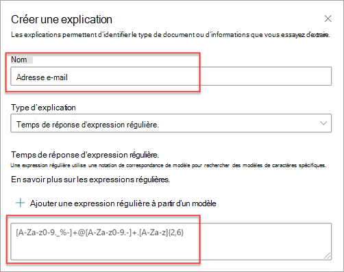
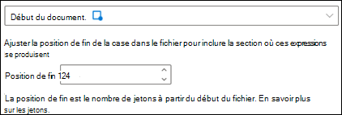

# Types d’explications dans Microsoft SharePoint Syntex

Les explications sont utilisées pour vous permettre de définir les informations que vous souhaitez étiqueter et extraire dans vos modèles de compréhension de documents dans Microsoft SharePoint Syntex. Lorsque vous créez une explication, vous devez sélectionner un type d’explication. Cet article vous permet de comprendre les différents types d’explications et comment ils sont utilisés.

Les types d’explications suivants sont disponibles :

- [**Liste d’expressions**](#phrase-list) : liste de mots, expressions, nombres ou autres caractères que vous pouvez utiliser dans le document ou les informations que vous extrayez. Par exemple, la chaîne de texte *Médecin référent* se trouve dans tous les documents de référence médicale que vous identifiez. Ou le *Numéro de téléphone* du médecin référent de tous les documents de référence médicale que vous identifiez.

- [**Expression régulière**](#regular-expression) utilise une notation correspondant à un modèle pour rechercher des modèles de caractères spécifiques. Par exemple, vous pouvez utiliser une expression régulière pour rechercher toutes les instances d’une *adresse e-mail* modèle dans un ensemble de documents.

- [**Proximité**](#proximity) : décrit à quel point les explications sont proches les unes des autres. Par exemple, une liste de phrases de *numéros de rue* se trouve juste avant la liste d’expressions des *noms de rue*, sans jetons entre les deux (vous en apprendrez davantage sur les jetons plus loin dans cet article). L’utilisation du type de proximité nécessite que vous ayez au moins deux explications dans votre modèle. Dans le cas contraire, l’option sera désactivée.

## Liste d’expressions

Un type d’explication de liste d’expressions est généralement utilisé pour identifier et classer un document dans votre modèle. Comme décrit dans l’exemple d’étiquette *Médecin référent*, il s’agit d’une chaîne de mots, d’expressions, de nombres ou de caractères qui se trouve systématiquement dans les documents que vous identifiez.

Bien que ce ne soit pas obligatoire, vous pouvez améliorer les performances de votre explication si l’expression que vous capturez se trouve à un emplacement cohérent dans votre document. Par exemple, l’étiquette *Médecin référent* peut être située systématiquement dans le premier paragraphe du document. Vous pouvez également utiliser le paramètre avancé **[Configurer l’emplacement de survenance des phrases dans le document](explanation-types-overview.md#configure-where-phrases-occur-in-the-document)** pour sélectionner des zones spécifiques dans lesquelles la phrase se situe, surtout s’il existe une possibilité que la phrase se produise dans plusieurs emplacements au sein de votre document.

Si le respect de la casse est une exigence pour identifier votre étiquette, l’utilisation du type de liste d’expressions vous permet de le spécifier dans votre explication en cochant la case **Seulement la mise en majuscule exacte**.

Un type de phrase est particulièrement utile lorsque vous créez une explication qui identifie et extraie des informations dans divers formats, telles que des dates, numéros de téléphone et de cartes bancaires. Par exemple, une date peut être affichée dans de nombreux formats différents (1/1/2020, 1-1-2020, 01/01/20, 01/01/2020 ou 1 janvier 2020). La définition d’une liste de phrases rend votre explication plus efficace en capturant toutes les variations possibles dans les données que vous essayez d’identifier et d’extraire.

Pour l’exemple du *Numéro de téléphone*, vous extrayez le numéro de téléphone de chaque médecin traitant dans tous les documents de référence médicale que le modèle identifie. Lorsque vous créez l’explication, tapez les différents formats pouvant correspondre à un affichage de numéro de téléphone dans votre document de sorte que vous puissiez capturer les variations possibles.

Pour cet exemple, dans les **Paramètres avancés**, sélectionnez la case à cocher **N’importe quel chiffre de 0 à 9** pour identifier chaque valeur « 0 » utilisée dans votre liste de phrases comme un chiffre compris entre 0 et 9.

De même, si vous créez une liste de phrases qui contient des caractères texte, sélectionnez la case à cocher **Une lettre de a à z** pour que chaque caractère « a » utilisé dans la liste de phrases soit n’importe quel caractère de « a » à « z ».

Par exemple, si vous créez une liste de phrases **Date** et que vous souhaitez vous assurer qu’un format de date tel que *Jan 1, 2020* est reconnu, vous devez :

- ajouter *aaa 0, 0000* et *aaa 00, 0000* à votre liste de phrases.
- vous assurer que **Toutes les lettres de a à z** est également sélectionnée.

Si vous avez des exigences de mise en majuscule dans votre liste de phrases, vous pouvez cocher la case **Seulement la mise en majuscule exacte**. Pour l’exemple Date, si vous souhaitez que la première lettre du mois soit en majuscule, vous devez :

- ajouter *Aaa 0, 0000* et *Aaa 00, 0000* à votre liste de modèles.
- vous assurer que **Seulement la mise en majuscule exacte** est également sélectionnée.

> [!NOTE]
> Au lieu de créer manuellement une explication de liste de phrases, utilisez la [bibliothèque d’explications](explanation-types-overview.md#use-explanation-templates) pour utiliser des modèles de liste de phrases pour une liste de phrases commune, comme les *dates*, *numéros de téléphone*, ou *numéro de carte bancaire*.

## Expression régulière

Un type d’explication d’expression régulière vous permet de créer des modèles qui permettent de rechercher et d’identifier certaines chaînes de texte dans des documents. Vous pouvez utiliser des expressions régulières pour analyser rapidement de grandes quantités de texte pour :

- Recherchez des modèles de caractères spécifiques.
- Validez le texte pour vous assurer qu’il correspond à un modèle prédéfini (par exemple, une adresse e-mail).
- Extrayez, modifiez, remplacez ou supprimez des sous-chaînes de texte.

Un type d’expression régulière est particulièrement utile lorsque vous créez une explication qui identifie et extrait des informations dans des formats similaires, tels que des adresses e-mail, des numéros de compte bancaire ou des URL. Par exemple, une adresse e-mail, telle que megan@contoso.com, s’affiche dans un certain modèle (« megan » est la première partie et « com » est la dernière partie).

L’expression régulière d’une adresse e-mail est : **[A-Za-z0-9._%-]+@[A-Za-z0-9.-]+. [A-Za-z]{2,6}**.

Cette expression se compose de cinq parties, dans cet ordre :

1. Un des caractères spéciaux suivants :

   a. Lettres de a à z

   b. Chiffres entre 0 et 9

   c. Point, trait de soulignement, pourcentage ou tiret

2. Le symbole @

3. Toute quantité des mêmes caractères que la première partie de l’adresse e-mail

4. Un point

5. Deux à six lettres

Pour ajouter un type d’explication d’expression régulière :

1. Dans le panneau **Créer une explication** , sous **Type d’explication**, sélectionnez **Expression régulière**.

   

2. Vous pouvez taper une expression dans la zone de texte **Expression régulière** ou sélectionner **Ajouter une expression régulière à partir d’un modèle**.

   Lorsque vous ajoutez une expression régulière à l’aide d’un modèle, elle ajoute automatiquement le nom et l’expression régulière à la zone de texte. Par exemple, si vous choisissez le modèle **Adresse e-mail**, le panneau **Créer une explication** est renseigné.

   

### Limites

Le tableau suivant présente les options de caractères inline qui ne sont actuellement pas disponibles pour une utilisation dans les modèles d’expression régulière.

|Option  |État  |Fonctionnalités actuelles  |
|---------|---------|---------|
|Respect de la casse | Actuellement non pris en charge. | Toutes les correspondances effectuées ne respectent pas la casse.  |
|Ancres de ligne     | Actuellement non pris en charge. | Impossible de spécifier une position spécifique dans une chaîne où une correspondance doit se produire.   |

## Proximité

Le type d’explication de proximité aide votre modèle à identifier les données en définissant la proximité d’un autre élément de données. Par exemple, dans votre modèle, vous avez défini deux explications qui étiquettent à la fois le *Numéro d’adresse* et le *Numéro de téléphone* du client.

Remarquez également que les numéros de téléphone des clients apparaissent toujours avant le numéro de l’adresse postale.

Alain Chauvin 
555-555-5555 
One Microsoft Way 
Redmond, WA 98034 

Utilisez l’explication de proximité pour définir la distance de l’explication du numéro de téléphone afin de mieux identifier le numéro de l’adresse postale dans vos documents.

> [!NOTE]
> Actuellement, les expressions régulières ne peuvent pas être utilisées avec le type d’explication de proximité.

#### Que sont les jetons ?

Pour utiliser le type d’explication de proximité, vous devez comprendre ce qu’est un jeton. Le nombre de jetons est la façon dont l'explication de proximité mesure la distance d'une explication à une autre. Un jeton est une étendue continue (non compris les espaces et la ponctuation) de lettres et de chiffres.

Le tableau suivant illustre des exemples sur la façon de déterminer le nombre de jetons dans une expression.

|Expression|Nombre de jetons|Explication|
|--|--|--|
|`Dog`|1|Un seul mot sans ponctuation ni espaces.|
|`RMT33W`|1|Numéro de localisateur d’enregistrement. Il peut inclure des chiffres et des lettres, mais n’a pas de ponctuation.|
|`425-555-5555`|5|Un numéro de téléphone. Chaque signe de ponctuation équivaut à un seul jeton, donc `425-555-5555` correspond à 5 jetons : `425` `-` `555` `-` `5555` |
|`https://luis.ai`|7|`https` `:` `/` `/` `luis` `.` `ai` |

#### Configurer le type d’explication de proximité

Pour l’exemple, configurez le paramètre de proximité pour définir la plage du nombre de jetons. L’explication dans le *Numéro de téléphone* provient de l’explication du *Numéro d’adresse*. Remarquez que la plage minimale est « 0 » car il n’y a pas de jetons entre le numéro de téléphone et le numéro d’adresse postale.

Certains numéros de téléphone dans les exemples de documents sont toutefois ajoutés avec un *(mobile)*.

Maurice Boule 
111-111-1111 (mobile) 
One Microsoft Way 
Redmond, WA 98034 

Il y a trois jetons dans *(mobile)* :

|Expression|Nombre de jetons|
|--|--|
|(|1|
|mobile|2|
|)|3|

Configurez le paramètre de proximité pour avoir une plage de 0 à 3.

## Configurer l’endroit où des phrases apparaissent dans le document

Lorsque vous créez une explication, par défaut, l’ensemble du document est recherché à la recherche de l’expression que vous essayez d’extraire. Toutefois, vous pouvez utiliser le **Où ces expressions se produisent** paramètre avancé pour vous aider à isoler un emplacement spécifique dans le document où se produit une expression. Ce paramètre est utile dans les situations où des instances similaires d’une expression peuvent apparaître à un autre endroit dans le document et dont vous voulez vous assurer que celle qui est correcte est sélectionnée.

En référence à notre exemple de document de référence médical, la *Référence médecin* est toujours mentionnée dans le premier paragraphe du document. Avec le paramètre **Où ces expressions se produisent**, dans cet exemple, vous pouvez configurer votre explication pour rechercher cette étiquette uniquement dans la section de début du document ou dans tout autre emplacement où elle pourrait se produire.

Vous pouvez choisir l'une des trois options suivantes :

- N’importe où dans le fichier : recherche l’expression dans l’ensemble du document.

- Début du fichier : La recherche s’effectuera du début jusqu’à l’emplacement des expressions.

   

    Dans la visionneuse, vous pouvez ajuster manuellement la case à sélectionner de manière à inclure l’emplacement où la phase a lieu. La valeur **Position de fin** est mise à jour de manière à afficher le nombre de jetons inclus dans la zone sélectionnée. Vous pouvez également mettre à jour la valeur de **Position de fin** pour ajuster la zone sélectionnée.

   

- Fin du fichier : la recherche s’effectuera de la fin jusqu’à l’emplacement des expressions.

   

    Dans la visionneuse, vous pouvez ajuster manuellement la case à sélectionner de manière à inclure l’emplacement où la phase a lieu. La valeur **Position de début** est mise à jour de manière à afficher le nombre de jetons inclus dans la zone sélectionnée. Vous pouvez également mettre à jour la valeur de position de début pour ajuster la zone sélectionnée.

   

- Plage personnalisée : recherche l’emplacement de l’expression dans une plage spécifiée du document.

   

    Dans la visionneuse, vous pouvez ajuster manuellement la case à sélectionner de manière à inclure l’emplacement où la phase a lieu. Pour ce paramètre, vous devez sélectionner une position de **Début** et une position de **Fin**. Ces valeurs représentent le nombre de jetons dès le début du document. Bien que vous pouvez entrer manuellement ces valeurs, il est plus facile d’ajuster manuellement la case à sélectionner dans la visionneuse.

## Utiliser des modèles d’explication

Bien que vous puissiez ajouter manuellement différentes valeurs de liste d'expressions pour votre explication, il peut être plus facile d’utiliser les modèles qui vous sont fournis dans la bibliothèque d’explications.

Par exemple, au lieu d’ajouter manuellement toutes les variantes de *Date*, vous pouvez utiliser le modèle de liste d’expressions pour *Date*, car il comprend déjà de nombreuses valeurs de listes d’expressions :

La bibliothèque d’explications comprend des explications de *liste d’expressions* couramment utilisées, notamment :

- Date : Dates du calendrier, tous les formats. Inclut du texte et des chiffres (par exemple, « 9 décembre 2020 »).
- Date (numérique) : Dates du calendrier, tous les formats. Inclut les numéros (par exemple 1-11-2020).
- Heure : formats 12 et 24 heures.
- Nombre : Nombres positifs et négatifs jusqu'à deux décimales.
- Pourcentage : Une liste de motifs représentant un pourcentage. Par exemple : 1%, 11%, 100%, ou 11.11%.
- Numéro de téléphone : Formats américains et internationaux courants. Par exemple, 000 000 0000, 000-000-0000, (000)000-0000, ou (000) 000-0000.
- Code postal : Formats de code postal américain. Par exemple, 11111, 11111-1111.
- Premier mot de la phrase : Modèles courants pour les mots jusqu'à neuf caractères.
- Fin de phrase : Ponctuation courante pour la fin d'une phrase.
- Carte de crédit : Formats courants de numéros de cartes de crédit. Par exemple, 1111-1111-1111-1111.
- Numéro de sécurité sociale : Format du numéro de sécurité sociale américain. Par exemple, 111-11-1111.
- Case à cocher : Une liste de phrases représentant des variations d'une case à cocher remplie. Par exemple, _X_, _ _X_.
- La monnaie : Principaux symboles internationaux. Par exemple, $.
- E-mail CC : Une liste de phrases avec le terme « CC : », que l'on trouve souvent près des noms ou des adresses e-mail de personnes ou des autres groupes auxquels le message a été envoyé.
- Date de l' e-mail : Une liste de phrases avec le terme « Envoyé le :», qui se trouve souvent près de la date d'envoi de l' e-mail.
- Message d'accueil par e-mail : Lignes d'ouverture courantes pour les e-mails.
- Destinataire de l' e-mail : Une liste de phrases avec le terme « À :», que l'on trouve souvent près des noms ou des adresses e-mail des personnes ou des groupes auxquels le message a été envoyé.
- Expéditeur de l' email : Une liste de phrases avec le terme « De : », que l'on trouve souvent près du nom ou de l'adresse électronique de l'expéditeur.
- Objet de l' e-mail : Une liste de phrases avec le terme « Objet : », qui se trouve souvent près de l'objet de l' e-mail.

La bibliothèque d’explications inclut également des explications *expression régulière* couramment utilisées, notamment :

- Nombres de 6 à 17 chiffres : correspond à un nombre compris entre 6 et 17 chiffres. Les numéros de compte bancaire américain correspondent à ce modèle.
- Adresse e-mail : correspond à un type commun d’adresse de messagerie telle que meganb@contoso.com.
- Numéro d’identification du contribuable américain : correspond à un nombre à trois chiffres commençant par 9 suivi d’un numéro à 6 chiffres commençant par 7 ou 8
- Adresse web (URL) : correspond au format d’une adresse web, en commençant par http:// ou https://.

En outre, la bibliothèque d’explications inclut trois types de modèles automatiques qui fonctionnent avec les données que vous avez étiquetées dans vos exemples de fichiers :

- Après l’étiquette : mots ou caractères qui apparaissent après les étiquettes dans les exemples de fichiers.
- Après l’étiquette : mots ou caractères qui apparaissent avant les étiquettes dans les exemples de fichiers.
- Étiquettes : jusqu’aux 10 premières étiquettes des exemples de fichiers.

Pour vous donner un exemple du fonctionnement des modèles automatiques, dans l’exemple de fichier suivant, nous allons utiliser le modèle d’explication avant étiquette pour fournir au modèle plus d’informations pour obtenir une correspondance plus précise.

Lorsque vous sélectionnez le modèle d’explication Avant étiquette, il recherche le premier jeu de mots qui apparaît avant l’étiquette dans vos exemples de fichiers. Dans l’exemple, les mots identifiés dans le premier exemple de fichier sont « En tant que ».

Vous pouvez sélectionner **Ajouter** pour créer une explication à partir du modèle.  À mesure que vous ajoutez d’autres exemples de fichiers, des mots supplémentaires sont identifiés et ajoutés à la liste des expressions.

#### Pour utiliser un modèle de la bibliothèque d’explications

1. Dans la section **Explications** de la page **Entraîner** de votre modèle, sélectionnez **Nouveau**, puis **À partir d’un modèle**.

   

2.  Sur la page **Modèles d’explication**, sélectionnez l’explication que vous souhaitez utiliser, puis **Ajouter**.

    

3. Les informations relatives au modèle que vous avez sélectionné s’affichent sur la page **Créer une explication**. Si nécessaire, modifiez le nom de l’explication et ajoutez ou supprimez des éléments de la liste d’expressions.

    

4. Lorsque vous avez terminé, cliquez sur **Enregistrer**.