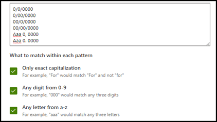

# Types d’explication dans Microsoft Syntex

**S’applique à :**  &ensp; &#10003; traitement de documents non structurés

Les explications sont utilisées pour vous aider à définir les informations que vous souhaitez étiqueter et extraire dans vos modèles de traitement de documents non structurés dans Microsoft Syntex. Lorsque vous créez une explication, vous devez sélectionner un type d’explication. Cet article vous permet de comprendre les différents types d’explications et comment ils sont utilisés.

Les types d’explications suivants sont disponibles :

- [**Liste d’expressions**](#phrase-list) : liste de mots, expressions, nombres ou autres caractères que vous pouvez utiliser dans le document ou les informations que vous extrayez. Par exemple, la chaîne de texte *Médecin référent* se trouve dans tous les documents de référence médicale que vous identifiez. Ou le *Numéro de téléphone* du médecin référent de tous les documents de référence médicale que vous identifiez.

- [**Expression régulière**](#regular-expression) utilise une notation correspondant à un modèle pour rechercher des modèles de caractères spécifiques. Par exemple, vous pouvez utiliser une expression régulière pour rechercher toutes les instances d’une *adresse e-mail* modèle dans un ensemble de documents.

- [**Proximité**](#proximity) : décrit à quel point les explications sont proches les unes des autres. Par exemple, une liste de phrases de *numéros de rue* se trouve juste avant la liste d’expressions des *noms de rue*, sans jetons entre les deux (vous en apprendrez davantage sur les jetons plus loin dans cet article). L’utilisation du type de proximité nécessite que vous ayez au moins deux explications dans votre modèle. Dans le cas contraire, l’option sera désactivée.

## Liste d’expressions

Un type d’explication de liste d’expressions est généralement utilisé pour identifier et classer un document dans votre modèle. Comme décrit dans l’exemple d’étiquette *Médecin référent*, il s’agit d’une chaîne de mots, d’expressions, de nombres ou de caractères qui se trouve systématiquement dans les documents que vous identifiez.

Bien que ce ne soit pas obligatoire, vous pouvez améliorer les performances de votre explication si l’expression que vous capturez se trouve à un emplacement cohérent dans votre document. Par exemple, l’étiquette *Médecin référent* peut être située systématiquement dans le premier paragraphe du document. Vous pouvez également utiliser le paramètre avancé **[Configurer l’emplacement de survenance des phrases dans le document](explanation-types-overview.md#configure-where-phrases-occur-in-the-document)** pour sélectionner des zones spécifiques dans lesquelles la phrase se situe, surtout s’il existe une possibilité que la phrase se produise dans plusieurs emplacements au sein de votre document.

Si le respect de la casse est une exigence pour identifier votre étiquette, l’utilisation du type de liste d’expressions vous permet de le spécifier dans votre explication en cochant la case **Seulement la mise en majuscule exacte**.

Un type de phrase est particulièrement utile lorsque vous créez une explication qui identifie et extraie des informations dans divers formats, telles que des dates, numéros de téléphone et de cartes bancaires. Par exemple, une date peut être affichée dans de nombreux formats différents (1/1/2020, 1-1-2020, 01/01/20, 01/01/2020 ou 1 janvier 2020). La définition d’une liste de phrases rend votre explication plus efficace en capturant toutes les variations possibles dans les données que vous essayez d’identifier et d’extraire.

Pour l’exemple du *Numéro de téléphone*, vous extrayez le numéro de téléphone de chaque médecin traitant dans tous les documents de référence médicale que le modèle identifie. Lorsque vous créez l’explication, tapez les différents formats pouvant correspondre à un affichage de numéro de téléphone dans votre document de sorte que vous puissiez capturer les variations possibles.

Pour cet exemple, dans les **Paramètres avancés**, sélectionnez la case à cocher **N’importe quel chiffre de 0 à 9** pour identifier chaque valeur « 0 » utilisée dans votre liste de phrases comme un chiffre compris entre 0 et 9.

De même, si vous créez une liste de phrases qui contient des caractères texte, sélectionnez la case à cocher **Une lettre de a à z** pour que chaque caractère « a » utilisé dans la liste de phrases soit n’importe quel caractère de « a » à « z ».

Par exemple, si vous créez une liste de phrases **Date** et que vous souhaitez vous assurer qu’un format de date tel que *Jan 1, 2020* est reconnu, vous devez :

- ajouter *aaa 0, 0000* et *aaa 00, 0000* à votre liste de phrases.
- vous assurer que **Toutes les lettres de a à z** est également sélectionnée.

Si vous avez des exigences de mise en majuscule dans votre liste de phrases, vous pouvez cocher la case **Seulement la mise en majuscule exacte**. Pour l’exemple Date, si vous souhaitez que la première lettre du mois soit en majuscule, vous devez :

- ajouter *Aaa 0, 0000* et *Aaa 00, 0000* à votre liste de modèles.
- vous assurer que **Seulement la mise en majuscule exacte** est également sélectionnée.

> [!NOTE]
> Au lieu de créer manuellement une explication de liste de phrases, utilisez la [bibliothèque d’explications](explanation-templates.md) pour utiliser des modèles de liste de phrases pour une liste de phrases commune, comme les *dates*, *numéros de téléphone*, ou *numéro de carte bancaire*.

## Expression régulière

Un type d’explication d’expression régulière vous permet de créer des modèles qui permettent de rechercher et d’identifier certaines chaînes de texte dans des documents. Vous pouvez utiliser des expressions régulières pour analyser rapidement de grandes quantités de texte pour :

- Recherchez des modèles de caractères spécifiques.
- Validez le texte pour vous assurer qu’il correspond à un modèle prédéfini (par exemple, une adresse e-mail).
- Extrayez, modifiez, remplacez ou supprimez des sous-chaînes de texte.

Un type d’expression régulière est particulièrement utile lorsque vous créez une explication qui identifie et extrait des informations dans des formats similaires, tels que des adresses e-mail, des numéros de compte bancaire ou des URL. Par exemple, une adresse e-mail, telle que megan@contoso.com, s’affiche dans un certain modèle (« megan » est la première partie et « com » est la dernière partie).

L’expression régulière d’une adresse e-mail est : **[A-Za-z0-9._%-]+@[A-Za-z0-9.-]+. [A-Za-z]{2,6}**.

Cette expression se compose de cinq parties, dans cet ordre :

1. Un des caractères spéciaux suivants :

   a. Letters from a to z

   b. Numbers from 0-9

   c. Period, underscore, percent, or dash

2. Le symbole @

3. Toute quantité des mêmes caractères que la première partie de l’adresse e-mail

4. Un point

5. Deux à six lettres

Pour ajouter un type d’explication d’expression régulière :

1. Dans le panneau **Créer une explication** , sous **Type d’explication**, sélectionnez **Expression régulière**.

   

2. Vous pouvez taper une expression dans la zone de texte **Expression régulière** ou sélectionner **Ajouter une expression régulière à partir d’un modèle**.

   Lorsque vous ajoutez une expression régulière à l’aide d’un modèle, elle ajoute automatiquement le nom et l’expression régulière à la zone de texte. Par exemple, si vous choisissez le modèle **Adresse e-mail**, le panneau **Créer une explication** est renseigné.

   

### Limites

Le tableau suivant présente les options de caractères inline qui ne sont actuellement pas disponibles pour une utilisation dans les modèles d’expression régulière.

|Option|État|Fonctionnalités actuelles|
|---|---|---|
|Respect de la casse|Actuellement non pris en charge.|Toutes les correspondances effectuées ne respectent pas la casse.|
|Ancres de ligne|Actuellement non pris en charge.| Impossible de spécifier une position spécifique dans une chaîne où une correspondance doit se produire.|

## Proximité

Le type d’explication de proximité aide votre modèle à identifier les données en définissant la proximité d’un autre élément de données. Par exemple, dans votre modèle, vous avez défini deux explications qui étiquettent à la fois le *Numéro d’adresse* et le *Numéro de téléphone* du client.

Remarquez également que les numéros de téléphone des clients apparaissent toujours avant le numéro de l’adresse postale.

Alain Chauvin 
555-555-5555 
One Microsoft Way 
Redmond, WA 98034 

Utilisez l’explication de proximité pour définir la distance de l’explication du numéro de téléphone afin de mieux identifier le numéro de l’adresse postale dans vos documents.

> [!NOTE]
> Actuellement, les expressions régulières ne peuvent pas être utilisées avec le type d’explication de proximité.

#### Que sont les jetons ?

Pour utiliser le type d’explication de proximité, vous devez comprendre ce qu’est un jeton. Le nombre de jetons est la façon dont l'explication de proximité mesure la distance d'une explication à une autre. Un jeton est une étendue continue (non compris les espaces et la ponctuation) de lettres et de chiffres.

Le tableau suivant illustre des exemples sur la façon de déterminer le nombre de jetons dans une expression.

|Expression|Nombre de jetons|Explication|
|---|---|---|
|`Dog`|1|Un seul mot sans ponctuation ni espaces.|
|`RMT33W`|1|A record locator number. It might include numbers and letters, but doesn't have punctuation.|
|`425-555-5555`|5|Un numéro de téléphone. Chaque signe de ponctuation équivaut à un seul jeton, donc `425-555-5555` correspond à 5 jetons : `425` `-` `555` `-` `5555`|
|`https://luis.ai`|7 |`https` `:` `/` `/` `luis` `.` `ai`|

#### Configurer le type d’explication de proximité

Pour l’exemple, configurez le paramètre de proximité pour définir la plage du nombre de jetons. L’explication dans le *Numéro de téléphone* provient de l’explication du *Numéro d’adresse*. Remarquez que la plage minimale est « 0 » car il n’y a pas de jetons entre le numéro de téléphone et le numéro d’adresse postale.

Certains numéros de téléphone dans les exemples de documents sont toutefois ajoutés avec un *(mobile)*.

Maurice Boule 
111-111-1111 (mobile) 
One Microsoft Way 
Redmond, WA 98034 

Il y a trois jetons dans *(mobile)* :

|Expression|Nombre de jetons|
|--|--|
|(|1|
|mobile|2|
|)|3|

Configurez le paramètre de proximité pour avoir une plage de 0 à 3.

## Configurer l’endroit où des phrases apparaissent dans le document

Lorsque vous créez une explication, par défaut, l’ensemble du document est recherché à la recherche de l’expression que vous essayez d’extraire. Toutefois, vous pouvez utiliser le **Où ces expressions se produisent** paramètre avancé pour vous aider à isoler un emplacement spécifique dans le document où se produit une expression. Ce paramètre est utile dans les situations où des instances similaires d’une expression peuvent apparaître à un autre endroit dans le document et dont vous voulez vous assurer que celle qui est correcte est sélectionnée.

En référence à notre exemple de document de référence médical, la *Référence médecin* est toujours mentionnée dans le premier paragraphe du document. Avec le paramètre **Où ces expressions se produisent**, dans cet exemple, vous pouvez configurer votre explication pour rechercher cette étiquette uniquement dans la section de début du document ou dans tout autre emplacement où elle pourrait se produire.

Vous pouvez choisir l'une des trois options suivantes :

- N’importe où dans le fichier : recherche l’expression dans l’ensemble du document.

- Début du fichier : La recherche s’effectuera du début jusqu’à l’emplacement des expressions.

   

    Dans la visionneuse, vous pouvez ajuster manuellement la case à sélectionner de manière à inclure l’emplacement où la phase a lieu. La valeur **Position de fin** est mise à jour de manière à afficher le nombre de jetons inclus dans la zone sélectionnée. Vous pouvez également mettre à jour la valeur de **Position de fin** pour ajuster la zone sélectionnée.

   

- Fin du fichier : la recherche s’effectuera de la fin jusqu’à l’emplacement des expressions.

   

    Dans la visionneuse, vous pouvez ajuster manuellement la case à sélectionner de manière à inclure l’emplacement où la phase a lieu. La valeur **Position de début** est mise à jour de manière à afficher le nombre de jetons inclus dans la zone sélectionnée. Vous pouvez également mettre à jour la valeur de position de début pour ajuster la zone sélectionnée.

   

- Plage personnalisée : recherche l’emplacement de l’expression dans une plage spécifiée du document.

   

    Dans la visionneuse, vous pouvez ajuster manuellement la case à sélectionner de manière à inclure l’emplacement où la phase a lieu. Pour ce paramètre, vous devez sélectionner une position de **Début** et une position de **Fin**. Ces valeurs représentent le nombre de jetons dès le début du document. Bien que vous pouvez entrer manuellement ces valeurs, il est plus facile d’ajuster manuellement la case à sélectionner dans la visionneuse.

## Considérations relatives à la configuration des explications

Lors de l’entraînement d’un classifieur, il y a quelques éléments à garder à l’esprit qui produiront des résultats plus prévisibles :

- Plus vous effectuez l’apprentissage de documents avec, plus le classifieur sera précis.  Si possible, utilisez plus de 5 bons documents et utilisez plus d’un document incorrect.  Si les bibliothèques avec lesquelles vous travaillez ont plusieurs types de documents différents, plusieurs de chaque type mènent à des résultats plus prévisibles.
- L’étiquetage du document joue un rôle important dans le processus de formation.  Ils sont utilisés avec des explications pour entraîner le modèle.  Vous pouvez voir des anomalies lors de l’apprentissage d’un classifieur avec des documents qui n’ont pas beaucoup de contenu.  L’explication peut ne pas correspondre à quoi que ce soit dans le document, mais étant donné qu’elle a été étiquetée comme un « bon » document, vous pouvez voir qu’il s’agit d’une correspondance pendant l’entraînement.
- Lors de la création d’explications, il utilise la logique OR en combinaison avec l’étiquette pour déterminer s’il s’agit d’une correspondance.  L’expression régulière qui utilise la logique AND peut être plus prévisible.  Voici un exemple d’expression régulière à utiliser sur des documents réels pour les entraîner.  Notez que le texte mis en surbrillance en rouge est la ou les expressions que vous recherchez.

    <pre>(?=.*network provider)(?=.*participating providers).*</pre>

- Les étiquettes et les explications fonctionnent ensemble et sont utilisées dans l’apprentissage du modèle.  Il ne s’agit pas d’une série de règles qui peuvent être découplées et des pondérations précises ou une prédiction appliquées à chaque variable configurée.  Plus la variation des documents utilisés dans l’entraînement est grande, plus le modèle sera plus précis.

### Voir aussi

[Utiliser des modèles d’explication dans Microsoft Syntex](explanation-templates.md)
