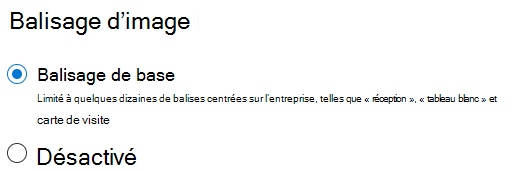

# Balisage d’image dans SharePoint Syntex

(Bientôt disponible)

Le balisage d’image dans SharePoint Syntex permet aux utilisateurs de trouver des images en effectuant une recherche sur des balises d’image, puis de créer des flux de travail en fonction de balises d’image. Par défaut, le balisage de base des images est activé pour SharePoint et OneDrive. Les images chargées dans l’un des emplacements sont automatiquement analysées et des balises valables sont appliquées, le cas échéant, à partir d’une liste de 37 balises de base. Les utilisateurs peuvent trouver des images en effectuant une recherche sur les balises d’images.

Lorsqu’un utilisateur charge une image, le processus de balisage s’exécute automatiquement. Si une image est modifiée, le processus de balisage s’exécute à nouveau pour la mise à jour des balises.

Les utilisateurs disposant d’autorisations sur le fichier image peuvent consulter et modifier les balises dans le volet d’informations sur le fichier ou dans la page des résultats de la recherche. Dès qu’un utilisateur modifie les balises d’une image, le système n’effectue plus le balisage automatique de cette image, même en cas de modification.

Si vous désactivez l’option de balisage, les images ne seront plus marquées automatiquement. Les balises existantes ne seront pas supprimées.

> [!NOTE]
> Les balises générées par le système peuvent changer avec les mises à jour de l’image ou notre technologie de balises.

## Configurer le balisage d’image

Après avoir [configuré SharePoint Syntex](set-up-content-understanding.md), vous pouvez configurer le balisage d’image dans le Centre d’administration Microsoft 365.  

Pour activer ou désactiver le balisage d’images

1. Dans le Centre d’administration Microsoft 365, cliquez sur **Configuration**.

2. Sous **Connaissances organisationnelles**, cliquez sur **Automatiser la compréhension de contenu**.

3. Cliquez sur **Gérer**.

4. Sous l’onglet **Balisage d'image**, cliquez sur **Modifier**.

5. Choisissez d’autoriser le **Balisage d’image** ou de le **Désactiver**.

6. Cliquez sur **Enregistrer**.

    
