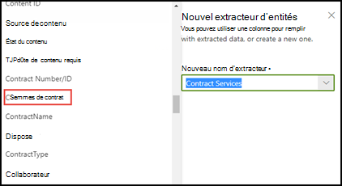

# Utiliser la taxonomie du magasin de termes lors de la création d’un extracteur

 

> [!VIDEO https://www.microsoft.com/videoplayer/embed/RE4GpJJ]  

 

Lorsque vous créez un extracteur dans votre modèle de compréhension de document via SharePoint Syntex, vous pouvez tirer parti de la taxonomie du magasin de termes [Services de métadonnées gérées](https://docs.microsoft.com/sharepoint/managed-metadata#terms) pour afficher les termes recommandés concernant les données extraites.  

Par exemple, votre modèle identifie et classe tous les documents **Contrat** chargés dans la bibliothèque de documents.  De plus, le modèle extrait également une valeur de **service de contrat** de chaque contrat et l’affiche dans une colonne de la vue de la bibliothèque. Les diverses valeurs de services des contrats incluent plusieurs éléments plus anciens, à présent inutilisés par votre société et renommés. Par exemple, toutes les références aux termes *Conception*, *Graphiques* ou *Topographie* (services de contrat) doivent à présent recevoir l’appellation *Créatif*. Chaque fois que votre modèle extrait l’un des termes obsolètes d’un document contractuel, il doit afficher le terme à jour, à savoir Créatif, dans la vue de la bibliothèque. Dans l’exemple ci-après, lors de la formation du modèle, nous constatons qu’un exemple de document contient le terme obsolète *Conception*.

    

## Utiliser une colonne de métadonnées gérées dans l’extracteur

Les ensembles de termes sont configurés dans le magasin de termes Services de métadonnées gérées (MMS) dans le Centre d’administration SharePoint. Dans l’exemple ci-dessous, *l’ensemble de termes* [Services de contrat](https://docs.microsoft.com/sharepoint/managed-metadata#term-set) est configuré pour inclure un certain nombre de termes, y compris *Créatif*.  Les détails indiquent que le terme a trois synonymes (*Conception*, *Graphiques* et *Topographie*). Il convient de les renommer *Créatif*. 

    

> [!NOTE]
>  Les ensembles de termes sont configurés comme globaux dans le champ MMS du centre de contenu.

Plusieurs raisons peuvent expliquer le désir d’utiliser un synonyme de votre ensemble de termes. Par exemple, cet ensemble peut inclure des termes obsolètes, des termes renommés ou des termes différents en fonction des services de votre organisation.

Pour pouvoir sélectionner le champ de métadonnées gérées lorsque vous créez l’extracteur dans votre modèle, vous devez [l’ajouter en tant que colonne de site de métadonnées gérées](https://support.microsoft.com/office/8fad9e35-a618-4400-b3c7-46f02785d27f). Après avoir ajouté la colonne de site, vous pouvez la sélectionner lorsque vous créez l’extracteur de votre modèle.

    

Une fois votre modèle appliqué à la bibliothèque de documents, lors du chargement des documents dans la bibliothèque, la colonne *Services de création* affiche le terme recommandé (*Créatif*) quand l’extracteur trouve l’une des valeurs synonymes (*Conception*, *Graphiques* et *Topographie*).

    

## Voir aussi
[Présentation des métadonnées gérées](https://docs.microsoft.com/sharepoint/managed-metadata#terms)

[Créer un extracteur](create-an-extractor.md)

[Créer une colonne de métadonnées gérées](https://support.microsoft.com/office/create-a-managed-metadata-column-8fad9e35-a618-4400-b3c7-46f02785d27f?redirectSourcePath=%252farticle%252fc2a06717-8105-4aea-890d-3082853ab7b7&ui=en-US&rs=en-US&ad=US)

