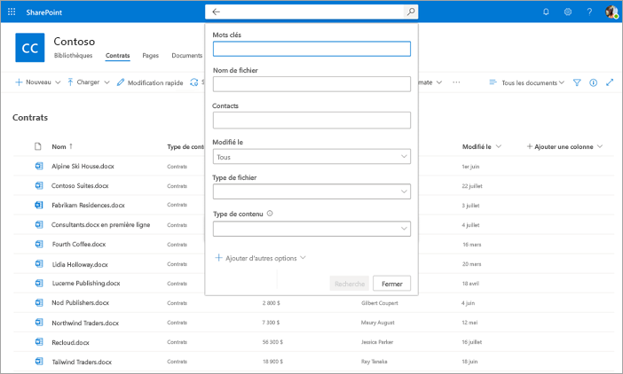

# Rechercher des métadonnées dans les bibliothèques de documents dans Microsoft SharePoint Syntex

La fonctionnalité de recherche avancée de métadonnées SharePoint Syntex vous permet d’effectuer des requêtes spécifiques basées sur des métadonnées sur SharePoint bibliothèques de documents. Vous pouvez effectuer des requêtes plus rapides et plus précises basées sur des valeurs de colonne de métadonnées spécifiques, plutôt que de simplement rechercher des mots clés.

La recherche avancée de métadonnées vous permet d’utiliser les métadonnées associées à un document pour vous aider à localiser le fichier dans SharePoint bibliothèque de documents. Cela est particulièrement utile lorsque vous avez un élément spécifique d’informations que vous souhaitez rechercher, comme la dernière modification d’un document, une personne spécifique associée à un fichier ou un type de fichier spécifique.

> [!NOTE]
> Cette fonctionnalité est disponible uniquement pour les utilisateurs titulaires d’une licence SharePoint Syntex. 

## Pour utiliser la recherche avancée de métadonnées

1. À partir d SharePoint bibliothèque de **documents, dans la zone** Rechercher dans cette bibliothèque, cliquez ou appuyez sur l’icône de recherche de métadonnées (Capture d’écran de l’icône de recherche ).

    

2. Dans le volet de recherche de métadonnées, tapez le texte ou sélectionnez le paramètre que vous souhaitez trouver dans un ou plusieurs champs de recherche.

    

   Cinq champs de recherche de métadonnées sont actuellement disponibles. D’autres champs seront ajoutés à l’avenir.

   |Champ    |Utilisez ce champ pour  |
   |---------|---------|
   |Mots clés |Recherchez une correspondance de chaîne dans les métadonnées ou dans le texte intégral d’un document. |
   |Nom     |Recherche dans la **colonne Nom** de la bibliothèque.          |
   |Personnes   |Recherchez une correspondance sur des personnes dans n’importe quelle colonne de la bibliothèque.   |
   |Modified |Recherchez par plage de dates sélectionnée dans la **colonne Modifié** de la bibliothèque.         |
   |Type     |Recherchez par type de fichier sélectionné.        |

3. Sélectionner **Rechercher**. Les documents qui correspondent à votre recherche de métadonnées sont affichés sur la page de résultats. 
